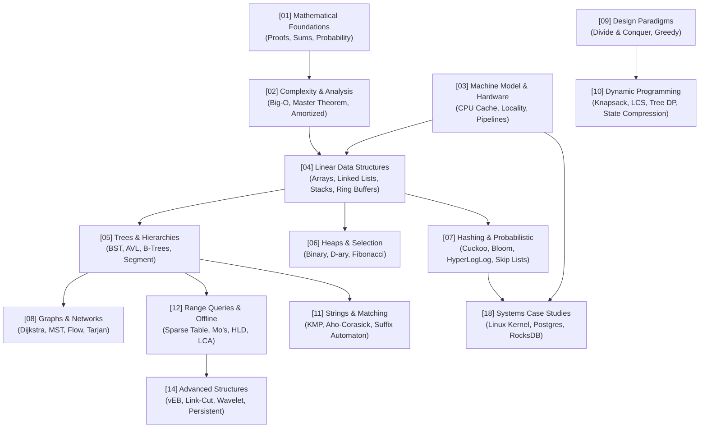

# Awesome DSA 

> The open-source encyclopedia and engineering handbook for **Data Structures & Algorithms**.  
> Bridging mathematical foundations, algorithmic paradigms, CPU hardware realities, and production systems architecture.

---

## Quick Navigation

[**Roadmap & Progress**](ROADMAP.md) • [**Style Guide**](STYLE-GUIDE.md) • [**Glossary**](GLOSSARY.md) • [**References**](REFERENCES.md) • [**FAQ**](FAQ.md) • [**Contributing**](CONTRIBUTING.md)

---

## Visual Prerequisite Graph

---

## Knowledge Domains (The 24 Modules)

| # | Domain Module | Focus Areas | Status |
| :--- | :--- | :--- | :---: |
| **00** | [**Learning Paths**](docs/00-learning-paths/) | Beginner, Technical Interview, CP, Systems Engineering, Theory | Planned |
| **01** | [**Mathematical Foundations**](docs/01-mathematical-foundations/) | Proof techniques, Summations, Recurrences, Combinatorics, Probability | Planned |
| **02** | [**Analysis & Complexity**](docs/02-analysis-and-complexity/) | Big-O/$\Omega$/$\Theta$, Amortized Potential Method, Master Theorem, Akra-Bazzi | Planned |
| **03** | [**Machine Model & Performance**](docs/03-machine-model-and-performance/) | RAM model, L1/L2/L3 cache lines, Data locality, Branch prediction, Benchmarking | Planned |
| **04** | [**Linear Data Structures**](docs/04-linear-data-structures/) | Arrays, Resizing geometric ratios, Linked lists, Stacks, Ring buffers, DSU | Planned |
| **05** | [**Trees & Hierarchical Structures**](docs/05-trees-and-hierarchical-structures/) | BST, AVL, Red-Black, B-Trees, Segment Trees, Fenwick, Tries | Planned |
| **06** | [**Heaps, Priority & Selection**](docs/06-heaps-priority-and-selection/) | Binary Heaps, D-ary, Fibonacci Heaps, Quickselect, Median maintenance | Planned |
| **07** | [**Hashing & Probabilistic**](docs/07-hashing-randomization-and-probabilistic/) | Open addressing, Cuckoo, Bloom/Cuckoo filters, HyperLogLog, Skip Lists | Planned |
| **08** | [**Graphs & Network Algorithms**](docs/08-graphs-and-network-algorithms/) | BFS/DFS, Shortest paths, MST, Network flow, Tarjan's SCC, LCA, Centroid | Planned |
| **09** | [**Algorithm Design Paradigms**](docs/09-algorithm-design-paradigms/) | Divide & Conquer, Greedy, Backtracking, Meet-in-the-Middle, Branch & Bound | Planned |
| **10** | [**Dynamic Programming**](docs/10-dynamic-programming/) | 1D/2D, Knapsack, Sequences, Tree DP, Bitmask, Convex Hull Trick, Alien Trick | Planned |
| **11** | [**Strings & Pattern Matching**](docs/11-strings-text-and-pattern-matching/) | KMP, Z-Algorithm, Rabin-Karp, Aho-Corasick, Suffix Automaton, FM-Index | Planned |
| **12** | [**Range Queries & Offline**](docs/12-range-query-and-offline-structures/) | Sparse Tables, Sqrt decomposition, Mo's Algorithm, Lazy Segment Trees, HLD | Planned |
| **13** | [**Geometric & Spatial**](docs/13-geometric-and-spatial-algorithms/) | Line Sweep, Convex Hull, Closest Pair, KD-Trees, R-Trees, Spatial indexing | Planned |
| **14** | [**Advanced Data Structures**](docs/14-advanced-data-structures/) | van Emde Boas, Link-Cut Trees, Wavelet Trees, Persistent BSTs, Succinct structures | Planned |
| **15** | [**External Memory & Streaming**](docs/15-external-memory-cache-oblivious-and-streaming/) | I/O Model, External sorting, LSM-Trees, Cache-oblivious trees, Count-Min sketch | Planned |
| **16** | [**Parallel, Concurrent & Lock-Free**](docs/16-parallel-concurrent-and-lock-free/) | Work-depth, Lock-free queues, ABA problem, Hazard pointers, Work-stealing deques | Planned |
| **17** | [**Cryptographic & Merkle Structures**](docs/17-cryptographic-and-merkle-like-structures/) | Merkle trees, Authenticated dictionaries, Vector commitments | Planned |
| **18** | [**Systems Case Studies**](docs/18-systems-case-studies/) | Postgres B-Trees, RocksDB LSM, Linux CFS Red-Black, kfifo ring buffers | Planned |
| **19** | [**Problem-Solving Patterns**](docs/19-problem-solving-patterns/) | Sliding window, Two pointers, Monotonic stack, Intervals, Binary search on answer | Planned |
| **20** | [**Proof Techniques & Correctness**](docs/20-proof-techniques-and-correctness/) | Induction, Loop invariants, Exchange arguments, Cut/cycle properties | Planned |
| **21** | [**Implementation Engineering**](docs/21-implementation-engineering/) | API design, Generics/templates, Property testing & fuzzing, Memory safety | Planned |
| **22** | [**Benchmarking & Tradeoffs**](docs/22-benchmarking-and-tradeoffs/) | Microbenchmarks, Asymptotics vs cache reality, Hardware counters | Planned |
| **23** | [**Classics & Seminal Papers**](docs/23-history-papers-and-classics/) | Landmark historical papers, evolution of algorithmic ideas | Planned |
| **24** | [**Exercises & Problem Sets**](docs/24-exercises-and-curated-problems/) | Categorized problem sets mapped to platforms (LeetCode, CSES, Codeforces) | Planned |

---

## Decision Matrix: Which Data Structure Should I Use?

| Requirement / Query Type | Recommended Data Structure | Time Complexity (Avg) | Real-World Trade-Off |
| :--- | :--- | :--- | :--- |
| Fast key-value lookups without ordering | **Hash Table / Hash Map** | $O(1)$ search, insert | Memory overhead; cache-unfriendly bucket chaining; worst-case $O(N)$ with hash collisions. |
| In-order traversal, range queries ($k_1 \le x \le k_2$) | **Self-Balancing BST (Red-Black / AVL)** | $O(\log N)$ | Pointer chasing hurts CPU cache locality compared to contiguous arrays. |
| Disk/Database indexing with minimal I/O | **B-Tree / B+ Tree** | $O(\log_B N)$ | High fan-out optimizes for page reads; B+ keeps all data in leaves for sequential range scans. |
| High write throughput with sequential disk writes | **LSM-Tree (Log-Structured Merge-Tree)** | $O(1)$ write, $O(\log N)$ read | Append-only commits fast writes; requires background compaction and Bloom filters for read performance. |
| Fast prefix searches / autocomplete | **Trie (Prefix Tree) / Radix Tree** | $O(L)$ ($L = \text{length}$) | Space-heavy if sparse; compressed (Radix) trees minimize node allocations. |
| Constant-time set membership with false positives allowed | **Bloom Filter / Cuckoo Filter** | $O(k)$ ($k = \text{hashes}$) | Saves massive memory/disk lookups; cannot retrieve elements or delete easily (unless Counting/Cuckoo). |
| Dynamic rank queries / K-th smallest in stream | **Order Statistic Tree / Fenwick Tree** | $O(\log N)$ | Extends standard trees or binary representations with subtree size tracking. |
| Range sum / update queries on mutable arrays | **Fenwick Tree (BIT) or Segment Tree** | $O(\log N)$ query/update | Fenwick has smaller memory footprint and simpler code; Segment Tree supports arbitrary associative operations. |
| Streaming cardinality estimation (billions of items) | **HyperLogLog** | $O(1)$ update | Estimates distinct counts within ~1-2% error using only a few kilobytes of RAM. |
| Sliding window min/max or Next Greater Element | **Monotonic Stack / Deque** | $O(1)$ amortized per item | Linear scan maintaining strict monotonic invariant; drops redundant candidates. |
| Disjoint set connectivity / cycle detection in graphs | **Disjoint Set Union (DSU / Union-Find)** | $O(\alpha(N)) \approx O(1)$ | Near-constant time with path compression and union-by-rank. |

---

## Contributing

We welcome contributions from students, competitive programmers, and systems engineers!  
Please review the [Style Guide](STYLE-GUIDE.md), check the [Roadmap](ROADMAP.md) for available topics, and follow the instructions in [CONTRIBUTING.md](CONTRIBUTING.md).

---

## License

To the extent possible under law, all content is dedicated to the public domain under [CC0 1.0 Universal](LICENSE).
