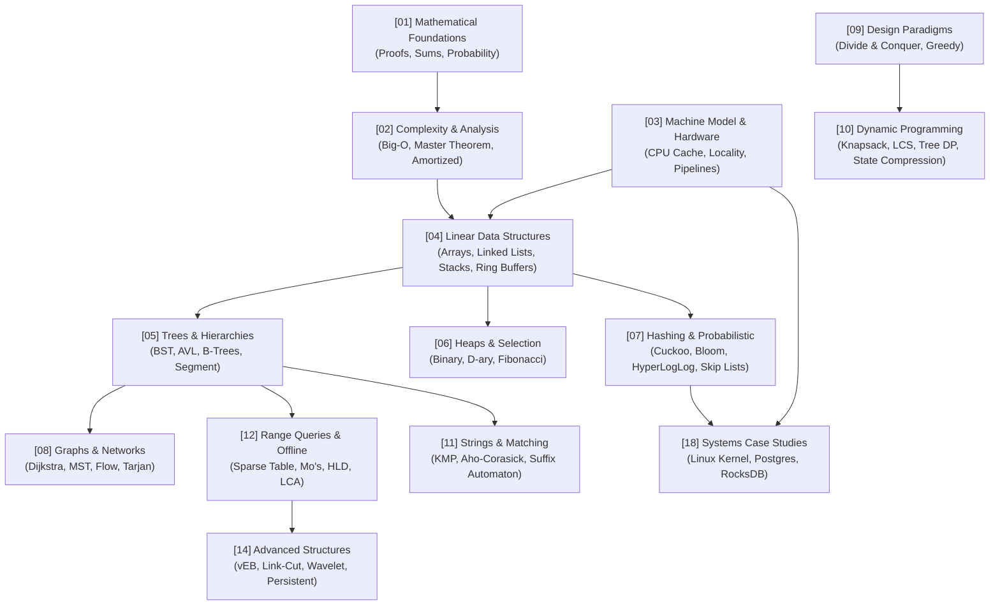

# The DSA Handbook
### The Invariant-First Reference Architecture & Implementation Manual for Data Structures and Algorithms

> An exhaustive, academically rigorous open reference manual for learning, verifying, and implementing data structures and algorithms — from discrete mathematical foundations and formal invariants to modern CPU cache modeling, lock-free concurrency, and distributed state machines.

---

## Quick Navigation

[**Master Roadmap**](ROADMAP.md) • [**Style Guide**](STYLE-GUIDE.md) • [**Glossary**](GLOSSARY.md) • [**References**](REFERENCES.md) • [**FAQ**](FAQ.md) • [**Contributing**](CONTRIBUTING.md)

---

## Visual Prerequisite Graph

```mermaid
flowchart TD
    M["[01] Mathematical Foundations<br/>(Proofs, Sums, Probability)"] --> C["[02] Complexity & Analysis<br/>(Big-O, Master Theorem, Amortized)"]
    H["[03] Machine Model & Hardware<br/>(CPU Cache, Locality, Pipelines)"] --> L["[04] Linear Data Structures<br/>(Arrays, Linked Lists, Stacks, Ring Buffers)"]
    C --> L
    L --> T["[05] Trees & Hierarchies<br/>(BST, AVL, B-Trees, Segment)"]
    L --> HP["[06] Heaps & Selection<br/>(Binary, D-ary, Fibonacci)"]
    L --> HS["[07] Hashing & Probabilistic<br/>(Cuckoo, Bloom, HyperLogLog, Skip Lists)"]
    T --> G["[08] Graphs & Networks<br/>(Dijkstra, MST, Flow, Tarjan)"]
    P["[09] Design Paradigms<br/>(Divide & Conquer, Greedy)"] --> DP["[10] Dynamic Programming<br/>(Knapsack, LCS, Tree DP, State Compression)"]
    T --> RQ["[12] Range Queries & Offline<br/>(Sparse Table, Mo's, HLD, LCA)"]
    T --> STR["[11] Strings & Matching<br/>(KMP, Aho-Corasick, Suffix Automaton)"]
    RQ --> ADV["[14] Advanced Structures<br/>(vEB, Link-Cut, Wavelet, Persistent)"]
    HS --> SYS["[18] Systems Case Studies<br/>(Linux Kernel, Postgres, RocksDB)"]
    H --> SYS
```

---

## Knowledge Domains (The 25 Modules)

| # | Domain Module | Focus Areas |
| :--- | :--- | :--- |
| **00** | [**Learning Paths**](docs/00-learning-paths/) | Beginner, Technical Interview, CP, Systems Engineering, Theory |
| **01** | [**Mathematical Foundations**](docs/01-mathematical-foundations/) | Proof techniques, Summations, Recurrences, Combinatorics, Probability |
| **02** | [**Analysis & Complexity**](docs/02-analysis-and-complexity/) | Big-O/$\Omega$/$\Theta$, Amortized Potential Method, Master Theorem, Akra-Bazzi |
| **03** | [**Machine Model & Performance**](docs/03-machine-model-and-performance/) | RAM model, L1/L2/L3 cache lines, Data locality, Branch prediction, Benchmarking |
| **04** | [**Linear Data Structures**](docs/04-linear-data-structures/) | Arrays, Resizing geometric ratios, Linked lists, Stacks, Ring buffers, DSU |
| **05** | [**Trees & Hierarchical Structures**](docs/05-trees-and-hierarchical-structures/) | BST, AVL, Red-Black, B-Trees, Segment Trees, Fenwick, Tries |
| **06** | [**Heaps, Priority & Selection**](docs/06-heaps-priority-and-selection/) | Binary Heaps, D-ary, Fibonacci Heaps, Quickselect, Median maintenance |
| **07** | [**Hashing & Probabilistic**](docs/07-hashing-randomization-and-probabilistic/) | Open addressing, Cuckoo, Bloom/Cuckoo filters, HyperLogLog, Skip Lists |
| **08** | [**Graphs & Network Algorithms**](docs/08-graphs-and-network-algorithms/) | BFS/DFS, Shortest paths, MST, Network flow, Tarjan's SCC, LCA, Centroid |
| **09** | [**Algorithm Design Paradigms**](docs/09-algorithm-design-paradigms/) | Divide & Conquer, Greedy, Backtracking, Meet-in-the-Middle, Branch & Bound |
| **10** | [**Dynamic Programming**](docs/10-dynamic-programming/) | 1D/2D, Knapsack, Sequences, Tree DP, Bitmask, Convex Hull Trick, Alien Trick |
| **11** | [**Strings & Pattern Matching**](docs/11-strings-text-and-pattern-matching/) | KMP, Z-Algorithm, Rabin-Karp, Aho-Corasick, Suffix Automaton, FM-Index |
| **12** | [**Range Queries & Offline**](docs/12-range-query-and-offline-structures/) | Sparse Tables, Sqrt decomposition, Mo's Algorithm, Lazy Segment Trees, HLD |
| **13** | [**Geometric & Spatial**](docs/13-geometric-and-spatial-algorithms/) | Line Sweep, Convex Hull, Closest Pair, KD-Trees, R-Trees, Spatial indexing |
| **14** | [**Advanced Data Structures**](docs/14-advanced-data-structures/) | van Emde Boas, Link-Cut Trees, Wavelet Trees, Persistent BSTs, Succinct structures |
| **15** | [**External Memory & Streaming**](docs/15-external-memory-cache-oblivious-and-streaming/) | I/O Model, External sorting, LSM-Trees, Cache-oblivious trees, Count-Min sketch |
| **16** | [**Parallel, Concurrent & Lock-Free**](docs/16-parallel-concurrent-and-lock-free/) | Work-depth, Lock-free queues, ABA problem, Hazard pointers, Work-stealing deques |
| **17** | [**Cryptographic & Merkle Structures**](docs/17-cryptographic-and-merkle-like-structures/) | Merkle trees, Authenticated dictionaries, Vector commitments |
| **18** | [**Systems Case Studies**](docs/18-systems-case-studies/) | Postgres B-Trees, RocksDB LSM, Linux CFS Red-Black, kfifo ring buffers |
| **19** | [**Problem-Solving Patterns**](docs/19-problem-solving-patterns/) | Sliding window, Two pointers, Monotonic stack, Intervals, Binary search on answer |
| **20** | [**Proof Techniques & Correctness**](docs/20-proof-techniques-and-correctness/) | Induction, Loop invariants, Exchange arguments, Cut/cycle properties |
| **21** | [**Implementation Engineering**](docs/21-implementation-engineering/) | API design, Generics/templates, Property testing & fuzzing, Memory safety |
| **22** | [**Benchmarking & Tradeoffs**](docs/22-benchmarking-and-tradeoffs/) | Microbenchmarks, Asymptotics vs cache reality, Hardware counters |
| **23** | [**Classics & Seminal Papers**](docs/23-history-papers-and-classics/) | Landmark historical papers, evolution of algorithmic ideas |
| **24** | [**Exercises & Problem Sets**](docs/24-exercises-and-curated-problems/) | Categorized problem sets mapped to platforms (LeetCode, CSES, Codeforces) |

---

## Architectural Selection Guide

Selecting the appropriate data structure requires balancing four physical and theoretical dimensions: **Access Pattern**, **Data Shape**, **Asymptotic & Memory Constraints**, and the **Execution Environment** (L1/L2/L3 cache, RAM, NVMe/Disk, or concurrent threads).

* **Unordered Point Lookups ($O(1)$ expected)**: Use **Open-Addressing / Cuckoo Hash Tables** in memory; use **Bloom / Cuckoo Filters** to guard expensive disk or network trips.
* **Ordered Range Scans & In-Order Traversals ($O(\log N)$)**: Use **Red-Black / AVL Trees** in cache-friendly node pools for RAM; use high fan-out **B+ Trees** for block/page storage (SSD/Disk).
* **High-Throughput Ingestion & Sequential Writes**: Use **LSM-Trees (Log-Structured Merge-Trees)** with tiered or leveled compaction to trade read amplification for maximum write throughput.
* **Dynamic Range Aggregations & Point/Range Updates ($O(\log N)$)**: Use **Fenwick Trees (BIT)** for compact prefix sums; use **Segment Trees with Lazy Propagation** for arbitrary associative semigroup queries.
* **Prefix / Lexicographical Matching**: Use **Radix Trees / Patricia Tries** to compress single-child branches and minimize cache misses; use **Aho-Corasick** for multi-pattern matching.
* **Streaming & Massive Cardinality Estimation**: Use **HyperLogLog** for fixed-memory distinct counting; use **Count-Min Sketch** for frequency estimation.
* **Sliding Window Extremes & Nearest Greater Elements**: Use **Monotonic Stacks / Deques** for amortized $O(1)$ candidate eviction.

> [!TIP]
> For a rigorous, benchmark-grounded breakdown across access patterns, cache locality, memory overhead, and disk mechanics, read the full engineering chapter:  
> 📖 [**Choosing the Right Data Structure**](docs/22-benchmarking-and-tradeoffs/choosing-the-right-data-structure.md).

---

## Contributing

We welcome contributions from students, competitive programmers, and systems engineers!  
Please review the [Style Guide](STYLE-GUIDE.md), check the [Roadmap](ROADMAP.md) for available topics, and follow the instructions in [CONTRIBUTING.md](CONTRIBUTING.md).

---

## License

To the extent possible under law, all content is dedicated to the public domain under [CC0 1.0 Universal](LICENSE).
