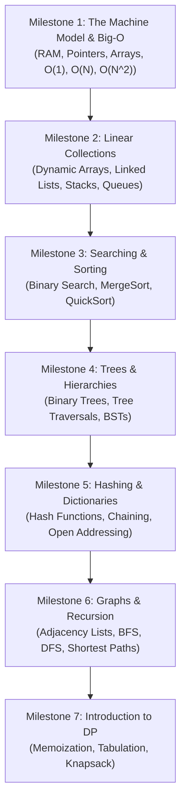

# Beginner Learning Path: Zero to Algorithmic Competence

## 1. Executive Summary & Curriculum Philosophy

Most beginners struggle with Data Structures and Algorithms (DSA) because traditional curricula present topics as isolated academic curiosities rather than **logical solutions to physical computing bottlenecks**.

This curriculum follows a **hardware-grounded, progressive sequence**:
1. First understand how physical hardware stores data (memory addresses, arrays, pointers).
2. Learn how growth rates are formally bounded (asymptotic notation).
3. Build the core linear collections (arrays, linked lists, stacks, queues).
4. Master divide-and-conquer, sorting, and binary search.
5. Ascend to non-linear structures (trees, binary search trees, hash tables).
6. Explore graph traversals and elementary dynamic programming.

Every milestone links directly to reference chapters in this repository with dual C++17 and Python 3 implementations.

---

## 2. Curriculum Roadmap & Milestones

---

## 3. Detailed Milestone Modules

### Milestone 1: The Machine Model & Asymptotic Analysis
- **Goal**: Understand memory addresses, cache lines, and how to measure algorithmic growth.
- **Key Chapters to Read**:
  - [`arrays-and-memory-layout.md`](../04-linear-data-structures/arrays-and-memory-layout.md)
  - [`asymptotic-notation.md`](../02-analysis-and-complexity/asymptotic-analysis.md)
  - [`theoretical-vs-practical-performance.md`](../22-benchmarking-and-tradeoffs/theoretical-vs-practical-performance.md)
- **Hands-On Exercises**:
  1. Implement a static fixed-size array in C++ and print memory addresses of adjacent elements to observe contiguous byte spacing.
  2. Write code with nested loops exhibiting $O(1)$, $O(N)$, and $O(N^2)$ growth. Measure runtimes across $N=10, 100, 1000, 10000$ and plot the curve.

---

### Milestone 2: Core Linear Data Structures
- **Goal**: Master pointer-based manipulation and basic LIFO/FIFO disciplines.
- **Key Chapters to Read**:
  - [`singly-and-doubly-linked-lists.md`](../04-linear-data-structures/linked-lists.md)
  - [`stacks-and-queues.md`](../04-linear-data-structures/stacks-and-queues.md)
  - [`two-pointers.md`](../19-problem-solving-patterns/two-pointers.md)
- **Hands-On Exercises**:
  1. Reverse a singly linked list in-place in $O(N)$ time and $O(1)$ space.
  2. Implement a circular array-backed Queue supporting $O(1)$ `enqueue` and `dequeue`.
  3. Solve LeetCode 20 (Valid Parentheses) using an explicit stack.

---

### Milestone 3: Divide & Conquer, Sorting & Binary Search
- **Goal**: Understand recursive problem reduction and logarithmic search spaces.
- **Key Chapters to Read**:
  - [`divide-and-conquer.md`](../09-algorithm-design-paradigms/divide-and-conquer.md)
  - [`binary-search-and-variants.md`](../19-problem-solving-patterns/binary-search-on-answer.md)
  - [`quicksort-and-mergesort.md`](../09-algorithm-design-paradigms/divide-and-conquer.md)
- **Hands-On Exercises**:
  1. Implement exact-match Binary Search and prove why `mid = low + (high - low) / 2` avoids integer overflow.
  2. Implement MergeSort and verify its $O(N \log N)$ running time against an $O(N^2)$ Bubble Sort.
  3. Implement binary search for monotonic predicates (e.g., LeetCode 875: Koko Eating Bananas).

---

### Milestone 4: Trees & Hierarchical Structures
- **Goal**: Master recursive traversals and binary search tree invariants.
- **Key Chapters to Read**:
  - [`binary-search-trees.md`](../05-trees-and-hierarchical-structures/binary-search-trees.md)
  - [`tree-flattening-and-euler-tour.md`](../05-trees-and-hierarchical-structures/tree-basics-and-traversals.md)
- **Hands-On Exercises**:
  1. Implement Pre-order, In-order, and Post-order tree traversals both recursively and iteratively using a stack.
  2. Implement a Binary Search Tree supporting `insert`, `search`, and `delete` (with in-order successor splicing).
  3. Compute the maximum depth and diameter of a binary tree in $O(N)$.

---

### Milestone 5: Hashing & Hash Tables
- **Goal**: Understand average $O(1)$ key lookup and hash collision resolution.
- **Key Chapters to Read**:
  - [`hash-functions.md`](../07-hashing-randomization-and-probabilistic/hash-functions.md)
  - [`chaining-and-open-addressing.md`](../07-hashing-randomization-and-probabilistic/hash-tables-and-collisions.md)
- **Hands-On Exercises**:
  1. Build a basic hash map from scratch using separate chaining with linked lists.
  2. Solve LeetCode 1 (Two Sum) in $O(N)$ time using a hash map.
  3. Implement frequency counting for words in a text file.

---

### Milestone 6: Graphs & Breadth/Depth First Search
- **Goal**: Model real-world networks and execute graph reachability and shortest paths.
- **Key Chapters to Read**:
  - [`graph-representations.md`](../08-graphs-and-network-algorithms/graph-representations.md)
  - [`bfs-and-dfs.md`](../08-graphs-and-network-algorithms/bfs-dfs-and-traversal-patterns.md)
  - [`dijkstra.md`](../08-graphs-and-network-algorithms/shortest-paths.md)
- **Hands-On Exercises**:
  1. Represent a directed graph using an adjacency list.
  2. Implement Breadth-First Search (BFS) to find the shortest path in an unweighted grid (LeetCode 1091: Shortest Path in Binary Matrix).
  3. Implement Depth-First Search (DFS) to count connected components (LeetCode 200: Number of Islands).

---

### Milestone 7: Foundations of Dynamic Programming
- **Goal**: Overcome the fear of DP by mastering optimal substructure and overlapping subproblems.
- **Key Chapters to Read**:
  - [`intro-to-dp.md`](../09-algorithm-design-paradigms/dynamic-programming-intuition.md)
  - [`0-1-knapsack.md`](../10-dynamic-programming/knapsack-family.md)
- **Hands-On Exercises**:
  1. Transition from naive recursive Fibonacci $O(2^N)$ to memoized DP $O(N)$, then to tabulated DP with $O(1)$ space.
  2. Solve the 0-1 Knapsack problem and trace the 2D DP table.
  3. Solve LeetCode 322 (Coin Change) using bottom-up tabulation.

---

## 4. Common Beginner Pitfalls & How to Avoid Them

> [!WARNING]
> **Trap 1: Memorizing Code Instead of Invariants**: Memorizing syntax ensures failure on any problem variation. Always ask: *"What invariant must hold true before and after each iteration?"*

> [!WARNING]
> **Trap 2: Jumping to Advanced Topics Too Early**: Attempting Segment Trees, Suffix Automata, or Lock-Free Concurrency before mastering pointers and recursion leads to burnout. Complete Milestones 1–5 thoroughly first.

---

## 5. Exit Criteria & Next Steps

You are ready to graduate from the Beginner Path to the **[Interview Path](interview-path.md)** or **[Competitive Programming Path](competitive-programming-path.md)** when you can:
- [ ] Implement Binary Search without off-by-one errors in under 5 minutes.
- [ ] Reverse a linked list and detect cycles using Floyd's Tortoise and Hare algorithm.
- [ ] Implement BFS and DFS on an adjacency list from memory.
- [ ] Correctly classify the time and space complexity of arbitrary recursive and iterative functions.
- [ ] Solve LeetCode Easy problems consistently in under 15 minutes.
