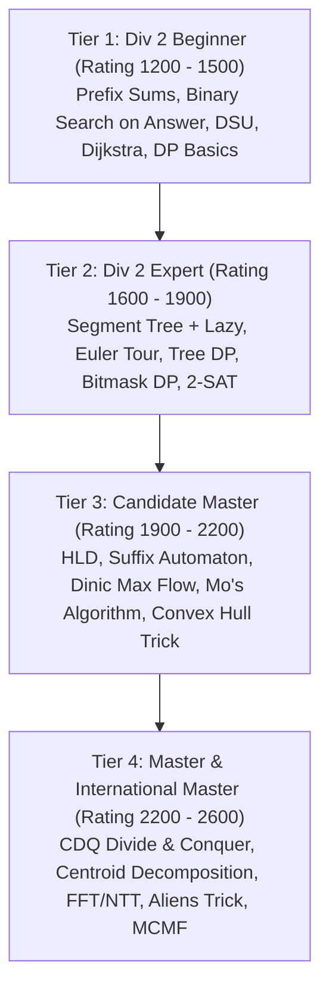

# Competitive Programming Learning Path: From Div 2 to Master

## 1. Executive Summary & The CP Paradigm

Competitive Programming (CP) on platforms like **Codeforces**, **AtCoder**, and the **ICPC** demands a distinct skill profile:
- **Strict Time Limits (1.0 - 2.0s)**: Requiring algorithms with exact execution steps below $\approx 2 \cdot 10^8$ operations per second.
- **Extreme Problem Reduction**: Disguising complex flow, geometry, or DP optimizations behind simple mathematical or puzzle-like stories.
- **Fast, Bug-Free Implementation**: Writing complex 100-line structures (Persistent Segment Trees, Suffix Automata, Dinic) under time pressure without debugging aid.
- **Stress-Testing Discipline**: Building automated differential fuzzers during the contest to catch subtle counterexamples and corner-case flaws.

This curriculum maps the progressive journey from **Div 2 (Rating 1400–1800)** to **Candidate Master & Master (Rating 2100+)**.

---

## 2. Competitive Rating Progression Roadmap



---

## 3. Core Competitive Modules by Rating Band

### Tier 1: The Div 2 Foundation (Rating 1200–1500)
- **Binary Search on Predicate**: Monotonic answer spaces (`check(mid)`).
- **Prefix Sums & 2D Grid Sums**: Range sum queries in $O(1)$ static time.
- **Disjoint-Set Union (DSU)**: Path compression and union-by-rank.
- **Elementary Graphs**: Dijkstra shortest paths, Topological Sort, BFS on grids.
- **Core DP**: 0-1 Knapsack, Longest Increasing Subsequence in $O(N \log N)$ via patience sorting.

### Tier 2: The Expert Ramp (Rating 1600–1900)
- **Segment Tree with Lazy Propagation**: Range update, range query in $O(\log N)$.
  - *Reference*: [`segment-tree.md`](../05-trees-and-hierarchical-structures/segment-trees.md)
- **Euler Tour & Tree Subtree Queries**: Mapping subtrees to linear segment intervals.
  - *Reference*: [`tree-flattening-and-euler-tour.md`](../05-trees-and-hierarchical-structures/tree-basics-and-traversals.md)
- **Number Theory Essentials**: Modular inverse, Fermat's Little Theorem, Sieve of Eratosthenes in $O(N \log \log N)$.
- **Bitmask & Submask DP**: Iterating over all submasks of all masks in $O(3^N)$.
  - *Reference*: [`bitmask-dp.md`](../10-dynamic-programming/bitmask-and-state-compression.md)
- **2-SAT**: Tarjan's SCC on implication graphs.
  - *Reference*: [`tarjan-scc.md`](../08-graphs-and-network-algorithms/strongly-connected-components.md)

### Tier 3: The Candidate Master Arsenal (Rating 1900–2200)
- **Heavy-Light Decomposition (HLD)**: Arbitrary path queries and updates on trees in $O(\log^2 N)$.
  - *Reference*: [`heavy-light-decomposition.md`](../08-graphs-and-network-algorithms/lowest-common-ancestor.md)
- **Suffix Automaton (SAM)**: Minimal DAG of substrings in $O(N)$ linear time.
  - *Reference*: [`suffix-automaton.md`](../11-strings-text-and-pattern-matching/suffix-automaton.md)
- **Network Flow**: Dinic’s algorithm ($O(V^2 E)$, $O(E \sqrt{V})$ for unit networks) and Min-Cut modeling.
  - *Reference*: [`dinic.md`](../08-graphs-and-network-algorithms/network-flow-and-push-relabel.md)
- **Offline Query Processing**: Mo's Algorithm with Hilbert curve ordering in $O(N \sqrt{Q})$.
  - *Reference*: [`mo-and-cdq-divide-and-conquer.md`](../12-range-query-and-offline-structures/mo-algorithm.md)
- **Convex Hull Trick & Li Chao Tree**: Linear cost DP optimization $dp[i] = \min(m_j \cdot x_i + c_j)$.
  - *Reference*: [`convex-hull-trick.md`](../13-geometric-and-spatial-algorithms/convex-hull.md)

### Tier 4: Master & Beyond (Rating 2200–2600)
- **CDQ Divide-and-Conquer**: Offline multi-dimensional partial order queries.
  - *Reference*: [`mo-and-cdq-divide-and-conquer.md`](../12-range-query-and-offline-structures/mo-algorithm.md)
- **Centroid Decomposition**: Divide-and-conquer on trees solving path length queries in $O(N \log N)$.
- **Aliens Trick (WQS Binary Search / Lagrangian Relaxation)**: Removing $K$-step constraints via slope penalties.
- **Fast Fourier Transform (FFT / NTT)**: Polynomial multiplication in $O(N \log N)$.
- **Link-Cut Trees**: Dynamic path aggregations and connectivity in $O(\log N)$.
  - *Reference*: [`link-cut-tree.md`](../14-advanced-data-structures/link-cut-trees.md)

---

## 4. The Competitive Toolchain & Workflow

### 4.1 Optimal C++ Competitive Template
```cpp
#pragma GCC optimize("O3,unroll-loops")
#pragma GCC target("avx2,bmi,bmi2,lzcnt,popcnt")

#include <bits/stdc++.h>
using namespace std;

void fast_io() {
    ios_base::sync_with_stdio(false);
    cin.tie(NULL);
}

int main() {
    fast_io();
    int t;
    if (cin >> t) {
        while (t--) {
            // Solve per test case
        }
    }
    return 0;
}
```

### 4.2 Automated Stress-Testing Script (`stress.sh`)
When failing a hidden system test, run an automated differential fuzzer:

```bash
#!/bin/bash
# stress.sh: Compares fast solution against naive brute-force generator
g++ -O3 -std=c++17 sol.cpp -o sol
g++ -O3 -std=c++17 brute.cpp -o brute
g++ -O3 -std=c++17 gen.cpp -o gen

for ((i = 1; ; ++i)); do
    ./gen > in.txt
    ./sol < in.txt > out_sol.txt
    ./brute < in.txt > out_brute.txt
    if ! diff -u out_sol.txt out_brute.txt > /dev/null; then
        echo "Found failing test case #$i!"
        cat in.txt
        break
    fi
    if (( i % 100 == 0 )); then
        echo "Passed $i test cases..."
    fi
done
```

---

## 5. Deliberate Contest Routine

1. **First 10 Minutes**: Read Problems A, B, and C. Solve A and B rapidly without hesitation.
2. **Mid-Contest Focus**: Focus entirely on the single bottleneck problem that will advance your rank (e.g. Problem D or E).
3. **The 30-Minute Rule**: If stuck on an approach for 30 minutes, abandon it completely and reconsider from first principles (e.g. convert from DP to Greedy or Flow).
4. **Post-Contest Upsolving**: Always upsolve the problem you were stuck on during the contest within 48 hours. Never let an unsolved contest problem go unmastered!
