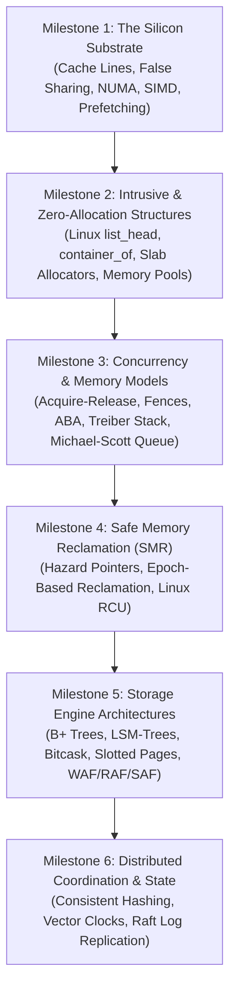

# Systems Engineer Learning Path: Low-Level Architecture & High-Throughput Engines

## 1. Executive Summary & The Mechanical Sympathy Philosophy

In high-performance systems engineering (database kernels, operating systems, distributed storage, high-frequency trading infrastructure), software does not run in an abstract Turing machine. It runs on physical silicon:
- Memory accesses stall on 64-byte cache lines.
- Branch predictors mispredict on data-dependent branching.
- Inter-core atomic writes trigger cache-coherency bus storms.
- Unaligned structures cause split-lock penalties.

Martin Thompson coined the phrase **"Mechanical Sympathy"**:
> You don't have to be an engineer to be a racing driver, but you have to understand how the engine works to get the most out of it.

This curriculum trains a systems engineer to design data structures with hardware empathy, moving from memory hierarchies to lock-free concurrency, storage engines, and distributed consensus.

---

## 2. Systems Mastery Roadmap

---

## 3. Detailed Milestone Modules

### Milestone 1: The Silicon Substrate & Hardware Mechanical Sympathy
- **Core Topics**: Cache hierarchy ($L1, L2, L3$, DRAM), cache lines (64 bytes), false sharing, branch prediction, SIMD vectorization.
- **Key Chapters to Read**:
  - [`cpu-cache-and-memory.md`](../03-machine-model-and-performance/cpu-cache-and-memory.md)
  - [`memory-allocation-and-fragmentation.md`](../03-machine-model-and-performance/memory-allocation-and-fragmentation.md)
  - [`bit-manipulation-tricks.md`](../03-machine-model-and-performance/bit-manipulation-tricks.md)
- **Hands-On Exercises**:
  1. Write a benchmark reproducing **false sharing**: two threads incrementing adjacent variables on the same 64-byte cache line vs separated by `alignas(64)`. Observe the $10\times$ performance drop.
  2. Implement an array of structures (AoS) vs structure of arrays (SoA) and benchmark SIMD vectorization throughput.

---

### Milestone 2: Intrusive & Zero-Allocation Data Structures
- **Core Topics**: Eliminating dynamic heap allocation wrappers, intrusive linking, offset-of pointer arithmetic.
- **Key Chapters to Read**:
  - [`linux-kernel-internals.md`](../18-systems-case-studies/linux-kernel-internals.md)
  - [`api-design-for-data-structures.md`](../21-implementation-engineering/api-design-for-data-structures.md)
- **Hands-On Exercises**:
  1. Implement Linux's `struct list_head` and `container_of` macro in C++.
  2. Embed two list heads into a single domain struct (`task_struct`), demonstrating simultaneous membership in a scheduler queue and a process table with zero heap allocations.

---

### Milestone 3: Concurrency, Memory Models & Lock-Free Data Structures
- **Core Topics**: The C++ memory model (`memory_order_relaxed`, `acquire`, `release`, `seq_cst`), the ABA problem, lock-free queues and stacks.
- **Key Chapters to Read**:
  - [`memory-models-and-ordering.md`](../16-parallel-concurrent-and-lock-free/memory-models-and-ordering.md)
  - [`concurrent-queues-and-stacks.md`](../16-parallel-concurrent-and-lock-free/concurrent-queues-and-stacks.md)
  - [`aba-problem.md`](../16-parallel-concurrent-and-lock-free/aba-problem.md)
  - [`work-stealing-deques.md`](../16-parallel-concurrent-and-lock-free/work-stealing-deques.md)
- **Hands-On Exercises**:
  1. Implement the **Michael-Scott Lock-Free Queue** with sentinel dummy nodes and cooperative helping.
  2. Build a 64-bit packed tagged pointer (`48-bit address + 16-bit tag`) to eliminate ABA in a lock-free Treiber stack.
  3. Implement the **Chase-Lev SPMC Work-Stealing Deque** with owner LIFO bottom and thief FIFO top.

---

### Milestone 4: Safe Memory Reclamation (SMR) & RCU
- **Core Topics**: Solving use-after-free in lock-free containers without a garbage collector.
- **Key Chapters to Read**:
  - [`hazard-pointers-and-epoch-reclamation.md`](../16-parallel-concurrent-and-lock-free/hazard-pointers-and-epoch-reclamation.md)
  - [`linux-kernel-internals.md`](../18-systems-case-studies/linux-kernel-internals.md)
- **Hands-On Exercises**:
  1. Implement **Epoch-Based Reclamation (EBR)** with 3 circular epoch bins.
  2. Implement **Hazard Pointers** and verify bounded memory retention under thread stalling.
  3. Simulate Linux Kernel **RCU (Read-Copy-Update)** with atomic pointer publication and quiescent grace period tracking.

---

### Milestone 5: Modern Storage Engine Design
- **Core Topics**: Write Amplification Factor (WAF), Read Amplification Factor (RAF), Space Amplification Factor (SAF), B+ Trees, LSM-Trees, Bitcask.
- **Key Chapters to Read**:
  - [`storage-engines-breakdown.md`](../18-systems-case-studies/storage-engines-breakdown.md)
  - [`high-performance-caching.md`](../18-systems-case-studies/high-performance-caching.md)
  - [`cache-oblivious-algorithms.md`](../15-external-memory-cache-oblivious-and-streaming/cache-oblivious-algorithms.md)
- **Hands-On Exercises**:
  1. Implement a slotted-page $B^+$-Tree node with binary searched key offsets.
  2. Build an LSM-Tree with in-memory MemTable, append-only Write-Ahead Log (WAL), and tiered background SSTable compaction.
  3. Implement the **W-TinyLFU** cache with a 4-bit Count-Min sketch admission filter and segmented LRU main cache.

---

### Milestone 6: Distributed Coordination & State Machines
- **Core Topics**: Consistent Hashing, Vector Clocks, Consensus, Replicated State Machines.
- **Key Chapters to Read**:
  - [`distributed-state-engines.md`](../18-systems-case-studies/distributed-state-engines.md)
  - [`merkle-trees.md`](../17-cryptographic-and-merkle-like-structures/merkle-trees.md)
  - [`authenticated-data-structures.md`](../17-cryptographic-and-merkle-like-structures/authenticated-data-structures.md)
- **Hands-On Exercises**:
  1. Build a Consistent Hash Ring with 150 virtual nodes per physical host; verify that adding a 5th node migrates exactly $\approx 20\%$ of keys.
  2. Implement Vector Clock causality tracking and concurrent conflict branch detection.
  3. Build an in-memory Raft cluster simulation verifying log replication, majority commit index advancement, and state machine consistency.

---

## 4. Systems Engineer Reading Canon

1. Love, R. (2010). *Linux Kernel Development (3rd Edition)*.
2. McKenney, P. E. (2020). *Is Parallel Programming Hard, And, If So, What Can You Do About It?* ("The Perfbook").
3. Herlihy, M., & Shavit, N. (2012). *The Art of Multiprocessor Programming*.
4. Kleppmann, M. (2017). *Designing Data-Intensive Applications*.
5. Gregg, B. (2020). *Systems Performance: Enterprise and the Cloud (2nd Edition)*.
