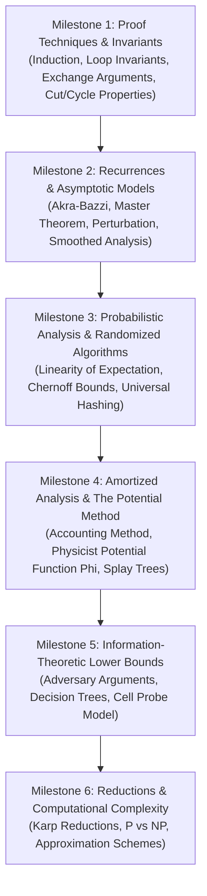

# Theoretical Computer Science Learning Path: Proofs, Asymptotics & Complexity

## 1. Executive Summary & The Theoretical Mindset

Theoretical Computer Science (TCS) asks the ultimate fundamental questions:
- *What can be computed efficiently?*
- *What are the intrinsic, unbreakable mathematical lower bounds on information processing?*
- *How can we prove—with absolute mathematical certainty—that an algorithm is correct and optimal on every possible input, across all infinite instances?*

While software engineering deals with empirical execution and heuristics, TCS deals with **invariants, formal reductions, potential functions, and structural proofs**.

This curriculum guides a student, researcher, or engineer through the formal mathematical foundations of algorithms: from induction and exchange arguments to probabilistic bounds, adversarial lower bounds, and complexity reductions.

---

## 2. Theory Mastery Roadmap

---

## 3. Detailed Milestone Modules

### Milestone 1: Rigorous Proof Techniques & Invariants
- **Core Topics**: Mathematical induction, structural induction on trees, loop invariants, exchange arguments for greedy algorithms, cut and cycle properties for matroids and spanning trees.
- **Key Chapters to Read**:
  - [`induction.md`](../20-proof-techniques-and-correctness/induction.md)
  - [`loop-invariants.md`](../20-proof-techniques-and-correctness/loop-invariants.md)
  - [`exchange-arguments.md`](../20-proof-techniques-and-correctness/exchange-arguments.md)
  - [`cut-and-cycle-properties.md`](../20-proof-techniques-and-correctness/cut-and-cycle-properties.md)
- **Core Proof Exercises**:
  1. Prove by induction that a binary tree with $L$ leaves has exactly $L - 1$ internal nodes of degree 2.
  2. Prove the correctness of Kruskal’s Minimum Spanning Tree algorithm using the Cut Property and an exchange argument.
  3. Formalize the loop invariant of Dijkstra’s algorithm: *For all visited vertices $u$, $\text{dist}[u]$ is the exact shortest path from source $s$.*

---

### Milestone 2: Recurrences & Asymptotic Analysis
- **Core Topics**: The Master Theorem, the Akra-Bazzi method for non-uniform branches, perturbation analysis, worst vs average vs smoothed analysis.
- **Key Chapters to Read**:
  - [`asymptotic-notation.md`](../02-analysis-and-complexity/asymptotic-analysis.md)
  - [`master-theorem.md`](../02-analysis-and-complexity/master-theorem-and-beyond.md)
  - [`recurrence-relations.md`](../01-mathematical-foundations/recurrence-relations.md)
  - [`akra-bazzi-method.md`](../02-analysis-and-complexity/akra-bazzi-method.md)
- **Core Proof Exercises**:
  1. Solve $T(n) = T(n/3) + T(2n/3) + cn$ using the Akra-Bazzi integration theorem:
     $$\sum_{i=1}^k a_i b_i^p = 1 \implies (1/3)^p + (2/3)^p = 1 \implies p = 1 \implies \Theta(n \log n)$$
  2. Contrast average-case complexity vs Spielman-Teng **Smoothed Analysis** on the Simplex algorithm.

---

### Milestone 3: Probabilistic Analysis & Randomized Algorithms
- **Core Topics**: Linearity of Expectation, Markov's inequality, Chebyshev's inequality, Chernoff bounds, Universal Hashing, Coupon Collector, Birthday Paradox.
- **Key Chapters to Read**:
  - [`expected-value-and-random-variables.md`](../01-mathematical-foundations/expected-value-and-random-variables.md)
  - [`randomized-analysis.md`](../02-analysis-and-complexity/randomized-analysis.md)
  - [`cuckoo-hashing.md`](../07-hashing-randomization-and-probabilistic/robin-hood-cuckoo-and-hopscotch-hashing.md)
  - [`bloom-filters.md`](../07-hashing-randomization-and-probabilistic/bloom-and-cuckoo-filters.md)
- **Core Proof Exercises**:
  1. Prove that Randomized Quicksort executes exactly $2n \ln n - O(n)$ expected comparisons using indicator random variables $X_{ij}$.
  2. Prove the Chernoff bound: For independent Bernoulli variables $X = \sum X_i$, $\mathbb{P}(X \ge (1+\delta)\mu) \le \exp(-\frac{\delta^2 \mu}{2 + \delta})$.

---

### Milestone 4: Amortized Analysis & The Physicist Potential Method
- **Core Topics**: Aggregate analysis, Accounting method, The Potential Method ($\hat{c_i} = c_i + \Phi(D_i) - \Phi(D_{i-1})$), Splay Tree Access Lemma.
- **Key Chapters to Read**:
  - [`amortized-analysis.md`](../02-analysis-and-complexity/amortized-analysis.md)
  - [`splay-trees.md`](../05-trees-and-hierarchical-structures/splay-trees.md)
  - [`fibonacci-heap.md`](../06-heaps-priority-and-selection/fibonacci-heaps.md)
- **Core Proof Exercises**:
  1. Prove the amortized cost of dynamic array expansion is $O(1)$ using the potential function $\Phi = 2 \cdot \text{size} - \text{capacity}$.
  2. Derive Sleator & Tarjan's Access Lemma for Splay Trees using the rank potential function $\Phi = \sum_{x} \log_2(\text{weight}(x))$.

---

### Milestone 5: Information-Theoretic Lower Bounds & Adversaries
- **Core Topics**: Decision tree models, Comparison sorting lower bound ($\Omega(n \log n)$), Adversary arguments, Cell probe model.
- **Key Chapters to Read**:
  - [`lower-bounds-and-adversaries.md`](../02-analysis-and-complexity/lower-bounds-and-adversaries.md)
  - [`landmark-data-structures.md`](../23-history-papers-and-classics/landmark-data-structures.md)
- **Core Proof Exercises**:
  1. Prove that any comparison-based sorting algorithm requires at least $\lceil \log_2(n!) \rceil \ge n \log_2 n - n \log_2 e$ comparisons in the worst case.
  2. Construct an adversary argument showing that finding both the minimum and maximum of an unsorted array of size $n$ requires at least $\lceil 3n/2 \rceil - 2$ comparisons.

---

### Milestone 6: Computational Complexity & Reductions
- **Core Topics**: Polynomial-time reductions ($\le_P$), Cook-Levin Theorem, NP-Completeness, 3-SAT, Vertex Cover, Clique, Subset Sum, Approximation algorithms.
- **Key Chapters to Read**:
  - [`reductions-and-hardness-intuition.md`](../02-analysis-and-complexity/reductions-and-hardness-intuition.md)
  - [`classic-papers-reading-list.md`](../23-history-papers-and-classics/classic-papers-reading-list.md)
- **Core Proof Exercises**:
  1. Prove that 3-SAT $\le_P$ Independent Set.
  2. Prove that Independent Set $\le_P$ Vertex Cover.
  3. Prove that the greedy 2-approximation for Vertex Cover achieves a strict approximation ratio of 2.

---

## 4. Foundational Theoretical Reading Canon

1. Cormen, T. H., Leiserson, C. E., Rivest, R. L., & Stein, C. (2022). *Introduction to Algorithms (4th Edition)*. MIT Press.
2. Kleinberg, J., & Tardos, É. (2005). *Algorithm Design*. Pearson.
3. Motwani, R., & Raghavan, P. (1995). *Randomized Algorithms*. Cambridge University Press.
4. Arora, S., & Barak, B. (2009). *Computational Complexity: A Modern Approach*. Cambridge University Press.
5. Sipser, M. (2012). *Introduction to the Theory of Computation (3rd Edition)*. Cengage Learning.
