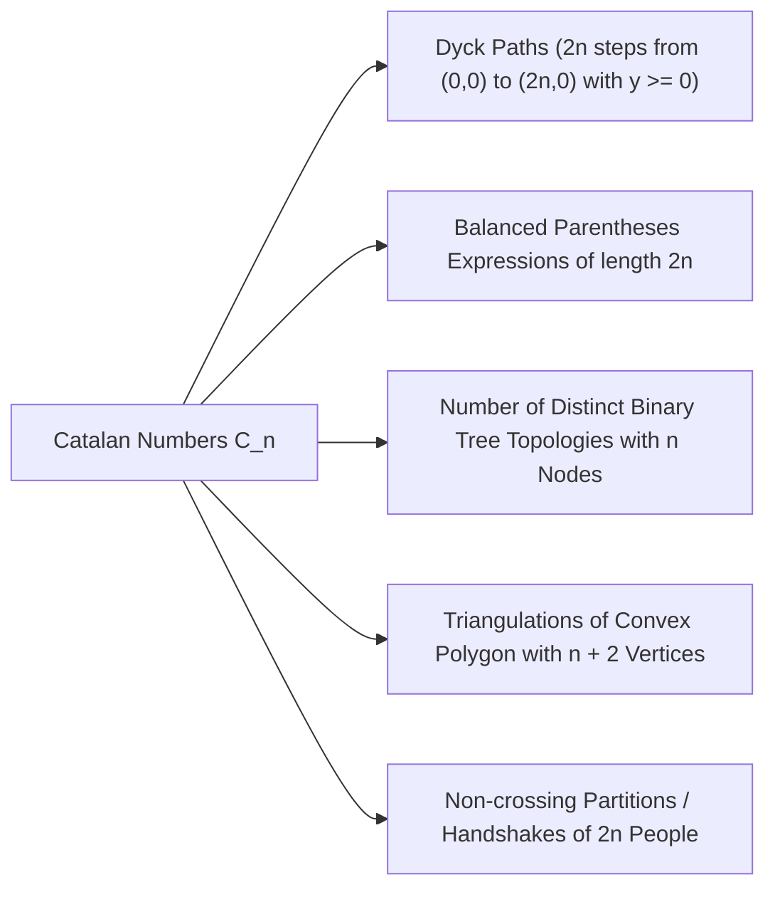

# Combinatorics

> [!NOTE]
> **The Art of Discrete Enumeration:**
> Combinatorics provides mathematical tools to count valid states, configurations, and permutations without exhaustively listing them. In algorithm design, combinatorial analysis governs:
> 1. **State Space Sizing:** Determining the graph or search-tree size in backtracking and brute-force bounds.
> 2. **Dynamic Programming Optimization:** Translating combinatorial counting problems into memoized subproblem transitions.
> 3. **Competitive Programming Queries:** Answering exact arrangement counts modulo a prime (typically $10^9 + 7$ or $998{,}244{,}353$) in $O(1)$ time after $O(N)$ preprocessing.

> [!TIP]
> **The $O(N)$ Precomputed Modular Binomial Coefficient Pattern:**
> Precomputing factorials and inverse factorials allows answering $\binom{n}{k} \pmod p$ in $O(1)$ time:
> $$\text{fact}[i] = (\text{fact}[i-1] \cdot i) \pmod p$$
> $$\text{invFact}[N] = (\text{fact}[N])^{p-2} \pmod p$$
> $$\text{invFact}[i-1] = (\text{invFact}[i] \cdot i) \pmod p \quad (\text{backward linear sweep})$$
> $$\binom{n}{k} \equiv \text{fact}[n] \cdot \text{invFact}[k] \cdot \text{invFact}[n-k] \pmod p$$

> [!WARNING]
> **Pitfalls with Non-Prime Moduli & Lucas Theorem Constraints:**
> 1. Fermat's Little Theorem modular inverse ($a^{p-2} \pmod p$) **strictly requires $p$ to be prime**. For composite moduli, prime factorization and the Chinese Remainder Theorem or Pascal's $O(n^2)$ addition triangle must be used.
> 2. When $n \ge p$ for prime $p$, $\text{fact}[n] \equiv 0 \pmod p$. Standard factorials collapse to zero; **Lucas' Theorem** must be used instead by decomposing $n$ and $k$ into their base-$p$ representations.

```mermaid
flowchart TD
    Count["Combinatorial Counting Problem"] --> Order{"Does Order Matter?"}
    Order -->|Yes: Order Matters| RepP{"Are Elements Repeated?"}
    RepP -->|No Repetition| Perm["Permutations: P(n, k) = n! / (n-k)!"]
    RepP -->|With Repetition| Exp["Exponential: n^k"]
    RepP -->|Multiset Repetition| Multi["Multinomial: n! / (k1! k2! ... km!)"]
    Order -->|No: Order Does Not Matter| RepC{"Are Elements Repeated?"}
    RepC -->|No Repetition| Comb["Combinations: C(n, k) = n! / (k!(n-k)!)"]
    RepC -->|With Repetition (Bins)| Stars["Stars and Bars: C(n + k - 1, k - 1)"]
    Comb --> Catalan{"Parentheses / Dyck Paths / Non-crossing?"}
    Catalan -->|Yes| Cat["Catalan Numbers: C_n = 1/(n+1) * C(2n, n)"]
    Count --> Overlap{"Overlapping Conditions?"}
    Overlap -->|Yes| PIE["Principle of Inclusion-Exclusion (PIE)"]
```

---

## 1. Fundamental Counting Principles

1. **Rule of Sum (Disjoint Events):**
   If set $A$ has $|A|$ outcomes and disjoint set $B$ has $|B|$ outcomes ($A \cap B = \emptyset$), the number of ways to choose an outcome from $A$ OR $B$ is:
   $$|A \cup B| = |A| + |B|$$

2. **Rule of Product (Independent Stages):**
   If a procedure breaks into two consecutive stages where stage 1 has $m$ outcomes and stage 2 has $n$ outcomes regardless of stage 1, the total number of composite outcomes is:
   $$|A \times B| = m \cdot n$$

3. **Bijection Principle:**
   If a one-to-one and onto mapping (bijection) $f: A \to B$ exists, then $|A| = |B|$. Proving an identity by mapping complex structures to simpler known sets is the cornerstone of combinatorial proofs.

---

## 2. Permutations and Combinations

### 2.1 Permutations (Ordered Arrangements)
- **Without replacement:** Number of ordered sequences of $k$ items chosen from $n$ distinct items:
  $$P(n, k) = n \cdot (n - 1) \cdot (n - 2) \cdots (n - k + 1) = \frac{n!}{(n - k)!}$$
- **Full permutation:** $P(n, n) = n!$ (stirling approximation: $n! \approx \sqrt{2\pi n}(n/e)^n$).
- **Multiset Permutations:** Arrangements of $n$ items where item $i$ repeats $k_i$ times ($\sum k_i = n$):
  $$\binom{n}{k_1, k_2, \dots, k_m} = \frac{n!}{k_1! k_2! \cdots k_m!}$$

### 2.2 Combinations (Unordered Selections)
Number of subsets of size $k$ chosen from $n$ distinct elements:
$$\binom{n}{k} = C(n, k) = \frac{P(n, k)}{k!} = \frac{n!}{k! (n - k)!}$$

#### Core Binomial Identities:
1. **Symmetry:** $\binom{n}{k} = \binom{n}{n - k}$
2. **Pascal's Identity:** $\binom{n}{k} = \binom{n-1}{k-1} + \binom{n-1}{k}$ (Proof: an arbitrary chosen item is either in the subset or not).
3. **Sum of Row:** $\sum_{k=0}^n \binom{n}{k} = 2^n$ (Total number of subsets in the power set of $n$ items).
4. **Vandermonde's Identity:** $\sum_{k=0}^r \binom{m}{k} \binom{n}{r - k} = \binom{m + n}{r}$
5. **Hockey-Stick Identity:** $\sum_{i=r}^n \binom{i}{r} = \binom{n+1}{r+1}$

---

## 3. Stars and Bars (Balls and Urns)

How many non-negative integer solutions satisfy $x_1 + x_2 + \cdots + x_k = n$?

Imagine $n$ identical stars ($\star$) and $k - 1$ dividers ($\mid$) placed among them to create $k$ bins:
$$\underbrace{\star \star \star}_{x_1 = 3} \mid \underbrace{}_{x_2 = 0} \mid \underbrace{\star \star}_{x_3 = 2} \mid \underbrace{\star}_{x_4 = 1}$$

- **Non-negative integers ($x_i \ge 0$):**
  Total symbols $= n + k - 1$. We must choose $k - 1$ positions for the dividers:
  $$\text{Ways} = \binom{n + k - 1}{k - 1}$$
- **Positive integers ($x_i \ge 1$):**
  There are $n - 1$ gaps between $n$ stars. We place $k - 1$ dividers into these gaps:
  $$\text{Ways} = \binom{n - 1}{k - 1}$$

---

## 4. Catalan Numbers

The Catalan sequence $(C_0, C_1, C_2, \dots) = (1, 1, 2, 5, 14, 42, 132, 429, 1430, \dots)$ is defined as:
$$C_n = \frac{1}{n+1} \binom{2n}{n} = \binom{2n}{n} - \binom{2n}{n+1}$$

### Recurrence Relation:
$$C_0 = 1, \quad C_n = \sum_{i=0}^{n-1} C_i C_{n-1-i} \quad (n \ge 1)$$



#### The Reflection Principle Proof:
Any path of length $2n$ made of $n$ up-steps $(+1)$ and $n$ down-steps $(-1)$ from $(0,0)$ to $(2n,0)$ contains $\binom{2n}{n}$ total paths.
A path is *invalid* if it touches $y = -1$.
Reflecting the path across the line $y = -1$ after its first contact point transforms it into a path from $(0,0)$ to $(2n, -2)$, which has $n - 1$ up-steps and $n + 1$ down-steps.
The count of invalid paths is therefore strictly $\binom{2n}{n+1}$.
$$C_n = \binom{2n}{n} - \binom{2n}{n+1} = \frac{1}{n+1} \binom{2n}{n}$$

---

## 5. Principle of Inclusion-Exclusion (PIE)

To find the cardinality of the union of $n$ finite sets:

$$|\bigcup_{i=1}^n A_i| = \sum_{k=1}^n (-1)^{k-1} \sum_{1 \le i_1 < i_2 < \dots < i_k \le n} |A_{i_1} \cap A_{i_2} \cap \dots \cap A_{i_k}|$$

### Canonical Application: Derangements ($D_n$)
A derangement is a permutation of $\{1, 2, \dots, n\}$ such that no element appears in its original position ($\pi(i) \ne i$ for all $i$).

Let $A_i$ be the set of permutations where $\pi(i) = i$. Then $|A_i| = (n-1)!$, $|A_i \cap A_j| = (n-2)!$, and so on.
By PIE, the number of valid derangements is:
$$D_n = n! - |\bigcup_{i=1}^n A_i| = n! \sum_{k=0}^n \frac{(-1)^k}{k!}$$
As $n \to \infty$, $\frac{D_n}{n!} \to \frac{1}{e} \approx 0.367879$.

---

## 6. Lucas' Theorem (Binomials with Large $N$ and Prime $P$)

When evaluating $\binom{n}{k} \pmod p$ where $n, k \ge p$ and $p$ is prime:
Expand $n$ and $k$ in base $p$:
$$n = n_m p^m + n_{m-1} p^{m-1} + \dots + n_0$$
$$k = k_m p^m + k_{m-1} p^{m-1} + \dots + k_0$$
Lucas' Theorem states:
$$\binom{n}{k} \equiv \prod_{i=0}^m \binom{n_i}{k_i} \pmod p$$
where $\binom{n_i}{k_i} = 0$ whenever $n_i < k_i$. This reduces computing $\binom{10^{18}}{10^{18}} \pmod p$ to $O(\log_p n)$ small queries where each factor is within $[0, p-1]$.

---

## 7. Operational Complexity Matrix

| Operation | Time Complexity | Auxiliary Space | Precomputation Required? | Constraint / Domain |
| :--- | :--- | :--- | :--- | :--- |
| **Pascal's Triangle $\binom{n}{k}$** | $O(N^2)$ precomputation, $O(1)$ query | $O(N^2)$ table | Yes | Any modulus (prime or composite), $N \le 5000$ |
| **Modular Factorials ($O(N)$ sweep)** | $O(N + \log p)$ precomputation, $O(1)$ query | $O(N)$ arrays | Yes | $p$ prime, $N \le 10^7$ |
| **Single $\binom{n}{k} \pmod p$ (no precalc)**| $O(k \log p)$ time | $O(1)$ space | No | $k \le 10^6$, $p$ prime |
| **Lucas' Theorem** | $O(p + \log_p n)$ time | $O(p)$ table | Precompute up to $p$ | $p$ small prime ($p \le 10^5$), $n \le 10^{18}$ |
| **Catalan Number $C_n \pmod p$** | $O(N)$ precomp, $O(1)$ query | $O(N)$ space | Modular factorials | $p$ prime, $2n < p$ |
| **Derangements $D_n \pmod p$** | $O(n)$ time | $O(1)$ space | None | DP: $D_n = (n-1)(D_{n-1} + D_{n-2})$ |

---

## 8. Common Pitfalls & Anti-Patterns

### Anti-Pattern 1: Integer Division Before Modulo Reduction
```cpp
// ANTI-PATTERN: (n! / k!) mod MOD does NOT equal (n! mod MOD) / (k! mod MOD)
uint64_t bad_comb = (fact[n] / fact[k]) % MOD; // WRONG!

// CORRECT: Multiply by modular multiplicative inverse
uint64_t correct_comb = fact[n] * invFact[k] % MOD * invFact[n - k] % MOD;
```

### Anti-Pattern 2: Forgetting $k > n$ Boundary Check
In dynamic programming and competitive programming queries, passing $k > n$ or $k < 0$ to a modular combination lookup will trigger an out-of-bounds index or return invalid garbage. Explicitly guard with:
```cpp
if (k < 0 || k > n) return 0;
```

---

## 9. Curated References & Related Problems

1. **CLRS Appendix C:** *Counting and Probability*.
2. **Concrete Mathematics (Graham, Knuth, Patashnik):** *Chapter 5: Binomial Coefficients*.
3. **LeetCode 62:** *Unique Paths* (Grid navigation as $\binom{m+n-2}{m-1}$).
4. **LeetCode 96:** *Unique Binary Search Trees* (Catalan numbers evaluation).
5. **Codeforces 895C:** *Square Subsets* (Combinatorics combined with bitmask DP).
6. **Project Euler 15:** *Lattice Paths* (Combinatorial paths across grids).
