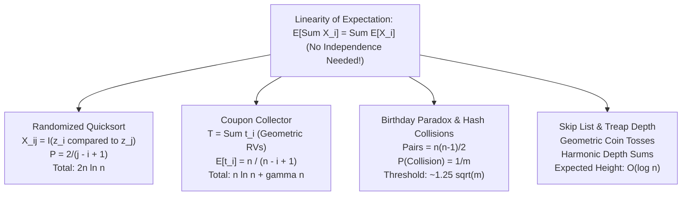

# Expected Value & Random Variables in Algorithm Analysis

## 1. Executive Summary & Core Intuition

> [!NOTE]
> In deterministic algorithm analysis, we measure the worst-case execution time $T(n)$ across all possible inputs of size $n$. In randomized algorithm analysis, the execution time $T(n)$ itself is a **random variable**, governed by internal coin flips. We analyze its **Expected Value** $\mathbb{E}[T(n)]$.

Expected value represents the long-run average value of a random variable over repeated independent trials. The secret weapon of algorithm analysis is **Linearity of Expectation**:
$$\mathbb{E}\left[ \sum_{i=1}^n c_i X_i \right] = \sum_{i=1}^n c_i \mathbb{E}[X_i]$$
Crucially, **linearity holds even if the random variables are arbitrarily correlated or dependent!** This allows complex algorithm behaviors to be decomposed into sums of simple **Indicator Random Variables**.

---

## 2. Formal Definitions & Foundations

### 2.1 Discrete Random Variables
A discrete random variable $X$ is a measurable function from sample space $\Omega$ to real numbers $\mathbb{R}$:
$$X: \Omega \to \mathbb{R}$$
The **Probability Mass Function (PMF)** $p_X(x)$ gives:
$$p_X(x) = \mathbb{P}(X = x) = \sum_{\omega \in \Omega: X(\omega) = x} \mathbb{P}(\omega)$$
where $\sum_{x} p_X(x) = 1$.

### 2.2 Expected Value (First Moment)
The expected value of discrete random variable $X$ is:
$$\mathbb{E}[X] = \sum_{x \in \text{Range}(X)} x \cdot \mathbb{P}(X = x)$$
provided the sum converges absolutely ($\sum |x| \mathbb{P}(X = x) < \infty$).

### 2.3 The Tail Sum Formula for Non-Negative Integer Random Variables
If $X \in \{0, 1, 2, \dots\}$, an indispensable computational formula is:
$$\mathbb{E}[X] = \sum_{k=1}^\infty \mathbb{P}(X \ge k)$$

```
Proof Intuition:
E[X] = 1*P(X=1) + 2*P(X=2) + 3*P(X=3) + ...
Sum P(X>=k):
k=1: P(X=1) + P(X=2) + P(X=3) + ...
k=2:          P(X=2) + P(X=3) + ...
k=3:                   P(X=3) + ...
Summing vertical columns reveals each P(X=j) is counted exactly j times!
```

---

## 3. Indicator Random Variables & The Fundamental Bridge

Let $A$ be an event in sample space $\Omega$. The **Indicator Random Variable** $I_A$ is defined as:
$$I_A = \begin{cases} 1 & \text{if event } A \text{ occurs} \\ 0 & \text{if event } A \text{ does not occur} \end{cases}$$

> [!TIP]
> **The Fundamental Bridge Lemma**:
> The expectation of an indicator random variable is identically equal to the probability of its underlying event:
> $$\mathbb{E}[I_A] = 1 \cdot \mathbb{P}(A) + 0 \cdot \mathbb{P}(\overline{A}) = \mathbb{P}(A)$$

By expressing a complex counting variable $X$ as a sum of indicators $X = \sum_{i=1}^m I_{A_i}$, we convert intractable expectation problems into simple probability calculations:
$$\mathbb{E}[X] = \mathbb{E}\left[ \sum_{i=1}^m I_{A_i} \right] = \sum_{i=1}^m \mathbb{E}[I_{A_i}] = \sum_{i=1}^m \mathbb{P}(A_i)$$

---

## 4. Canonical Case Studies in Algorithm Analysis



### 4.1 Expected Comparisons in Randomized Quicksort
Let $A = [z_1, z_2, \dots, z_n]$ be the elements in sorted order.
Let $X$ be the total number of element comparisons made during Quicksort.
For any pair $i < j$, let indicator $X_{ij} = I(z_i \text{ is compared to } z_j)$.
Then:
$$X = \sum_{i=1}^{n-1} \sum_{j=i+1}^n X_{ij} \implies \mathbb{E}[X] = \sum_{i=1}^{n-1} \sum_{j=i+1}^n \mathbb{P}(z_i \text{ is compared to } z_j)$$

**Key Insight**: $z_i$ and $z_j$ are compared if and only if either $z_i$ or $z_j$ is chosen as a pivot *before* any element in the set $\{z_i, z_{i+1}, \dots, z_j\}$.
The size of this set is $j - i + 1$. Because every pivot choice is uniformly random:
$$\mathbb{P}(z_i \text{ is compared to } z_j) = \frac{2}{j - i + 1}$$
Substitute and evaluate the double summation:
$$\mathbb{E}[X] = \sum_{i=1}^{n-1} \sum_{j=i+1}^n \frac{2}{j - i + 1} = \sum_{i=1}^{n-1} \sum_{k=2}^{n - i + 1} \frac{2}{k} < \sum_{i=1}^n \sum_{k=1}^n \frac{2}{k} = 2n H_n = 2n \ln n + \Theta(n)$$
Randomized Quicksort makes at most $2n \ln n \approx 1.386 n \log_2 n$ comparisons on *any* input!

### 4.2 The Coupon Collector's Problem
Suppose a coupon collector needs $n$ distinct coupons. Each box contains one coupon chosen uniformly at random with replacement.
Let $T$ be the number of boxes purchased to collect all $n$ coupons.
Let $t_i$ be the number of boxes purchased to find the $i$-th new coupon after having collected $i-1$ distinct coupons:
$$T = t_1 + t_2 + \dots + t_n$$
Each $t_i$ is a **Geometric Random Variable** with success probability:
$$p_i = \frac{n - (i - 1)}{n} = \frac{n - i + 1}{n}$$
The expectation of a geometric distribution with parameter $p$ is $1/p$:
$$\mathbb{E}[t_i] = \frac{1}{p_i} = \frac{n}{n - i + 1}$$
By Linearity of Expectation:
$$\mathbb{E}[T] = \sum_{i=1}^n \mathbb{E}[t_i] = \sum_{i=1}^n \frac{n}{n - i + 1} = n \left( \frac{1}{n} + \frac{1}{n-1} + \dots + \frac{1}{1} \right) = n H_n = n \ln n + \gamma n + O(1)$$
where $\gamma \approx 0.5772$ is the Euler-Mascheroni constant.

### 4.3 The Birthday Paradox & Hash Collisions
Consider hashing $n$ keys into a hash table with $m$ buckets ($m > n$).
For any pair $\{i, j\}$ ($1 \le i < j \le n$), let $X_{ij} = I(h(i) = h(j))$.
Under uniform independent hashing:
$$\mathbb{P}(h(i) = h(j)) = \frac{1}{m}$$
The total number of pairwise collisions is:
$$C = \sum_{1 \le i < j \le n} X_{ij} \implies \mathbb{E}[C] = \sum_{1 \le i < j \le n} \frac{1}{m} = \frac{\binom{n}{2}}{m} = \frac{n(n - 1)}{2m}$$
For an expected collision count $\mathbb{E}[C] \ge 1$:
$$\frac{n^2}{2m} \approx 1 \implies n \approx \sqrt{2m} \approx 1.414 \sqrt{m}$$
In a 32-bit hash space ($m = 2^{32}$), collisions occur with high probability after only $n \approx 2^{16} = 65,536$ keys!

---

## 5. Variance, Covariance & Tail Dispersion

### 5.1 Variance (Second Central Moment)
While expectation measures central tendency, **Variance** measures dispersion around the mean:
$$\text{Var}(X) = \mathbb{E}[(X - \mathbb{E}[X])^2] = \mathbb{E}[X^2] - (\mathbb{E}[X])^2$$
The standard deviation is $\sigma = \sqrt{\text{Var}(X)}$.

### 5.2 Covariance & Independence
For two random variables $X$ and $Y$:
$$\text{Cov}(X, Y) = \mathbb{E}[(X - \mathbb{E}[X])(Y - \mathbb{E}[Y])] = \mathbb{E}[XY] - \mathbb{E}[X]\mathbb{E}[Y]$$
- If $X$ and $Y$ are independent, $\text{Cov}(X, Y) = 0$.
- **Variance of a Sum**:
  $$\text{Var}\left( \sum_{i=1}^n X_i \right) = \sum_{i=1}^n \text{Var}(X_i) + 2 \sum_{1 \le i < j \le n} \text{Cov}(X_i, X_j)$$
  If the variables are pairwise independent, the covariance terms vanish: $\text{Var}(\sum X_i) = \sum \text{Var}(X_i)$.

---

## 6. Fundamental Probability Bounds

### 6.1 Markov's Inequality
If $X$ is a **non-negative** random variable ($X \ge 0$), then for any $a > 0$:
$$\mathbb{P}(X \ge a) \le \frac{\mathbb{E}[X]}{a}$$
*Significance*: Relies only on expectation. Extremely coarse, but requires zero assumptions about variance or independence.

### 6.2 Chebyshev's Inequality
Let $X$ be any random variable with mean $\mu$ and variance $\sigma^2$. For any $k > 0$:
$$\mathbb{P}(|X - \mu| \ge k\sigma) \le \frac{1}{k^2}$$
*Significance*: Uses second-moment information to prove that deviations decay quadratically with standard deviation.

---

## 7. Comparative Summary of Random Variable Profiles

| Distribution | Notation | PMF / Probability | Mean $\mathbb{E}[X]$ | Variance $\text{Var}(X)$ | Core Algorithmic Application |
| :--- | :--- | :--- | :--- | :--- | :--- |
| **Bernoulli** | $\text{Bernoulli}(p)$ | $P(1)=p, P(0)=1-p$ | $p$ | $p(1-p)$ | Coin tosses, indicator variables |
| **Binomial** | $\text{Bin}(n, p)$ | $\binom{n}{k} p^k (1-p)^{n-k}$ | $n p$ | $n p (1-p)$ | Quicksort pivot partitions |
| **Geometric** | $\text{Geom}(p)$ | $p (1-p)^{k-1}$ | $1/p$ | $(1-p)/p^2$ | Skip list tower heights |
| **Uniform** | $\text{Unif}(a, b)$ | $1 / (b - a + 1)$ | $(a + b)/2$ | $((b-a+1)^2 - 1)/12$ | Universal hash slots |
| **Poisson** | $\text{Pois}(\lambda)$ | $\frac{\lambda^k e^{-\lambda}}{k!}$ | $\lambda$ | $\lambda$ | Hash table load limit modeling |

---

## 8. Exercises & Analytical Problems

1. **Randomized Select Comparisons**:
   Prove that the expected number of comparisons made by `Quickselect` to find the median of $n$ elements is at most $4n$.
2. **Hash Table Longest Chain**:
   Using balls-into-bins analysis, prove that when throwing $n$ balls into $n$ bins independently, the maximum number of balls in any bin is $\Theta\left(\frac{\log n}{\log \log n}\right)$ with high probability.
3. **Variance of Quicksort**:
   Derive the variance of the number of comparisons in Randomized Quicksort and show that $\text{Var}(X) = (7 - \frac{2}{3} \pi^2) n^2 + \Theta(n \log n) \approx 0.42 n^2$.
