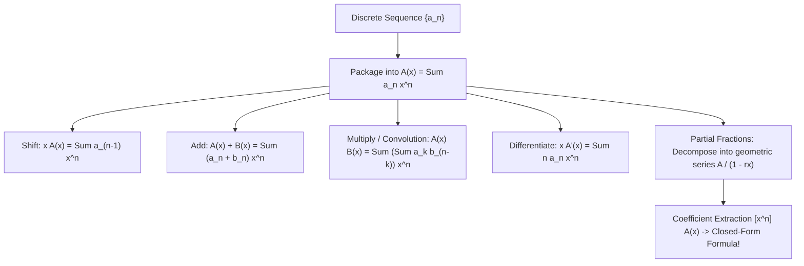

# Generating Functions: Combinatorial Clotheslines & Recurrence Solvers

## 1. Executive Summary & Herbert Wilf's Intuition

> [!NOTE]
> *"A generating function is a clothesline on which we hang up a sequence of numbers for display."*  
> — Herbert S. Wilf, *generatingfunctionology* (1990)

In algorithm analysis, we frequently encounter discrete sequences:
- $a_n$: The number of steps to sort $n$ elements.
- $F_n$: The $n$-th Fibonacci number.
- $C_n$: The number of distinct binary trees with $n$ vertices.
- $p(n)$: The number of ways to make change for $n$ cents.

Working with infinite discrete sequences $\{a_0, a_1, a_2, \dots\}$ algebraically is difficult. A **Generating Function** packages an entire infinite sequence into a single continuous analytic object—a formal power series:
$$A(x) = \sum_{n=0}^\infty a_n x^n = a_0 + a_1 x + a_2 x^2 + a_3 x^3 + \dots$$

Here, $x$ is not an unknown to be solved; it is a **formal variable** acting as a placeholder. Powers of $x$ act as "clothes pegs," and the coefficients $a_n = [x^n] A(x)$ are the numbers hanging on the line.

---

## 2. The Toolkit: Operations on Formal Power Series

### 2.1 The Foundational Geometric Dictionary

| Power Series $A(x)$ | Closed-Form Sequence $a_n = [x^n] A(x)$ | Sequence Terms |
| :--- | :--- | :--- |
| $\frac{1}{1 - x} = \sum_{n=0}^\infty x^n$ | $a_n = 1$ | $1, 1, 1, 1, 1, \dots$ |
| $\frac{1}{1 - c x} = \sum_{n=0}^\infty c^n x^n$ | $a_n = c^n$ | $1, c, c^2, c^3, \dots$ |
| $\frac{1}{(1 - x)^2} = \sum_{n=0}^\infty (n + 1) x^n$ | $a_n = n + 1$ | $1, 2, 3, 4, 5, \dots$ |
| $\frac{x}{(1 - x)^2} = \sum_{n=0}^\infty n x^n$ | $a_n = n$ | $0, 1, 2, 3, 4, \dots$ |
| $\frac{1}{(1 - x)^k} = \sum_{n=0}^\infty \binom{n + k - 1}{k - 1} x^n$ | $a_n = \binom{n + k - 1}{k - 1}$ | Stars-and-bars combinations |
| $e^x = \sum_{n=0}^\infty \frac{x^n}{n!}$ | $a_n = \frac{1}{n!}$ | Exponential generating basis |

### 2.2 Convolution (Product of Series)
When two generating functions are multiplied, their coefficients form a **discrete convolution**:
$$A(x) B(x) = \left( \sum_{i=0}^\infty a_i x^i \right) \left( \sum_{j=0}^\infty b_j x^j \right) = \sum_{n=0}^\infty \left( \sum_{k=0}^n a_k b_{n-k} \right) x^n$$
Combinatorial meaning: If $a_k$ is the number of ways to build component 1 of size $k$, and $b_{n-k}$ is the number of ways to build component 2 of size $n-k$, then $[x^n] A(x) B(x)$ is the number of ways to combine them into an object of total size $n$!

---

## 3. Solving Recurrence Relations via Generating Functions

### 3.1 The 4-Step Master Recipe
1. **Define**: Let $A(x) = \sum_{n=0}^\infty a_n x^n$.
2. **Multiply & Sum**: Multiply the recurrence by $x^n$ and sum over all valid $n \ge 0$.
3. **Solve for $A(x)$**: Rearrange the equation to express $A(x)$ algebraically in terms of $x$.
4. **Expand & Extract**: Decompose $A(x)$ via partial fractions and read off $[x^n] A(x) = a_n$.

---

### 3.2 Case Study 1: The Fibonacci Numbers (Binet's Formula)
Given the recurrence:
$$F_0 = 0, \quad F_1 = 1, \quad F_n = F_{n-1} + F_{n-2} \quad (n \ge 2)$$

**Step 1 & 2**: Multiply by $x^n$ and sum from $n = 2$ to $\infty$:
$$\sum_{n=2}^\infty F_n x^n = \sum_{n=2}^\infty F_{n-1} x^n + \sum_{n=2}^\infty F_{n-2} x^n$$
Recognize the left and right sides in terms of $F(x) = \sum_{n=0}^\infty F_n x^n$:
$$F(x) - F_0 - F_1 x = x (F(x) - F_0) + x^2 F(x)$$
Substitute initial values $F_0 = 0, F_1 = 1$:
$$F(x) - x = x F(x) + x^2 F(x)$$

**Step 3: Solve for $F(x)$**:
$$F(x) (1 - x - x^2) = x \implies F(x) = \frac{x}{1 - x - x^2}$$

**Step 4: Partial Fractions Decomposition**:
The roots of the denominator $1 - x - x^2 = 0$ are the golden ratio conjugates:
$$r_1 = -\frac{1 + \sqrt{5}}{2} = -\phi, \quad r_2 = -\frac{1 - \sqrt{5}}{2} = -\psi$$
Factoring yields:
$$F(x) = \frac{1}{\sqrt{5}} \left( \frac{1}{1 - \phi x} - \frac{1}{1 - \psi x} \right)$$
Using the geometric series $\frac{1}{1 - c x} = \sum_{n=0}^\infty c^n x^n$:
$$F_n = [x^n] F(x) = \frac{1}{\sqrt{5}} (\phi^n - \psi^n) = \frac{1}{\sqrt{5}} \left( \left(\frac{1 + \sqrt{5}}{2}\right)^n - \left(\frac{1 - \sqrt{5}}{2}\right)^n \right)$$
This is **Binet's Formula**, derived without guesswork!

---

### 3.3 Case Study 2: Catalan Numbers & Binary Trees
The number of distinct rooted binary trees with $n$ nodes satisfies:
$$C_0 = 1, \quad C_n = \sum_{i=0}^{n-1} C_i C_{n-1-i} \quad (n \ge 1)$$
Notice that the summation is a convolution of the Catalan sequence with itself!
Let $C(x) = \sum_{n=0}^\infty C_n x^n$.
The convolution identity gives:
$$C(x) = 1 + x C(x)^2 \implies x C(x)^2 - C(x) + 1 = 0$$
Using the quadratic formula to solve for $C(x)$:
$$C(x) = \frac{1 \pm \sqrt{1 - 4x}}{2x}$$
Since $C(0) = C_0 = 1$, we must choose the minus sign (by L'Hôpital's rule $\lim_{x \to 0} \frac{1 - \sqrt{1-4x}}{2x} = 1$):
$$C(x) = \frac{1 - \sqrt{1 - 4x}}{2x}$$
Applying Newton's generalized binomial theorem $\sqrt{1 - 4x} = \sum_{n=0}^\infty \binom{1/2}{n} (-4x)^n$:
$$C_n = [x^n] C(x) = \frac{1}{n + 1} \binom{2n}{n}$$
This single formula counts:
1. Valid balanced parentheses strings of length $2n$.
2. Distinct binary trees with $n$ vertices.
3. Non-intersecting polygon triangulations with $n+2$ vertices.
4. Dyck paths from $(0, 0)$ to $(2n, 0)$ staying above the x-axis.

---

## 4. Integer Partitions & Coin Change (Euler's Product Formula)

Let $P(x)$ be the generating function where $[x^n] P(x)$ is the number of ways to write $n$ as a sum of positive integers:
$$P(x) = \prod_{k=1}^\infty \frac{1}{1 - x^k} = \left(\sum_{a=0}^\infty x^{1a}\right) \left(\sum_{b=0}^\infty x^{2b}\right) \left(\sum_{c=0}^\infty x^{3c}\right) \cdots$$

### The Coin Change Analogy:
If available coin denominations are $\{1¢, 5¢, 10¢, 25¢\}$, the generating function for the number of ways to make change for $n$ cents is:
$$C(x) = \frac{1}{(1 - x)(1 - x^5)(1 - x^{10})(1 - x^{25})}$$
Expanding this polynomial product directly answers dynamic programming coin change in closed form!

---

## 5. Probability Generating Functions (PGF)

For a non-negative integer-valued random variable $X \in \{0, 1, 2, \dots\}$, its **Probability Generating Function** $G_X(s)$ is:
$$G_X(s) = \mathbb{E}[s^X] = \sum_{k=0}^\infty \mathbb{P}(X = k) s^k$$

### 5.1 Moment Extraction Properties
1. **Total Probability**: $G_X(1) = \sum \mathbb{P}(X = k) = 1$.
2. **Mean**:
   $$G_X'(s) = \sum_{k=1}^\infty k \mathbb{P}(X = k) s^{k-1} \implies \mathbb{E}[X] = G_X'(1)$$
3. **Variance**:
   $$G_X''(1) = \mathbb{E}[X(X - 1)] = \mathbb{E}[X^2] - \mathbb{E}[X] \implies \text{Var}(X) = G_X''(1) + G_X'(1) - (G_X'(1))^2$$
4. **Sum of Independent Variables**:
   If $X$ and $Y$ are independent, $G_{X+Y}(s) = \mathbb{E}[s^{X+Y}] = \mathbb{E}[s^X] \mathbb{E}[s^Y] = G_X(s) G_Y(s)$.
   Adding independent random variables corresponds to multiplying their generating functions!

---

## 6. Algorithmic Applications: FFT & Polynomial Multiplication

Generating functions are not just mathematical theory; they are executed directly in software!
When multiplying two generating functions $A(x) = \sum_{i=0}^n a_i x^i$ and $B(x) = \sum_{j=0}^n b_j x^j$:
- Naive polynomial multiplication takes $O(N^2)$ time.
- **Fast Fourier Transform (FFT / NTT)** evaluates $A(x)$ and $B(x)$ at complex roots of unity, multiplies values in $O(N)$ pointwise time, and interpolates back using Inverse FFT in:
  $$O(N \log N) \text{ time!}$$
This enables solving string matching with wildcards, integer multiplication, and tree convolutions in $O(N \log N)$.

---

## 7. Exercises & Analytical Problems

1. **Deriving Lucas Numbers**:
   Let $L_0 = 2, L_1 = 1, L_n = L_{n-1} + L_{n-2}$. Derive its generating function $L(x)$ and extract the closed-form expression for $L_n$.
2. **Tiling a $2 \times N$ Board with Dominoes**:
   Let $a_n$ be the number of ways to tile a $2 \times n$ board with $2 \times 1$ dominoes. Show that $a_n = a_{n-1} + a_{n-2}$ and find $A(x)$.
3. **Dice Sum Distribution**:
   Let $P(x) = \frac{1}{6}(x + x^2 + x^3 + x^4 + x^5 + x^6)$ be the generating function of a fair 6-sided die. Using $P(x)^3$, find the probability of rolling a total sum of 10 with three dice.
