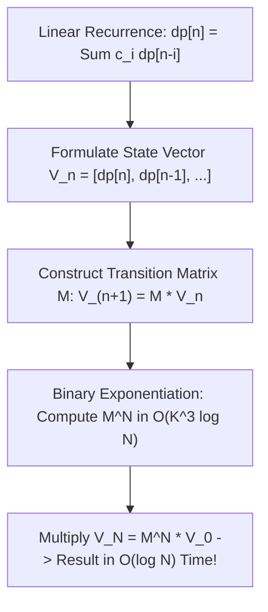

# Linear Algebra for Algorithms: Matrices, Spectral Graphs & XOR Bases

## 1. Executive Summary & Algorithmic Applications

Linear algebra is often taught as an abstract study of vector spaces and matrix equations. In computer science and algorithm design, however, linear algebra is a **computational powerhouse**:

- **Logarithmic Recurrence Acceleration**: Any linear recurrence relation of order $K$ can be evaluated at step $N$ in $O(K^3 \log N)$ time using **Matrix Exponentiation**.
- **Graph Path Counting & Shortest Paths**: The $k$-th power of an adjacency matrix $A^k$ computes the number of walks of length $k$. Replacing standard arithmetic with the $(\min, +)$ tropical semiring solves All-Pairs Shortest Paths.
- **GF(2) Gaussian Elimination & XOR Bases**: Row reduction over Galois Field $\text{GF}(2)$ solves XOR-sum maximization, linear dependence, and parity games in $O(N \cdot B)$ where $B \le 64$.
- **Kirchhoff's Matrix Tree Theorem**: The number of spanning trees in an arbitrary graph equals any cofactor of the **Graph Laplacian Matrix** $L = D - A$.
- **Metric Embedding**: The **Johnson-Lindenstrauss Lemma** proves that high-dimensional vector spaces can be projected into $O(\epsilon^{-2} \log N)$ dimensions while preserving pairwise Euclidean distances within $1 \pm \epsilon$.

---

## 2. Matrix Exponentiation for Recurrences & Graphs



### 2.1 The Fibonacci Recurrence in $O(\log N)$
The Fibonacci recurrence $F_n = F_{n-1} + F_{n-2}$ can be framed as a state transition:
$$\begin{pmatrix} F_{n+1} \\ F_n \end{pmatrix} = \begin{pmatrix} 1 & 1 \\ 1 & 0 \end{pmatrix} \begin{pmatrix} F_n \\ F_{n-1} \end{pmatrix}$$
By induction:
$$\begin{pmatrix} F_{n+1} \\ F_n \end{pmatrix} = \begin{pmatrix} 1 & 1 \\ 1 & 0 \end{pmatrix}^n \begin{pmatrix} F_1 \\ F_0 \end{pmatrix} = \begin{pmatrix} 1 & 1 \\ 1 & 0 \end{pmatrix}^n \begin{pmatrix} 1 \\ 0 \end{pmatrix}$$
Using binary exponentiation (repeated squaring), $M^n$ is computed using $\le 2 \log_2 n$ matrix multiplications. For $2 \times 2$ matrices, computing $F_{10^{18}} \pmod{10^9 + 7}$ executes in less than **1 microsecond**!

### 2.2 Counting Graph Walks of Length $k$
Let $G = (V, E)$ be a directed graph with adjacency matrix $A$, where $A_{ij} = 1$ if edge $(i \to j)$ exists, and $0$ otherwise.

> [!TIP]
> **Adjacency Power Lemma**:
> The entry $(A^k)_{ij}$ in the $k$-th matrix power $A^k$ is **identically equal to the number of directed walks of length $k$ from vertex $i$ to vertex $j$**.

*Proof by induction on $k$*:
For $k=1$, $(A^1)_{ij} = A_{ij}$ (walks of length 1 are single edges).
For $k > 1$, $(A^k)_{ij} = \sum_{m \in V} (A^{k-1})_{im} A_{mj}$. By induction, $(A^{k-1})_{im}$ counts walks of length $k-1$ from $i$ to $m$. Multiplying by $A_{mj}$ extends each walk by the final edge $(m \to j)$.

### 2.3 The Tropical $(\min, +)$ Semiring & Shortest Paths
If we redefine matrix multiplication by replacing addition with $\min$ and multiplication with addition:
$$(A \odot B)_{ij} = \min_{k} (A_{ik} + B_{kj})$$
Then setting $W_{ij} = \text{weight}(i \to j)$ (with $W_{ii} = 0$ and $W_{ij} = \infty$ for non-edges):
$$W^k_{ij} = \text{Shortest path from } i \text{ to } j \text{ using at most } k \text{ edges}$$
Computing $W^{|V|-1}$ via repeated squaring solves **All-Pairs Shortest Paths (APSP)** in $O(V^3 \log V)$ time!

---

## 3. Gaussian Elimination over GF(2) & Linear XOR Bases

In competitive programming and systems cryptography, problems frequently require finding a subset of integers that maximizes XOR sum or evaluating whether a value can be formed by XOR combinations.

### 3.1 The Vector Space of Bits
Consider 64-bit integers as vectors in the vector space $\mathbb{Z}_2^{64}$ over the two-element field $\text{GF}(2) = \{0, 1\}$:
- Vector addition is bitwise XOR: $\vec{u} \oplus \vec{v}$.
- Scalar multiplication is $0 \cdot \vec{v} = \vec{0}$ and $1 \cdot \vec{v} = \vec{v}$.

### 3.2 The Linear XOR Basis Engine
A set of vectors $\{\vec{b}_1, \dots, \vec{b}_k\}$ forms a **Linear Basis** if they are linearly independent and span the space of all possible XOR combinations.
- For 64-bit integers, the basis size $k \le 64$.
- Inserting a new value takes $O(B)$ time where $B = 64$.

```cpp
struct XorBasis {
    uint64_t basis[64] = {0};
    size_t size = 0;

    void insert(uint64_t mask) {
        for (int i = 63; i >= 0; --i) {
            if (!(mask & (1ULL << i))) continue;
            if (!basis[i]) {
                basis[i] = mask;
                size++;
                return;
            }
            mask ^= basis[i]; // Eliminate leading bit
        }
    }

    bool can_represent(uint64_t mask) const {
        for (int i = 63; i >= 0; --i) {
            if (!(mask & (1ULL << i))) continue;
            if (!basis[i]) return false;
            mask ^= basis[i];
        }
        return true;
    }

    uint64_t max_xor() const {
        uint64_t res = 0;
        for (int i = 63; i >= 0; --i) {
            if ((res ^ basis[i]) > res) {
                res ^= basis[i];
            }
        }
        return res;
    }
};
```

**Key Applications**:
1. Finding the maximum possible XOR sum of any subset of an array in $O(N \cdot 64)$ time.
2. Determining the total number of distinct XOR sums: $2^{\text{size}}$.
3. Solving Nim games, parity checks, and Lights Out puzzles.

---

## 4. Spectral Graph Theory & Kirchhoff's Matrix Tree Theorem

### 4.1 The Graph Laplacian
Let $G = (V, E)$ be an undirected graph without self-loops.
- **Degree Matrix $D$**: Diagonal matrix where $D_{ii} = \text{deg}(v_i)$.
- **Adjacency Matrix $A$**: Symmetric matrix where $A_{ij} = 1$ if $(v_i, v_j) \in E$.
- **Graph Laplacian Matrix $L$**:
  $$L = D - A$$
$$L_{ij} = \begin{cases} \text{deg}(v_i) & \text{if } i = j \\ -1 & \text{if } (v_i, v_j) \in E \\ 0 & \text{otherwise} \end{cases}$$

```
Graph: Triangle (K3)
Nodes: 1, 2, 3

Adjacency A:       Degree D:          Laplacian L = D - A:
[ 0  1  1 ]       [ 2  0  0 ]       [  2 -1 -1 ]
[ 1  0  1 ]       [ 0  2  0 ]       [ -1  2 -1 ]
[ 1  1  0 ]       [ 0  0  2 ]       [ -1 -1  2 ]
```

### 4.2 Kirchhoff's Matrix Tree Theorem (1847)
> [!IMPORTANT]
> **Theorem**: The total number of distinct spanning trees in an undirected graph $G$ is equal to **any cofactor of its Laplacian matrix $L$**.

To compute the number of spanning trees:
1. Construct the $N \times N$ Laplacian matrix $L = D - A$.
2. Delete any row $i$ and column $i$ to produce an $(N-1) \times (N-1)$ submatrix $L^{(i)}$.
3. Compute the determinant:
   $$\tau(G) = \det(L^{(i)})$$
Using Gaussian Elimination, the determinant is computed in $O(N^3)$ time!

*Verification on $K_3$*:
Delete row 1, col 1 of $K_3$ Laplacian:
$$L^{(1)} = \begin{pmatrix} 2 & -1 \\ -1 & 2 \end{pmatrix} \implies \det(L^{(1)}) = (2)(2) - (-1)(-1) = 4 - 1 = 3$$
The number of spanning trees of a triangle is indeed 3 (removing any of the 3 edges leaves a tree). By Cayley's formula, for complete graph $K_n$, $\tau(K_n) = n^{n-2}$.

---

## 5. Metric Dimensionality Reduction: Johnson-Lindenstrauss

When searching nearest neighbors across millions of high-dimensional vectors (e.g. 1536-dimensional embeddings in AI search engines), calculating distances is computationally slow.

> [!NOTE]
> **The Johnson-Lindenstrauss Lemma (1984)**:
> Given $N$ points in $\mathbb{R}^D$ and $\epsilon \in (0, 1)$, there exists a linear mapping $f: \mathbb{R}^D \to \mathbb{R}^k$ with target dimension:
> $$k = O\left( \frac{\log N}{\epsilon^2} \right)$$
> such that for all point pairs $u, v$:
> $$(1 - \epsilon) \|u - v\|^2 \le \|f(u) - f(v)\|^2 \le (1 + \epsilon) \|u - v\|^2$$

Remarkably, the target dimension $k$ **does not depend on the original dimension $D$ at all!** It depends solely on $\log N$. A dataset of $1,000,000$ vectors in 10,000-dimensional space can be projected into a few hundred dimensions while preserving all pairwise geometry within $5\%$ error.

---

## 6. Exercises & Analytical Problems

1. **Tribonacci via Matrix Exponentiation**:
   Let $T_0 = 0, T_1 = 1, T_2 = 1, T_n = T_{n-1} + T_{n-2} + T_{n-3}$. Construct the $3 \times 3$ transition matrix and derive the state equation for $T_n$.
2. **Kth Shortest Walk**:
   Explain how modifying matrix exponentiation on the $(\min, +)$ semiring can compute the length of the shortest walk containing exactly $K$ edges between two vertices.
3. **Kirchhoff's Theorem for Complete Bipartite Graph**:
   Construct the Laplacian for complete bipartite graph $K_{2, 3}$ and verify that the number of spanning trees is $2^{3-1} \cdot 3^{2-1} = 4 \cdot 3 = 12$.
