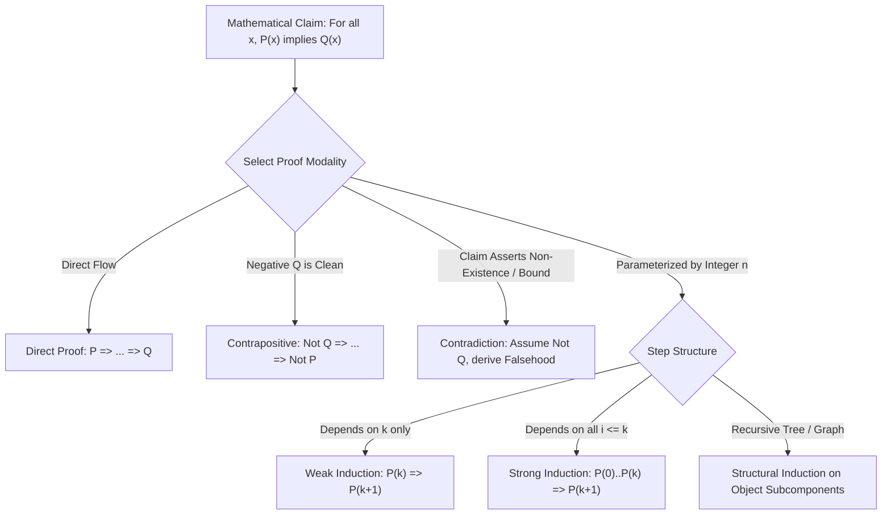
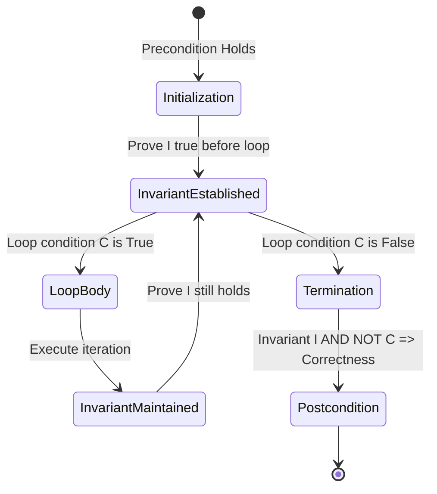

# Logic and Proof Techniques

> [!NOTE]
> **The Foundation of Algorithmic Correctness:**
> An algorithm is not merely code that runs; it is a mathematical claim that for all inputs conforming to specified preconditions, execution halts in finite time and satisfies stated postconditions. Formal logic and proof techniques provide the language to rigorously establish:
> 1. **Algorithm Correctness:** Proving that an algorithm produces the correct output for every valid input.
> 2. **Termination:** Proving that loops and recursions strictly decrease toward a well-founded base case.
> 3. **Lower Bounds:** Proving that no algorithm in a given computation model can beat a specific complexity threshold.

> [!TIP]
> **The Four Classical Proof Modalities:**
> - **Direct Proof ($P \implies Q$):** Assume $P$ is true; proceed via definitions, axioms, and established theorems to deduce $Q$.
> - **Contrapositive ($\neg Q \implies \neg P$):** Exploit the logical equivalence $P \implies Q \equiv \neg Q \implies \neg P$. Highly effective when $\neg Q$ provides more concrete algebraic structure than $P$.
> - **Contradiction ($P \land \neg Q \implies \bot$):** Assume the proposition is false; derive a logical impossibility (e.g., $0 = 1$ or an element that is both even and odd).
> - **Mathematical Induction:** Establish a base case $P(b)$, then prove the transmission invariant $\forall k \ge b, P(k) \implies P(k+1)$.

> [!WARNING]
> **Common Fallacies in Algorithm Proofs:**
> 1. **Affirming the Consequent:** Concluding $P$ is true simply because $P \implies Q$ and $Q$ is true. (e.g., "If an algorithm is $O(n)$, it passes within 1 second; this code passed within 1 second, therefore it is $O(n)$").
> 2. **Failure of Base Case Coverage in Induction:** Proving the inductive step $P(k) \implies P(k+1)$ correctly while omitting or misidentifying the base case (e.g., the infamous "all horses are the same color" fallacy).
> 3. **Assuming What You Wish to Prove (Circular Reasoning / Begging the Question):** Embedding the postcondition into intermediate inductive steps without justification.

---

## 1. Propositional and Predicate Logic

### 1.1 Logical Connectives and Truth Tables

Let $P$ and $Q$ be propositions (declarative statements that are either True or False).

| $P$ | $Q$ | $\neg P$ (Not) | $P \land Q$ (And) | $P \lor Q$ (Or) | $P \implies Q$ (Implies) | $P \iff Q$ (Equiv) |
| :---: | :---: | :---: | :---: | :---: | :---: | :---: |
| T | T | F | T | T | **T** | T |
| T | F | F | F | T | **F** | F |
| F | T | T | F | T | **T** | F |
| F | F | T | F | F | **T** | T |

> [!IMPORTANT]
> **Vacuous Truth:** The implication $P \implies Q$ is True whenever the antecedent $P$ is False, regardless of $Q$. (e.g., "If $x \in \emptyset$, then $x > 100$" is vacuously True).

### 1.2 Fundamental Logical Equivalences
1. **De Morgan's Laws:**
   $$\neg (P \land Q) \equiv \neg P \lor \neg Q$$
   $$\neg (P \lor Q) \equiv \neg P \land \neg Q$$
2. **Implication Identity:**
   $$P \implies Q \equiv \neg P \lor Q$$
3. **Contrapositive Equivalence:**
   $$P \implies Q \equiv \neg Q \implies \neg P$$
   *(Note: The converse $Q \implies P$ and inverse $\neg P \implies \neg Q$ are NOT logically equivalent to $P \implies Q$)*.

### 1.3 Predicate Logic & Quantifiers
- **Universal Quantifier ($\forall$):** $\forall x \in S, P(x)$ is True if $P(x)$ holds for every element in $S$.
- **Existential Quantifier ($\exists$):** $\exists x \in S, P(x)$ is True if $P(x)$ holds for at least one element in $S$.
- **Quantifier Negation Duality:**
  $$\neg (\forall x P(x)) \equiv \exists x (\neg P(x))$$
  $$\neg (\exists x P(x)) \equiv \forall x (\neg P(x))$$

---

## 2. Core Proof Methodologies

### 2.1 Direct Proof
To prove $P \implies Q$:
1. State "Assume $P$ is true."
2. Unfold definitions of concepts in $P$.
3. Apply deductive steps, known algebraic lemmas, and identities.
4. Conclude $Q$.

#### Example: Sum of Two Odd Numbers is Even
- *Claim:* If $a$ and $b$ are odd integers, then $a + b$ is even.
- *Proof:*
  1. Since $a$ and $b$ are odd, there exist integers $k, m$ such that $a = 2k + 1$ and $b = 2m + 1$.
  2. Then $a + b = (2k + 1) + (2m + 1) = 2k + 2m + 2 = 2(k + m + 1)$.
  3. Let $q = k + m + 1 \in \mathbb{Z}$. Then $a + b = 2q$.
  4. By definition, $a + b$ is even. $\blacksquare$

---

### 2.2 Proof by Contraposition
To prove $P \implies Q$, we prove the logically equivalent statement $\neg Q \implies \neg P$.

#### Example: Parity of $n^2$
- *Claim:* For integer $n$, if $n^2$ is even, then $n$ is even.
- *Proof via Contrapositive:*
  1. We prove: If $n$ is odd ($\neg Q$), then $n^2$ is odd ($\neg P$).
  2. Assume $n$ is odd. Then $n = 2k + 1$ for some integer $k$.
  3. $n^2 = (2k + 1)^2 = 4k^2 + 4k + 1 = 2(2k^2 + 2k) + 1$.
  4. Since $2k^2 + 2k$ is an integer, $n^2$ is of the form $2m + 1$, which is odd.
  5. By contraposition, if $n^2$ is even, $n$ must be even. $\blacksquare$

---

### 2.3 Proof by Contradiction ($Reductio\ ad\ Absurdum$)
To prove a proposition $P$:
1. Assume $\neg P$ is True.
2. Follow deductive reasoning until a logical impossibility ($R \land \neg R$) is derived.
3. Conclude that the assumption $\neg P$ is False, meaning $P$ is True.

#### Canonical Example: $\sqrt{2}$ is Irrational
- *Claim:* $\sqrt{2} \notin \mathbb{Q}$.
- *Proof:*
  1. Assume the negation: $\sqrt{2}$ is rational.
  2. Then $\sqrt{2} = \frac{a}{b}$ for integers $a, b$ with $b \ne 0$, where $\gcd(a, b) = 1$ (fraction in lowest terms).
  3. Squaring both sides: $2 = \frac{a^2}{b^2} \implies a^2 = 2b^2$.
  4. Thus $a^2$ is even, which implies $a$ is even ($a = 2k$).
  5. Substituting $a = 2k$: $(2k)^2 = 2b^2 \implies 4k^2 = 2b^2 \implies b^2 = 2k^2$.
  6. Thus $b^2$ is even, which implies $b$ is even.
  7. If both $a$ and $b$ are even, then $2 \mid \gcd(a, b)$, contradicting $\gcd(a, b) = 1$.
  8. Therefore, $\sqrt{2}$ is irrational. $\blacksquare$

---

### 2.4 Mathematical Induction

Used to prove claims parameterized by integers $n \ge n_0$.

#### 1. Weak Induction:
- **Base Case:** Prove $P(n_0)$ holds.
- **Inductive Hypothesis:** Assume $P(k)$ holds for an arbitrary $k \ge n_0$.
- **Inductive Step:** Prove that $P(k) \implies P(k+1)$.
- **Conclusion:** $P(n)$ holds for all integers $n \ge n_0$.

#### 2. Strong Induction:
- **Base Cases:** Prove $P(n_0), P(n_0+1), \dots, P(n_0+j)$ hold.
- **Inductive Hypothesis:** Assume $P(i)$ holds for **all** $n_0 \le i \le k$.
- **Inductive Step:** Prove that $\left(\bigwedge_{i=n_0}^k P(i)\right) \implies P(k+1)$.
- *Application:* Proving existence of prime factorizations, binary tree decomposition, and games of strategy (Nim).

#### 3. Structural Induction:
Generalization of induction to recursively defined structures:
- Prove property for atomic base objects (e.g., leaf nodes, empty trees).
- Prove that if property holds for subcomponents $L$ and $R$, it holds for the composite structure $\text{Node}(L, R)$.

---

### 2.5 The Well-Ordering Principle
Every non-empty set of non-negative integers contains a least element:
$$S \subseteq \mathbb{N}, S \ne \emptyset \implies \exists m \in S \text{ such that } \forall x \in S, m \le x$$
The Well-Ordering Principle is logically equivalent to the Principle of Mathematical Induction and is frequently used to prove program termination by showing that a loop variant strictly decreases within $\mathbb{N}$.

---

### 2.6 The Pigeonhole Principle

If $n$ items are placed into $k$ containers and $n > k$, then at least one container must contain at least $\lceil n/k \rceil$ items.

#### Algorithmic Application: Cycle Detection in Finite Automata
In any deterministic finite automaton (DFA) with $|Q|$ states, processing any string of length $\ge |Q|$ must visit at least $|Q| + 1$ states. By the Pigeonhole Principle, at least one state must repeat, proving the existence of a loop (the basis of the Pumping Lemma).

---

## 3. Loop Invariants for Algorithm Correctness

A **loop invariant** is a formal predicate $I$ that is true before and after each iteration of a loop.

To prove algorithm correctness using loop invariants, three conditions must be shown:
1. **Initialization:** $I$ is true prior to the first iteration of the loop.
2. **Maintenance:** If $I$ is true before an iteration, it remains true before the next iteration.
3. **Termination:** When the loop terminates, the invariant $I$, combined with the loop termination condition, establishes the postcondition of the algorithm.

---

## 4. Complexity & Operational Verification Matrix

| Proof Technique | Primary Use in Computer Science | Typical Invariant Structure | Common Failure Mode |
| :--- | :--- | :--- | :--- |
| **Direct Proof** | Runtime complexity derivations, algebraic identities | Linear step-by-step equality | Unjustified algebraic step |
| **Contrapositive** | Proving conditional lower bounds | Invert output requirement | Confusing contrapositive with converse |
| **Contradiction** | Impossibility proofs, halting problem, adversary lower bounds | Assume optimal beats theoretical bound | Contradicting an unjustified assumption |
| **Weak Induction** | Correctness of linear loops, prefix sums | $P(k) \implies P(k+1)$ | Weak inductive hypothesis |
| **Strong Induction** | Divide-and-conquer, recurrence solutions | $\forall i \le k, P(i) \implies P(k+1)$ | Insufficient base cases |
| **Structural Induction** | Tree traversals, expression evaluators | Subtree property preservation | Ignoring degenerate empty structures |
| **Loop Invariants** | Correctness of sorting, search, graph relaxations | Boundary slice invariants ($A[0 \dots i]$) | Mischaracterizing termination state |

---

## 5. Curated References & Related Problems

1. **CLRS Chapter 2 & Appendix B:** *Loop Invariants and Discrete Mathematics*.
2. **Discrete Mathematics and its Applications (Kenneth Rosen):** *Chapter 1 & 5: Logic and Induction*.
3. **Introduction to the Theory of Computation (Michael Sipser):** *Chapter 0: Proof Techniques*.
4. **LeetCode 704:** *Binary Search* (Verification via loop invariant `low <= target_idx <= high`).
5. **LeetCode 75:** *Sort Colors* (Dutch National Flag three-pointer invariant).
