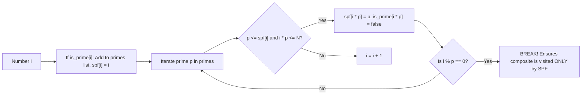

# Number Theory Basics

> [!NOTE]
> **The Computational Bedrock of Cryptography & Hashing:**
> Elementary number theory studies the properties of integers, prime numbers, divisibility, and modular congruences. In computer science and competitive programming, number theory enables:
> 1. **Public-Key Cryptography:** RSA, Diffie-Hellman, and elliptic curves rely on modular exponentiation and the difficulty of integer factorization.
> 2. **Universal Hashing:** Preventing hash table worst-case collision attacks using modular field arithmetic.
> 3. **Exact Modular Arithmetic:** Handling integer growth in combinatorial counting without precision loss.

> [!TIP]
> **The Dual Paths to Modular Inverse ($a \cdot x \equiv 1 \pmod m$):**
> - **When $m$ is prime ($p$):** Use Fermat's Little Theorem:
>   $$a^{p-1} \equiv 1 \pmod p \implies a^{-1} \equiv a^{p-2} \pmod p \quad \text{via binary exponentiation in } O(\log p)$$
> - **When $m$ is composite (with $\gcd(a, m) = 1$):** Use the Extended Euclidean Algorithm:
>   $$a x + m y = 1 \implies a x \equiv 1 \pmod m \quad \text{in } O(\log(\min(a, m)))$$

> [!WARNING]
> **Linear Sieve vs Classic Sieve Memory & Constant Factors:**
> While Euler's linear sieve achieves strictly $O(n)$ time by ensuring every composite number is crossed out exactly once by its smallest prime factor (SPF), its memory footprint is $4n$ bytes (storing 32-bit `spf[x]`). The classic Sieve of Eratosthenes ($O(n \log \log n)$) can be packed into a bitset using $\frac{n}{8}$ or $\frac{n}{16}$ bytes, fitting entirely within CPU L2/L3 cache and often outperforming the linear sieve in wall-clock time for $n \le 10^7$.

```mermaid
flowchart TD
    NT["Number Theory Core Operations"] --> Div["Divisibility & Primes"]
    Div --> Sieve["Prime Sieve: Eratosthenes O(n log log n) vs Linear O(n)"]
    Div --> GCD["Greatest Common Divisor"]
    GCD --> Euclid["Euclidean Algorithm: O(log min(a, b))"]
    Euclid --> ExtEuclid["Extended Euclidean Algorithm: ax + by = gcd(a, b)"]
    ExtEuclid --> ModInv["Modular Multiplicative Inverse: a^(-1) mod m"]
    ModInv --> Congruence["Systems of Congruences"]
    Congruence --> CRT["Chinese Remainder Theorem (CRT)"]
    Div --> Totient["Euler's Totient Function: phi(n)"]
    Totient --> EulerThm["Euler's Theorem: a^phi(m) = 1 mod m"]
```



---

## 1. Divisibility and Prime Factorization

For integers $a, b$ with $b \ne 0$, we say $b$ divides $a$ ($b \mid a$) if there exists an integer $q$ such that $a = q \cdot b$.

### Fundamental Theorem of Arithmetic
Every integer $n > 1$ can be uniquely factored into a product of prime powers:
$$n = p_1^{e_1} p_2^{e_2} \cdots p_k^{e_k} = \prod_{i=1}^k p_i^{e_i}$$
where $p_1 < p_2 < \dots < p_k$ are primes and $e_i \ge 1$.

#### Properties Derived from Factorization:
1. **Total Number of Divisors:**
   $$d(n) = \prod_{i=1}^k (e_i + 1)$$
2. **Sum of Divisors:**
   $$\sigma(n) = \prod_{i=1}^k \left( \frac{p_i^{e_i + 1} - 1}{p_i - 1} \right)$$
3. **Trial Division Factorization in $O(\sqrt{n})$:**
   Any composite number $n$ must have at least one prime factor $p \le \sqrt{n}$. Thus, testing divisors up to $\lfloor\sqrt{n}\rfloor$ guarantees complete factorization.

---

## 2. Greatest Common Divisor & Extended Euclidean Algorithm

The greatest common divisor $\gcd(a, b)$ is the largest positive integer that divides both $a$ and $b$.

### 2.1 Euclidean Algorithm
Based on the invariant:
$$\gcd(a, b) = \gcd(b, a \bmod b) \quad (\text{with } \gcd(a, 0) = a)$$

#### Complexity (Lamé's Theorem):
The number of division steps in the Euclidean algorithm is at most $5 \times \text{number of base-10 digits of } \min(a, b)$.
Worst-case input occurs on consecutive Fibonacci numbers ($F_{n+1}, F_n$), where each modulo step reduces the dividend by the minimal factor:
$$\text{Time Complexity} = O(\log(\min(a, b)))$$

### 2.2 Bézout's Identity and the Extended Euclidean Algorithm
Bézout's identity asserts that for any integers $a$ and $b$, there exist integers $x$ and $y$ such that:
$$a \cdot x + b \cdot y = \gcd(a, b)$$

The Extended Euclidean algorithm computes both $\gcd(a, b)$ and the Bézout coefficients $(x, y)$ by tracking the substitution backwards through the Euclidean division steps:

Given recursive step:
$$b \cdot x_1 + (a \bmod b) \cdot y_1 = g$$
Since $a \bmod b = a - \lfloor a/b \rfloor \cdot b$:
$$b \cdot x_1 + (a - \lfloor a/b \rfloor \cdot b) \cdot y_1 = a \cdot y_1 + b \cdot (x_1 - \lfloor a/b \rfloor \cdot y_1) = g$$
Thus:
$$x = y_1, \quad y = x_1 - \lfloor a/b \rfloor \cdot y_1$$

---

## 3. Modular Arithmetic and Multiplicative Inverses

Two integers $a$ and $b$ are congruent modulo $m$ ($a \equiv b \pmod m$) if $m \mid (a - b)$.

### 3.1 Modular Multiplicative Inverse
The modular inverse of $a$ modulo $m$ is an integer $x$ such that:
$$a \cdot x \equiv 1 \pmod m$$
The inverse exists **if and only if $\gcd(a, m) = 1$** (i.e., $a$ and $m$ are coprime).

#### Evaluation via Extended Euclidean Algorithm:
Solving $a x + m y = \gcd(a, m) = 1$ yields:
$$a x \equiv 1 \pmod m \implies a^{-1} \equiv (x \bmod m + m) \bmod m$$

#### Evaluation via Fermat's Little Theorem (Prime Modulus $p$):
For prime $p$ and $a \not\equiv 0 \pmod p$:
$$a^{p-1} \equiv 1 \pmod p \implies a \cdot a^{p-2} \equiv 1 \pmod p \implies a^{-1} \equiv a^{p-2} \pmod p$$

---

## 4. Prime Sieves

### 4.1 Classic Sieve of Eratosthenes
Initializes a boolean array of size $n + 1$. Iteratively marks multiples of each prime $p \le \sqrt{n}$ starting at $p^2$:

$$\text{Total Steps} = \sum_{p \le n} \frac{n}{p} = n \sum_{p \le n} \frac{1}{p} = n (\ln \ln n + M) = O(n \log \log n)$$

### 4.2 Linear Sieve (Euler's Sieve)
Eliminates the redundant composite visits of the classic sieve. Every composite number $x$ is visited **exactly once** by its Smallest Prime Factor (SPF):



#### Invariant of Euler's Sieve:
Because we break immediately when `i % p == 0`, $p$ is strictly the smallest prime factor of $i \cdot p$. Any larger prime $p' > p$ would not be the smallest prime factor of $i \cdot p'$, guaranteeing strict $O(n)$ operations.

---

## 5. Euler's Totient Function $\phi(n)$

Euler's totient function $\phi(n)$ counts the number of positive integers up to $n$ that are coprime to $n$:
$$\phi(n) = |\{k \in \mathbb{Z} : 1 \le k \le n, \gcd(k, n) = 1\}|$$

### Properties:
1. **Formula from Prime Factorization:**
   $$\phi(n) = n \prod_{p \mid n} \left( 1 - \frac{1}{p} \right) = \prod_{i=1}^k p_i^{e_i - 1}(p_i - 1)$$
2. **Multiplicativity:**
   If $\gcd(a, b) = 1$, then $\phi(a \cdot b) = \phi(a) \cdot \phi(b)$.
3. **Divisor Sum Identity (Gauss' Theorem):**
   $$\sum_{d \mid n} \phi(d) = n$$
4. **Euler's Totient Theorem:**
   If $\gcd(a, m) = 1$, then:
   $$a^{\phi(m)} \equiv 1 \pmod m$$
   (Fermat's Little Theorem is the special case where $m = p$ is prime, so $\phi(p) = p - 1$).

---

## 6. Chinese Remainder Theorem (CRT)

Given a system of simultaneous congruences:
$$\begin{cases} x \equiv a_1 \pmod{m_1} \\ x \equiv a_2 \pmod{m_2} \\ \vdots \\ x \equiv a_k \pmod{m_k} \end{cases}$$
where moduli $m_1, m_2, \dots, m_k$ are pairwise coprime ($\gcd(m_i, m_j) = 1$ for $i \ne j$).

### Solution:
Let $M = \prod_{i=1}^k m_i$ and $M_i = \frac{M}{m_i}$. Since $\gcd(M_i, m_i) = 1$, there exists modular inverse $y_i \equiv M_i^{-1} \pmod{m_i}$.
The unique solution modulo $M$ is:
$$x = \left( \sum_{i=1}^k a_i \cdot M_i \cdot y_i \right) \bmod M$$

---

## 7. Complexity Matrix

| Algorithm / Operation | Time Complexity | Auxiliary Space | Deterministic? | Core Constraint |
| :--- | :--- | :--- | :--- | :--- |
| **Euclidean GCD** | $O(\log(\min(a, b)))$ | $O(1)$ | Yes | Non-negative integers |
| **Extended Euclidean** | $O(\log(\min(a, b)))$ | $O(1)$ | Yes | Outputs Bézout coefficients $(x, y)$ |
| **Modular Exp ($a^b \bmod m$)** | $O(\log b)$ | $O(1)$ | Yes | Modular multiplications |
| **Trial Division Factorization**| $O(\sqrt{n})$ | $O(1)$ | Yes | Practical for $n \le 10^{14}$ |
| **Classic Sieve** | $O(n \log \log n)$ | $O(n)$ bits | Yes | Cache-friendly bitset |
| **Linear Sieve (Euler)** | $O(n)$ | $O(n)$ words | Yes | Computes SPF and multiplicative functions |
| **Euler Totient $\phi(n)$ (Single)**| $O(\sqrt{n})$ | $O(1)$ | Yes | Requires prime factorization |
| **Chinese Remainder Theorem**| $O(k \log M)$ | $O(1)$ | Yes | Pairwise coprime moduli |

---

## 8. Common Pitfalls & Anti-Patterns

### Anti-Pattern 1: Negative Results from C++ Modulo Operator `%`
In C++17, `-7 % 5` evaluates to `-2`, NOT `3`. When dealing with modular arithmetic (especially after subtraction or Extended GCD):
```cpp
// ANTI-PATTERN: Can produce negative output
int ans = (a - b) % mod;

// CORRECT: Wrap into non-negative range
int ans = ((a - b) % mod + mod) % mod;
```

### Anti-Pattern 2: 64-bit Overflow in Modular Multiplication
When $m \approx 10^{18}$, computing $(a \cdot b) \pmod m$ overflows standard 64-bit unsigned integers (`uint64_t`). Use `__uint128_t` in GCC/Clang:
```cpp
uint64_t mul_mod(uint64_t a, uint64_t b, uint64_t m) {
    return static_cast<uint64_t>((static_cast<__uint128_t>(a) * b) % m);
}
```

---

## 9. Curated References & Related Problems

1. **CLRS Chapter 31:** *Number-Theoretic Algorithms*.
2. **A Computational Introduction to Number Theory and Algebra (Victor Shoup):** *Foundations of Modular Arithmetic*.
3. **LeetCode 372:** *Super Pow* (Euler's totient theorem with large exponents).
4. **Codeforces 101270F:** *Extended Euclid Problem* (Direct Bézout identity construction).
5. **Project Euler 10:** *Summation of Primes* (Sieve of Eratosthenes benchmarking).
