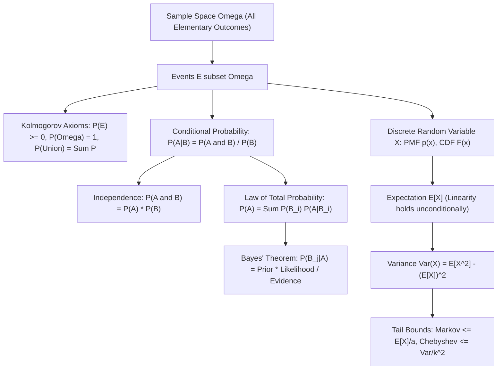

# Probability Basics

> [!NOTE]
> **Randomness as an Algorithmic Resource:**
> Randomized algorithms use coin flips to break worst-case input symmetries, simplify data structures, and achieve lower average-case complexities than deterministic counterparts. Probability theory formalizes:
> 1. **Randomized Quicksort:** Expected $O(n \log n)$ time avoiding adversarial quadratic inputs.
> 2. **Probabilistic Data Structures:** Bloom filters, Skip lists, HyperLogLog, and Treaps.
> 3. **Hashing Guarantees:** Universal hash families ensuring $O(1)$ expected lookup.

> [!TIP]
> **Linearity of Expectation: The Unconditional Superpower:**
> For *any* random variables $X_1, X_2, \dots, X_n$ (regardless of whether they are independent or highly correlated):
> $$\mathbb{E}\left[ \sum_{i=1}^n c_i X_i \right] = \sum_{i=1}^n c_i \mathbb{E}[X_i]$$
> This identity is the fundamental engine behind indicator random variable analysis in algorithms (e.g., counting inversions, expected quicksort comparisons, coupon collector's problem).

> [!WARNING]
> **Independence Pitfalls & Multiplication Fallacy:**
> While expectation is always additive ($\mathbb{E}[X + Y] = \mathbb{E}[X] + \mathbb{E}[Y]$), multiplication and variance additivity **strictly require independence**:
> - $\mathbb{E}[X Y] = \mathbb{E}[X] \mathbb{E}[Y]$ holds if and only if $X$ and $Y$ are uncorrelated.
> - $\text{Var}(X + Y) = \text{Var}(X) + \text{Var}(Y)$ holds if and only if $\text{Cov}(X, Y) = 0$.
> Assuming variables are independent without proof leads to invalid false-positive bounds in probabilistic structures.

---

## 1. Axiomatic Probability Theory

### 1.1 Kolmogorov Axioms
Let $\Omega$ be the sample space of all possible outcomes. An event $A$ is a subset $A \subseteq \Omega$.
A probability measure $P: \mathcal{F} \to [0, 1]$ satisfies:
1. **Non-negativity:** $\forall A \subseteq \Omega, P(A) \ge 0$.
2. **Unit Measure:** $P(\Omega) = 1$.
3. **Countable Additivity:** For any sequence of mutually disjoint events $A_1, A_2, \dots$ ($A_i \cap A_j = \emptyset$ for $i \ne j$):
   $$P\left( \bigcup_{i=1}^\infty A_i \right) = \sum_{i=1}^\infty P(A_i)$$

### 1.2 Essential Corollaries:
- **Complement:** $P(\overline{A}) = 1 - P(A)$.
- **Empty Event:** $P(\emptyset) = 0$.
- **Monotonicity:** If $A \subseteq B$, then $P(A) \le P(B)$.
- **Inclusion-Exclusion (Union of Two Events):**
  $$P(A \cup B) = P(A) + P(B) - P(A \cap B)$$
- **Union Bound (Boole's Inequality):**
  For *arbitrary* (possibly overlapping) events $A_1, \dots, A_n$:
  $$P\left( \bigcup_{i=1}^n A_i \right) \le \sum_{i=1}^n P(A_i)$$
  *(Critical in algorithm analysis to bound the probability that at least one failure mode occurs)*.

---

## 2. Conditional Probability and Independence

### 2.1 Conditional Probability
The probability of event $A$ given that event $B$ has occurred ($P(B) > 0$):
$$P(A \mid B) = \frac{P(A \cap B)}{P(B)}$$

### 2.2 Independence
Two events $A$ and $B$ are **independent** if knowledge of $B$ gives no information about $A$:
$$P(A \mid B) = P(A) \iff P(A \cap B) = P(A) \cdot P(B)$$

> [!IMPORTANT]
> **Pairwise vs Mutual Independence:**
> A collection of events $\{A_1, \dots, A_n\}$ is **mutually independent** if for every subset $S \subseteq \{1, \dots, n\}$:
> $$P\left( \bigcap_{i \in S} A_i \right) = \prod_{i \in S} P(A_i)$$
> Pairwise independence ($P(A_i \cap A_j) = P(A_i)P(A_j)$ for all $i \ne j$) does **not** imply mutual independence! 2-universal hash functions exploit pairwise independence because it is dramatically cheaper to compute than full mutual independence.

---

## 3. Law of Total Probability & Bayes' Theorem

### 3.1 Law of Total Probability
Let $B_1, B_2, \dots, B_k$ form a partition of the sample space $\Omega$ (mutually disjoint and $\bigcup B_i = \Omega$).
For any event $A$:
$$P(A) = \sum_{i=1}^k P(A \cap B_i) = \sum_{i=1}^k P(B_i) \cdot P(A \mid B_i)$$

### 3.2 Bayes' Theorem
Inverting conditionality to update prior beliefs with observed evidence:
$$P(B_j \mid A) = \frac{P(B_j \cap A)}{P(A)} = \frac{P(B_j) \cdot P(A \mid B_j)}{\sum_{i=1}^k P(B_i) \cdot P(A \mid B_i)}$$

---

## 4. Discrete Random Variables

A **random variable** $X: \Omega \to \mathbb{R}$ is a function that maps outcomes to real numbers.

### 4.1 Probability Mass Function (PMF) & CDF
- **PMF:** $p_X(x) = P(X = x)$, where $\sum_x p_X(x) = 1$.
- **CDF:** $F_X(x) = P(X \le x) = \sum_{t \le x} p_X(t)$.

### 4.2 Expected Value (Mean)
$$\mathbb{E}[X] = \sum_x x \cdot P(X = x)$$

### 4.3 Variance and Standard Deviation
$$\text{Var}(X) = \mathbb{E}\left[ (X - \mathbb{E}[X])^2 \right] = \mathbb{E}[X^2] - (\mathbb{E}[X])^2$$
Standard deviation $\sigma(X) = \sqrt{\text{Var}(X)}$.

---

## 5. Canonical Discrete Distributions in Computing

| Distribution | Notation | PMF $P(X = k)$ | Expected Value $\mathbb{E}[X]$ | Variance $\text{Var}(X)$ | Algorithmic Context |
| :--- | :--- | :--- | :--- | :--- | :--- |
| **Bernoulli** | $\text{Bern}(p)$ | $p^k (1-p)^{1-k}, \quad k \in \{0, 1\}$ | $p$ | $p(1-p)$ | Single randomized coin flip |
| **Binomial** | $\text{Bin}(n, p)$ | $\binom{n}{k} p^k (1-p)^{n-k}, \quad 0 \le k \le n$ | $n p$ | $n p (1 - p)$ | Total hash collisions, Chernoff bounds |
| **Geometric** | $\text{Geom}(p)$ | $(1 - p)^{k - 1} p, \quad k \ge 1$ | $\frac{1}{p}$ | $\frac{1 - p}{p^2}$ | Randomized search iterations until success |
| **Poisson** | $\text{Pois}(\lambda)$ | $\frac{\lambda^k e^{-\lambda}}{k!}, \quad k \ge 0$ | $\lambda$ | $\lambda$ | Network packet arrivals, Bloom filter load |

---

## 6. Fundamental Probability Bounds

### 6.1 Markov's Inequality
If $X$ is a non-negative random variable ($\forall \omega, X(\omega) \ge 0$) and $a > 0$:
$$P(X \ge a) \le \frac{\mathbb{E}[X]}{a}$$
*Significance:* Requires only the expectation; provides a universal upper bound on the tail probability of any non-negative distribution.

### 6.2 Chebyshev's Inequality
Let $X$ be a random variable with mean $\mu$ and variance $\sigma^2$. For any $k > 0$:
$$P(|X - \mu| \ge k \sigma) \le \frac{1}{k^2}$$
*Significance:* Demonstrates concentration around the mean. At least $75\%$ of data lies within $2\sigma$, and at least $89\%$ lies within $3\sigma$.

---

## 7. Common Pitfalls & Anti-Patterns

### Anti-Pattern 1: The Gambler's Fallacy
Assuming that independent events have "memory" (e.g., if a fair coin lands Heads 5 times in a row, Tails is "due"). Each independent trial strictly satisfies $P(\text{Heads}) = 0.5$.

### Anti-Pattern 2: Confounding Conditional Probabilities $P(A \mid B)$ with $P(B \mid A)$
(The Prosecutor's Fallacy). In medical diagnostics, a test with $99\%$ accuracy ($P(\text{Positive} \mid \text{Disease}) = 0.99$) on a rare disease with $0.1\%$ prevalence ($P(\text{Disease}) = 0.001$) yields:
$$P(\text{Disease} \mid \text{Positive}) = \frac{0.001 \times 0.99}{(0.001 \times 0.99) + (0.999 \times 0.01)} \approx 9\%$$
Ignoring base rates leads to severe false-positive conclusions.

---

## 8. Curated References & Related Problems

1. **CLRS Appendix C:** *Counting and Probability*.
2. **Probability and Computing (Mitzenmacher & Upfal):** *Randomized Algorithms and Probabilistic Analysis*.
3. **LeetCode 470:** *Implement Rand10() Using Rand7()* (Rejection sampling and geometric distribution).
4. **LeetCode 382:** *Linked List Random Node* (Reservoir sampling).
5. **Project Euler 381:** *Prime-k Factorial* (Wilson's Theorem and modular probability).
