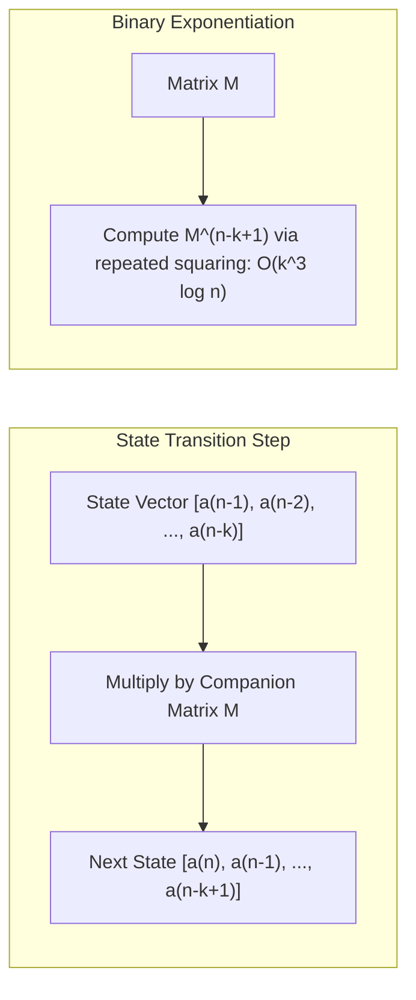

# Recurrence Relations

> [!NOTE]
> **The Equation of Recursive Process Execution:**
> A recurrence relation expresses the $n$-th term of a sequence as a mathematical function of its preceding terms:
> $$a_n = f(a_{n-1}, a_{n-2}, \dots, a_{n-k}, n)$$
> In computer science, recurrence relations formalize:
> 1. **Time Complexity:** The step count of recursive algorithms (e.g., Merge Sort $T(n) = 2T(n/2) + O(n)$).
> 2. **Combinatorial Counting:** Enumerating valid states (e.g., Fibonacci tiling, Catalan binary trees).
> 3. **Dynamic Programming:** State transitions across subproblems.

> [!TIP]
> **Matrix Exponentiation for Order-$k$ Linear Recurrences in $O(k^3 \log n)$:**
> Any linear recurrence $a_n = c_1 a_{n-1} + c_2 a_{n-2} + \cdots + c_k a_{n-k}$ with constant coefficients can be represented as a matrix transition:
> $$\mathbf{v}_n = \mathbf{M} \mathbf{v}_{n-1} \implies \mathbf{v}_n = \mathbf{M}^{n-k+1} \mathbf{v}_{k-1}$$
> Using binary matrix exponentiation, this calculates the $n$-th term in $O(k^3 \log n)$ time and $O(k^2)$ space, converting exponential-time recursion into sub-millisecond computations for $n \approx 10^{18}$.

> [!WARNING]
> **Repeated Roots & Multiplicity Traps:**
> When solving the characteristic polynomial $P(r) = 0$, if a root $r_j$ has algebraic multiplicity $m > 1$, the general solution term is not simply $A r_j^n$. It must include polynomial factors:
> $$(A_0 + A_1 n + A_2 n^2 + \cdots + A_{m-1} n^{m-1}) r_j^n$$
> Omitting these higher-order factors yields an underdetermined linear system that fails to satisfy initial conditions.

```mermaid
flowchart TD
    Rec["Recurrence Relation: T(n)"] --> Classify{"Structure of Subproblems"}
    Classify -->|Divide-and-Conquer: T(n) = a T(n/b) + f(n)| Master["Master Theorem / Akra-Bazzi"]
    Classify -->|Linear Shift: a(n) = Sum c_i a(n-i)| Lin{"Homogeneous?"}
    Lin -->|Yes: f(n) = 0| CharRoot["Characteristic Polynomial / Roots"]
    Lin -->|No: f(n) != 0| UndetCoeff["Particular + Homogeneous Solution"]
    CharRoot --> MatExp["Matrix Exponentiation: O(k^3 log n)"]
    Classify -->|Convolution: a(n) = Sum a(i) a(n-1-i)| GenFunc["Generating Functions / Catalan Closed Form"]
```

---

## 1. Classification of Recurrence Relations

| Type | General Form | Algorithmic Representative | Solution Technique |
| :--- | :--- | :--- | :--- |
| **Linear Homogeneous (Order $k$)** | $a_n = \sum_{i=1}^k c_i a_{n-i}$ | Fibonacci: $F_n = F_{n-1} + F_{n-2}$ | Characteristic Equation, Matrix Exponentiation |
| **Linear Non-Homogeneous** | $a_n = \sum_{i=1}^k c_i a_{n-i} + g(n)$ | Towers of Hanoi: $H_n = 2H_{n-1} + 1$ | Undetermined Coefficients, Annihilators |
| **Divide-and-Conquer** | $T(n) = a T(n/b) + f(n)$ | Merge Sort: $T(n) = 2T(n/2) + O(n)$ | Master Theorem, Recursion Tree, Akra-Bazzi |
| **Convolution (Non-linear)** | $a_n = \sum_{i=0}^{n-1} a_i a_{n-1-i}$ | Catalan / BST Shapes: $C_n = \sum C_i C_{n-1-i}$ | Ordinary Generating Functions (OGF) |
| **Divide-and-Conquer (Non-uniform)**| $T(n) = T(\alpha n) + T(\beta n) + f(n)$ | Median-of-Medians: $T(n/5) + T(7n/10) + O(n)$ | Akra-Bazzi, Substitution Guessing |

---

## 2. Linear Homogeneous Recurrences (The Characteristic Root Method)

Consider the order-$k$ recurrence with constant coefficients $c_i$:
$$a_n - c_1 a_{n-1} - c_2 a_{n-2} - \cdots - c_k a_{n-k} = 0$$

### Step 1: Form the Characteristic Equation
Substitute the trial solution $a_n = r^n$:
$$r^n - c_1 r^{n-1} - c_2 r^{n-2} - \cdots - c_k r^{n-k} = 0$$
Dividing through by $r^{n-k}$ yields the characteristic polynomial of degree $k$:
$$P(r) = r^k - c_1 r^{k-1} - c_2 r^{k-2} - \cdots - c_k = 0$$

### Step 2: Solve for Roots $r_1, r_2, \dots, r_m$
By the Fundamental Theorem of Algebra, $P(r)$ has exactly $k$ roots (counting multiplicity).

1. **Distinct Roots:** If all $k$ roots are distinct:
   $$a_n = \sum_{i=1}^k A_i r_i^n$$
2. **Repeated Roots:** If root $r_j$ has multiplicity $m_j$:
   $$a_n^{(j)} = \left( A_{j,0} + A_{j,1} n + A_{j,2} n^2 + \cdots + A_{j, m_j - 1} n^{m_j - 1} \right) r_j^n$$
3. **Complex Conjugate Roots ($r = \rho e^{\pm i \theta}$):**
   $$a_n = \rho^n \left( B_1 \cos(n\theta) + B_2 \sin(n\theta) \right)$$

### Step 3: Solve for Constants $A_i$ using Base Cases
Substitute the initial conditions $a_0, a_1, \dots, a_{k-1}$ into the general solution to form a system of $k$ linear equations in $k$ unknowns, solvable via Gaussian elimination.

---

## 3. Concrete Example: Binet's Formula for Fibonacci

Recurrence: $F_n = F_{n-1} + F_{n-2}$ with $F_0 = 0, F_1 = 1$.

1. Characteristic equation:
   $$r^2 - r - 1 = 0$$
2. Roots via quadratic formula:
   $$r_1 = \frac{1 + \sqrt{5}}{2} = \phi \quad (\text{Golden Ratio}), \quad r_2 = \frac{1 - \sqrt{5}}{2} = \hat{\phi} = -\frac{1}{\phi}$$
3. General solution:
   $$F_n = A_1 \phi^n + A_2 \hat{\phi}^n$$
4. Initial conditions:
   - $n = 0: A_1 + A_2 = 0 \implies A_2 = -A_1$
   - $n = 1: A_1 \phi + A_2 \hat{\phi} = A_1(\phi - \hat{\phi}) = A_1 \sqrt{5} = 1 \implies A_1 = \frac{1}{\sqrt{5}}$
5. Closed Form (Binet's Formula):
   $$F_n = \frac{1}{\sqrt{5}} \left( \left(\frac{1+\sqrt{5}}{2}\right)^n - \left(\frac{1-\sqrt{5}}{2}\right)^n \right)$$
   Since $|\hat{\phi}| < 1$, $\hat{\phi}^n \to 0$ exponentially, meaning $F_n = \text{round}\left(\frac{\phi^n}{\sqrt{5}}\right) = \Theta(\phi^n) \approx \Theta(1.618^n)$.

---

## 4. The Companion Matrix & Fast Matrix Exponentiation

When $n$ is very large (e.g., $n = 10^{18}$ in competitive programming and discrete simulations), closed forms with floating-point square roots lose precision. Matrix exponentiation provides exact modulo-arithmetic answers in $O(k^3 \log n)$.

For any recurrence $a_n = c_1 a_{n-1} + c_2 a_{n-2} + \cdots + c_k a_{n-k}$:

$$\begin{pmatrix} a_n \\ a_{n-1} \\ a_{n-2} \\ \vdots \\ a_{n-k+1} \end{pmatrix} = \begin{pmatrix} c_1 & c_2 & c_3 & \cdots & c_k \\ 1 & 0 & 0 & \cdots & 0 \\ 0 & 1 & 0 & \cdots & 0 \\ \vdots & \vdots & \ddots & \vdots & \vdots \\ 0 & 0 & \cdots & 1 & 0 \end{pmatrix} \begin{pmatrix} a_{n-1} \\ a_{n-2} \\ a_{n-3} \\ \vdots \\ a_{n-k} \end{pmatrix}$$

Let $\mathbf{M}$ be the $k \times k$ companion matrix. Then:
$$\mathbf{v}_n = \mathbf{M}^{n - (k - 1)} \mathbf{v}_{k-1}$$



---

## 5. Non-Homogeneous Linear Recurrences

$$a_n = c_1 a_{n-1} + c_2 a_{n-2} + \cdots + c_k a_{n-k} + g(n)$$

The complete general solution is the sum of two components:
$$a_n = a_n^{(h)} + a_n^{(p)}$$
where $a_n^{(h)}$ satisfies the homogeneous version ($g(n) = 0$), and $a_n^{(p)}$ is any particular solution satisfying the full recurrence.

### Method of Undetermined Coefficients:
| Forcing Term $g(n)$ | Form of Particular Solution $a_n^{(p)}$ (assuming no root collision) |
| :--- | :--- |
| **Constant $C$** | $a_n^{(p)} = K$ |
| **Polynomial $P_d(n)$** | $a_n^{(p)} = K_d n^d + K_{d-1} n^{d-1} + \cdots + K_0$ |
| **Exponential $s^n$** | $a_n^{(p)} = K s^n$ (if $s$ is not a characteristic root) |
| **Collision ($s$ is root of multiplicity $m$)** | $a_n^{(p)} = K n^m s^n$ |

#### Worked Example: Towers of Hanoi
$$H_n = 2H_{n-1} + 1, \quad H_1 = 1$$
1. Homogeneous: $r - 2 = 0 \implies r = 2 \implies H_n^{(h)} = A \cdot 2^n$.
2. Particular: $g(n) = 1$ (constant). Guess $H_n^{(p)} = K$:
   $$K = 2K + 1 \implies K = -1$$
3. Total solution: $H_n = A \cdot 2^n - 1$.
4. Base case $H_1 = 1$:
   $$A \cdot 2^1 - 1 = 1 \implies 2A = 2 \implies A = 1$$
5. Result: $H_n = 2^n - 1 = \Theta(2^n)$.

---

## 6. Generating Functions Intuition

The **Ordinary Generating Function (OGF)** of a sequence $(a_0, a_1, a_2, \dots)$ is the formal power series:
$$A(x) = \sum_{n=0}^\infty a_n x^n = a_0 + a_1 x + a_2 x^2 + a_3 x^3 + \cdots$$

### The Algebraic Translation Pipeline:
1. Multiply the recurrence equation by $x^n$ and sum over all valid $n \ge k$.
2. Express the resulting series in terms of $A(x)$.
3. Solve the algebraic equation for $A(x)$.
4. Expand $A(x)$ into partial fractions and read off the coefficients $a_n = [x^n] A(x)$.

#### Example: Solving Catalan Numbers Convolution
$$C_0 = 1, \quad C_n = \sum_{i=0}^{n-1} C_i C_{n-1-i}$$
Multiplying by $x^n$ and summing yields:
$$C(x) - 1 = x C(x)^2 \implies x C(x)^2 - C(x) + 1 = 0$$
Solving via quadratic formula:
$$C(x) = \frac{1 - \sqrt{1 - 4x}}{2x}$$
Expanding $\sqrt{1 - 4x}$ via the Generalized Binomial Theorem produces:
$$C_n = \frac{1}{n+1} \binom{2n}{n}$$

---

## 7. Complexity & Trade-Offs Matrix

| Evaluation Technique | Time Complexity | Space Complexity | Numerical Precision Constraints | Best Use Case |
| :--- | :--- | :--- | :--- | :--- |
| **Naive Recursion** | $O(2^n)$ or $O(k^n)$ | $O(n)$ recursion stack | Exact integer | Anti-pattern; avoid except for tiny $n \le 20$ |
| **Dynamic Programming (Memoization / Tabulation)** | $O(n \cdot k)$ | $O(k)$ rolling array | Exact integer | Moderate $n \le 10^7$ |
| **Matrix Exponentiation** | $O(k^3 \log n)$ | $O(k^2)$ | Exact under modular arithmetic | Massive $n \le 10^{18}$, fixed small $k \le 100$ |
| **Binet / Characteristic Roots** | $O(1)$ or $O(\log n)$ | $O(1)$ | Double floating-point overflow for $n > 78$ | Theoretical derivation, asymptotic proofs |
| **Generating Functions** | $O(1)$ closed form | $O(1)$ | Combinatorial closed-form analysis | Proving asymptotic bounds and identities |

---

## 8. Common Pitfalls & Anti-Patterns

### Anti-Pattern 1: Matrix Inversion / Division in Modular Arithmetic
In companion matrix operations, avoid matrix inversion unless modulo is prime and determinant is non-zero. Only binary multiplication of transition matrices is needed to advance states forward.

### Anti-Pattern 2: Ignoring Zero Modulo Edge Cases
When evaluating $a_n \pmod M$ using matrix exponentiation, ensure all intermediate matrix multiplications use 128-bit promotion (`__uint128_t`) before modulo reduction to prevent 64-bit product overflow when $M \approx 10^9 + 7$.

---

## 9. Curated References & Related Problems

1. **CLRS Chapter 4:** *Divide-and-Conquer and Recurrences*.
2. **Concrete Mathematics (Graham, Knuth, Patashnik):** *Chapter 7: Generating Functions*.
3. **LeetCode 509:** *Fibonacci Number* (Baseline recurrence verification).
4. **LeetCode 1137:** *N-th Tribonacci Number* (Order-3 linear recurrence).
5. **Codeforces 185A:** *Plant* (Matrix exponentiation for 2-state geometric recurrence).
6. **Project Euler 137:** *Fibonacci Golden Nuggets* (Generating functions and Pell's equation connection).
