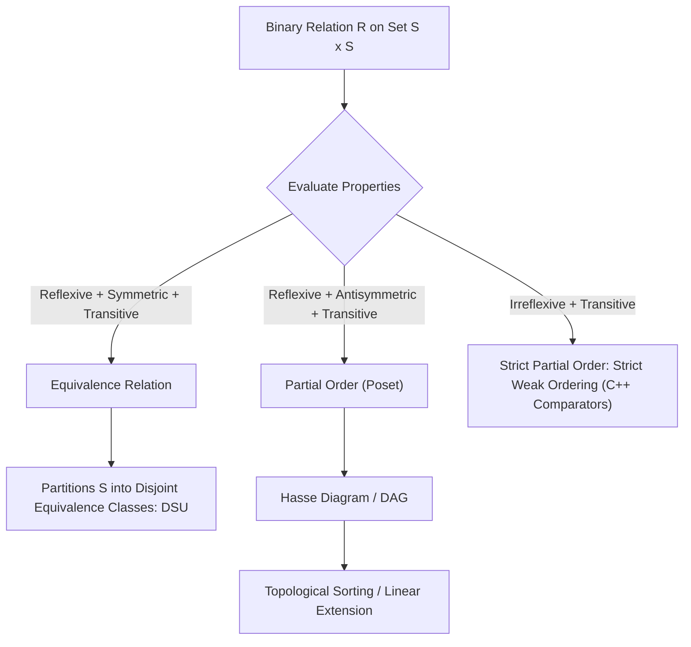
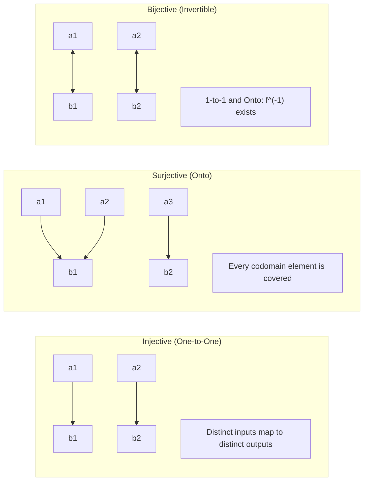
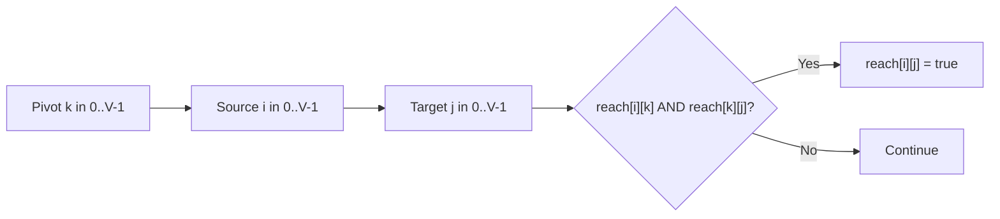

# Sets, Functions, and Relations

> [!NOTE]
> **The Structural Language of Computational Entities:**
> Computer science builds all abstract data types from three primitive mathematical concepts:
> 1. **Sets:** Unordered collections of distinct objects representing state spaces, universes of keys, and graph vertex sets.
> 2. **Relations:** Associations between elements formalizing graph edges, partial orderings, and equivalence partitions (Disjoint Set Union).
> 3. **Functions:** Deterministic mappings assigning each input in a domain exactly one output in a codomain (formalizing hash functions, state transitions, and lookups).

> [!TIP]
> **Equivalence Relations are Isomorphic to Disjoint Set Partitions:**
> A binary relation $R$ is an **equivalence relation** if and only if it is reflexive, symmetric, and transitive.
> Every equivalence relation on set $S$ partitions $S$ into mutually disjoint, non-empty **equivalence classes** $[x] = \{y \in S : (x, y) \in R\}$.
> In software engineering, this partition is represented and dynamically maintained by the **Disjoint Set Union (DSU / Union-Find)** data structure with near $O(1)$ amortized queries.

> [!WARNING]
> **Antisymmetry vs Non-Symmetry:**
> A relation is **antisymmetric** if $((x, y) \in R \land (y, x) \in R) \implies x = y$.
> Antisymmetry is *not* the opposite of symmetry. A relation can be both symmetric and antisymmetric (e.g., the identity relation $x = y$), or neither (e.g., divisibility on negative integers). Confounding antisymmetry with asymmetry causes subtle bugs in comparator predicates for `std::sort`.



---

## 1. Sets and Set Algebra

A **set** is an unordered collection of distinct elements.

### 1.1 Fundamental Operations
Let $U$ be the universal set, and $A, B \subseteq U$:
- **Subset ($A \subseteq B$):** $\forall x, (x \in A \implies x \in B)$.
- **Union ($A \cup B$):** $\{x \in U : x \in A \lor x \in B\}$.
- **Intersection ($A \cap B$):** $\{x \in U : x \in A \land x \in B\}$.
- **Set Difference ($A \setminus B$):** $\{x \in U : x \in A \land x \notin B\}$.
- **Symmetric Difference ($A \oplus B$):** $(A \setminus B) \cup (B \setminus A) = (A \cup B) \setminus (A \cap B)$.
- **Complement ($\overline{A}$):** $\{x \in U : x \notin A\}$.
- **Power Set ($\mathcal{P}(A)$):** Set of all subsets of $A$. If $|A| = n$, then $|\mathcal{P}(A)| = 2^n$.
- **Cartesian Product ($A \times B$):** $\{(a, b) : a \in A, b \in B\}$. $|A \times B| = |A| \cdot |B|$.

### 1.2 Algorithmic Bitmask Representation ($N \le 64$)
When universe $|U| \le 64$, sets are mapped to 64-bit unsigned words (`uint64_t`):
- $A \cup B \iff A \mid B$ (Bitwise OR)
- $A \cap B \iff A \ \& \ B$ (Bitwise AND)
- $A \setminus B \iff A \ \& \ (\sim B)$
- $A \oplus B \iff A \text{ \^{} } B$ (Bitwise XOR)
- $|A| \iff \text{\_\_builtin\_popcountll}(A)$ (CPU instruction `POPCNT`)

---

## 2. Relations and Their Formal Properties

A **binary relation** $R$ from set $A$ to set $B$ is a subset of the Cartesian product: $R \subseteq A \times B$.
If $A = B$, $R \subseteq A \times A$ is a homogeneous relation on $A$. We write $x \mathrel{R} y$ for $(x, y) \in R$.

### 2.1 Core Mathematical Properties on Set $S$:

| Property | Formal Definition | Intuition / Counterexample |
| :--- | :--- | :--- |
| **Reflexive** | $\forall x \in S, (x, x) \in R$ | Equality ($x = x$), $\le$. Not: strict inequality $<$. |
| **Irreflexive** | $\forall x \in S, (x, x) \notin R$ | Strict inequality ($x < x$ is False). |
| **Symmetric** | $\forall x, y \in S, (x, y) \in R \implies (y, x) \in R$ | Undirected edges in graphs, friendship. |
| **Antisymmetric** | $\forall x, y \in S, ((x, y) \in R \land (y, x) \in R) \implies x = y$ | $\le$, subset inclusion $\subseteq$, divisibility on $\mathbb{N}$. |
| **Transitive** | $\forall x, y, z \in S, ((x, y) \in R \land (y, z) \in R) \implies (x, z) \in R$ | Reachability in DAGs, ancestry, ordering $<$. |

---

## 3. Equivalence Relations & Partitions

A relation $R$ on $S$ is an **equivalence relation** if it satisfies:
1. **Reflexivity:** $x \mathrel{R} x$.
2. **Symmetry:** $x \mathrel{R} y \implies y \mathrel{R} x$.
3. **Transitivity:** $x \mathrel{R} y \land y \mathrel{R} z \implies x \mathrel{R} z$.

### The Fundamental Theorem of Equivalence Relations
Every equivalence relation on $S$ induces a unique partition of $S$ into disjoint subsets:
$$S = \bigcup_{i} C_i \quad \text{where } C_i \cap C_j = \emptyset \text{ for } i \ne j$$
The subsets $C_i = [x] = \{y \in S : x \mathrel{R} y\}$ are the **equivalence classes** of $R$.

#### Canonical Applications:
- **Modular Congruence:** $x \equiv y \pmod m$ partitions $\mathbb{Z}$ into $m$ residue classes $\{[0], [1], \dots, [m-1]\}$.
- **Connected Components:** Two graph vertices are equivalent if there exists a path between them.

---

## 4. Partial Orders, Total Orders, and Posets

A **partially ordered set (poset)** is a pair $(S, \le)$ where $\le$ is reflexive, antisymmetric, and transitive.

- **Total Order (Linear Order):** A partial order where every pair of elements is comparable ($\forall x, y \in S, x \le y \lor y \le x$).
- **Strict Weak Ordering:** The mathematical foundation of sorting algorithms (`std::sort`, Java `Comparable`). Irreflexive, asymmetric, and transitive incomparability.
- **Topological Sorting:** Linear extension of a finite poset into a compatible total order. Executable in $O(V + E)$ time via Kahn's algorithm or DFS.

---

## 5. Functions (Mappings)

A **function** $f: A \to B$ is a relation $f \subseteq A \times B$ such that for every $a \in A$, there exists **exactly one** $b \in B$ where $(a, b) \in f$.



### 5.1 Function Classifications
1. **Injective (One-to-One):**
   $$\forall x, y \in A, f(x) = f(y) \implies x = y$$
   *(Cardinality consequence: $|A| \le |B|$)*.
2. **Surjective (Onto):**
   $$\forall b \in B, \exists a \in A \text{ such that } f(a) = b$$
   *(Cardinality consequence: $|A| \ge |B|$)*.
3. **Bijective (One-to-One Correspondence):**
   Both injective and surjective. Guarantees the existence of an inverse function $f^{-1}: B \to A$.
   *(Cardinality consequence: $|A| = |B|$)*.

---

## 6. Algorithmic Relations: Transitive Closure (Warshall's Algorithm)

Given a directed graph $G = (V, E)$, the transitive closure relation $R^*$ connects $u$ to $v$ if there exists a directed path from $u$ to $v$.



### Dynamic Programming Formulation:
$$T^{(k)}[i][j] = T^{(k-1)}[i][j] \lor \left( T^{(k-1)}[i][k] \land T^{(k-1)}[k][j] \right)$$
Using bitset acceleration, this runs in $O(V^3 / 64)$ time and $O(V^2)$ space.

---

## 7. Common Pitfalls & Anti-Patterns

### Anti-Pattern 1: Violating Strict Weak Ordering in C++ Comparators
```cpp
// ANTI-PATTERN: Using <= instead of < in std::sort
// Violates irreflexivity: comp(x, x) must be false!
// Causes infinite loops and segmentation faults in introsort.
bool bad_comp(int a, int b) {
    return a <= b; // BUG! When a == b, returns true
}

// CORRECT: Strict weak ordering (irreflexive, asymmetric)
bool good_comp(int a, int b) {
    return a < b;
}
```

### Anti-Pattern 2: Confounding Relation Composition Order
Given relations $R \subseteq A \times B$ and $S \subseteq B \times C$, the composition $S \circ R$ contains pairs $(a, c)$ such that $\exists b \in B, (a, b) \in R \land (b, c) \in S$. Reversing the order to $R \circ S$ is invalid unless dimensions match.

---

## 8. Curated References & Related Problems

1. **CLRS Appendix B:** *Sets, Relations, and Functions*.
2. **Discrete Mathematics and its Applications (Kenneth Rosen):** *Chapter 2 & 9: Sets, Functions, and Relations*.
3. **LeetCode 547:** *Number of Provinces* (Equivalence classes via DSU / Connected components).
4. **LeetCode 210:** *Course Schedule II* (Topological sorting of a strict poset).
5. **Codeforces 1213D2:** *Equalizing by Division* (Multiset mappings and function inverses).
