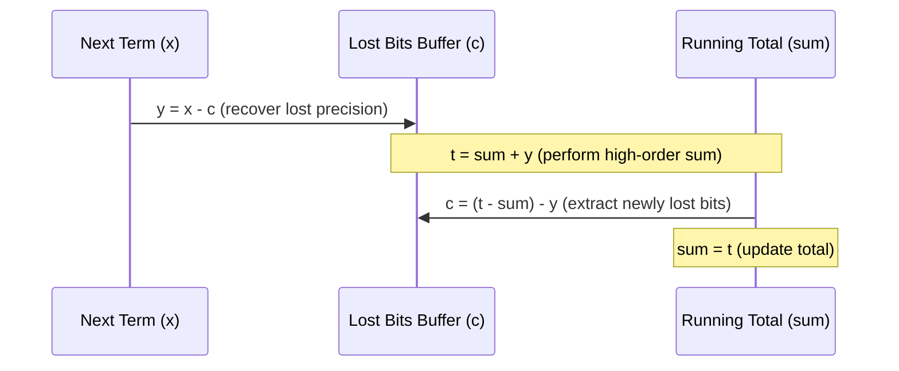

# Summations and Series

> [!NOTE]
> **Summation as the Discrete Counterpart to Integration:**
> In algorithmic complexity analysis, loop counters and recursive subproblem invocations generate discrete sums. Summation calculus provides the tools to simplify these discrete accumulations into closed-form algebraic expressions or tight asymptotic bounds ($\Theta, O, \Omega$).
> - **Arithmetic Series:** $\sum_{i=1}^n i = \frac{n(n+1)}{2} = \Theta(n^2)$.
> - **Geometric Series ($r \ne 1$):** $\sum_{i=0}^{n-1} a r^i = a \frac{r^n - 1}{r - 1} = \Theta(r^n)$ if $r > 1$, or $\Theta(1)$ if $r < 1$.
> - **Harmonic Series:** $H_n = \sum_{i=1}^n \frac{1}{i} = \ln n + \gamma + O(1/n) = \Theta(\log n)$.
> - **Telescoping Series:** $\sum_{i=1}^n (a_i - a_{i-1}) = a_n - a_0$.

> [!TIP]
> **Bounding Summations via Monotone Integrals:**
> When an exact closed form is difficult to evaluate, and $f(x)$ is monotonically increasing on $[a, b]$:
> $$\int_{a-1}^b f(x)\,dx \;\le\; \sum_{i=a}^b f(i) \;\le\; \int_a^{b+1} f(x)\,dx$$
> Conversely, if $f(x)$ is monotonically decreasing on $[a, b]$:
> $$\int_a^{b+1} f(x)\,dx \;\le\; \sum_{i=a}^b f(i) \;\le\; \int_{a-1}^b f(x)\,dx$$
> This integral bound yields tight asymptotic proofs for harmonic numbers, Stirling's factorial approximation, and polynomial series without requiring combinatorial identities.

> [!WARNING]
> **Numerical & Implementation Traps:**
> 1. **Integer Overflow in Closed Forms:** Computing $\frac{n(n+1)}{2}$ or $\frac{n(n+1)(2n+1)}{6}$ in standard 32-bit signed integers will overflow when $n > 65{,}535$ or $n > 1{,}817$. In production C++ and competitive programming, evaluate factors before multiplying: `(n % 2 == 0) ? (n / 2) * (n + 1) : n * ((n + 1) / 2)` using 64-bit unsigned integers (`uint64_t`).
> 2. **Catastrophic Cancellation in Floating-Point Sums:** Adding billions of tiny floating-point increments to an accumulating sum causes loss of precision due to mantissa shifting. Use **Kahan Compensated Summation** or pairwise summation.

```mermaid
flowchart TD
    Start["Analyze Loop / Recursion Sum"] --> Classify{"Examine Term Ratio a(i+1) / a(i)"}
    Classify -->|Difference is Constant| Arith["Arithmetic Series: O(n^2)"]
    Classify -->|Ratio is Constant r| Geom{"Ratio r"}
    Geom -->|r < 1| GeomDec["Convergent Geometric: O(1) tail"]
    Geom -->|r > 1| GeomInc["Growing Geometric: O(r^n)"]
    Classify -->|Ratio ~ (i)/(i+1)| Harm["Harmonic Series: Theta(log n)"]
    Classify -->|Adjacent Cancellation| Tele["Telescoping Sum: O(1) evaluation"]
    Classify -->|General Monotone f(i)| IntBound["Integral Bounding: Integral f(x) dx"]
```

---

## 1. Core Families of Summations

### 1.1 Arithmetic Series

An arithmetic progression is characterized by a constant difference $d = a_{i} - a_{i-1}$.

$$\sum_{i=1}^n a_i = \sum_{i=1}^n \left( a_1 + (i - 1)d \right) = n a_1 + d \frac{n(n-1)}{2} = \frac{n(a_1 + a_n)}{2}$$

#### Canonical Algorithmic Sums:
1. **Sum of first $n$ integers:**
   $$\sum_{i=1}^n i = \frac{n(n+1)}{2} = \frac{n^2 + n}{2} = \Theta(n^2)$$
   *Application:* Nested loops where inner loop runs $i$ times (e.g., Bubble Sort, Selection Sort, Insertion Sort worst-case).

2. **Sum of squares:**
   $$\sum_{i=1}^n i^2 = \frac{n(n+1)(2n+1)}{6} = \frac{2n^3 + 3n^2 + n}{6} = \Theta(n^3)$$

3. **Sum of cubes:**
   $$\sum_{i=1}^n i^3 = \left( \frac{n(n+1)}{2} \right)^2 = \Theta(n^4)$$

4. **Sum of $k$-th powers (Faulhaber's Formula):**
   $$\sum_{i=1}^n i^k = \frac{n^{k+1}}{k+1} + \Theta(n^k)$$

---

### 1.2 Geometric Series

A geometric progression is defined by a constant ratio $r = \frac{a_{i}}{a_{i-1}}$ ($r \ne 1$).

$$\sum_{i=0}^{n-1} a r^i = a \left( \frac{1 - r^n}{1 - r} \right) = a \left( \frac{r^n - 1}{r - 1} \right)$$

#### Asymptotic Regimes:
- **Case $r < 1$ (Decaying terms):**
  The sum is dominated by the initial term $a_0$. As $n \to \infty$:
  $$\sum_{i=0}^\infty a r^i = \frac{a}{1 - r} = \Theta(1)$$
  *Application:* Dynamic array geometric resizing amortization: $n + \frac{n}{2} + \frac{n}{4} + \cdots \le 2n = O(n)$.
- **Case $r = 1$:**
  $$\sum_{i=0}^{n-1} a = a \cdot n = \Theta(n)$$
- **Case $r > 1$ (Growing terms):**
  The sum is dominated by the last term $a r^{n-1}$:
  $$\sum_{i=0}^{n-1} a r^i = \Theta(r^n)$$
  *Application:* Full binary tree node count $\sum_{i=0}^{h} 2^i = 2^{h+1} - 1 = \Theta(2^h)$.

---

### 1.3 Arithmetico-Geometric Series

An arithmetico-geometric series has terms composed of the product of an arithmetic progression and a geometric progression:

$$S_n = \sum_{i=1}^n i \cdot r^i$$

To evaluate $S_n$, multiply by $r$ and subtract:
$$r S_n = \sum_{i=1}^n i \cdot r^{i+1} = \sum_{i=2}^{n+1} (i - 1) r^i$$
$$(1 - r) S_n = S_n - r S_n = r + \sum_{i=2}^n r^i - n r^{n+1} = \sum_{i=1}^n r^i - n r^{n+1} = \frac{r(1 - r^n)}{1 - r} - n r^{n+1}$$
$$S_n = \frac{r - (n+1)r^{n+1} + n r^{n+2}}{(1 - r)^2}$$

#### Canonical Computer Science Special Case ($r = 2$):
$$\sum_{i=1}^k i \cdot 2^i = (k - 1)2^{k+1} + 2 = \Theta(k 2^k)$$

#### Decaying Infinite Case ($|r| < 1$):
$$\sum_{i=1}^\infty i \cdot r^i = \frac{r}{(1 - r)^2}$$
*Application:* Average-case analysis of linear search with geometric exit probability, and heapify linear-time construction proof:
$$\sum_{h=0}^{\lfloor \log_2 n \rfloor} \frac{h}{2^h} \le \sum_{h=0}^\infty h \left(\frac{1}{2}\right)^h = \frac{1/2}{(1 - 1/2)^2} = 2 \implies \text{Linear time } O(n) \text{ heap construction.}$$

---

### 1.4 Harmonic Series & Approximations

The harmonic series is defined as:
$$H_n = \sum_{i=1}^n \frac{1}{i} = 1 + \frac{1}{2} + \frac{1}{3} + \cdots + \frac{1}{n}$$

By the integral bounding method with $f(x) = 1/x$:
$$\int_1^{n+1} \frac{1}{x}\,dx \le \sum_{i=1}^n \frac{1}{i} \le 1 + \int_1^n \frac{1}{x}\,dx$$
$$\ln(n+1) \le H_n \le 1 + \ln n$$

Using the Euler-Maclaurin summation formula:
$$H_n = \ln n + \gamma + \frac{1}{2n} - \frac{1}{12n^2} + O\left(\frac{1}{n^4}\right)$$
where $\gamma \approx 0.5772156649$ is the **Euler-Mascheroni constant**. Thus:
$$H_n = \Theta(\log n)$$

#### Algorithmic Appearances:
1. **Randomized Quicksort Comparisons:** $E[C_n] = 2(n+1)H_n - 4n = \Theta(n \log n)$.
2. **Harmonic Sieve (Divisor Counting):** Iterating through multiples $i, 2i, 3i, \dots, n$ across all $i \le n$ takes $\sum_{i=1}^n \frac{n}{i} = n H_n = \Theta(n \log n)$ total operations.
3. **Coupon Collector's Problem:** Expected steps to collect all $n$ distinct coupons is $n H_n = \Theta(n \log n)$.

---

### 1.5 Telescoping Series

A series is telescoping if successive terms cancel algebraically:

$$\sum_{i=1}^n \left( a_i - a_{i-1} \right) = (a_1 - a_0) + (a_2 - a_1) + \cdots + (a_n - a_{n-1}) = a_n - a_0$$

#### Canonical Example: Partial Fraction Decomposition
$$\sum_{i=1}^n \frac{1}{i(i+1)} = \sum_{i=1}^n \left( \frac{1}{i} - \frac{1}{i+1} \right) = \left( 1 - \frac{1}{2} \right) + \left( \frac{1}{2} - \frac{1}{3} \right) + \cdots + \left( \frac{1}{n} - \frac{1}{n+1} \right) = 1 - \frac{1}{n+1} = \frac{n}{n+1}$$
As $n \to \infty$, the infinite sum converges to exactly $1$.

---

## 2. Advanced Bounding Techniques

### 2.1 Bounding by Splitting Terms

When bounding non-standard summations, split the sum into two halves:
$$\sum_{i=1}^n a_i = \sum_{i=1}^{\lfloor n/2 \rfloor} a_i + \sum_{i=\lfloor n/2 \rfloor + 1}^n a_i$$

#### Example: Tight Lower Bound on $\sum_{i=1}^n i$
$$\sum_{i=1}^n i \ge \sum_{i=\lfloor n/2 \rfloor + 1}^n i \ge \sum_{i=\lfloor n/2 \rfloor + 1}^n \frac{n}{2} = \left( n - \frac{n}{2} \right) \frac{n}{2} = \frac{n^2}{4} = \Omega(n^2)$$
Combined with the trivial upper bound $\sum_{i=1}^n i \le \sum_{i=1}^n n = n^2 = O(n^2)$, this proves $\sum_{i=1}^n i = \Theta(n^2)$ without knowing the exact identity.

#### Example: Tight Bound on $\sum_{i=1}^n \log_2 i = \log_2(n!)$
$$\sum_{i=1}^n \log_2 i \le \sum_{i=1}^n \log_2 n = n \log_2 n = O(n \log n)$$
$$\sum_{i=1}^n \log_2 i \ge \sum_{i=\lfloor n/2 \rfloor + 1}^n \log_2 i \ge \sum_{i=\lfloor n/2 \rfloor + 1}^n \log_2(n/2) = \frac{n}{2} (\log_2 n - 1) = \Omega(n \log n)$$
Therefore, $\log_2(n!) = \Theta(n \log n)$ (consistent with Stirling's approximation).

---

### 2.2 The Euler-Maclaurin Summation Formula

For a $p$-times continuously differentiable function $f(x)$:
$$\sum_{i=a}^b f(i) = \int_a^b f(x)\,dx + \frac{f(a) + f(b)}{2} + \sum_{k=1}^{\lfloor p/2 \rfloor} \frac{B_{2k}}{(2k)!} \left( f^{(2k-1)}(b) - f^{(2k-1)}(a) \right) + R_p$$
where $B_{2k}$ are the Bernoulli numbers ($B_2 = \frac{1}{6}, B_4 = -\frac{1}{30}$). This provides an asymptotic expansion of arbitrary precision for discrete sums.

---

## 3. Numerical Summation & Kahan Compensation

In systems engineering and numerical computing, summing millions of floating-point values naively leads to substantial error:

$$s_{k} = s_{k-1} + x_k$$

If $s_{k-1}$ is large and $x_k$ is small, low-order bits of $x_k$ fall off the mantissa and are permanently lost.

### Kahan Summation Algorithm:
Maintains a separate running compensation variable `c` for lost low-order bits:



The error bound drops from $O(n \epsilon)$ in naive summation to $O(2\epsilon + O(n \epsilon^2))$ in Kahan summation, where $\epsilon$ is machine epsilon ($2^{-52} \approx 2.22 \times 10^{-16}$ for IEEE 754 double precision).

---

## 4. Complexity & Operational Trade-offs

| Summation Type | Closed Form Available? | Algebraic Complexity | Numerical Accumulation Complexity | Common Invariance |
| :--- | :--- | :--- | :--- | :--- |
| **Arithmetic $\sum i$** | Yes | $O(1)$ time, $O(1)$ space | $O(n)$ time, $O(1)$ space | Integer overflow risk on 32-bit |
| **Geometric $\sum r^i$** | Yes (via Modular Pow / Float) | $O(\log n)$ time, $O(1)$ space | $O(n)$ time, $O(1)$ space | Ratio $|r| < 1$ vs $|r| > 1$ divergence |
| **Harmonic $\sum \frac{1}{i}$** | No exact rational closed form | $O(1)$ asymptotic approximation | $O(n)$ time, $O(1)$ space | Converges slowly: $H_{10^9} \approx 21.3$ |
| **Telescoping $\sum \Delta a_i$** | Yes | $O(1)$ time, $O(1)$ space | $O(n)$ time, $O(1)$ space | Boundary evaluation $a_n - a_0$ |
| **Monotone Integral Bound** | Yes (upper/lower bound) | $O(1)$ integration calculus | N/A | Proves $\Theta$-equivalence without exact sums |

---

## 5. Common Pitfalls & Anti-Patterns

### Anti-Pattern 1: Premature Floating-Point Conversion in Closed Forms
```cpp
// ANTI-PATTERN: Double precision mantissa has only 53 bits.
// For n > 10^8, double arithmetic loses precision.
uint64_t n = 1000000000ULL;
uint64_t sum = static_cast<uint64_t>(n * (n + 1) / 2.0); // Precision loss!

// CORRECT: Pure 64-bit integer arithmetic with even parity factoring
uint64_t correct_sum = (n % 2 == 0) ? (n / 2) * (n + 1) : n * ((n + 1) / 2);
```

### Anti-Pattern 2: Forgetting the Geometric Series Common Ratio Constraint
Applying $S = \frac{a}{1 - r}$ when $r \ge 1$. The formula strictly requires $|r| < 1$ for convergence. For $r > 1$, the sum is divergent and evaluates asymptotically to $\Theta(r^n)$.

### Anti-Pattern 3: Inaccurate Prime Sieve Loop Bounds
Assuming $\sum_{p \le n} \frac{n}{p} = \Theta(n \log n)$ by confounding it with the harmonic series. The sum over prime reciprocals is $\sum_{p \le n} \frac{1}{p} = \ln \ln n + M + O(1/\log n)$ (Mertens' Theorem), proving that the Sieve of Eratosthenes runs in $O(n \log \log n)$, significantly faster than $O(n \log n)$.

---

## 6. Curated References & Related Problems

1. **CLRS Chapter 3 & Appendix A:** *Summations and Asymptotic Notation*.
2. **Concrete Mathematics (Graham, Knuth, Patashnik):** *Chapter 2: Sums*.
3. **LeetCode 172:** *Factorial Trailing Zeroes* (Legendre's Formula: $\sum_{k=1}^\infty \lfloor n / 5^k \rfloor$).
4. **Codeforces 1117C:** *Magic Ship* (Binary search on answer combined with arithmetic progression bounding).
5. **Project Euler 1:** *Multiples of 3 and 5* (Inclusion-Exclusion with arithmetic closed forms).
