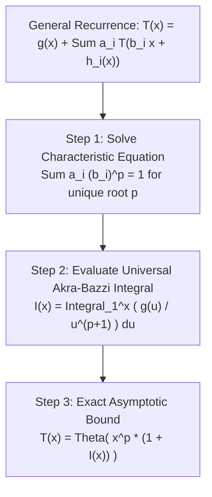

# The Akra-Bazzi Method: Solving General Divide-and-Conquer Recurrences

## 1. Executive Summary & Why the Master Theorem Fails

The classical **Master Theorem** is the standard tool for solving divide-and-conquer recurrence relations:
$$T(n) = a T(n/b) + f(n)$$
However, the Master Theorem is severely restricted. It fails completely on recurrences with:
1. **Uneven / Non-Uniform Subproblem Splits**:
   $$T(n) = T(n/3) + T(2n/3) + n \quad (\text{e.g. unbalanced Quicksort})$$
2. **Multiple Different Branch Divisors**:
   $$T(n) = 2 T(n/2) + 3 T(n/4) + n^2$$
3. **Fractions with Floors, Ceilings, and Perturbations**:
   $$T(n) = T(\lfloor n/5 \rfloor) + T(\lceil 7n/10 \rceil) + O(n) \quad (\text{Median-of-Medians Selection})$$

In 1998, Mohamad Akra and Louay Bazzi at the American University of Beirut published a profound generalization that solves **all** such recurrences in closed form via a single elegant integral equation.

---

## 2. The Akra-Bazzi Theorem



### 2.1 Formal Formulation
Consider the recurrence:
$$T(x) = g(x) + \sum_{i=1}^k a_i T(b_i x + h_i(x)) \quad \text{for } x \ge x_0$$
subject to the regularity conditions:
1. $a_i > 0$ (positive branch multipliers).
2. $b_i \in (0, 1)$ (fractional subproblem shrinkage factors).
3. $|h_i(x)| = O\left(\frac{x}{\log^2 x}\right)$ (perturbations like floors $\lfloor \cdot \rfloor$ and ceilings $\lceil \cdot \rceil$ do not affect asymptotics).
4. $|g'(x)| = O(x^c)$ for some constant $c$ (polynomial growth bound on non-recursive work).

> [!IMPORTANT]
> **The Akra-Bazzi Master Theorem (1998)**:
> 1. There exists a **unique real number** $p$ that satisfies the characteristic equation:
>    $$\sum_{i=1}^k a_i b_i^p = 1$$
> 2. The solution to the recurrence satisfies:
>    $$T(x) = \Theta\left( x^p \left( 1 + \int_1^x \frac{g(u)}{u^{p+1}} \, du \right) \right)$$

### 2.2 Why Does the Characteristic Exponent $p$ Always Exist?
Define $f(p) = \sum_{i=1}^k a_i b_i^p$.
Because each $b_i \in (0, 1)$, each term $b_i^p = e^{p \ln b_i}$ is strictly monotonically decreasing (since $\ln b_i < 0$):
- As $p \to -\infty$, $f(p) \to +\infty$.
- As $p \to +\infty$, $f(p) \to 0$.
By the Intermediate Value Theorem, $f(p) = 1$ has **exactly one unique real root $p$**!

---

## 3. Step-by-Step Canonical Derivations

### 3.1 Case Study 1: Uneven Quicksort Branching
Consider an algorithm that splits an array into sizes $n/5$ and $4n/5$, doing $O(n)$ partitioning work:
$$T(n) = T(n/5) + T(4n/5) + n$$
Here:
- $k = 2$
- $a_1 = 1, b_1 = 1/5$
- $a_2 = 1, b_2 = 4/5$
- $g(u) = u$

**Step 1: Solve for $p$**:
$$\left(\frac{1}{5}\right)^p + \left(\frac{4}{5}\right)^p = 1$$
By inspection, setting $p = 1$:
$$\frac{1}{5}^1 + \frac{4}{5}^1 = \frac{5}{5} = 1 \implies p = 1$$

**Step 2: Evaluate the Integral**:
$$\int_1^n \frac{g(u)}{u^{p+1}} \, du = \int_1^n \frac{u}{u^{1+1}} \, du = \int_1^n \frac{1}{u} \, du = \ln n$$

**Step 3: Combine via Akra-Bazzi Formula**:
$$T(n) = \Theta\left( n^1 (1 + \ln n) \right) = \Theta(n \log n)$$
Even with heavily asymmetric $1/5$ vs $4/5$ partitioning, Quicksort remains strictly $\Theta(n \log n)$!

---

### 3.2 Case Study 2: Median-of-Medians (BFPRT Selection Algorithm)
In the Blum-Floyd-Pratt-Rivest-Tarjan (BFPRT) linear-time selection algorithm, the recurrence for finding the $k$-th smallest element is:
$$T(n) \le T\left( \left\lfloor \frac{n}{5} \right\rfloor \right) + T\left( \left\lceil \frac{7n}{10} \right\rceil \right) + c n$$
Here:
- $a_1 = 1, b_1 = 1/5 = 0.2$
- $a_2 = 1, b_2 = 7/10 = 0.7$
- $h_1(n) = \lfloor n/5 \rfloor - n/5$ (bounded by $\pm 1$, satisfying perturbation constraint)
- $g(u) = c u$

**Step 1: Characteristic Exponent $p$**:
$$0.2^p + 0.7^p = 1$$
Evaluate at $p = 1$:
$$0.2^1 + 0.7^1 = 0.9 < 1$$
Because $f(p)$ is strictly decreasing, to reach $1$, $p$ must be **strictly less than 1**:
$$p \approx 0.83978 < 1$$

**Step 2: Evaluate the Integral**:
$$\int_1^n \frac{c u}{u^{p+1}} \, du = c \int_1^n u^{-p} \, du = c \left[ \frac{u^{1-p}}{1-p} \right]_1^n = \Theta(n^{1-p})$$

**Step 3: Combine via Akra-Bazzi**:
$$T(n) = \Theta\left( n^p \left( 1 + \Theta(n^{1-p}) \right) \right) = \Theta\left( n^p + n^p \cdot n^{1-p} \right) = \Theta(n)$$
Akra-Bazzi proves that BFPRT selection runs in **strictly linear time $\Theta(n)$**!

---

### 3.3 Case Study 3: Subsuming the Classical Master Theorem
Let $T(n) = a T(n/b) + n^c$.
Characteristic equation:
$$a \left(\frac{1}{b}\right)^p = 1 \implies b^p = a \implies p = \log_b a$$
The integral becomes:
$$\int_1^n \frac{u^c}{u^{\log_b a + 1}} \, du = \int_1^n u^{c - \log_b a - 1} \, du$$
- **Case 1 ($c < \log_b a$)**: Integral converges to a constant $\implies T(n) = \Theta(n^{\log_b a})$.
- **Case 2 ($c = \log_b a$)**: Integral is $\int \frac{1}{u} du = \ln n \implies T(n) = \Theta(n^{\log_b a} \log n)$.
- **Case 3 ($c > \log_b a$)**: Integral evaluates to $\Theta(n^{c - \log_b a}) \implies T(n) = \Theta(n^c)$.

The Akra-Bazzi method reproduces all three cases of the classical Master Theorem as trivial special cases of one integral!

---

## 4. Numerical Bisection Search for Exponent $p$

In practice, when $p$ cannot be determined analytically, it is approximated numerically via standard bisection:

```cpp
#include <vector>
#include <cmath>

double find_characteristic_p(const std::vector<double>& a, const std::vector<double>& b) {
    auto f = [&](double p) {
        double sum = 0.0;
        for (size_t i = 0; i < a.size(); ++i) {
            sum += a[i] * std::pow(b[i], p);
        }
        return sum;
    };

    double low = -20.0, high = 20.0;
    for (int iter = 0; iter < 100; ++iter) {
        double mid = low + (high - low) / 2.0;
        if (f(mid) > 1.0) {
            low = mid;
        } else {
            high = mid;
        }
    }
    return low;
}
```

---

## 5. Comparative Recurrence Summary Matrix

| Recurrence Relation | Exponent $p$ | Non-Recursive Work $g(n)$ | Integral Behavior | Final Complexity $T(n)$ |
| :--- | :--- | :--- | :--- | :--- |
| $T(n) = T(n/3) + T(2n/3) + n$ | $p = 1$ | $n$ | $\int \frac{1}{u} du = \ln n$ | **$\Theta(n \log n)$** |
| $T(n) = T(n/5) + T(7n/10) + n$ | $p \approx 0.84 < 1$ | $n$ | $\int u^{-p} du = \Theta(n^{1-p})$ | **$\Theta(n)$** |
| $T(n) = 3 T(n/2) + n$ | $p = \log_2 3 \approx 1.58$ | $n$ | Converges to $O(1)$ | **$\Theta(n^{\log_2 3})$** |
| $T(n) = 2 T(n/2) + n \log n$ | $p = 1$ | $n \log n$ | $\int \frac{\log u}{u} du = \Theta(\log^2 n)$ | **$\Theta(n \log^2 n)$** |
| $T(n) = T(n/2) + T(n/4) + T(n/8) + n$ | $p < 1$ ($0.5 + 0.25 + 0.125 < 1$) | $n$ | Dominated by $g(n)$ | **$\Theta(n)$** |

---

## 6. Exercises & Analytical Problems

1. **Verify Binary Search**:
   Formulate Binary Search as an Akra-Bazzi recurrence: $T(n) = T(n/2) + 1$. Solve for $p$ and evaluate the integral to verify $\Theta(\log n)$.
2. **Multi-Way Asymmetric Tree**:
   Solve $T(n) = T(n/4) + T(n/2) + n^2$ using the Akra-Bazzi integral formula.
3. **Perturbation Invariance**:
   Prove that replacing $T(n/3)$ with $T(\lfloor n/3 \rfloor + \sqrt{n})$ does not alter the asymptotic solution because $\sqrt{n} = O(n / \log^2 n)$.
