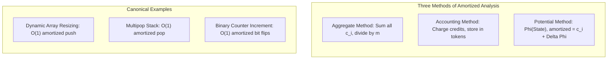

# Amortized Analysis

> [!NOTE]
> **Worst-Case Sequence Guarantee Without Probability:**
> Amortized analysis evaluates the average performance of each operation over a worst-case sequence of operations.
> - Unlike **average-case analysis**, which assumes an underlying probability distribution over inputs, **amortized analysis** is completely deterministic and holds across every possible sequence executed by an adversary.
> - An occasional expensive operation (e.g., dynamic array reallocation copying $N$ items) is offset by a guaranteed preceding sequence of cheap operations, yielding constant $O(1)$ amortized time per operation.
> - Reference implementations: [C++17 Implementation](../../implementations/cpp/amortized_analysis.cpp) | [Python Implementation](../../implementations/python/amortized_analysis.py)

> [!TIP]
> **The Three Foundational Frameworks:**
> 1. **Aggregate Analysis:** Determine the total upper bound $T(m)$ on a sequence of $m$ operations; the amortized cost per operation is simply $T(m) / m$.
> 2. **Accounting (Banker's) Method:** Assign an artificial charge $\hat{c}_i$ to each operation. Cheap operations are overcharged, depositing the surplus as "credit" on data structure elements. Expensive operations draw down credit to pay their real cost. Invariant: cumulative credit must never be negative: $\sum \hat{c}_i \ge \sum c_i$.
> 3. **The Potential Method (Physicist's Method):** Define a potential function $\Phi(D)$ mapping data structure state $D$ to a real number, with $\Phi(D_0) = 0$ and $\Phi(D_i) \ge 0$. The amortized cost of operation $i$ is:
>    $$\hat{c}_i = c_i + \Phi(D_i) - \Phi(D_{i-1})$$
>    The sum telescopes: $\sum_{i=1}^m \hat{c}_i = \sum_{i=1}^m c_i + \Phi(D_m) - \Phi(D_0) \ge \sum_{i=1}^m c_i$.

> [!WARNING]
> **Critical Traps & Misconceptions:**
> 1. **Amortized $\ne$ Real-Time Safe:** While dynamic array `push_back` is $O(1)$ amortized, a single resize operation takes $O(N)$ worst-case time, pausing execution. In real-time audio or safety-critical systems, an unexpected $O(N)$ latency spike can violate deadlines; use ring buffers or incrementally resized structures instead.
> 2. **Additive Sizing Anti-Pattern:** Resizing an array by adding a constant increment $+K$ (e.g., adding 100 slots when full) requires $\Theta(N^2)$ total copies over $N$ pushes, destroying the $O(1)$ amortized guarantee and degrading it to $\Theta(N)$ per push. True $O(1)$ amortization requires geometric scaling (multiplying capacity by $c > 1$, such as $1.5$ or $2.0$).
> 3. **Invalid Potential Functions:** If a proposed potential function allows $\Phi(D_m) < \Phi(D_0)$, the telescoping sum fails to bound total actual work from above.

---

## 1. Why Amortized Analysis Matters

In traditional algorithm analysis, we evaluate the worst-case time of a single isolated operation. However, for many advanced data structures, this isolated metric is deeply misleading:

- In a **dynamic array**, $99.9\%$ of `push_back` operations take $O(1)$ time, but the $1$ operation that triggers capacity reallocation takes $O(N)$ time.
- In a **multipop stack**, a single `multipop(k)` call can pop $k$ elements, taking $O(N)$ time, but it cannot pop elements that were never pushed.
- In **Disjoint Set Union (DSU)** with path compression, a `find` operation traversing a long path takes $O(N)$ time, but flattens the tree so subsequent queries run in nearly constant time.

Amortized analysis proves that over any sequence of $m$ operations, the total cost is strictly bounded by $O(m)$, guaranteeing an average cost of $O(1)$ per operation.

---

## 2. Amortized vs. Average-Case Analysis

A widespread point of confusion is conflating **amortized cost** with **average-case cost**:

| Dimension | Average-Case Analysis | Amortized Analysis |
|---|---|---|
| **Underlying Nature** | Probabilistic | Completely Deterministic |
| **Input Assumptions** | Assumes random inputs from an assumed distribution | No distribution assumed; worst-case input sequence |
| **Adversary Resilience** | Vulnerable to pathological inputs selected by an adversary | Immune to adversarial inputs; holds for *any* sequence |
| **Typical Examples** | Quicksort expected $O(n \log n)$, Hash table probing | Dynamic array growth, Multipop stack, Splay tree, DSU |

---

## 3. Method 1: Aggregate Analysis

**Aggregate analysis** is the most direct method:
1. Show that for all $m$, any sequence of $m$ operations takes at most $T(m)$ total time in the worst case.
2. The amortized cost per operation is then:

$$\hat{c} = \frac{T(m)}{m}$$

### Example 1: Multipop Stack

Consider a stack supporting:
- `push(x)`: pushes $x$ onto stack ($O(1)$ cost).
- `pop()`: pops top element ($O(1)$ cost).
- `multipop(k)`: pops up to $k$ elements from top of stack ($O(\min(k, s))$ cost, where $s$ is stack size).

**Worst-case single operation:** If $s = n$, a single `multipop(n)` costs $O(n)$.  
**Aggregate analysis:**
- An element can only be popped if it was previously pushed.
- Each element is pushed at most once and therefore popped at most once.
- In any sequence of $m$ operations starting from an empty stack, the total number of `pop` and `multipop` removals cannot exceed the total number of `push` operations (which is at most $m$).
- Total actual cost $T(m) \le m \cdot O(1) + m \cdot O(1) = O(m)$.
- Therefore, the amortized cost per operation is:

$$\hat{c} = \frac{O(m)}{m} = O(1)$$

### Example 2: Dynamic Array Expansion (Geometric Doubling)

Let an array start with capacity $1$ and double its capacity whenever full:

$$\text{Capacities: } 1, 2, 4, 8, 16, \dots, 2^k$$

When inserting $N$ elements into an initially empty array:
- Ordinary insertions cost $1$ unit each: total $N$.
- Copy operations during reallocations occur at sizes $1, 2, 4, 8, \dots, 2^{\lfloor \log_2 N \rfloor}$.
- Total copy cost is:

$$\sum_{j=0}^{\lfloor \log_2 N \rfloor} 2^j = 2^{\lfloor \log_2 N \rfloor + 1} - 1 < 2N$$

- Total time for $N$ operations:

$$T(N) = N + \sum \text{copies} < N + 2N = 3N = O(N)$$

- The amortized cost of `push_back` is:

$$\hat{c} = \frac{T(N)}{N} < \frac{3N}{N} = 3 = O(1)$$

---

## 4. Method 2: The Accounting (Banker's) Method

In the **accounting method**, we assign different amortized charges $\hat{c}_i$ to different operations:

- If $\hat{c}_i > c_i$ (overcharged), the surplus $\hat{c}_i - c_i$ is stored as **credit** associated with specific objects in the data structure.
- If $\hat{c}_i < c_i$ (undercharged), the deficit $c_i - \hat{c}_i$ is paid for by consuming stored credit.

**Banker's Invariant:** The total accumulated credit must never be negative at any point in time:

$$\sum_{i=1}^k \hat{c}_i - \sum_{i=1}^k c_i \ge 0 \quad \text{for all } k \ge 1$$

### Accounting Analysis of Dynamic Array
We set the amortized cost of each `push_back` to **$3$ credits**:
- **$1$ credit** pays for the actual insertion into the current array slot.
- **$1$ credit** is saved on the newly inserted element to pay for its own copy during the *next* resize.
- **$1$ credit** is saved to pay for copying one *older* element (which had already used up its credit in an earlier resize).

When capacity doubles from $M$ to $2M$, exactly $M$ new elements were inserted, accumulating $2M$ stored credits.  
The cost to copy all $M$ elements into the new array is $M$ operations.  
The $2M$ saved credits easily pay the $M$ copy cost, leaving surplus credit for future resizes. The credit never drops below zero, proving that `push_back` is $O(1)$ amortized.

---

## 5. Method 3: The Potential Method (Physicist's Method)

The **potential method** represents the stored energy of the entire data structure as a whole via a **potential function** $\Phi(D)$:

- Let $D_0$ be the initial state of the data structure (usually empty, with $\Phi(D_0) = 0$).
- Let $D_i$ be the state after the $i$-th operation.
- We require $\Phi(D_i) \ge \Phi(D_0)$ for all $i$.

The **amortized cost** $\hat{c}_i$ of the $i$-th operation with actual cost $c_i$ is defined as:

$$\hat{c}_i = c_i + \Phi(D_i) - \Phi(D_{i-1}) = c_i + \Delta \Phi_i$$

### The Telescoping Sum Proof
Summing the amortized costs over all $m$ operations:

$$\sum_{i=1}^m \hat{c}_i = \sum_{i=1}^m \left( c_i + \Phi(D_i) - \Phi(D_{i-1}) \right) = \sum_{i=1}^m c_i + \Phi(D_m) - \Phi(D_0)$$

Since $\Phi(D_m) \ge \Phi(D_0)$, we have:

$$\sum_{i=1}^m \hat{c}_i \ge \sum_{i=1}^m c_i$$

Thus, the total amortized cost provides a rigorous upper bound on the total actual cost.

---

## 6. Potential Method for Dynamic Array

Let:
- $s_i$ be the number of elements after operation $i$.
- $c_i$ be the capacity after operation $i$.

Define the potential function:

$$\Phi(D_i) = 2 s_i - c_i$$

**Properties of $\Phi$:**
- Right after a resize ($s_i = c_i / 2$), $\Phi = 2(c_i / 2) - c_i = 0$.
- Right before a resize ($s_i = c_i$), $\Phi = 2 c_i - c_i = c_i$. The potential has accumulated exactly enough energy ($c_i$) to pay for copying $c_i$ elements!
- Since $s_i \ge c_i / 2$ once populated, $\Phi(D_i) \ge 0 = \Phi(D_0)$.

### Case A: `push_back` Without Resize ($s_i < c_{i-1}$)
- Actual cost: $c_i = 1$.
- Capacity remains unchanged: $c_i = c_{i-1}$.
- Size increases by 1: $s_i = s_{i-1} + 1$.
- $\Delta \Phi_i = (2(s_{i-1} + 1) - c_i) - (2 s_{i-1} - c_i) = 2$.
- Amortized cost:

$$\hat{c}_i = c_i + \Delta \Phi_i = 1 + 2 = 3$$

### Case B: `push_back` With Resize ($s_{i-1} = c_{i-1}$)
- Actual cost: $c_i = s_{i-1} + 1$ (copying $s_{i-1}$ elements $+$ inserting new element).
- New capacity: $c_i = 2 c_{i-1} = 2 s_{i-1}$.
- New size: $s_i = s_{i-1} + 1$.
- New potential: $\Phi(D_i) = 2(s_{i-1} + 1) - 2 s_{i-1} = 2$.
- Old potential: $\Phi(D_{i-1}) = 2 s_{i-1} - c_{i-1} = s_{i-1}$.
- $\Delta \Phi_i = 2 - s_{i-1}$.
- Amortized cost:

$$\hat{c}_i = c_i + \Delta \Phi_i = (s_{i-1} + 1) + (2 - s_{i-1}) = 3$$

In both cases, **$\hat{c}_i = 3 = O(1)$**. The potential function absorbs the spike cleanly!

---

## 7. Example 3: $k$-Bit Binary Counter Increment

Consider incrementing a binary counter initialized to zero.

An increment flips a sequence of trailing 1s to 0s, and flips the lowest 0 to 1:
- `000` $\to$ `001` (1 flip)
- `001` $\to$ `010` (2 flips)
- `011` $\to$ `100` (3 flips)
- `111` $\to$ `1000` (4 flips)

In the worst case, a single increment flips $k$ bits ($O(k)$).

### Potential Analysis
Define $\Phi(D_i) = b_i$, where $b_i$ is the number of 1-bits in the counter after operation $i$.
- $\Phi(D_0) = 0$ and $\Phi(D_i) \ge 0$.
- Suppose the $i$-th increment resets $t_i$ trailing 1s to 0, and sets one 0 to 1.
- Actual cost: $c_i = t_i + 1$ bit flips.
- The number of 1-bits changes by: $b_i - b_{i-1} = 1 - t_i$.
- $\Delta \Phi_i = 1 - t_i$.
- Amortized cost:

$$\hat{c}_i = c_i + \Delta \Phi_i = (t_i + 1) + (1 - t_i) = 2$$

Every increment costs at most **2 amortized bit flips**, regardless of counter width $k$!

---

## 8. Common Engineering Pitfalls

### Pitfall 1: Additive Array Growth ($+K$ Slots)
Expanding capacity by adding a fixed block size (e.g. $c_{new} = c_{old} + 1000$) rather than multiplying ($c_{new} = 2 \times c_{old}$) results in $\Theta(N / K)$ reallocations.  
Total copying work becomes $\sum_{j=1}^{N/K} j K = \Theta(N^2 / K)$, causing an amortized cost of $\Theta(N)$ per append.

### Pitfall 2: Premature Shrinking Thrashing
If an array doubles at $100\%$ load and halves at $50\%$ load, alternating `push` and `pop` at capacity boundary causes continuous $O(N)$ reallocations on every operation.  
**Resolution:** Halve capacity only when load drops to $25\%$ (one-quarter full), ensuring an amortized cost of $O(1)$ for both insertions and deletions.

---

## 9. Summary Table

| Method | Core Mechanism | Best Used For |
|---|---|---|
| **Aggregate** | Direct summation of sequence cost divided by $m$ | Simple structures where operations cannot repeat (multipop) |
| **Accounting (Banker's)** | Overcharge cheap steps; store credit on individual items | Intuitive physical tracking of prepaid work (array tokens) |
| **Potential (Physicist's)** | Define global state energy function $\Phi(D)$ | Complex structures where credits shift between nodes (Splay, DSU, Fib Heaps) |

---

## 10. Practice Prompts and Exercises

1. **Queue Using Two Stacks:** Implement a FIFO queue using two LIFO stacks (`in_stack` and `out_stack`). Show using aggregate and potential methods why `enqueue` and `dequeue` are both $O(1)$ amortized.
2. **De-amortization:** How does the "incremental copy" technique convert $O(1)$ amortized array doubling into strict $O(1)$ worst-case time for hard real-time systems?
3. **Disjoint Set Union (DSU):** Why does path compression without union-by-rank achieve $O(m \log n)$ amortized time, and why does combining both yield $O(m \alpha(n))$?
4. **Binary Counter Decrement:** What happens to the amortized complexity if the counter supports both `increment` and `decrement` arbitrarily? Can an adversary induce $\Theta(k)$ work per step?
