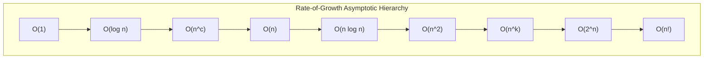

# Asymptotic Analysis

> [!NOTE]
> **Machine-Independent Resource Growth Classification:**
> Asymptotic analysis characterizes how an algorithm's running time or memory usage scales as input size $n \to \infty$, abstracting away hardware clock speeds, instruction sets, and compiler optimizations.
> - **Big-O ($O$):** Asymptotic upper bound ($f(n) \le c \cdot g(n)$).
> - **Big-Omega ($\Omega$):** Asymptotic lower bound ($f(n) \ge c \cdot g(n)$).
> - **Big-Theta ($\Theta$):** Asymptotically tight bound ($c_1 g(n) \le f(n) \le c_2 g(n)$).
> - **Little-o ($o$) / Little-omega ($\omega$):** Strictly dominated growth ($f(n) / g(n) \to 0$ or $\infty$).

> [!TIP]
> **The Limit Quotient Decision Test ($L = \lim_{n \to \infty} \frac{f(n)}{g(n)}$):**
> - **$L = 0$:** $f(n) = o(g(n))$ (and therefore $f(n) = O(g(n))$, but $f(n) \ne \Omega(g(n))$).
> - **$0 < L < \infty$:** $f(n) = \Theta(g(n))$ (identical asymptotic growth rate).
> - **$L = \infty$:** $f(n) = \omega(g(n))$ (and therefore $f(n) = \Omega(g(n))$, but $f(n) \ne O(g(n))$).
> - **Growth Hierarchy:**
>   $$1 \prec \log \log n \prec \log n \prec n^\epsilon \prec n \prec n \log n \prec n^2 \prec n^k \prec c^n \prec n! \prec n^n \quad (\epsilon > 0, c > 1)$$

> [!WARNING]
> **Analytical Traps & Common Fallacies:**
> 1. **Treating Big-O as Exact:** Big-O is an upper bound, not an equivalence relation. While $n = O(n^2)$ is mathematically true, only $\Theta(n)$ conveys the tight rate of growth.
> 2. **Ignoring Constant Factors in Practice:** An algorithm with $1000 n$ operations is asymptotically superior to $n^2$, but for practical workloads where $n < 1000$, the $n^2$ algorithm runs faster.
> 3. **Logarithm Base Invariance:** By the change of base formula $\log_a n = \frac{\log_b n}{\log_b a} = \Theta(\log_b n)$, logarithm bases differ by a constant factor and are asymptotically equivalent.



When we analyze algorithms, we usually do not care about one specific machine, one compiler, or one exact input size.

Instead, we want to understand how running time or memory usage grows as the input becomes large.

This is the purpose of **asymptotic analysis**.

Asymptotic notation helps us describe growth rates such as:

- upper bounds
- lower bounds
- tight bounds
- strictly smaller or strictly larger growth

The most common notations are:

- Big-O
- Big-Omega
- Big-Theta
- little-o
- little-omega

This chapter develops:

- why asymptotic analysis is useful
- formal definitions of the main notations
- examples and limit tests
- rate-of-growth hierarchies
- common misconceptions

---

## 1. Why asymptotic analysis matters

Suppose one algorithm takes:

$$
3n^2 + 10n + 7
$$

steps and another takes:

$$
100n \log n + 500
$$

steps.

For small $ n $, the first might sometimes look competitive.
For large $ n $, the second usually grows much more slowly.

Asymptotic analysis helps us focus on the long-run growth pattern rather than small constants and low-order terms.

This gives a cleaner picture of scalability.

---

## 2. Input size and growth rate

An algorithm's resource usage is often expressed as a function of input size $ n $.

Examples:

- $ n $
- $ n \log n $
- $ n^2 $
- $ 2^n $

These expressions describe how resource usage grows as the problem gets larger.

Asymptotic notation compares such functions.

---

## 3. Big-O notation

We say:

$$
f(n) = O(g(n))
$$

if $ f $ grows at most as fast as $ g $, up to constant factors, for sufficiently large $ n $.

Formally, there exist constants $ c > 0 $ and $ n_0 $ such that:

$$
0 \le f(n) \le c g(n) \quad \text{for all } n \ge n_0
$$

Big-O is an **asymptotic upper bound**.

---

## 4. Intuition for Big-O

Big-O says:

> eventually, $ f(n) $ is no bigger than a constant multiple of $ g(n) $

So if:

$$
f(n) = 3n^2 + 10n + 7
$$

then:

$$
f(n) = O(n^2)
$$

because the quadratic term dominates for large $ n $.

---

## 5. Big-Omega notation

We say:

$$
f(n) = \Omega(g(n))
$$

if $ f $ grows at least as fast as $ g $, up to constant factors, for sufficiently large $ n $.

Formally, there exist constants $ c > 0 $ and $ n_0 $ such that:

$$
0 \le c g(n) \le f(n) \quad \text{for all } n \ge n_0
$$

Big-Omega is an **asymptotic lower bound**.

---

## 6. Big-Theta notation

We say:

$$
f(n) = \Theta(g(n))
$$

if $ f $ is both $ O(g(n)) $ and $ \Omega(g(n)) $.

That means $ f $ and $ g $ have the same asymptotic growth rate up to constant factors.

Formally, there exist constants $ c_1, c_2 > 0 $ and $ n_0 $ such that:

$$
0 \le c_1 g(n) \le f(n) \le c_2 g(n)
\quad \text{for all } n \ge n_0
$$

Big-Theta is a **tight asymptotic bound**.

---

## 7. Example: polynomial simplification

Let:

$$
f(n) = 3n^2 + 10n + 7
$$

Then:

- $ f(n) = O(n^2) $
- $ f(n) = \Omega(n^2) $
- therefore $ f(n) = \Theta(n^2) $

This is one of the most common examples in asymptotic analysis.

---

## 8. little-o notation

We say:

$$
f(n) = o(g(n))
$$

if $ f $ grows **strictly more slowly** than $ g $.

Formally:

$$
\lim_{n \to \infty} \frac{f(n)}{g(n)} = 0
$$

So little-o is a stronger statement than Big-O.

For example:

$$
n = o(n^2)
$$

because:

$$
\frac{n}{n^2} = \frac{1}{n} \to 0
$$

---

## 9. little-omega notation

We say:

$$
f(n) = \omega(g(n))
$$

if $ f $ grows **strictly faster** than $ g $.

Formally:

$$
\lim_{n \to \infty} \frac{f(n)}{g(n)} = \infty
$$

For example:

$$
n^2 = \omega(n)
$$

because:

$$
\frac{n^2}{n} = n \to \infty
$$

---

## 10. Relation between the notations

These notations are related, but not identical.

### Big-O
At most this fast asymptotically.

### Big-Omega
At least this fast asymptotically.

### Big-Theta
Exactly this growth rate up to constants.

### little-o
Strictly smaller growth.

### little-omega
Strictly larger growth.

It is important not to mix them carelessly.

---

## 11. Limit test intuition

A common way to compare functions is the ratio:

$$
\frac{f(n)}{g(n)}
$$

If:

- the ratio tends to 0, then $ f = o(g) $
- the ratio tends to a positive constant, then $ f = \Theta(g) $
- the ratio tends to infinity, then $ f = \omega(g) $

This limit test is often the fastest way to compare growth rates.

---

## 12. Example with logarithm and polynomial

Compare:

$$
\log n \quad \text{and} \quad n^{0.1}
$$

We have:

$$
\log n = o(n^{0.1})
$$

So any positive power of $ n $, even a very small one, eventually grows faster than $ \log n $.

This is a classic asymptotic fact.

---

## 13. Example with $ n \log n $ and $ n^{3/2} $

Compare:

$$
n \log n \quad \text{and} \quad n^{3/2}
$$

Take the ratio:

$$
\frac{n \log n}{n^{3/2}} = \frac{\log n}{\sqrt{n}} \to 0
$$

So:

$$
n \log n = o(n^{3/2})
$$

This shows that $ n^{3/2} $ eventually grows faster.

---

## 14. Constants do not matter asymptotically

For asymptotic notation, constant factors do not change the class.

For example:

$$
100n = \Theta(n)
$$

and:

$$
\frac{1}{7}n^2 = \Theta(n^2)
$$

This is why asymptotic analysis ignores constant multipliers.

That does not mean constants never matter in practice.
It means they do not change the long-run growth category.

---

## 15. Lower-order terms do not dominate

Similarly, lower-order terms do not affect the leading asymptotic class.

Examples:

$$
n^2 + n = \Theta(n^2)
$$

$$
n^3 + 1000n^2 + 5 = \Theta(n^3)
$$

For large $ n $, the highest-growth term dominates.

---

## 16. Common rate-of-growth hierarchy

A useful growth hierarchy is:

$$
1
\prec \log n
\prec n^\epsilon
\prec n
\prec n \log n
\prec n^2
\prec n^3
\prec c^n
\prec n!
$$

for fixed constants $ \epsilon > 0 $ and $ c > 1 $.

This is not a full theorem covering every possible case, but it is a very useful mental map.

---

## 17. Logarithm bases in asymptotic analysis

For asymptotic purposes, logarithm bases differ only by a constant factor.

Because:

$$
\log_a n = \frac{\log_b n}{\log_b a}
$$

we get:

$$
\log_a n = \Theta(\log_b n)
$$

So in big-O style reasoning, the base of the logarithm usually does not matter.

---

## 18. Worst-case, average-case, and best-case

Asymptotic notation can describe different performance models.

Examples:

- worst-case time
- average-case time
- best-case time

So saying “this algorithm is $ O(n^2) $” should ideally be tied to a model, such as worst-case running time.

Otherwise the statement may be incomplete.

---

## 19. Asymptotic notation is about functions, not just algorithms

Big-O and related notations apply to any nonnegative functions, not only running times.

For example:

- memory usage
- number of comparisons
- recursion depth
- number of states
- mathematical quantities in proofs

This is why asymptotic notation is such a broad mathematical tool.

---

## 20. C++17 toy growth comparison helper

```cpp
#include <cmath>
#include <iostream>

int main() {
    for (int n = 2; n <= 1024; n *= 2) {
        double a = n * std::log2(n);
        double b = n * n;
        std::cout << n << " " << a << " " << b << "\n";
    }
}
```

This kind of experiment can help build intuition, though asymptotic claims are proved mathematically, not by finite testing alone.

---

## 21. Python toy growth comparison helper

```python
import math

n = 2
while n <= 1024:
    a = n * math.log2(n)
    b = n * n
    print(n, a, b)
    n *= 2
```

Again, this is only for intuition.

---

## 22. Proving $ O $, $ \Omega $, and $ \Theta $

A common proof style is:

1. start from the function
2. bound it above or below by simpler expressions
3. choose explicit constants
4. state “for sufficiently large $ n $”

Example:

$$
3n^2 + 10n + 7 \le 20n^2 \quad \text{for } n \ge 1
$$

So:

$$
3n^2 + 10n + 7 = O(n^2)
$$

This style of proof is worth practicing.

---

## 23. Common misconceptions

### Misconception 1: Big-O means exact running time
It does not.
It is an upper bound class.

### Misconception 2: Big-O ignores everything important
It ignores constants and lower-order terms asymptotically, but those may still matter in practice.

### Misconception 3: $ O(n) $ is always better than $ O(n \log n) $ for every real input size
Not always on small inputs, though asymptotically yes.

### Misconception 4: Big-Theta and Big-O mean the same thing
They do not.
Theta is tighter.

### Misconception 5: If $ f = O(g) $, then $ f $ and $ g $ grow equally fast
Not necessarily.
For example, $ n = O(n^2) $, but the growth rates are not equal.

---

## 24. Comparing common functions

### $ n $ vs $ n \log n $
$$
n = o(n \log n)
$$

### $ n \log n $ vs $ n^2 $
$$
n \log n = o(n^2)
$$

### $ 2^n $ vs $ n^k $ for fixed $ k $
$$
n^k = o(2^n)
$$

### $ n! $ vs $ 2^n $
$$
2^n = o(n!)
$$

These are important benchmark facts.

---

## 25. Why asymptotic analysis is still useful

Asymptotic analysis does not predict every real-world performance detail.

It does not directly model:

- cache effects
- branch prediction
- constant-factor engineering
- implementation quality

But it is still essential because it explains scalability and provides a common language for comparing algorithms cleanly.

It is one of the most important abstractions in algorithm design.

---

## 26. Comparison table

| Notation | Meaning |
|---|---|
| $ O(g(n)) $ | asymptotic upper bound |
| $ \Omega(g(n)) $ | asymptotic lower bound |
| $ \Theta(g(n)) $ | asymptotically tight bound |
| $ o(g(n)) $ | strictly smaller growth |
| $ \omega(g(n)) $ | strictly larger growth |

---

## 27. Summary

Asymptotic analysis studies how functions grow as input size becomes large.

The central notations are:

- Big-O for upper bounds
- Big-Omega for lower bounds
- Big-Theta for tight bounds
- little-o and little-omega for strict growth comparisons

The most important lessons are:

- constants and lower-order terms do not change asymptotic class
- limits are a powerful way to compare growth rates
- different growth families have a recognizable hierarchy
- asymptotic analysis is about long-run behavior, not exact timing on one machine

This makes asymptotic notation the basic language of algorithm analysis.

---

## 28. Practice prompts

1. What does $ f(n) = O(g(n)) $ mean formally?
2. What is the difference between Big-O and Big-Theta?
3. What does little-o mean?
4. Why is $ n = o(n^2) $?
5. Why do logarithm bases not matter asymptotically?
6. Is $ 100n $ asymptotically different from $ n $?
7. Why is $ n \log n = o(n^2) $?
8. Why is $ 2^n $ asymptotically larger than any polynomial $ n^k $?
9. Why is asymptotic notation useful even though it ignores constants?
10. What is a common misconception about Big-O?
```
