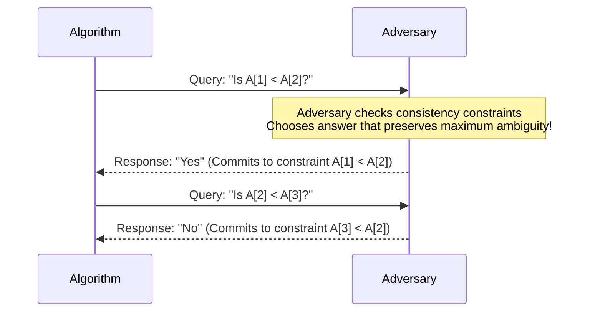

# Lower Bounds & Adversary Arguments: Proving Algorithmic Limits

## 1. Executive Summary & The Asymmetry of Complexity

In computer science, proving an **Upper Bound** is constructively simple: you invent a specific algorithm $\mathcal{A}$ and prove that its running time on inputs of size $n$ satisfies $T_{\mathcal{A}}(n) \le c \cdot f(n)$.

Proving a **Lower Bound** ($\Omega(g(n))$) is fundamentally more profound: you must prove a negative statement about **all conceivable algorithms** that currently exist or could ever be conceived in the future:
$$\forall \text{ algorithms } \mathcal{A}, \quad \exists \text{ input } x \text{ of size } n \text{ such that } T_{\mathcal{A}}(x) \ge c \cdot g(n)$$

Lower bounds establish the fundamental speed limits of nature. When an algorithm's upper bound matches the theoretical lower bound ($O(f(n)) = \Omega(f(n))$), the algorithm is **Asymptotically Optimal**, and no further asymptotic optimization is mathematically possible.

---

## 2. Technique 1: Information-Theoretic Lower Bounds (Decision Trees)

Any algorithm that interacts with data solely through pairwise comparisons can be modeled as a **Comparison Decision Tree**:
- **Internal Nodes**: Represent a comparison query between two elements (e.g. $A[i] < A[j]$).
- **Edges**: Represent the boolean outcomes of the query (YES / NO).
- **Leaves**: Represent the distinct final answers or classifications.
- **Tree Height $h$**: The maximum number of comparisons on any execution path (the worst-case running time).

```
                      [ Is A[1] < A[2]? ]
                       /               \
                   YES /                 \ NO
           [ Is A[2] < A[3]? ]     [ Is A[1] < A[3]? ]
             /             \         /             \
          [1, 2, 3]    [1, 3, 2]  [2, 1, 3]    [2, 3, 1] ...
```

### 2.1 The Fundamental Leaf Inequality
A binary decision tree of height $h$ can have at most $2^h$ leaves:
$$\text{Number of Distinct Outcomes } K \le \text{Number of Leaves} \le 2^h$$
Taking the base-2 logarithm of both sides:
$$h \ge \lceil \log_2 K \rceil$$

### 2.2 Proof: The $\Omega(n \log n)$ Comparison Sorting Lower Bound
- An array of $n$ distinct elements has $n!$ possible permutations.
- A correct sorting algorithm must be able to produce any of the $n!$ permutations as its output.
- Therefore, the decision tree must have at least $K = n!$ leaves.
$$h \ge \log_2(n!) = \sum_{i=1}^n \log_2 i$$
Using Stirling's Approximation or integral bounding:
$$\sum_{i=1}^n \log_2 i \ge \int_1^n \log_2 x \, dx = n \log_2 n - n \log_2 e + \Theta(\log n)$$
$$h \ge n \log_2 n - 1.443 n = \Omega(n \log n)$$

> [!IMPORTANT]
> **Conclusion**: No comparison-based sorting algorithm (MergeSort, QuickSort, Heapsort) can ever sort $n$ elements in fewer than $\approx n \log_2 n$ comparisons in the worst case. Non-comparison sorts (Counting Sort, Radix Sort) bypass this bound because they inspect bit representations rather than using comparison trees!

---

## 3. Technique 2: Adversary Arguments (Adversary Strategies)

In an **Adversary Argument**, we imagine the algorithm running against an active, malicious opponent. The adversary does not fix the input in advance. Instead, the adversary **constructs the input dynamically** in response to the algorithm's queries, choosing answers that force the algorithm to perform maximum work while maintaining consistency with all previous answers.



### 3.1 Landmark Proof: Finding Both Min and Max in an Array
- **Problem**: Find both the minimum and maximum of an unsorted array of size $n$.
- **Naive Algorithm**: Find min in $n-1$ comparisons, then max in $n-1$ comparisons $\implies 2n - 2$ comparisons.
- **Optimal Algorithm**: Compare elements in pairs ($n/2$ comparisons), then compare losers for min ($n/2$ comparisons) and winners for max ($n/2$ comparisons) $\implies \lceil 3n/2 \rceil - 2$ comparisons.
- **Can we do better than $\lceil 3n/2 \rceil - 2$?**

### The Adversary State Machine Proof:
Every element begins in state $U$ (Untested).
- $W$: Has won at least one comparison, never lost (candidate for Max).
- $L$: Has lost at least one comparison, never won (candidate for Min).
- $WL$: Has both won and lost comparisons (cannot be Min or Max).

To find both Min and Max, the algorithm must eliminate $n-1$ elements from candidate Min (leaving 1 Min) and $n-1$ elements from candidate Max (leaving 1 Max), requiring a total of **$2n - 2$ status updates**.

The adversary adopts the following strategy to minimize status updates per comparison:

| Comparison | Adversary Response | Status Updates Awarded |
| :--- | :--- | :--- |
| $U$ vs $U$ | Arbitrary winner (one becomes $W$, one becomes $L$) | **2 units** (1 $W$, 1 $L$) |
| $W$ vs $U$ | $W$ wins ($U$ becomes $L$) | **1 unit** (1 $L$) |
| $L$ vs $U$ | $L$ loses ($U$ becomes $W$) | **1 unit** (1 $W$) |
| $W$ vs $W$ | Arbitrary winner (loser becomes $WL$) | **1 unit** (1 loser eliminated) |
| $L$ vs $L$ | Arbitrary winner (winner becomes $WL$) | **1 unit** (1 winner eliminated) |
| $WL$ vs anything | Consistent with previous | **0 units** |

To collect $2n - 2$ units of information:
- At most $\lfloor n/2 \rfloor$ comparisons can award 2 units (comparing $U$ vs $U$).
- All remaining comparisons award at most 1 unit!
$$\text{Total Comparisons } C \ge \lfloor n/2 \rfloor + (2n - 2 - 2 \lfloor n/2 \rfloor) = \lceil 3n/2 \rceil - 2$$
The paired-comparison algorithm is strictly, provably optimal!

---

## 4. Technique 3: Algorithmic Reductions to Known Lower Bounds

If an algorithm solves Problem $B$, and we can transform instances of a known hard problem $A$ into instances of $B$, then $B$ inherits the lower bound of $A$.

```
Known Hard Problem A (Lower Bound: Omega(f(n)))
       |
       v (Reduction in O(r(n)) time)
Algorithm for Problem B (Time: T_B(n))
       |
       v
Answer to Problem A
```

$$\text{If } A \le_T B \text{ and } T_A(n) = \Omega(f(n)), \quad \text{then } T_B(n) = \Omega(f(n) - r(n))$$

### 4.1 Example: Convex Hull Requires $\Omega(n \log n)$ Comparisons
- **Known Lower Bound**: Comparison Sorting requires $\Omega(n \log n)$.
- **Reduction**: Given $n$ unsorted real numbers $x_1, x_2, \dots, x_n$:
  1. Map each number $x_i$ to a 2D point on the parabola: $p_i = (x_i, x_i^2)$ in $O(n)$ time.
  2. Because the parabola $y = x^2$ is strictly convex, **every point $p_i$ lies on the Convex Hull!**
  3. Computing the convex hull returns the points in counterclockwise sorted order along the parabola.
  4. Reading the x-coordinates produces the sorted array!
- **Conclusion**: If Convex Hull could be solved in $o(n \log n)$ comparisons, we could sort in $o(n \log n)$, violating the sorting lower bound. Therefore, **Convex Hull requires $\Omega(n \log n)$ comparisons**!

---

## 5. Technique 4: Yao's Minimax Principle for Randomized Algorithms

Can randomized algorithms break deterministic lower bounds?

> [!TIP]
> **Yao's Minimax Principle (Andrew Yao 1977)**:
> The expected running time of the best randomized algorithm against the worst-case input is lower-bounded by the average running time of the best deterministic algorithm against an input distribution $\mathcal{D}$:
> $$\max_{x} \mathbb{E}[T(\mathcal{R}, x)] \ge \min_{\mathcal{D}_{\text{algo}}} \mathbb{E}_{x \sim \mathcal{D}}[T(\mathcal{D}_{\text{algo}}, x)]$$

To prove a lower bound on **any randomized algorithm**:
1. Construct a cleverly chosen probability distribution $\mathcal{D}$ over inputs.
2. Prove that **no deterministic algorithm** can achieve an average runtime faster than $\Omega(g(n))$ under distribution $\mathcal{D}$.
3. Yao's Minimax Principle guarantees that no randomized algorithm can beat $\Omega(g(n))$ either!

---

## 6. Summary Matrix of Fundamental Lower Bounds

| Problem Domain | Computational Model | Lower Bound | Matching Optimal Algorithm |
| :--- | :--- | :--- | :--- |
| **Comparison Sorting** | Decision Tree | $\Omega(n \log n)$ | MergeSort, Heapsort |
| **Element Uniqueness** | Algebraic Decision Tree | $\Omega(n \log n)$ | Sort + Scan |
| **Convex Hull** | Algebraic Decision Tree | $\Omega(n \log n)$ | Andrew's Monotone Chain |
| **Finding Min & Max** | Adversary Model | $\lceil 3n/2 \rceil - 2$ | Pairwise Comparison |
| **Search in Sorted Array** | Decision Tree | $\Omega(\log n)$ | Binary Search |
| **Predecessor Search** | Cell Probe ($W$ bits) | $\Omega(\sqrt{\log n / \log \log n})$ | Fusion Tree / vEB Tree |
| **Dynamic Connectivity** | Cell Probe Model | $\Omega(\log n / \log \log n)$ | Link-Cut Tree |

---

## 7. Exercises & Proof Challenges

1. **Adversary for 2nd Largest Element**:
   Use an adversary argument to prove that finding the second largest element in an unsorted array of size $n$ requires at least $n + \lceil \log_2 n \rceil - 2$ comparisons.
2. **Matrix Multiplication Lower Bound**:
   Explain why $O(n^2)$ is the trivial lower bound for $n \times n$ matrix multiplication, and discuss the open problem of whether the true bound is $\Omega(n^2)$ or $\Omega(n^2 \log n)$.
3. **Element Uniqueness Reduction**:
   Formally write the reduction from Element Uniqueness to 3-SUM, showing that if 3-SUM takes $\Omega(n^2)$ then 3-SUM with distinct elements inherits the same bound.
