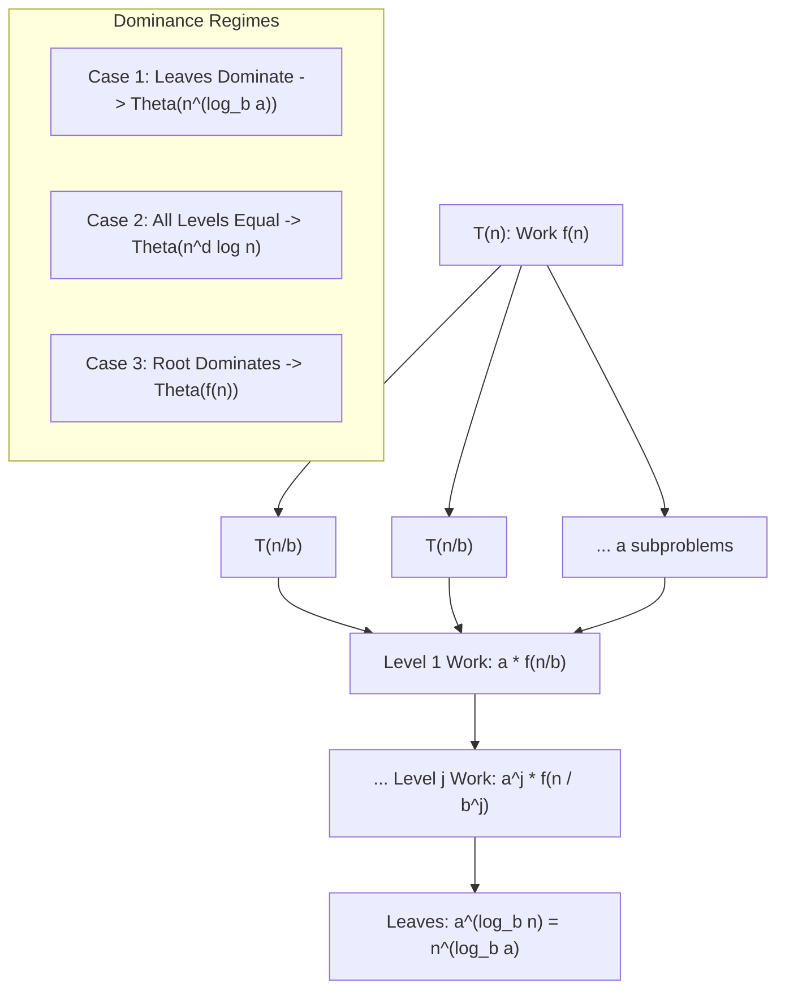

# Master Theorem and Beyond

> [!NOTE]
> **Systematic Recurrence Resolution for Divide-and-Conquer:**
> The **Master Theorem** provides an immediate closed-form asymptotic bound for divide-and-conquer recurrences of the canonical form:
> $$T(n) = a \, T\left(\frac{n}{b}\right) + f(n)$$
> It resolves the asymptotic behavior by pitting two competing forces against each other:
> - **The Leaves (Recursive Branching):** Generating $a$ subproblems of size $n/b$ yields $a^{\log_b n} = n^{\log_b a}$ leaf subproblems.
> - **The Root / Non-Recursive Work:** The combining and partitioning work $f(n)$ performed at each node.
> - Reference implementations: [C++17 Implementation](../../implementations/cpp/master_theorem_solver.cpp) | [Python Implementation](../../implementations/python/master_theorem_solver.py)

> [!TIP]
> **The Three Standard Regimes ($c = \log_b a$ vs. $f(n) = \Theta(n^d \log^k n)$):**
> 1. **Case 1 (Leaf Dominance, $c > d$):** Work grows geometrically downward. Total time is dominated by the leaves:
>    $$T(n) = \Theta(n^{\log_b a})$$
> 2. **Case 2 (Even Distribution, $c = d$):** Work across all $\log_b n$ levels is asymptotically identical:
>    $$T(n) = \Theta(n^c \log^{k+1} n)$$
> 3. **Case 3 (Root Dominance, $c < d$ with regularity $a f(n/b) \le \delta f(n)$ for $\delta < 1$):** Work decays geometrically downward. Total time is dominated by the root:
>    $$T(n) = \Theta(f(n))$$

> [!WARNING]
> **Critical Traps & Inapplicable Recurrences:**
> 1. **Sub-Polynomial Gaps:** The difference between $f(n)$ and $n^{\log_b a}$ must be strictly polynomial ($n^\epsilon$). For example, in $T(n) = 2T(n/2) + n / \log n$, $\log_b a = 1$ and $f(n) = n / \log n$. Since $n / \log n$ is smaller than $n$ by only a logarithmic factor, standard Master Theorem does NOT apply!
> 2. **Uneven Divide-and-Conquer:** If subproblem sizes differ (e.g. $T(n) = T(n/3) + T(2n/3) + O(n)$), the Master Theorem cannot be used. Use the **Akra-Bazzi Theorem** or draw the explicit recursion tree.
> 3. **Non-Geometric Reductions:** Does not apply to additive reductions such as $T(n) = T(n - 1) + O(1)$ or $T(n) = T(\sqrt{n}) + O(1)$ without variable transformations.

---

## 1. The Canonical Divide-and-Conquer Recurrence

Many classic algorithms divide a problem of size $n$ into smaller subproblems, solve each subproblem recursively, and combine the partial solutions:

$$
T(n) = a \, T\left(\frac{n}{b}\right) + f(n)
$$

Where:
- $a \ge 1$: The number of subproblems generated in each recursive step.
- $b > 1$: The factor by which the input size shrinks in each subproblem.
- $f(n)$: The cost of dividing the problem and combining the results of the subproblems (work performed outside recursion).

---

## 2. Derivation via the Recursion Tree

To see why the Master Theorem works, construct the recursion tree for $T(n)$:

1. **Root (Level 0):** 1 problem of size $n$. Work: $f(n)$.
2. **Level 1:** $a$ problems of size $n/b$. Total work: $a \cdot f(n/b)$.
3. **Level $j$:** $a^j$ problems of size $n / b^j$. Total work: $a^j \cdot f(n / b^j)$.
4. **Leaves (Depth $D = \log_b n$):** Subproblems reach base size $n / b^D = 1$.  
   Total number of leaves:

$$
a^{\log_b n} = \left( b^{\log_b a} \right)^{\log_b n} = \left( b^{\log_b n} \right)^{\log_b a} = n^{\log_b a}
$$

The total running time of the algorithm is the sum of work over all levels:

$$
T(n) = \sum_{j=0}^{\log_b n - 1} a^j f\left(\frac{n}{b^j}\right) + \Theta(n^{\log_b a})
$$

The asymptotic behavior is simply determined by **which part of this sum dominates**: the leaves, the root, or all levels equally.

---

## 3. The Three Classical Master Cases

Let $c = \log_b a$.

### Case 1: Leaf Work Dominates (Heavy Bottom)
If $f(n) = O(n^{c - \epsilon})$ for some constant $\epsilon > 0$:
- The work per level grows geometrically as we descend the tree.
- The leaf level dominates the entire summation.

$$
T(n) = \Theta(n^{\log_b a})
$$

### Case 2: Work is Uniformly Distributed (Balanced Tree)
If $f(n) = \Theta(n^c)$:
- The work at each level of the tree is asymptotically identical: $\Theta(n^c)$.
- Since there are $\log_b n$ levels, total work is the work per level multiplied by the tree height:

$$
T(n) = \Theta(n^c \log n) = \Theta(n^{\log_b a} \log n)
$$

### Case 3: Root Work Dominates (Heavy Top)
If $f(n) = \Omega(n^{c + \epsilon})$ for some constant $\epsilon > 0$, and $f(n)$ satisfies the **regularity condition**:

$$
a \, f\left(\frac{n}{b}\right) \le \delta \, f(n) \quad \text{for some constant } \delta < 1 \text{ and sufficiently large } n
$$

- The work per level decays geometrically as we descend the tree.
- The root level dominates the summation:

$$
T(n) = \Theta(f(n))
$$

---

## 4. The Extended Master Theorem

The classical Master Theorem requires $f(n) = \Theta(n^c)$ in Case 2. The **Extended Master Theorem** generalizes Case 2 to include polylogarithmic factors $f(n) = \Theta(n^c \log^k n)$ for any $k \ge 0$:

$$
T(n) = a \, T\left(\frac{n}{b}\right) + \Theta(n^{\log_b a} \log^k n) \implies T(n) = \Theta(n^{\log_b a} \log^{k+1} n)
$$

If $k = -1$ (e.g. $f(n) = \Theta(n^{\log_b a} / \log n)$), then $T(n) = \Theta(n^{\log_b a} \log \log n)$.  
If $k < -1$, $T(n) = \Theta(n^{\log_b a})$.

---

## 5. Canonical Algorithm Applications

### 1. Binary Search
- Recurrence: $T(n) = T(n/2) + O(1)$
- Parameters: $a = 1, b = 2, f(n) = 1$
- Watershed exponent: $\log_b a = \log_2 1 = 0 \implies n^0 = 1$.
- Case 2 applies ($k = 0$): $T(n) = \Theta(1 \cdot \log^1 n) = \Theta(\log n)$.

### 2. Merge Sort
- Recurrence: $T(n) = 2 T(n/2) + O(n)$
- Parameters: $a = 2, b = 2, f(n) = n$
- Watershed exponent: $\log_b a = \log_2 2 = 1 \implies n^1 = n$.
- Case 2 applies ($k = 0$): $T(n) = \Theta(n \log n)$.

### 3. Karatsuba Integer Multiplication
- Recurrence: $T(n) = 3 T(n/2) + O(n)$
- Parameters: $a = 3, b = 2, f(n) = n$
- Watershed exponent: $\log_b a = \log_2 3 \approx 1.585$.
- Compare $f(n) = n^1$ vs $n^{1.585}$: Case 1 applies ($1.585 > 1$).
- Result: $T(n) = \Theta(n^{\log_2 3}) \approx \Theta(n^{1.585})$ (significantly faster than naive grade-school $\Theta(n^2)$!).

### 4. Strassen's Matrix Multiplication
- Recurrence: $T(n) = 7 T(n/2) + O(n^2)$
- Parameters: $a = 7, b = 2, f(n) = n^2$
- Watershed exponent: $\log_b a = \log_2 7 \approx 2.807$.
- Compare $f(n) = n^2$ vs $n^{2.807}$: Case 1 applies.
- Result: $T(n) = \Theta(n^{\log_2 7}) \approx \Theta(n^{2.807})$ (beating naive $\Theta(n^3)$).

---

## 6. Beyond the Master Theorem: The Akra-Bazzi Method

What happens when subproblems are **uneven**?  
Consider the median-of-medians or quickselect recurrence:

$$
T(n) = T\left(\frac{n}{5}\right) + T\left(\frac{7n}{10}\right) + O(n)
$$

The standard Master Theorem cannot handle multiple different division factors ($n/5$ and $7n/10$).  
In 1998, Mohamad Akra and Louay Bazzi established a powerful generalization for all recurrences of the form:

$$
T(n) = \sum_{i=1}^k a_i \, T(b_i n) + g(n)
$$

where $a_i > 0$ and $0 < b_i < 1$.

### The Akra-Bazzi Procedure
1. Find the unique real number $p$ satisfying the **characteristic equation**:

$$
\sum_{i=1}^k a_i \, (b_i)^p = 1
$$

2. The closed-form solution is:

$$
T(n) = \Theta\left( n^p \left( 1 + \int_1^n \frac{g(u)}{u^{p+1}} \, du \right) \right)
$$

### Example Solution
For $T(n) = T(n/5) + T(7n/10) + O(n)$:
- Characteristic equation: $(1/5)^p + (7/10)^p = 1$.
- Testing $p = 1$: $(1/5)^1 + (7/10)^1 = 0.2 + 0.7 = 0.9 \ne 1$.
- Testing $p < 1$: At $p \approx 0.839$, $(0.2)^{0.839} + (0.7)^{0.839} \approx 1.0$.
- Integral evaluation: $\int_1^n \frac{u}{u^{p+1}} du = \int_1^n u^{-p} du = \Theta(n^{1 - p})$.
- Total time: $T(n) = \Theta(n^p \cdot n^{1 - p}) = \Theta(n)$!

---

## 7. When the Master Theorem Fails

The Master Theorem is not universally applicable. It fails in three notable scenarios:

1. **Non-polynomial gap between $f(n)$ and $n^{\log_b a}$:**
   - $T(n) = 2T(n/2) + n / \log n$. Here $n^{\log_b a} = n^1$, and $f(n) = n / \log n$. The ratio is $\log n$, which grows slower than any polynomial $n^\epsilon$. Standard Master Theorem fails. (The Extended Master Theorem resolves it: $T(n) = \Theta(n \log \log n)$).
2. **Regularity violation in Case 3:**
   - $T(n) = T(n/2) + n (2 - \cos n)$. The function oscillates violently, violating $a f(n/b) \le \delta f(n)$.
3. **$a$ is not constant:**
   - $T(n) = n \, T(n/2) + O(n)$. Subproblem count depends on $n$.

---

## 8. Summary Comparison Table

| Recurrence | $a$ | $b$ | Watershed $n^{\log_b a}$ | $f(n)$ | Master Case | Solution |
|---|---|---|---|---|---|---|
| **Binary Search** | $1$ | $2$ | $n^0 = 1$ | $O(1)$ | Case 2 ($k=0$) | $\Theta(\log n)$ |
| **Merge Sort** | $2$ | $2$ | $n^1$ | $O(n)$ | Case 2 ($k=0$) | $\Theta(n \log n)$ |
| **Karatsuba** | $3$ | $2$ | $n^{1.585}$ | $O(n)$ | Case 1 | $\Theta(n^{1.585})$ |
| **Strassen** | $7$ | $2$ | $n^{2.807}$ | $O(n^2)$ | Case 1 | $\Theta(n^{2.807})$ |
| **Binary Tree Traversal** | $2$ | $2$ | $n^1$ | $O(1)$ | Case 1 | $\Theta(n)$ |
| **Uneven Split** | — | — | Akra-Bazzi $p$ | $g(n)$ | Akra-Bazzi | $\Theta(n^p (1 + \int \dots))$ |

---

## 9. Practice Prompts and Exercises

1. **Apply Master Theorem:** Solve $T(n) = 4 T(n/2) + n$. Which case applies and what is the tight asymptotic bound?
2. **Apply Master Theorem:** Solve $T(n) = 4 T(n/2) + n^2$. Which case applies?
3. **Apply Master Theorem:** Solve $T(n) = 4 T(n/2) + n^3$. Which case applies?
4. **Variable Substitution:** Solve $T(n) = 2 T(\sqrt{n}) + \log n$ by setting $m = \log n$ and $S(m) = T(2^m)$.
5. **Akra-Bazzi Derivation:** For $T(n) = T(n/3) + T(2n/3) + n$, prove that $p = 1$ and solve for $T(n)$.
