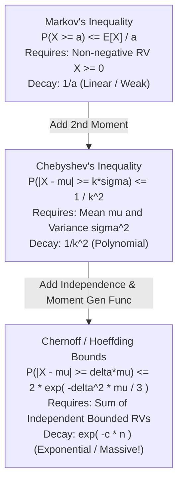

# Randomized Analysis: Concentration Bounds, Las Vegas & Monte Carlo

## 1. Executive Summary & The Power of Randomness

Randomized algorithms employ internal coin flips to make execution decisions. Randomness is used not out of ignorance, but as a deliberate **computational resource**:
- It breaks input symmetries that adversaries could exploit.
- It guarantees that worst-case performance is governed by random coin flips rather than malicious input arrangements.
- It delivers algorithms that are orders of magnitude simpler and faster than deterministic equivalents (e.g. Miller-Rabin primality, Karger's min-cut, Treaps, Skip lists).

In rigorous randomized complexity analysis, computing the **Expected Running Time** $\mathbb{E}[T(n)]$ is only the first step. Systems require **High-Probability Bounds**: proving that an algorithm terminates within $O(f(n))$ with probability at least:
$$1 - \frac{1}{n^c} \quad \text{for any constant } c \ge 1$$
This is proven using **Concentration Inequalities** (Markov, Chebyshev, and Chernoff bounds).

---

## 2. Las Vegas vs. Monte Carlo Algorithms

Randomized algorithms fall into two fundamentally distinct classes:

```
+---------------------------------------------------------------------------------+
| Dimension                  | Las Vegas Algorithms       | Monte Carlo Algorithms|
|----------------------------+----------------------------+-----------------------|
| Correctness Guarantee      | 100% Deterministic (Always)| Probabilistic (1 - eps)|
| Running Time               | Random Variable (E[T] low) | Deterministic / Bounded|
| Typical Failure Mode       | Runs slow on rare coins    | May output wrong answer|
| Canonical Archetypes       | Randomized Quicksort       | Miller-Rabin Primality |
|                            | Treap, Skip List, Quicksel | Bloom Filter, Karger  |
| Amplification Strategy     | N/A (Always correct)       | Independent repetitions|
+---------------------------------------------------------------------------------+
```

### 2.1 The Cross-Conversion Duality
1. **Las Vegas $\longrightarrow$ Monte Carlo (Markov Cutoff)**:
   Run the Las Vegas algorithm for $t = 2 \cdot \mathbb{E}[T]$ steps. If it has not finished, abort and output "FAIL". By Markov's Inequality, the failure probability is at most $\mathbb{P}(T \ge 2\mathbb{E}[T]) \le 1/2$.
2. **Monte Carlo $\longrightarrow$ Las Vegas (Verification Loop)**:
   If the solution can be verified deterministically in polynomial time (e.g. factoring verification), run the Monte Carlo algorithm and test the result. If incorrect, repeat! The expected number of repetitions is $1 / (1 - \epsilon) = O(1)$.

---

## 3. Concentration Inequalities & The Tail Hierarchy



### 3.1 Chernoff Bounds (Multiplicative Form)
Let $X_1, X_2, \dots, X_n$ be independent Bernoulli random variables such that $\mathbb{P}(X_i = 1) = p_i$.
Let $X = \sum_{i=1}^n X_i$ and $\mu = \mathbb{E}[X] = \sum p_i$.

> [!IMPORTANT]
> **The Multiplicative Chernoff Bound (1952)**:
> 1. **Upper Tail (for any $\delta > 0$)**:
>    $$\mathbb{P}(X \ge (1 + \delta)\mu) \le \left( \frac{e^\delta}{(1 + \delta)^{1 + \delta}} \right)^\mu \le \exp\left( -\frac{\delta^2 \mu}{2 + \delta} \right)$$
>    For $0 < \delta \le 1$:
>    $$\mathbb{P}(X \ge (1 + \delta)\mu) \le \exp\left( -\frac{\delta^2 \mu}{3} \right)$$
> 2. **Lower Tail (for any $0 < \delta < 1$)**:
>    $$\mathbb{P}(X \le (1 - \delta)\mu) \le \exp\left( -\frac{\delta^2 \mu}{2} \right)$$

---

## 4. Canonical Case Studies & Proofs

### 4.1 Quicksort Runs in $O(n \log n)$ With High Probability
We know $\mathbb{E}[T(n)] = 2n \ln n$. Can Quicksort degrade to $O(n^2)$ on bad coin flips?

**Proof via Chernoff Bounds**:
1. Call a partition split **"good"** if both subproblems receive at least $1/4$ and at most $3/4$ of the elements.
2. A random pivot lands in the central half $[n/4, 3n/4]$ with probability $p = 1/2$.
3. After at most $\log_{4/3} n \approx 2.4 \log_2 n$ good splits, an element is reduced to a subproblem of size 1.
4. Consider an execution path of length $M = 32 \ln n$. Let $X$ be the number of good splits along this path.
   - $\mathbb{E}[X] = M / 2 = 16 \ln n$.
5. For the path not to terminate, we must have $X < 2.4 \log_2 n \approx 3.5 \ln n$ (less than half of expectation, so $\delta \ge 0.75$).
6. Applying the lower Chernoff bound:
   $$\mathbb{P}(X \le 3.5 \ln n) \le \exp\left( -\frac{(0.75)^2 \cdot 16 \ln n}{2} \right) \le \exp(-4.5 \ln n) = n^{-4.5}$$
7. By the Union Bound across all $n$ elements, the probability that *any* path exceeds $32 \ln n$ is at most:
   $$n \cdot n^{-4.5} = n^{-3.5}$$
Quicksort runs in $O(n \log n)$ with probability at least $1 - n^{-3.5}$ (High Probability)!

---

### 4.2 Karger's Min-Cut Probability Amplification
- **The Contraction Algorithm**: Pick a random edge uniformly at random and contract its two endpoints into a single supernode. Repeat until only 2 supernodes remain.
- **Single-Run Success Probability**:
  Let $C$ be a minimum cut of size $k$.
  Every node has degree $\ge k \implies 2|E| \ge n k \implies |E| \ge n k / 2$.
  The probability of contracting an edge in $C$ in step 1 is:
  $$\mathbb{P}(\text{Cut edge chosen}) = \frac{k}{|E|} \le \frac{k}{n k / 2} = \frac{2}{n}$$
  The probability that $C$ survives all $n-2$ contractions is:
  $$\mathbb{P}(\text{Success}) \ge \prod_{i=0}^{n-3} \left( 1 - \frac{2}{n - i} \right) = \frac{n-2}{n} \cdot \frac{n-3}{n-1} \cdots \frac{2}{4} \cdot \frac{1}{3} = \frac{2}{n(n - 1)} = \binom{n}{2}^{-1} = \Theta\left(\frac{1}{n^2}\right)$$

**Amplification to High Probability**:
Run the algorithm independently $T = \binom{n}{2} \ln(n^c) = \frac{n(n-1)}{2} c \ln n$ times.
The probability that *all* runs fail is:
$$\mathbb{P}(\text{All Fail}) \le \left( 1 - \frac{2}{n(n-1)} \right)^T \le e^{-\frac{2}{n(n-1)} \cdot \frac{n(n-1)}{2} c \ln n} = e^{-c \ln n} = \frac{1}{n^c}$$
By repeating $O(n^2 \log n)$ times, Karger's algorithm finds the global minimum cut with probability $\ge 1 - 1/n^c$!

---

### 4.3 Freivalds' Matrix Verification Algorithm
- **Problem**: Given $n \times n$ matrices $A, B, C$, verify whether $A \cdot B = C$.
- **Direct Multiplication**: Takes $O(n^3)$ or $O(n^{2.37})$ (Strassen / Coppersmith-Winograd).
- **Freivalds' Trick (1977)**:
  1. Generate random column vector $\vec{r} \in \{0, 1\}^n$ where each $r_i \sim \text{Bernoulli}(1/2)$.
  2. Compute $\vec{x} = A(B \vec{r}) - C \vec{r}$ using three matrix-vector products in $O(n^2)$ time!
  3. If $\vec{x} = \vec{0}$, output YES; otherwise NO.

**Error Analysis**:
If $A B = C$, $\vec{x}$ is always $\vec{0}$ (zero false negatives).
If $A B \ne C$, let $D = A B - C \ne 0$. There exists some non-zero row $\vec{d}_k \ne \vec{0}$.
The product $\vec{d}_k \cdot \vec{r} = \sum d_{ki} r_i = 0$ if and only if:
$$r_j = -d_{kj}^{-1} \sum_{i \ne j} d_{ki} r_i$$
Because $r_j$ is chosen independently with $P=1/2$, this occurs with probability at most $1/2$:
$$\mathbb{P}(\text{Error}) \le \frac{1}{2}$$
Repeating with $k$ independent random vectors reduces the error probability to $\le 2^{-k}$. For $k=100$, error probability is $2^{-100} \approx 10^{-30}$—far lower than the probability of a cosmic ray flipping a CPU bit!

---

## 5. The Probabilistic Method (Paul Erdős)

The **Probabilistic Method** is a non-constructive proof technique:
> To prove that an object with a desired mathematical property $\mathcal{P}$ exists, construct an appropriate probability space and prove that:
> $$\mathbb{P}(\mathcal{P}) > 0$$
> If the probability is strictly positive, an object with property $\mathcal{P}$ must exist!

### Example: Large Bipartite Subgraphs
*Theorem*: Every graph $G = (V, E)$ contains a bipartite subgraph with at least $|E| / 2$ edges.

*Proof via the Probabilistic Method*:
1. Partition vertices $V$ into two sets $L$ and $R$ by flipping an independent fair coin for each vertex ($P(v \in L) = 1/2$).
2. For each edge $e = (u, v) \in E$, let indicator $X_e = 1$ if $u$ and $v$ land in different sets, and $0$ otherwise.
3. $\mathbb{P}(X_e = 1) = \mathbb{P}(u \in L, v \in R) + \mathbb{P}(u \in R, v \in L) = 1/4 + 1/4 = 1/2$.
4. By Linearity of Expectation:
   $$\mathbb{E}[\text{Cross-edges}] = \sum_{e \in E} \mathbb{E}[X_e] = \sum_{e \in E} \frac{1}{2} = \frac{|E|}{2}$$
5. Since the average number of cross-edges is $|E| / 2$, there must exist at least one partition with $\ge |E| / 2$ cross-edges!

---

## 6. Exercises & Analytical Problems

1. **Deriving the Two-Sided Chernoff Bound**:
   Using the moment generating function $M_X(t) = \mathbb{E}[e^{tX}]$ and Markov's inequality, prove that $\mathbb{P}(X \ge (1+\delta)\mu) \le e^{-\mu \delta^2 / 3}$ for $0 < \delta \le 1$.
2. **Amplifying Miller-Rabin**:
   The Miller-Rabin randomized primality test has error probability at most $1/4$ on composite inputs. Prove that running 40 iterations reduces the error to $\le 2^{-80}$.
3. **Randomized Selection High-Probability Bound**:
   Using Chernoff bounds, prove that Randomized Quickselect finds the median of $n$ elements in $O(n)$ time with probability at least $1 - n^{-2}$.
