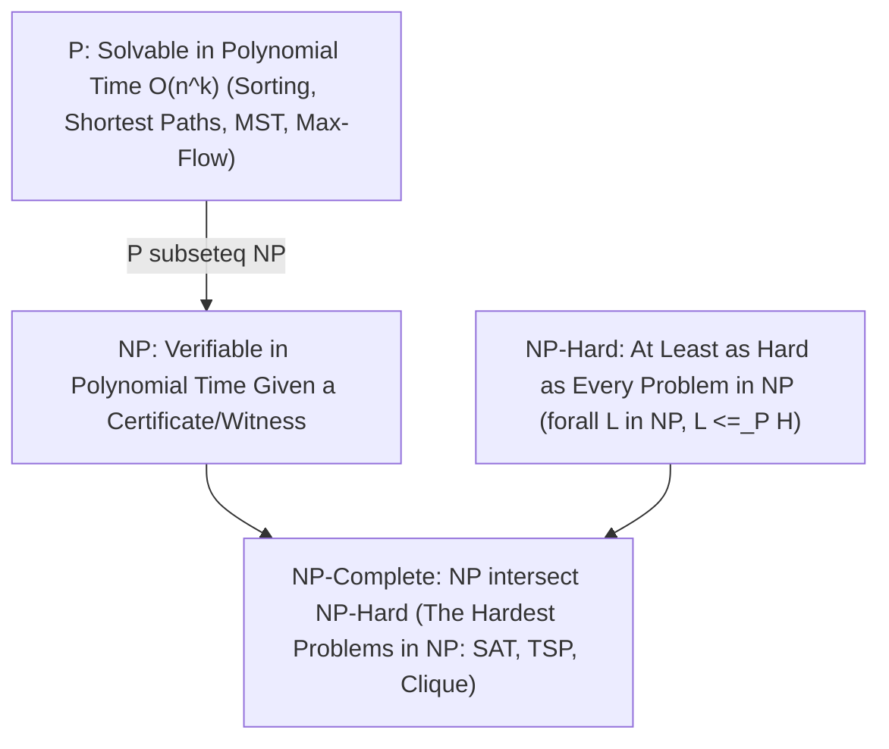

# Reductions and Hardness Intuition: P, NP, and Fine-Grained Complexity

## 1. Executive Summary & The Philosophy of Reductions

In computer science, a **Reduction** is the mathematical equivalent of solving a problem by translating it into another language. If you have a subroutine that solves problem $B$, and you can transform any instance of problem $A$ into an equivalent instance of $B$ in polynomial time, we write:
$$A \le_P B$$
which reads: *"Problem $A$ is polynomial-time reducible to Problem $B$."*

> [!IMPORTANT]
> **The Two Faces of a Reduction**:
> A reduction $A \le_P B$ establishes a relative difficulty constraint: **$B$ is at least as hard as $A$**.
> 1. **To Solve an Easy Problem $A$**: Reduce $A$ to an already solved problem $B$ (e.g. reduce Bipartite Matching to Max-Flow).
> 2. **To Prove Hardness of a New Problem $B$**: Reduce an already proven intractable problem $A$ to $B$ (e.g. reduce 3-SAT to Vertex Cover). If $B$ were easy, $A$ would be easy—a contradiction!

---

## 2. The Complexity Landscape: P, NP, NP-Hard & NP-Complete



### 2.1 The Formal Definitions
1. **Class P (Polynomial Time)**: Decision problems $L$ for which there exists a deterministic algorithm that outputs YES or NO in time $O(n^k)$.
2. **Class NP (Nondeterministic Polynomial Time)**: Decision problems for which a proposed YES-solution (a **certificate** or **witness**) can be verified in polynomial time by a deterministic verifier.
   - Example: For the Hamiltonian Cycle problem, finding a cycle is hard, but verifying that a given sequence of $n$ vertices forms a valid cycle takes $O(n)$ time.
3. **NP-Hard**: A problem $H$ is NP-hard if for every problem $L \in \text{NP}$, $L \le_P H$. (Does not need to be in NP; may even be undecidable like the Halting Problem).
4. **NP-Complete**: A problem $C$ is NP-complete if:
   $$C \in \text{NP} \quad \text{and} \quad C \text{ is NP-Hard}$$
   If *any single* NP-complete problem can be solved in polynomial time, then **$\text{P} = \text{NP}$**!

---

## 3. The Genesis: Cook-Levin Theorem & Karp's 21 Problems

### 3.1 The Cook-Levin Theorem (1971)
How did computer scientists find the very first NP-complete problem without having an existing NP-complete problem to reduce from?

Stephen Cook and Leonid Levin proved that the **Boolean Satisfiability Problem (SAT)** is NP-complete by directly encoding the execution of an **arbitrary non-deterministic Turing machine** into a boolean CNF formula!
- Boolean variables represent: *Is head at cell $i$? Is tape cell $j$ symbol $s$? Is state $q$? at step $t$*.
- The formula $\Phi$ is satisfiable if and only if the Turing machine reaches an accept state within polynomial steps $p(n)$.

### 3.2 Karp's Reduction Tree (1972)
Once SAT was proven NP-complete, Richard Karp showed that a vast universe of practical combinatorial problems are all NP-complete via a chain of polynomial-time reductions:

```
                          [ Cook-Levin: SAT ]
                                   |
                                   v
                                [ 3-SAT ]
                               /         \
                              /           \
                 [ Independent Set ]    [ 3-Dimensional Matching ]
                         |                         |
                         v                         v
                  [ Vertex Cover ]           [ Exact Cover ]
                    /          \                   |
                   /            \                  v
            [ Clique ]    [ Feedback Node ]   [ Subset Sum ]
                 |                                 |
                 v                                 v
        [ Hamiltonian Cycle ]                 [ Knapsack ]
                 |
                 v
              [ TSP ]
```

---

## 4. Canonical Step-by-Step Reduction Walkthroughs

### 4.1 3-SAT $\le_P$ Independent Set
- **Input**: A 3-CNF formula with $m$ clauses: $\Phi = C_1 \land C_2 \land \dots \land C_m$, where each clause $C_i = (l_{i,1} \lor l_{i,2} \lor l_{i,3})$.
- **Target**: A graph $G = (V, E)$ and integer $k$ such that $G$ has an independent set of size $k$ iff $\Phi$ is satisfiable.

**The Gadget Construction**:
1. For each clause $C_i$, create a **triangle of 3 vertices** representing its literals: $v_{i,1}, v_{i,2}, v_{i,3}$.
   - Total vertices $|V| = 3m$.
   - Triangle edges: Connect $(v_{i,1}, v_{i,2})$, $(v_{i,2}, v_{i,3})$, $(v_{i,3}, v_{i,1})$.
   - *Invariant*: In any independent set, at most 1 vertex can be picked from each triangle!
2. Add **conflict edges**: Connect any pair of vertices that represent contradictory literals (e.g. edge between $x_1$ and $\neg x_1$).
3. Set $k = m$ (the number of clauses).

```
Clause 1: (x1 OR NOT x2 OR x3)          Clause 2: (NOT x1 OR x2 OR x4)
       (x1)                                  (~x1)
      /    \                                /    \
     /      \       Conflict Edge          /      \
  (~x2)----(x3) <=====================> (x2)----(x4)
                    (~x2 conflicts with x2)
```

**Proof of Equivalence**:
- $(\implies)$ If $\Phi$ is satisfiable, each clause has at least one TRUE literal. Pick one TRUE literal vertex from each clause triangle. Because the assignment is consistent, no two picked vertices are complementary, so no conflict edges are touched. We have an independent set of size $m$.
- $(\impliedby)$ If $G$ has an independent set of size $m$, it must contain exactly one vertex from each of the $m$ triangles. Assigning those literals to TRUE creates a valid, contradiction-free truth assignment satisfying all clauses.
- Reduction time: $O(m^2)$ (polynomial). Thus, **Independent Set is NP-Complete**!

### 4.2 Independent Set $\le_P$ Vertex Cover
- **Target**: A subset of vertices $S \subseteq V$ such that every edge in $E$ has at least one endpoint in $S$.

> [!TIP]
> **The Complement Duality Lemma**:
> In any graph $G = (V, E)$, a subset $I \subseteq V$ is an **Independent Set** if and only if its complement $V \setminus I$ is a **Vertex Cover**.

*Proof*:
$I$ is independent $\iff$ no edge has both endpoints in $I$  
$\iff$ every edge has at least one endpoint outside $I$  
$\iff$ every edge has at least one endpoint in $V \setminus I$  
$\iff V \setminus I$ is a vertex cover!

Therefore:
$$G \text{ has an independent set of size } k \iff G \text{ has a vertex cover of size } |V| - k$$
This reduction takes $O(1)$ additional work! Thus, **Vertex Cover is NP-Complete**.

---

## 5. The Modern Frontier: Fine-Grained Complexity

Traditional NP-completeness separates polynomial time from exponential time. But what about problems *inside* P that take $O(n^2)$ or $O(n^3)$—can they be solved in $O(n)$?

In the 2010s, Virginia Vassilevska Williams, Ryan Williams, and others established **Fine-Grained Complexity**, basing polynomial lower bounds on three core conjectures:

```
+---------------------------------------------------------------------------------+
| Foundational Hypothesis                | Induced Fine-Grained Lower Bounds      |
|----------------------------------------+----------------------------------------|
| Strong Exponential Time Hypothesis     | Edit Distance requires n^(2 - o(1))    |
| (SETH): k-SAT requires 2^n time        | Fréchet Distance requires n^(2 - o(1)) |
|                                        | Regular Expression matching quadratic  |
|----------------------------------------+----------------------------------------|
| 3-SUM Conjecture:                      | Collinear Points requires n^(2 - o(1)) |
| No O(n^(2 - eps)) algorithm for 3-SUM  | Geom. Segment Intersections quadratic  |
|                                        | Triangle counting sub-cubic            |
|----------------------------------------+----------------------------------------|
| All-Pairs Shortest Paths (APSP):       | Graph Radius & Diameter require n^3    |
| No O(n^(3 - eps)) algorithm for APSP   | Metric Betweenness Centrality cubic    |
+---------------------------------------------------------------------------------+
```

---

## 6. How to Cope with NP-Hardness in Production

When faced with an NP-hard problem in industry, do not give up! Engineers adopt four pragmatic strategies:

```
1. Approximation Algorithms: Guarantee a solution within factor alpha of optimal.
   (e.g. Greedy 2-approximation for Vertex Cover; Christofides 1.5-approx for Metric TSP).

2. Fixed-Parameter Tractability (FPT): Solve in O(f(k) * n^c) where k is a small parameter.
   (e.g. Vertex Cover solvable in O(2^k * n) time for small k).

3. Pseudo-Polynomial Time / DP: Solve in O(n * W) when numbers W are bounded.
   (e.g. Knapsack 0-1 dynamic programming).

4. SAT / ILP Solvers: Formulate into Z3, Gurobi, or MiniSAT; modern solvers exploit
   clause learning (CDCL) to solve industrial instances with millions of variables!
```

---

## 7. Exercises & Reduction Challenges

1. **Vertex Cover to Set Cover**:
   Show that Vertex Cover is a special case of Set Cover where the universe is the set of edges $E$, and each vertex corresponds to a set containing its incident edges.
2. **Subset Sum to Partition**:
   Reduce the general Subset Sum problem to the Partition problem (partitioning an array into two subsets of equal sum).
3. **SETH and Orthogonal Vectors**:
   Trace Williams' reduction showing that if Orthogonal Vectors (finding two vectors with dot product 0) can be solved in $O(n^{2-\epsilon})$ time, then SETH is refuted.
