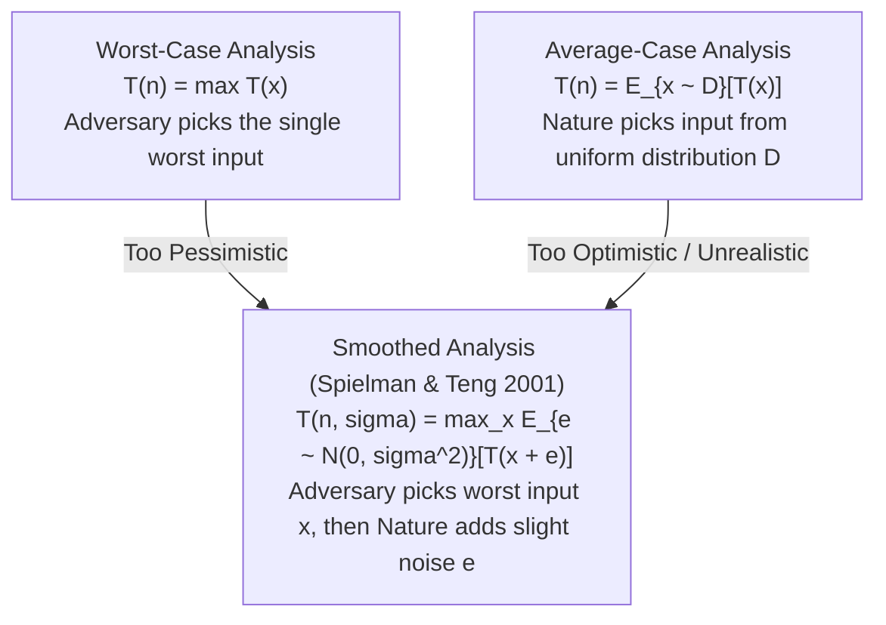

# Worst, Average, and Smoothed Analysis: Beyond Pessimism

## 1. Executive Summary & The Analysis Trilemma

For decades, theoretical computer science evaluated algorithms almost exclusively through **Worst-Case Complexity**:
$$T_{\text{worst}}(n) = \max_{x \in \Sigma^n} T(x)$$
While worst-case analysis provides an unconditional safety guarantee, it is frequently **too pessimistic**:
- The **Simplex Algorithm** for linear programming is theoretically exponential ($O(2^n)$ on artificial Klee-Minty cubes), yet in practice it solves industrial problems with millions of variables in linear time.
- The **$k$-Means Clustering** heuristic can take $2^{\Omega(n)}$ iterations in the worst case, yet terminates in dozens of iterations on physical datasets.
- Modern **SAT Solvers** (CDCL) solve NP-complete instances with millions of boolean clauses daily, despite worst-case exponential runtime.

Conversely, classical **Average-Case Analysis** ($\mathbb{E}[T(n)] = \sum P(x) T(x)$) suffers from the opposite flaw: it requires assuming an input distribution (usually uniform), which rarely reflects the structured, correlated inputs of the real world.

In 2001, Daniel Spielman and Shang-Hua Teng resolved this crisis by inventing **Smoothed Analysis** (awarded the Gödel Prize in 2008), providing a rigorous mathematical framework that explains why algorithms with bad worst-case behavior perform magnificently in practice.

---

## 2. Mathematical Formulations & Models



### 2.1 Worst-Case Analysis
An adversary chooses the single worst possible input of size $n$:
$$T_{\text{worst}}(n) = \sup_{x \in \Omega_n} T(x)$$
- *Pros*: Completely distribution-free; guarantees that the algorithm will never exceed this bound.
- *Cons*: Highly sensitive to isolated pathological "spikes" that never occur in practice.

### 2.2 Average-Case Analysis
Inputs are drawn from a probability distribution $\mathcal{D}$:
$$T_{\text{avg}}(n) = \mathbb{E}_{x \sim \mathcal{D}}[T(x)] = \sum_{x \in \Omega_n} \mathbb{P}(x) T(x)$$
- *Pros*: Measures representative behavior over a distribution.
- *Cons*: If $\mathcal{D}$ is uniform, real-world structured inputs (which have low entropy) are excluded.

### 2.3 Smoothed Analysis
An adversary chooses the worst-case input $x \in \Omega_n$, but the input is then subjected to a small random perturbation $\epsilon$ drawn from a Gaussian or uniform distribution with magnitude $\sigma$:
$$T_{\text{smoothed}}(n, \sigma) = \max_{x \in \Omega_n} \mathbb{E}_{\epsilon \sim \mathcal{N}(0, \sigma^2 I)} [T(x + \epsilon)]$$

```
Running Time T
  ^
  |        Pathological Worst-Case Spike T(x) = 2^n
  |                  |
  |                 / \
  |                /   \
  |               /     \
  |              /       \
  |  -----------+         +----------------------------  Polynomial Baseline
  +-------------+---------+----------------------------> Input Space
                <-- 2*sigma -->
        Perturbation knocks input off the measure-zero spike!
```

- When $\sigma \to 0$: Smoothed analysis converges to **Worst-Case analysis**.
- When $\sigma \to \infty$: Smoothed analysis converges to **Average-Case analysis**.
- For intermediate $\sigma > 0$: An algorithm has **polynomial smoothed complexity** if $T(n, \sigma) = \text{poly}(n, 1/\sigma)$.

---

## 3. Landmark Case Studies in Smoothed Analysis

### 3.1 The Simplex Algorithm for Linear Programming
- **Problem**: Maximize $\vec{c}^T \vec{x}$ subject to $A \vec{x} \le \vec{b}$.
- **Worst-Case**: In 1972, Klee and Minty constructed a distorted hypercube where Dantzig's pivot rule visits all $2^n$ vertices. Worst-case is $O(2^n)$.
- **Smoothed Analysis Result (Spielman & Teng 2004)**:
  Let $A \in \mathbb{R}^{m \times n}$ and $\vec{b} \in \mathbb{R}^m$ be perturbed by Gaussian noise with variance $\sigma^2$:
  $$\mathbb{E}[\text{Number of Simplex Steps}] = \text{poly}\left(m, n, \frac{1}{\sigma}\right)$$
  The Klee-Minty cube requires razor-sharp, exponentially close geometric facets. Any physical perturbation $\sigma > 0$ rounds off the pathological vertices, reducing the shadow boundary to polynomial length!

### 3.2 The Lloyd / $k$-Means Clustering Heuristic
- **Problem**: Partition $n$ points in $\mathbb{R}^d$ into $k$ clusters minimizing sum-of-squared distances.
- **Worst-Case**: Vattani (2011) showed that $k$-means can require $2^{\Omega(n)}$ iterations to converge.
- **Smoothed Analysis Result (Arthur & Vassilvitskii 2009)**:
  Adding small noise to point coordinates bounds the expected number of iterations to:
  $$\mathbb{E}[\text{Iterations}] = O\left( n^{kd} \cdot \sigma^{-2} \right) \quad \text{and sub-polynomial for small } k$$
  Confirming that the exponential bad instances are fragile geometric coincidences.

---

## 4. Comparative Complexity Matrix across Analysis Frameworks

| Algorithm / Problem | Worst-Case Complexity | Average-Case (Uniform) | Smoothed Complexity ($1/\sigma$) | Real-World Observed Runtime |
| :--- | :--- | :--- | :--- | :--- |
| **Deterministic Quicksort** | $\Theta(n^2)$ | $\Theta(n \log n)$ | $\Theta(n \log n)$ | $O(n \log n)$ |
| **Simplex Algorithm (LP)** | $O(2^n)$ (Klee-Minty) | $O(m^2)$ | $\text{poly}(m, n, 1/\sigma)$ | $O(m \cdot n)$ |
| **$k$-Means Clustering** | $2^{\Omega(n)}$ | $O(n)$ | $\text{poly}(n, k, 1/\sigma)$ | $10 - 100$ iterations |
| **Knapsack Problem** | $O(n W)$ (pseudo-poly) | $O(n)$ | $O(n^3 / \sigma)$ | Extremely fast via DP |
| **Interior Point Methods** | $O(n^{3.5} L)$ (polynomial) | $O(n^3)$ | $O(n^3)$ | $O(n^3)$ |
| **SAT (CDCL Solvers)** | $O(2^n)$ | Trivial / Under-constrained | Active Research | Polynomial on industrial CAD |

---

## 5. Exercises & Analytical Problems

1. **Quicksort with Perturbation**:
   Suppose an array of $n$ elements sorted in reverse order (worst-case for naive Quicksort) is subjected to random swaps where each element moves by at most $\pm k$ positions. Analyze the resulting smoothed complexity.
2. **Klee-Minty Geometric Instability**:
   Explain geometrically why rotating the facets of the Klee-Minty cube by an angle $\theta \sim \mathcal{N}(0, \sigma^2)$ breaks the exponential path of the Simplex algorithm.
3. **Smoothed vs Parameterized Complexity**:
   Compare the philosophy of Smoothed Analysis with Parameterized Complexity (Fixed-Parameter Tractability $O(f(k) \cdot n^c)$). How does each framework rescue algorithms from worst-case hardness?
