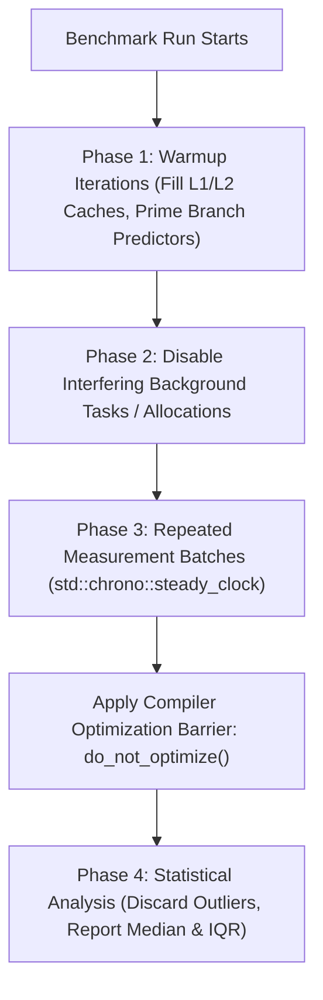
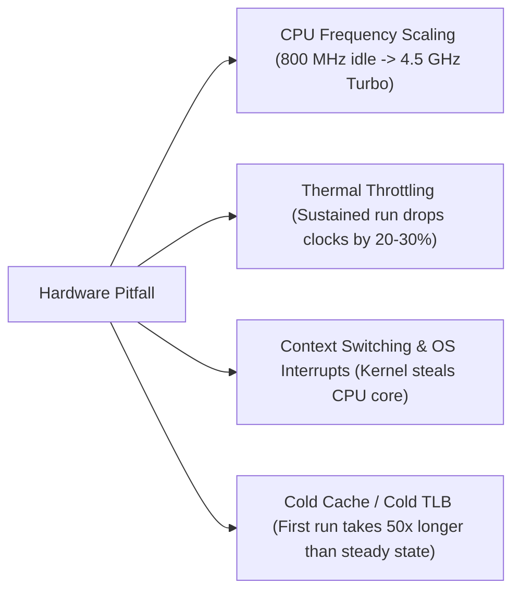

# Benchmarking Pitfalls and Measurement Science

> [!NOTE]
> **The Illusion of Microbenchmarks:**
> Writing a microbenchmark is deceptively simple: record start time, run the algorithm in a loop, record end time, and divide by the loop count.
> In reality, modern optimizing compilers and superscalar processors conspire to make naive microbenchmarks **completely invalid**:
> 1. Compilers aggressively eliminate computations whose results are unused (**Dead Code Elimination**).
> 2. Compilers pre-calculate loops with constant inputs at compile time (**Constant Folding**).
> 3. CPU Turbo Boost, dynamic frequency scaling, and thermal throttling introduce up to **$40\%$ variance** between runs.

> [!TIP]
> **The Compiler Optimization Barrier (`DoNotOptimize`):**
> To prevent an optimizing compiler (`-O3`) from deleting your benchmarked loop or folding it into a constant, force the compiler to treat the value as an unknown memory input/output using an inline assembly barrier:
> ```cpp
> template <typename T>
> inline void do_not_optimize(T const& val) {
>     asm volatile("" : : "g"(val) : "memory");
> }
> ```

> [!WARNING]
> **Never Use Wall-Clock Time for High-Resolution Microbenchmarks:**
> In C++, `std::chrono::system_clock` measures wall-clock time and is subject to operating system NTP time-synchronization jumps (it can step backwards!).
> Always use `std::chrono::steady_clock` (which maps to monotonic hardware counters like x86 `RDTSC`).



---

## 1. The Deadly Compiler Traps

### 1.1 Dead Code Elimination (DCE)
```cpp
// Flawed benchmark:
auto start = std::chrono::steady_clock::now();
for (int i = 0; i < 1'000'000; ++i) {
    fibonacci(30); // Return value is never read!
}
auto end = std::chrono::steady_clock::now();
```
* **What happens under `-O3`:** The compiler proves that `fibonacci()` is a pure function with no side effects and its return value is discarded. The entire loop is deleted from the binary.
* **Reported time:** $0.000\text{ ns}$.

### 1.2 Constant Folding & Propagation
```cpp
// Flawed benchmark:
const int N = 1000;
int sum = 0;
for (int i = 0; i < N; ++i) sum += i;
```
* **What happens under `-O3`:** The compiler recognizes the loop as an arithmetic progression $\frac{N(N-1)}{2}$, replaces the loop with `mov eax, 499500`, and runs in $0.3\text{ ns}$.

---

## 2. Hardware and Environment Traps



### 2.1 Warmup Phases
A microbenchmark must run several thousand iterations *before* recording timestamps:
* **Instruction Cache ($I$-Cache):** Code bytes must be loaded into L1-I.
* **Data Cache ($D$-Cache):** Working datasets must reach steady-state cache levels.
* **Branch Predictor:** Branch History Tables (BHT) and Direction Predictors need training.

### 2.2 Reporting Statistics: Why Means Lie
Never report a simple arithmetic average without percentiles. An operating system interrupt or garbage collection cycle will create extreme positive outliers.
* **Preferred metric:** **Median** and **Interquartile Range (IQR)** or Minimum execution time across batches (since environmental noise can only *add* delay, never subtract execution time).

---

## 3. The Anatomy of a Robust Benchmark Harness

```cpp
template <typename Func>
double benchmark_operation(Func&& func, size_t warmup_iters, size_t measure_iters) {
    // 1. Warmup
    for (size_t i = 0; i < warmup_iters; ++i) {
        func();
    }

    // 2. Timed Execution
    auto t0 = std::chrono::steady_clock::now();
    for (size_t i = 0; i < measure_iters; ++i) {
        func();
    }
    auto t1 = std::chrono::steady_clock::now();

    std::chrono::duration<double, std::nano> elapsed = t1 - t0;
    return elapsed.count() / measure_iters; // Nanoseconds per operation
}
```

---

## 4. Benchmark Pitfalls Checklist

| Risk Area | Common Flaw | Correct Mitigation |
| :--- | :--- | :--- |
| **Compiler** | DCE removes empty or unused loops. | Use `asm volatile` barrier / `DoNotOptimize()`. |
| **Compiler** | Inputs are constant, loop is folded. | Generate inputs dynamically or pass via volatile pointers. |
| **Clock Source** | Using `time(NULL)` or `system_clock`. | Strictly use `steady_clock`. |
| **Hardware** | CPU Turbo clocks fluctuate dynamically. | Pin CPU frequency or pin thread to core (`pthread_setaffinity`). |
| **Memory** | Reusing dirty memory hides page faults. | Pre-fault all memory pages prior to timed loop. |
| **Statistics** | Reporting mean skewed by OS context switch. | Report Median, Min, and 99th percentile. |

---

## 5. Curated References

1. **Google Benchmark Library:** *User Guide & Assembly Inspection Principles*.
2. **Andrei Alexandrescu:** *Writing Fast Code I & II* (Keynote on microbenchmark verification).
3. **Emery Berger et al. (2009):** *Stabilizer: Statistically Rigorous Performance Evaluation*. ASPLOS.
4. **LLVM Documentation:** *Benchmarking Tips and Compiler Intrinsics*.
