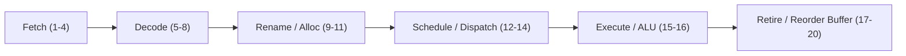
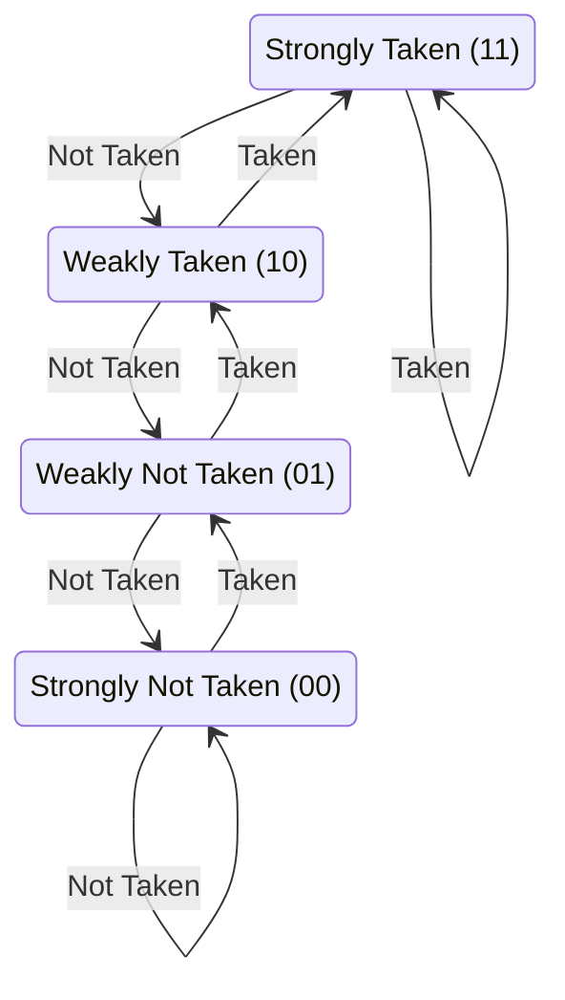

# Branch Prediction and CPU Pipelines

> [!NOTE]
> **The Speculative Execution Paradigm:**
> Modern superscalar processors achieve high throughput by overlapping the execution of dozens of instructions in deep **instruction pipelines** (typically 14 to 20 stages deep in modern x86_64 and ARM cores).
> When encountering a conditional jump (`if`, `switch`, loop guard), the CPU cannot wait for the condition register to resolve without stalling the pipeline for 15–20 cycles.
> Instead, the CPU's hardware **branch predictor** speculates on the branch direction and speculatively executes instructions down the predicted path.

> [!TIP]
> **Branchless Coding via Conditional Select (`cmov` / `csel`):**
> When a branch is unpredictable (e.g., 50/50 randomized data), eliminating the branch using bitwise masking or conditional moves (`cmov` in x86, `csel` in ARM) avoids the 15–20 cycle misprediction penalty:
> ```cpp
> // Branchy (Penalized if unpredictable):
> if (arr[i] >= 128) sum += arr[i];
>
> // Branchless Arithmetic (Compiler emits cmov or lea):
> sum += arr[i] * (arr[i] >= 128);
> ```

> [!WARNING]
> **Branchless is NOT Always Faster:**
> Do not blindly replace all branches with branchless arithmetic.
> Modern branch predictors (e.g., TAGE) achieve **>98% accuracy on biased branches** (e.g., bounds checks, error handlers, loops).
> A correctly predicted branch executes in **0 to 1 CPU cycle**, whereas branchless equivalents unconditionally execute extra arithmetic, bitwise operations, and register dependencies that prevent vectorization.

```mermaid
flowchart TD
    Branch["Conditional Branch Instruction"] --> Predict{"Branch Predictor Guess"}
    Predict -->|Predict Taken| SpecT["Speculatively Fetch & Execute Taken Path"]
    Predict -->|Predict Not Taken| SpecNT["Speculatively Fetch & Execute Fallthrough Path"]
    SpecT & SpecNT --> Resolve{"Branch Condition Resolves in ALU"}
    Resolve -->|Prediction Correct| Commit["Retire Speculative Instructions (0-1 Cycle Cost)"]
    Resolve -->|Prediction Incorrect (MISPREDICT!)| Flush["PIPELINE FLUSH: Discard Speculative Work (15-20 Cycle Penalty)"]
```

---

## 1. The Anatomy of Modern Instruction Pipelines

In the classical RISC pipeline (Fetch $\to$ Decode $\to$ Execute $\to$ Memory $\to$ Writeback), a branch condition resolved in stage 3 caused a 2-cycle stall.
Modern processors decompose execution into 14–20 micro-operations ($\mu$ops):



If a branch at stage 5 is mispredicted, all instructions currently in stages 1 through 16 must be discarded (a **pipeline flush**), wasting up to 20 clock cycles.

---

## 2. Hardware Branch Prediction Mechanisms

### 2.1 The 2-Bit Saturating Counter (Bimodal Predictor)
Maintains a state machine with 4 states for each branch address:



**Key Advantage:** A single anomalous loop exit does not derail the predictor; it requires two consecutive mistakes to transition between Taken and Not Taken predictions.

### 2.2 Modern Predictors (TAGE & Perceptron)
Modern hardware (AMD Zen, Intel Golden Cove, Apple M-series) uses **TAGE (TAgged GEometric history length)** predictors and neural perceptrons:
- Tracks global branch history across the last 100+ branches.
- Detects complex periodic patterns (e.g., alternating `true, false, true, false` or nested loop correlations).

---

## 3. The Canonical Experiment: Sorted vs Unsorted Array

Consider filtering an array of random integers in $[0, 255]$:

```cpp
int sum = 0;
for (int i = 0; i < n; ++i) {
    if (data[i] >= 128) {
        sum += data[i];
    }
}
```

- **When `data` is sorted:**
  The sequence of branch decisions is:
  $$\underbrace{\text{False, False, \dots, False}}_{\text{all values } < 128}, \underbrace{\text{True, True, \dots, True}}_{\text{all values } \ge 128}$$
  The branch predictor mispredicts exactly **once** at the transition point. Prediction accuracy $> 99.9\%$.
- **When `data` is unsorted (random noise):**
  The sequence is pure Bernoulli noise with $p = 0.5$.
  No pattern exists. The branch predictor mispredicts $\approx 50\%$ of the time.
  Execution is **3x to 6x slower** solely due to pipeline flushes.

---

## 4. Branchless Programming Patterns

### 4.1 Branchless Selection via Bitwise Masking
```cpp
// Branchy:
int select_branchy(bool cond, int a, int b) {
    return cond ? a : b;
}

// Branchless (Arithmetic negation generates 0x00000000 or 0xFFFFFFFF):
int select_branchless(bool cond, int a, int b) {
    int mask = -static_cast<int>(cond); // true -> -1 (all 1s), false -> 0 (all 0s)
    return (a & mask) | (b & ~mask);
}
```

### 4.2 Branchless Min, Max, and Clamping
```cpp
// Branchless min for signed 32-bit integers:
int min_branchless(int a, int b) {
    return b + ((a - b) & ((a - b) >> 31));
}

// Clamping value x between [low, high]:
int clamp_branchless(int x, int low, int high) {
    x = low + ((x - low) & ~((x - low) >> 31));
    x = high - ((high - x) & ~((high - x) >> 31));
    return x;
}
```

### 4.3 Branchless Binary Search
Standard binary search has unpredictable branches because the target comparison is 50/50 at every step.
Branchless binary search advances indices using arithmetic without jumping:

```cpp
int branchless_lower_bound(const int* arr, int n, int target) {
    const int* base = arr;
    while (n > 1) {
        int half = n / 2;
        base = (base[half] < target) ? base + half : base; // Compiles to CMOV
        n -= half;
    }
    return (*base < target) ? base - arr + 1 : base - arr;
}
```

---

## 5. Decision Matrix: Branchy vs Branchless

| Scenario | Recommended Pattern | Architectural Rationale |
| :--- | :--- | :--- |
| **Highly Biased Branch (>95% taken/not taken)** | **Branchy (`if`)** | Predictor achieves near 100% accuracy; zero ALU overhead. |
| **Random / Unpredictable 50/50 Data** | **Branchless (`cmov` / mask)** | Eliminates 15-20 cycle pipeline flush penalty. |
| **Critical Loop Inner Body** | **Branchless / SIMD** | Allows autovectorizer to generate AVX2/NEON instructions. |
| **Complex Multi-Condition Logic** | **Branchy** | Branchless arithmetic causes excessive register pressure. |
| **Cold Error Handling Paths** | **Branchy (`[[unlikely]]`)** | Keeps error handling code outside instruction cache hot paths. |

---

## 6. Common Pitfalls & Anti-Patterns

### Anti-Pattern 1: Premature De-branching of Predictable Loops
Replacing loop termination conditions with branchless counters. Loop branches are backward jumps with >99% prediction accuracy. Branchless loops inhibit hardware loop stream detectors (LSD).

### Anti-Pattern 2: Relying on Undefined Bitwise Shifts
Writing `(a - b) >> 31` assuming sign extension on right shifts. In C++, right-shifting a negative signed integer is formally implementation-defined (arithmetic shift on x86/ARM, but not strictly guaranteed by standard prior to C++20). In C++20, arithmetic right shift is guaranteed.

---

## 7. Curated References & Related Problems

1. **Agner Fog:** *Optimizing subroutines in assembly language: An analysis of pipeline stalls and branch prediction*.
2. **Intel 64 and IA-32 Architectures Optimization Reference Manual:** *Branch Prediction Strategies*.
3. **Stack Overflow Classic:** *Why is processing a sorted array faster than processing an unsorted array?* (Question ID: 11227809).
4. **LeetCode 136:** *Single Number* (Branchless bitwise XOR accumulation).
