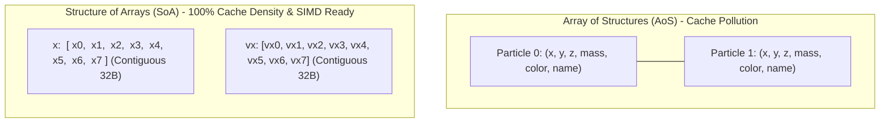
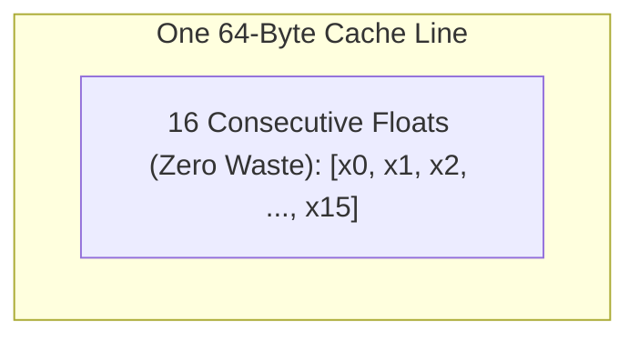

# Locality and Data-Oriented Design

> [!NOTE]
> **The Data-Oriented Philosophy:**
> Classical Object-Oriented Programming (OOP) groups data by conceptual identity:
> *An entity is a class containing its state and methods.*
> In contrast, **Data-Oriented Design (DOD)** organizes data according to how hardware consumes it:
> *Where there is one, there are many; transform streams of inputs into streams of outputs.*
> DOD prioritizes **memory access patterns, cache line packing, and elimination of pointer indirection** over inheritance hierarchies and encapsulation.

> [!TIP]
> **Array of Structures (AoS) vs Structure of Arrays (SoA):**
> * **AoS:** `[ {x, y, z, mass, color, name}, {x, y, z, mass, color, name}, ... ]`
>   Ideal when accessing *all fields of a single instance* together.
> * **SoA:** `{ x: [...], y: [...], z: [...], mass: [...], color: [...], name: [...] }`
>   Ideal when a computation transforms *one or two fields across all instances* (e.g. physics position update $x' = x + v_x \cdot dt$). SoA ensures $100\%$ cache-line bandwidth utilization and enables automated SIMD vectorization.

> [!WARNING]
> **The Cache Line Pollution Penalty:**
> In AoS, if an entity struct is $128\text{ bytes}$ (2 cache lines) and an inner loop only reads 8 bytes of position and velocity, **$93.75\%$ of the loaded DRAM bandwidth is pure waste**.
> The CPU memory controller spends $15\times$ more time transferring cold metadata than useful numerical payload.



---

## 1. Spatial vs Temporal Locality

### 1.1 Spatial Locality
If a program accesses memory address $A$, it is highly likely to access nearby addresses $A + 1, A + 2, \dots$ in the near future.
* Exploited by **64-byte Cache Lines** and hardware stream prefetchers.
* Standard contiguous arrays maximize spatial locality.

### 1.2 Temporal Locality
If a program accesses memory address $A$, it is highly likely to access the exact same address $A$ repeatedly in the near future.
* Exploited by **L1/L2 cache capacity** and register allocation.
* Loop tiling / cache blocking maximizes temporal locality (e.g., in matrix multiplication and stencil grids).

---

## 2. Array of Structures (AoS) vs Structure of Arrays (SoA)

Consider simulating $N = 1,000,000$ moving 3D entities:

### 2.1 The AoS Pattern (Object-Centric)
```cpp
struct EntityAoS {
    float x, y, z;        // 12 bytes
    float vx, vy, vz;     // 12 bytes
    uint32_t id;          // 4 bytes
    char name[36];        // 36 bytes (metadata)
}; // Total: 64 bytes (exactly 1 cache line per entity)

std::vector<EntityAoS> entities(N);

// Physics update:
for (size_t i = 0; i < N; ++i) {
    entities[i].x += entities[i].vx * dt;
    entities[i].y += entities[i].vy * dt;
    entities[i].z += entities[i].vz * dt;
}
```
* **Bandwidth consumed per entity:** 64 bytes.
* **Useful data accessed:** 24 bytes (`x, y, z, vx, vy, vz`).
* **Efficiency:** $24 / 64 = 37.5\%$. The remaining 40 bytes (`id`, `name`) are dragged into L1 cache for nothing.

### 2.2 The SoA Pattern (Data-Centric)
```cpp
struct EntitySoA {
    std::vector<float> x, y, z;
    std::vector<float> vx, vy, vz;
    std::vector<uint32_t> id;
    std::vector<std::string> name;
};

// Physics update:
for (size_t i = 0; i < N; ++i) {
    x[i] += vx[i] * dt;
    y[i] += vy[i] * dt;
    z[i] += vz[i] * dt;
}
```
* **Bandwidth consumed per coordinate:** Pure contiguous 32-bit floats.
* **Efficiency:** $100\%$. A single 64-byte cache line brings in 16 consecutive `float` values.
* **SIMD:** Compilers automatically vectorize this into 8-wide AVX2 `_mm256_fmadd_ps` instructions.



---

## 3. Hot / Cold Data Splitting

When an entity requires both high-frequency computational fields (hot) and low-frequency descriptive fields (cold), split them into separate parallel buffers:

```cpp
// Hot data (processed at 60-120 FPS):
struct ParticleHot {
    float x, y, z;
    float vx, vy, vz;
};

// Cold data (queried on mouse hover or death):
struct ParticleCold {
    uint64_t entity_uuid;
    char displayName[64];
    uint32_t ownerPlayerId;
};
```
By isolating hot components, the working set of the hot loop shrinks by $75\%$, allowing the entire simulation state of $10,000$ particles to fit directly inside the ultra-fast L2 cache ($512\text{ KB}$).

---

## 4. Struct Padding and Alignment

Compilers insert alignment "holes" to satisfy hardware address alignment restrictions (e.g., 64-bit pointers must reside on addresses divisible by 8):

```cpp
// Unoptimized struct (Padding waste):
struct PoorlyOrdered {
    char a;      // 1 byte + 7 bytes PADDING
    int64_t b;   // 8 bytes
    char c;      // 1 byte + 7 bytes PADDING
    int64_t d;   // 8 bytes
}; // sizeof = 32 bytes (18 bytes payload + 14 bytes padding = 43.7% waste!)

// Optimized struct (Sorted by alignment size descending):
struct WellOrdered {
    int64_t b;   // 8 bytes
    int64_t d;   // 8 bytes
    char a;      // 1 byte
    char c;      // 1 byte + 6 bytes PADDING
}; // sizeof = 24 bytes (25% reduction in memory footprint!)
```

---

## 5. Architectural Decision Matrix

| Metric | Array of Structures (AoS) | Structure of Arrays (SoA) | SoAoS (Hybrid / Tiled) |
| :--- | :--- | :--- | :--- |
| **Primary Advantage** | Clean encapsulation, easy entity CRUD. | Peak memory bandwidth, trivial SIMD vectorization. | Balances cache footprint with vectorized register packing. |
| **Cache Line Utilization** | Low if loop touches subset of fields. | High ($100\%$ for traversed streams). | Optimal for fixed-size SIMD chunk processing. |
| **Random Entity Access** | $O(1)$ single pointer dereference. | Incurs multiple loads across arrays. | Moderate. |
| **Best Used In** | General application logic, relational rows. | Physics, graphics, particle systems, columnar DBs. | Deep learning kernels, AVX-512 block computation. |

---

## 6. Common Pitfalls & Anti-Patterns

### Anti-Pattern 1: Dogmatic Full-SoA Everywhere
Transforming every single class in a codebase into parallel vectors. This destroys ergonomics when adding or removing individual objects (requiring synchronized insertions across 15 separate vectors). Apply SoA only to high-throughput data pipelines.

### Anti-Pattern 2: Struct Packing Without Measuring Alignment Penalties
Using `#pragma pack(1)` to force zero-byte padding. While this minimizes RAM usage, accessing an unaligned 64-bit integer across a cache line boundary can trigger **split-lock stalls or hardware penalties of 10–20 cycles per load**.

---

## 7. Curated References

1. **Mike Acton:** *Data-Oriented Design and C++* (CppCon 2014 Landmark Keynote).
2. **Richard Fabian:** *Data-Oriented Design: A book about making software for hardware*.
3. **Noel Llopis (2009):** *Data-Oriented Design (Or Why You Might Be Thinking and Programming Wrong)*.
4. **Apache Arrow Documentation:** *Columnar In-Memory Format Specification*.
