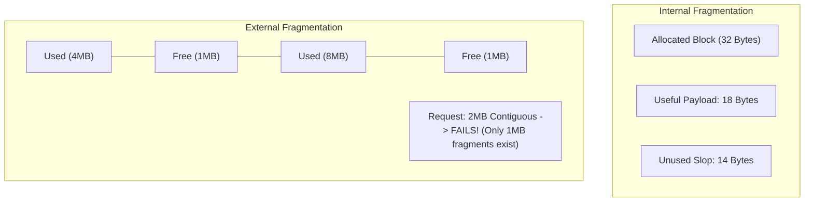
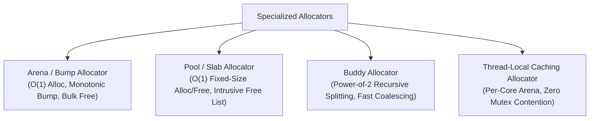
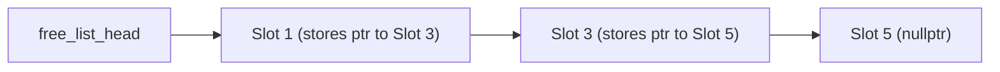

# Memory Allocation and Fragmentation

> [!NOTE]
> **The Cost of Dynamic Memory:**
> In high-level algorithm analysis, dynamic memory allocation is treated as a free, instantaneous $O(1)$ primitive: `new Node()`.
> In production systems, calling general-purpose heap allocators (`malloc`, `free`, `operator new`) is **slow and nondeterministic**:
> 1. General allocators acquire thread-synchronization mutexes or inspect complex bin structures.
> 2. Each allocated chunk carries an invisible **8 to 16-byte metadata header** (storing block size, flags, and boundary tags).
> 3. Allocating millions of small objects scatters memory across pages, destroying CPU cache locality.

> [!TIP]
> **Domain-Specific Allocators Beat General Allocators:**
> For algorithmic workloads with predictable lifetimes, replace general heap allocation with specialized memory managers:
> * **Arena / Bump Allocator:** Increments a single pointer. Ultra-fast $O(1)$ allocation; deallocates entire frame in one bulk reset.
> * **Fixed-Size Pool Allocator:** Pre-allocates an array of fixed chunks and manages them with an embedded intrusive freelist. Zero external fragmentation, $O(1)$ allocate and free.

> [!WARNING]
> **Internal vs External Fragmentation:**
> * **Internal Fragmentation:** Memory wasted *inside* an allocated block due to alignment or power-of-two bin rounding (e.g., requesting 18 bytes receives a 32-byte bin $\implies 14$ bytes wasted).
> * **External Fragmentation:** Total free memory is ample, but it is divided into tiny non-contiguous slivers such that a large contiguous request fails with `OutOfMemory` (OOM).



---

## 1. The Mechanics of General-Purpose Heap Allocators

Standard implementations (glibc `ptmalloc`, `jemalloc`, `tcmalloc`) use segregated free lists and boundary tags:

```text
+-----------------------+-----------------------+-----------------------+
| Chunk Header (16B)    | User Payload (Size S) | Alignment Padding     |
| [Prev Size | Size/Flags] | Data bytes...         | (0-15 bytes)          |
+-----------------------+-----------------------+-----------------------+
```

When you allocate a 4-byte integer via `new int(42)`:
* The allocator requests at least 16 or 32 bytes to store the chunk header and satisfy 16-byte SIMD alignment rules.
* **Overhead:** $80\% - 87.5\%$ of allocated memory is non-payload metadata!

---

## 2. The Four Specialized Allocator Architectures



### 2.1 Arena (Bump / Linear) Allocator
* Maintains a pre-allocated buffer and an offset pointer.
* Allocation: `current_ptr += size; return current_ptr - size;` (Costs 2 CPU instructions).
* Deallocation: Individual objects cannot be freed. The entire arena is reset at the end of a transaction, request, or frame (`current_ptr = base;`).
* Ideal for: Compilers (AST nodes), game loop frames, HTTP request processing.

### 2.2 Pool / Slab Allocator
* Pre-allocates a contiguous block partitioned into $N$ slots of identical size $S$.
* Manages unused slots using an **embedded intrusive singly-linked list**: the free slots themselves store the pointer to the next free slot (zero memory overhead when free!).
* Ideal for: Graph nodes, linked list nodes, tree nodes, connection pools.



### 2.3 The Buddy Allocator
* Memory is managed in powers of two ($2^k$).
* If a block of size $2^k$ is requested and only size $2^{k+1}$ is available, the block is split into two equal "buddies".
* When a block is freed, the allocator checks if its buddy is also free using bitwise XOR:
  $$\text{Buddy Address} = \text{Block Address} \oplus 2^k$$
  If both buddies are free, they are recursively coalesced into a single $2^{k+1}$ block.

---

## 3. Comparative Tradeoff Matrix

| Allocator Type | Allocation Cost | Deallocation Cost | Internal Fragmentation | External Fragmentation | Memory Overhead |
| :--- | :--- | :--- | :--- | :--- | :--- |
| **`malloc` / `new`** | $O(\log N)$ or amortized $O(1)$ | $O(1)$ | Moderate ($5\% - 25\%$) | High over long lifespans | High (16B per object) |
| **Arena (Bump)** | strictly $O(1)$ (1-2 cycles) | $O(1)$ bulk only | None / Minimal | **Zero** | Zero |
| **Pool (Slab)** | strictly $O(1)$ (pop freelist) | strictly $O(1)$ (push freelist)| None (exact match) | **Zero** | Zero (intrusive) |
| **Buddy System** | $O(\log(\text{Max} / \text{Min}))$ | $O(\log(\text{Max} / \text{Min}))$ | High (up to $50\%$) | Low | Minimal |

---

## 4. Common Pitfalls & Anti-Patterns

### Anti-Pattern 1: Fine-Grained Node Allocations in Tight Loops
Writing a binary search tree or linked list that executes `new Node(val)` inside a loop running millions of times. This creates heap fragmentation, thrashes the OS virtual memory manager, and guarantees cache misses. Use a `std::vector<Node>` pool with integer index handles instead of raw pointers.

### Anti-Pattern 2: Memory Leaks in Arena Lifetimes
Failing to reset an arena at the frame boundary, causing monotonic memory growth until an out-of-memory crash occurs.

---

## 5. Curated References

1. **Donald Knuth:** *The Art of Computer Programming, Volume 1: Fundamental Algorithms* (Dynamic Storage Allocation).
2. **Paul R. Wilson et al. (1995):** *Dynamic Storage Allocation: A Survey and Critical Review*.
3. **Bonavita & Evans:** *jemalloc: A Scalable Concurrent Allocator*.
4. **Linux Kernel Source:** `mm/slab.c` and `mm/page_alloc.c` (Buddy System implementation).
