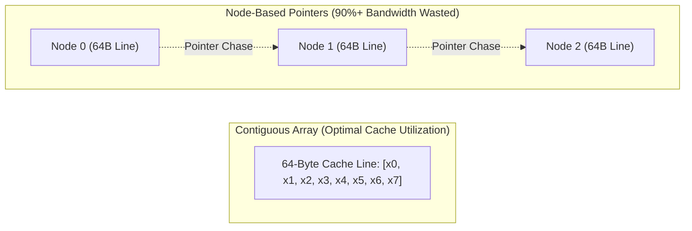
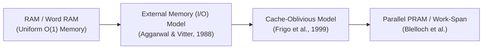

# RAM Model vs Real Machines

> [!NOTE]
> **The Theoretical Abstraction:**
> Modern theoretical computer science evaluates algorithms using the **Random Access Machine (RAM) model** (and its cousin, the Word RAM model).
> In the RAM model:
> 1. Memory is an unbounded array of uniform cells indexed by integers.
> 2. Accessing any memory address takes strictly $O(1)$ time.
> 3. Standard primitive operations (addition, subtraction, bitwise logic, memory load/store) cost exactly 1 unit of time.
> 4. Execution is strictly sequential and single-threaded.

> [!TIP]
> **The Power and Limits of the Abstraction:**
> The RAM model is one of the greatest intellectual triumphs in computer science because it abstracts away microarchitectural churn, allowing us to reason portably about scalability as $N \to \infty$.
> However, for real-world inputs where $N$ fits in memory (or across cache levels), the RAM model's core assumptions diverge from silicon physics by up to **three orders of magnitude ($1,000\times$)**.

> [!WARNING]
> **The Constant Factor Trap:**
> An algorithm with $O(N)$ memory accesses that hit L1 cache (1 ns) can easily outperform an $O(\log N)$ algorithm that incurs random main-memory DRAM stalls (80 ns) or TLB misses for all practical problem sizes $N \le 10^7$.

```mermaid
flowchart TD
    subgraph RAM_Model["The Classical RAM Model (Theory)"]
        CPU1["CPU Core"] <-->|"Uniform Cost = 1"| Mem1["Flat Infinite Memory (Every cell accessible in O(1) time)"]
    end

    subgraph Real_Hardware["Physical Machine Architecture (Silicon)"]
        CPU2["Superscalar Core (Out-of-Order / SIMD)"] <-->|"0.8-1 ns (~4 cycles)"| L1["L1 Cache (32-64 KB)"]
        L1 <-->|"3-5 ns (~14 cycles)"| L2["L2 Cache (512 KB - 1 MB)"]
        L2 <-->|"15-20 ns (~50 cycles)"| L3["L3 Shared Cache (16-64 MB)"]
        L3 <-->|"60-100 ns (~250 cycles)"| DRAM["Main Memory (DRAM)"]
        DRAM <-->|"10,000-50,000 ns"| SSD["NVMe Storage / Page Faults"]
    end
```

---

## 1. The Five Physical Divergences

### 1.1 Non-Uniform Memory Latency (The Memory Wall)
In the RAM model, reading $A[0]$ and reading $A[10^8]$ cost the exact same: 1 unit.
On an Intel Core i9 or AMD Zen 4 processor:
* Reading $A[0]$ (in L1 cache): $\approx 1\text{ ns}$ ($\approx 4\text{ clock cycles}$).
* Reading $A[10^8]$ (cold DRAM miss): $\approx 80\text{ ns}$ ($\approx 320\text{ clock cycles}$).
A single memory access is **$80\times$ slower** purely based on address history and spatial locality.

### 1.2 Chunked Memory Transfers (Cache Lines)
Memory buses do not transfer individual bytes or 64-bit words. When the CPU requests 1 byte, the hardware transfers an entire **64-byte Cache Line**.
* Iterating through 8 contiguous 64-bit integers incurs **1 cache miss** for the first element, followed by **7 instantaneous hits**.
* Traversing 8 linked list nodes scattered across heap memory incurs **8 separate cache misses**, wasting up to $8 \times 64 = 512$ bytes of bandwidth to read 64 bytes of data.

### 1.3 Operation Latency Heterogeneity
The RAM model treats all arithmetic operations as unit-cost ($O(1)$).
On real silicon:
* `add`, `sub`, `and`, `or`, `xor`, `shift`: **1 cycle** (throughput: 4 per cycle on modern superscalar cores).
* `imul` (64-bit integer multiplication): **3 cycles**.
* `idiv` (64-bit integer division): **25–45 cycles** (and non-pipelined!).
Replacing integer division or modulo by reciprocal multiplication and shifts yields massive real-world speedups invisible in Big-O analysis.

### 1.4 Virtual Memory and TLB Misses
Memory addresses in real programs are virtual addresses translated to physical pages (typically 4 KB) via the CPU's **Translation Lookaside Buffer (TLB)**.
Random accesses across a multi-gigabyte array cause TLB misses. A TLB miss forces a 4-level page table walk in hardware, taking an extra **10–30 ns** per lookup on top of the DRAM miss.

### 1.5 Superscalar Execution & Instruction-Level Parallelism (ILP)
Real CPUs are not single-instruction sequential state machines. Modern cores feature out-of-order execution engines with 4 to 6 execution ports:
* Independent instructions execute simultaneously.
* Chained data dependencies ($a = b + c; d = a + e;$) force serial stalls.
* Unpredictable branches trigger pipeline flushes (15–20 cycle penalty).

---

## 2. Latency Numbers Every Algorithm Designer Must Know

| Operation | Typical Latency | Approximate CPU Cycles | Normalized Scale |
| :--- | :--- | :--- | :--- |
| **CPU Register / L1 Cache Access** | $1\text{ ns}$ | $4\text{ cycles}$ | $1\text{ second}$ |
| **L2 Cache Access** | $3 - 5\text{ ns}$ | $14\text{ cycles}$ | $4\text{ seconds}$ |
| **L3 Cache Access** | $15 - 20\text{ ns}$ | $50 - 75\text{ cycles}$ | $18\text{ seconds}$ |
| **Main Memory (DRAM) Access** | $60 - 100\text{ ns}$ | $250 - 400\text{ cycles}$ | **$1.5\text{ minutes}$** |
| **Branch Misprediction Penalty** | $4 - 6\text{ ns}$ | $15 - 20\text{ cycles}$ | $5\text{ seconds}$ |
| **TLB Miss (Hardware Page Walk)** | $15 - 30\text{ ns}$ | $60 - 120\text{ cycles}$ | $25\text{ seconds}$ |
| **NVMe SSD Read (Random 4KB)** | $10,000 - 25,000\text{ ns}$ | $\sim 50,000\text{ cycles}$ | **$5\text{ hours}$** |
| **Internet Round-Trip (SF to NY)** | $40,000,000\text{ ns}$ | $\sim 150,000,000\text{ cycles}$ | **$1.3\text{ years}$** |

---

## 3. The Classic Empirical Paradox: Hash Table vs Flat Array

Consider searching for elements in a collection of size $N = 64$.

* **Hash Table (`std::unordered_set`):**
  * Asymptotic complexity: $O(1)$ expected time.
  * Mechanism: Compute hash, index bucket, dereference node pointer, chase linked list pointer on collision. Incurs 2 to 3 cache misses.
* **Flat Array Linear Scan (`std::vector`):**
  * Asymptotic complexity: $O(N)$ worst-case time.
  * Mechanism: All 64 integers occupy exactly $64 \times 4 = 256\text{ bytes}$ (exactly 4 cache lines). The hardware stream prefetcher brings them in before the CPU even requests them.
* **Empirical Outcome:**
  * For $N \le 64$, flat linear scan is **$3\times$ to $5\times$ faster** than the $O(1)$ hash table.
  * The RAM model predicts $O(1) < O(N)$, but hardware reality reverses the conclusion.

---

## 4. Hierarchy of Machine Models

When analyzing algorithms where hardware realities dominate, computer scientists utilize refined models:

1. **Word RAM Model:** Word size $w \ge \log_2 N$. Arithmetic and bitwise ops on $w$-bit words cost $O(1)$.
2. **External Memory (I/O) Model:** Tracks transfers of block size $B$ between fast memory of size $M$ and infinite slow memory.
3. **Cache-Oblivious Model:** Designs algorithms that optimize block transfers across all cache levels simultaneously *without knowing* cache size $M$ or block size $B$.

---

## 5. Common Pitfalls & Anti-Patterns

### Anti-Pattern 1: Premature Pointer-Chasing Data Structures
Using linked lists or node-based binary search trees (`std::map`) for small collections ($N < 1,000$). Each node incurs heap allocation overhead (16-byte metadata), pointer storage (8 bytes per child), and scattered cache lines. Use flat sorted arrays (`std::vector` + `std::lower_bound`) or flat B-trees instead.

### Anti-Pattern 2: Ignoring Data Structure Memory Footprint
Assuming that a 64-bit integer takes 8 bytes in memory. In node-based structures:
$$\text{Node Size} = 8\text{ (value)} + 8\text{ (left)} + 8\text{ (right)} + 8\text{ (parent/color)} + 16\text{ (allocator chunk header)} = 48\text{ bytes}$$
Only 16.7% of the memory loaded from DRAM is payload data; 83.3% is metadata overhead.

---

## 6. Curated References

1. **John L. Hennessy & David A. Patterson:** *Computer Architecture: A Quantitative Approach* (6th Edition).
2. **Ulrich Drepper (2007):** *What Every Programmer Should Know About Memory*. Red Hat.
3. **Peter Norvig:** *Teach Yourself Programming in Ten Years* (Latency Numbers Matrix).
4. **Frigo, Leiserson, Prokop, Ramachandran (1999):** *Cache-Oblivious Algorithms*. FOCS.
