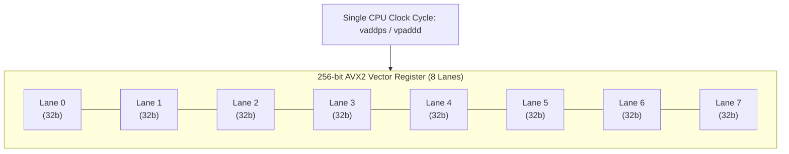
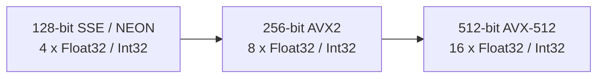
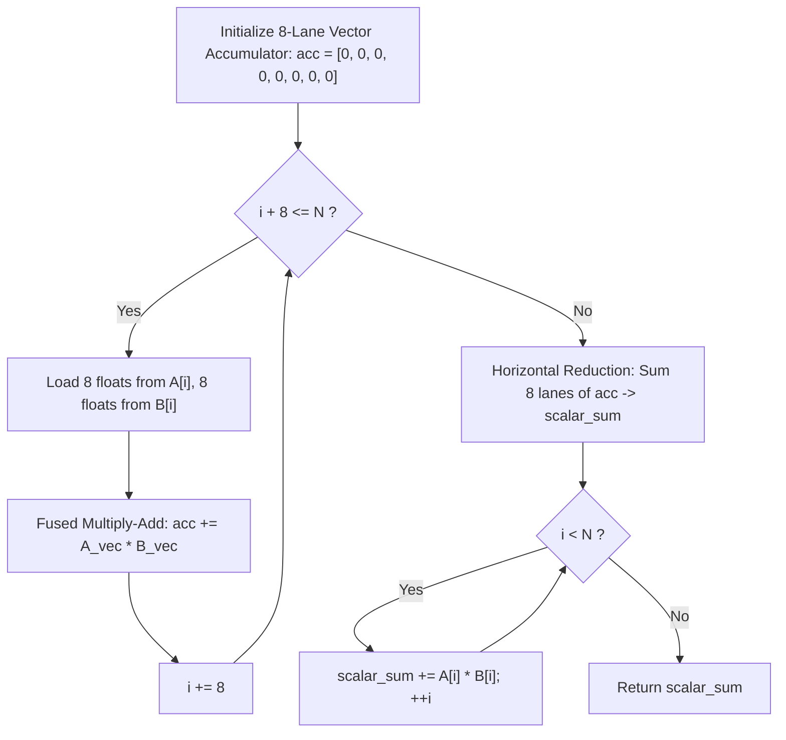

# SIMD and Vectorization Intuition

> [!NOTE]
> **Data Parallelism in Silicon:**
> Traditional scalar execution processes one data item per instruction ($c = a + b$).
> **SIMD (Single Instruction, Multiple Data)** architectures execute a single hardware instruction across an entire bank of uniform data lanes packed into wide vector registers.
> * **SSE (128-bit):** Processes $4 \times 32\text{-bit}$ integers or floats simultaneously.
> * **AVX2 (256-bit):** Processes $8 \times 32\text{-bit}$ integers or floats simultaneously.
> * **AVX-512 (512-bit):** Processes $16 \times 32\text{-bit}$ integers or floats simultaneously.
> * **ARM NEON (128-bit):** Processes $4 \times 32\text{-bit}$ elements in mobile/Apple silicon cores.

> [!TIP]
> **The Five Golden Rules for Auto-Vectorization:**
> Modern optimizing compilers (`gcc -O3`, `clang -O3`) vectorize loops automatically if and only if:
> 1. **Contiguous Memory:** Data resides in linear, stride-1 arrays.
> 2. **Fixed Trip Count:** The loop boundary does not change and contains no early exits (`break`, `return`).
> 3. **No Pointer Aliasing:** Pointers are marked `__restrict__` or proven disjoint.
> 4. **No Loop-Carried Dependencies:** Iteration $i$ does not read results produced by iteration $i-1$.
> 5. **Branchless Math:** Inner conditionals are replaced with bitwise select (`cmov`) or masks.

> [!WARNING]
> **The Scalar Cleanup Tail:**
> An array of size $N$ rarely divides evenly by vector register width $W$ (e.g., $N = 1,003$ on an 8-wide AVX2 machine).
> Vectorized code must process $\lfloor N / W \rfloor$ vector blocks, followed by a **scalar tail loop** to handle the remaining $N \pmod W$ elements. Missing the tail produces silent buffer truncations!



---

## 1. Vector Registers and Instruction Sets



| Technology | Width | 32-bit Integers (`int32`) | 64-bit Floats (`double`) | 8-bit Bytes (`uint8`) |
| :--- | :--- | :--- | :--- | :--- |
| **x86 SSE4.2** | 128 bits | 4 elements | 2 elements | 16 elements |
| **ARM NEON** | 128 bits | 4 elements | 2 elements | 16 elements |
| **x86 AVX2** | 256 bits | 8 elements | 4 elements | 32 elements |
| **x86 AVX-512** | 512 bits | 16 elements | 8 elements | 64 elements |

---

## 2. Anatomy of a Vectorized Loop

Consider calculating the dot product of two arrays $A$ and $B$:

```cpp
float dot_product_scalar(const float* a, const float* b, size_t n) {
    float sum = 0.0f;
    for (size_t i = 0; i < n; ++i) {
        sum += a[i] * b[i];
    }
    return sum;
}
```

When vectorized across $W = 8$ lanes:
1. **Vector Main Loop:** Steps $i$ by 8 at a time, accumulating into an 8-lane vector accumulator.
2. **Horizontal Reduction:** Sums the 8 individual lanes of the vector accumulator down to 1 scalar float.
3. **Scalar Tail Loop:** Processes remaining $n \pmod 8$ elements one by one.



---

## 3. What Blocks Vectorization? (The Inhibitors)

### 3.1 Loop-Carried Dependencies
```cpp
// Cannot vectorize: iteration i depends on output of iteration i - 1:
for (int i = 1; i < n; ++i) {
    arr[i] = arr[i - 1] + 10;
}
```

### 3.2 Pointer Aliasing
Compilers must assume two pointers might overlap in memory (`a == b + 1`).
Use the `__restrict__` keyword to promise to the compiler that arrays do not overlap:
```cpp
void add_arrays(float* __restrict__ c, const float* __restrict__ a, const float* __restrict__ b, size_t n) {
    for (size_t i = 0; i < n; ++i) {
        c[i] = a[i] + b[i];
    }
}
```

---

## 4. Vectorization Decision Matrix

| Workload Characteristic | Feasibility | Expected Real-World Speedup |
| :--- | :--- | :--- |
| **Contiguous 32-bit math (Dot product, Matrix mult)** | High (Trivial) | $4\times - 7.5\times$ on AVX2 |
| **Byte searches & string hashing (memchr, strlen)** | High | $10\times - 25\times$ using byte masks |
| **Node-based graph / Tree traversal** | Zero | $1\times$ (Memory bound / pointer chasing) |
| **Unpredictable branches inside inner loop** | Moderate | Requires SIMD blending/masking |

---

## 5. Common Pitfalls & Anti-Patterns

### Anti-Pattern 1: Unaligned Vector Loads with Legacy Intrinsics
In older SSE, attempting an aligned load (`_mm_load_ps`) on an address not divisible by 16 crashed the program with a General Protection Fault (`SIGSEGV`). Modern AVX2 supports unaligned loads (`_mm256_loadu_ps`) with zero hardware penalty if the access does not span across a 64-byte cache line boundary.

### Anti-Pattern 2: Forgetting the Scalar Tail
Processing only `n - (n % 8)` elements and returning. For arrays whose size is not a multiple of the vector width, the tail elements are silently dropped, producing incorrect sums or corrupt matrices.

---

## 6. Curated References

1. **Intel Intrinsics Guide:** Interactive reference for all SSE, AVX2, and AVX-512 intrinsics.
2. **Fog, Agner:** *Optimizing subroutines in assembly language: An analysis of SIMD instruction execution*.
3. **Lemire, Daniel:** *Fast integer compression and parsing algorithms via SIMD*.
4. **LLVM Project:** *Auto-Vectorization in LLVM*.
