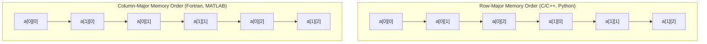

# Arrays and Memory Layout

> [!NOTE]
> **Contiguous Physical Layout & Addressing Invariant:**
> An array stores elements consecutively in a single contiguous block of addressable memory.
> - **Direct Address Calculation:** Random access executes in guaranteed $O(1)$ time via arithmetic: $\text{address}(a[i]) = \text{base} + i \cdot s$ where $s = \text{sizeof}(T)$.
> - **Spatial Locality:** Accessing element $i$ automatically pulls neighboring elements ($i+1, i+2, \dots$) into high-speed L1/L2 cache lines (typically 64 bytes).
> - Reference implementations: [C++17 Implementation](../../implementations/cpp/arrays_and_memory_layout.cpp) | [Python Implementation](../../implementations/python/arrays_and_memory_layout.py)

> [!TIP]
> **Row-Major vs. Column-Major Loop Disciplines:**
> - **Row-Major Layout (C, C++, Python, Rust):** Rows are contiguous. The linear index for element $(r, c)$ in an $R \times C$ matrix is $r \cdot C + c$. Traversal **must** place the column loop inside: `for r ... for c ... a[r][c]` to achieve stride-1 access.
> - **Column-Major Layout (Fortran, MATLAB, R, Julia):** Columns are contiguous. The linear index is $c \cdot R + r$. Inner loop must iterate over rows $r$.
> - Violating the storage layout by traversing against the major dimension introduces large strides, incurring constant L1 cache misses and up to $10\times-50\times$ slowdowns.

> [!WARNING]
> **Critical Hardware Pitfalls:**
> 1. **False Sharing:** When concurrent threads modify logically independent variables that reside within the same 64-byte cache line, the CPU cache coherency protocol repeatedly invalidates the entire line across core caches ("cache bouncing"). Resolve using explicit cache line alignment: `alignas(64)`.
> 2. **Structure Padding and Memory Holes:** Compilers enforce natural member alignment by inserting silent padding bytes. Order struct fields in descending order of size/alignment (e.g. `double` $\to$ `int` $\to$ `char`) to eliminate padding bloat.
> 3. **Python List Indirection:** Standard Python `list` objects are contiguous arrays of *pointers* to distinct `PyObject` heap records, not contiguous arrays of values. For raw numeric contiguity, use `array.array` or NumPy arrays.



Arrays are among the most fundamental data structures in computer science.

At first, an array looks simple:

- store elements in order
- access by index
- use contiguous memory

But under that simplicity is an important systems-level story.

Array performance depends not only on asymptotic complexity, but also on:

- contiguous layout
- cache behavior
- row-major versus column-major ordering
- alignment and padding
- false sharing in concurrent code

This chapter develops:

- what array contiguity means
- how indexing maps to addresses
- why locality matters
- row-major and column-major layouts
- cache lines and alignment
- padding and structure layout
- false sharing and practical performance

---

## 1. What is an array?

An **array** is a sequence of elements stored in contiguous memory.

If each element has fixed size, then the address of element $ i $ can be computed directly from:

- the base address
- the element size
- the index

This is why array indexing is so fast.

---

## 2. Contiguous memory layout

If an array begins at address `base`, and each element has size `s` bytes, then the address of element $ i $ is:

$$
\text{address}(a[i]) = \text{base} + i \cdot s
$$

This formula is the key property of arrays.

Because of it:

- random access is easy
- iteration is efficient
- nearby elements are physically nearby in memory

That last point matters a lot for cache behavior.

---

## 3. Why contiguous layout matters

Contiguity gives two major advantages:

### Fast indexing
We compute addresses directly, without following pointers.

### Good locality
When one element is loaded into cache, nearby elements often come with it.

This is why arrays are often faster in practice than pointer-heavy structures, even when both have the same asymptotic complexity.

---

## 4. C++17 contiguous array examples

```cpp
#include <vector>
#include <array>

void example() {
    int raw[5] = {1, 2, 3, 4, 5};
    std::array<int, 5> fixed = {1, 2, 3, 4, 5};
    std::vector<int> dynamic = {1, 2, 3, 4, 5};
}
```

For all three of these, the elements themselves are stored contiguously.

That is an important shared property.

---

## 5. Python note on arrays

Python lists support indexed access, but they are not low-level C arrays of raw values.

A Python list stores references to Python objects, not the objects inline.

So:

- the list's references are contiguous
- the actual objects may be elsewhere

This is why Python lists behave differently from raw numeric arrays in systems-level performance discussions.

For true contiguous numeric data, tools like `array`, `numpy`, or specialized libraries are often more appropriate.

---

## 6. Temporal and spatial locality

Cache performance often depends on two forms of locality.

### Temporal locality
If a memory location was used recently, it is likely to be used again soon.

### Spatial locality
If a memory location was used, nearby locations are likely to be used soon.

Arrays are especially strong for spatial locality because adjacent elements sit next to each other in memory.

This is one of the deepest practical reasons arrays are so important.

---

## 7. Cache lines

Memory is typically transferred between main memory and cache in fixed-size blocks called **cache lines**.

A common cache line size is 64 bytes.

That means when one array element is loaded, nearby elements in the same cache line are often loaded too.

So sequential array traversal benefits strongly from cache lines.

This is a major constant-factor performance effect.

---

## 8. Sequential vs scattered access

Consider two ways of reading data:

### Sequential array access
Read `a[0], a[1], a[2], ...`

### Pointer-chasing access
Follow links through a scattered structure like a linked list

Both may be $ O(n) $, but the sequential array version is often much faster because it works well with caches and hardware prefetching.

This is a classic example of asymptotics not telling the whole performance story.

---

## 9. Multidimensional arrays

A 2D array is still stored in 1D memory.

So we need a rule for mapping:

- row index
- column index

to one linear address.

The two main conventions are:

- **row-major order**
- **column-major order**

Understanding this matters for both correctness and performance.

---

## 10. Row-major order

In **row-major** layout, elements of the same row are stored next to each other.

For a matrix with:

- $ R $ rows
- $ C $ columns

the address of element $ a[i][j] $ is based on:

$$
i \cdot C + j
$$

This means rows are contiguous.

C, C++, and many systems-level contexts use row-major layout.

---

## 11. Column-major order

In **column-major** layout, elements of the same column are stored next to each other.

The linear index is based on:

$$
j \cdot R + i
$$

This means columns are contiguous.

Languages and tools in scientific computing sometimes use column-major layout.

The important lesson is that both are valid, but the access pattern should match the storage order when possible.

---

## 12. Why row-major vs column-major matters

Suppose a matrix is stored in row-major order.

Then iterating row by row gives strong locality:

- adjacent memory
- cache-friendly traversal

But iterating column by column jumps across memory with a large stride.

That often leads to worse cache performance.

So loop order matters.

---

## 13. C++17 row-major traversal example

```cpp
#include <vector>

long long sum_row_major(const std::vector<std::vector<int>>& a) {
    long long total = 0;
    for (std::size_t i = 0; i < a.size(); ++i) {
        for (std::size_t j = 0; j < a[i].size(); ++j) {
            total += a[i][j];
        }
    }
    return total;
}
```

This matches row-major intuition when the underlying storage is row-oriented.

---

## 14. Flattened 2D row-major array

A common systems-level technique is to store a matrix in one flat array.

Then:

$$
\text{index}(i, j) = i \cdot C + j
$$

This avoids pointer indirection and keeps the data fully contiguous.

---

## 15. C++17 flattened matrix example

```cpp
#include <vector>
#include <stdexcept>

class Matrix {
public:
    Matrix(int rows, int cols) : rows_(rows), cols_(cols), data_(rows * cols, 0) {}

    int& at(int i, int j) {
        return data_[i * cols_ + j];
    }

    const int& at(int i, int j) const {
        return data_[i * cols_ + j];
    }

private:
    int rows_;
    int cols_;
    std::vector<int> data_;
};
```

This is a clean example of row-major mapping.

---

## 16. Stride

The **stride** of an access pattern is the memory distance between consecutive accesses.

Examples:

- reading `a[i], a[i+1], a[i+2]` has small stride
- reading one column of a row-major matrix has large stride

Small strides usually give better cache behavior than large strides.

This is why memory layout and loop order interact so strongly.

---

## 17. Alignment

**Alignment** means that an object begins at an address that is a multiple of some number, such as 4, 8, 16, or 64.

Many machine architectures prefer or require alignment for efficient access.

For example:

- a 4-byte integer is often aligned to 4 bytes
- an 8-byte integer is often aligned to 8 bytes

Alignment helps hardware load and store values efficiently.

---

## 18. Why alignment matters

Good alignment can improve performance because:

- one aligned access may fit naturally within hardware boundaries
- misaligned accesses may require extra work or multiple memory operations
- vectorized instructions often prefer stronger alignment

Compilers and allocators usually handle ordinary alignment automatically, but it is still important to understand the concept.

---

## 19. Structure padding

When a struct contains fields of different sizes, the compiler may insert unused bytes called **padding**.

This helps preserve alignment for later fields.

Example idea:

- a 1-byte `char`
- followed by an 8-byte `double`

Often padding is inserted between them so the `double` starts at an aligned address.

This means logical field size and actual memory size may differ.

---

## 20. C++17 padding example

```cpp
#include <cstddef>

struct A {
    char c;
    int x;
};

struct B {
    int x;
    char c;
};
```

These two structs may have different layouts and possibly different sizes because of padding.

Field order can affect memory footprint.

---

## 21. Why field order can matter

If a struct has many objects in an array, even small padding waste can add up.

So grouping larger-alignment fields together can reduce wasted space.

This is not always the most important optimization, but in systems work it can matter.

That said, correctness and clarity come first.

---

## 22. Cache line alignment

Sometimes data is intentionally aligned to cache-line boundaries, such as 64 bytes.

This can matter in high-performance or concurrent code.

For example, two heavily updated counters may be placed on different cache lines to avoid contention effects.

This leads to the topic of false sharing.

---

## 23. False sharing

**False sharing** happens when:

- two threads update different variables
- but those variables happen to lie in the same cache line

Even though the variables are logically independent, the cache coherence system treats the whole line as shared.

So the threads interfere with each other unnecessarily.

This can severely reduce performance.

---

## 24. Why false sharing is “false”

The sharing is called “false” because the threads are not truly sharing the same logical variable.

They are sharing only the same physical cache line.

The program may be correct, but performance suffers because cache lines bounce between cores.

This is a purely layout-driven performance issue.

---

## 25. C++17 false-sharing intuition example

```cpp
#include <atomic>

struct CountersBad {
    std::atomic<long long> x;
    std::atomic<long long> y;
};
```

If two threads repeatedly update `x` and `y`, these counters may sit in the same cache line.

That can create false sharing.

A padded version may separate them.

---

## 26. C++17 padded counter idea

```cpp
#include <atomic>

struct alignas(64) PaddedCounter {
    std::atomic<long long> value;
};
```

Using aligned and separated objects can reduce false sharing in some high-contention cases.

This is an advanced optimization, but it is important to know the idea.

---

## 27. Arrays of structs vs structs of arrays

A common layout choice is:

### Array of structs
```text
[x1 y1 z1] [x2 y2 z2] [x3 y3 z3]
```

### Struct of arrays
```text
[x1 x2 x3]
[y1 y2 y3]
[z1 z2 z3]
```

The best choice depends on access pattern.

If an algorithm uses only `x` values heavily, a struct of arrays may have better locality for that workload.

This is another example of layout depending on computation.

---

## 28. Array resizing and relocation

Dynamic arrays such as vectors may reallocate when growing.

When this happens:

- a larger memory block is allocated
- elements are moved or copied
- the old block is released

So dynamic arrays are contiguous, but the physical location of the array may change over time.

This matters if external raw pointers or references are kept.

---

## 29. Pointer invalidation

When a dynamic array reallocates, pointers, references, and iterators to its elements may become invalid.

This is an important correctness issue.

So memory layout is not only about performance.
It also affects what references remain safe.

This is especially important in C++.

---

## 30. Why arrays are often faster than linked structures

Arrays often outperform linked structures because they provide:

- direct indexing
- fewer pointer dereferences
- better cache locality
- better prefetch behavior
- less allocation overhead

Even when both structures have the same big-O time, these constant factors can be decisive.

This is one of the most important practical lessons in data structures.

---

## 31. Complexity vs layout

Array access is often described as:

$$
O(1)
$$

This is true in the algorithmic sense.

But two $ O(1) $ accesses can have very different real costs depending on:

- cache hit or miss
- alignment
- stride
- locality

So asymptotic complexity and memory layout must be understood together.

---

## 32. Common mistakes

### Mistake 1: assuming all $ O(1) $ access costs are equal
They are not equal in real hardware.

### Mistake 2: ignoring loop order in matrix code
Wrong loop order can hurt cache performance badly.

### Mistake 3: forgetting Python lists store references
They are not raw numeric arrays.

### Mistake 4: ignoring padding in structs
Field order can affect size.

### Mistake 5: confusing logical independence with physical independence
False sharing can occur even when variables are logically separate.

### Mistake 6: keeping pointers into vectors across reallocation
Those pointers may become invalid.

---

## 33. Comparison table

| Idea | Main point | Why it matters |
|---|---|---|
| contiguous array | elements stored next to each other | fast indexing and locality |
| row-major layout | rows are contiguous | row-wise traversal is cache-friendly |
| column-major layout | columns are contiguous | column-wise traversal is cache-friendly |
| alignment | objects start at preferred boundaries | efficient loads and stores |
| padding | extra bytes inserted for alignment | affects memory footprint |
| false sharing | independent variables share one cache line | hurts multithreaded performance |

---

## 34. Summary

Arrays are simple in theory but deep in practice.

Their key strengths come from:

- contiguous memory layout
- direct address computation
- strong spatial locality

Important memory-layout ideas include:

- row-major vs column-major order
- stride and loop order
- alignment and padding
- false sharing in concurrent code

The central lesson is:

> data layout shapes performance

Understanding arrays at the memory-layout level helps explain why some code is much faster than other code with the same asymptotic complexity.

---

## 35. Practice prompts

1. Why does contiguous layout make array indexing fast?
2. What is spatial locality?
3. Why can sequential array access be much faster than pointer chasing?
4. What is the difference between row-major and column-major layout?
5. Why does loop order matter for matrix traversal?
6. What is alignment?
7. Why does struct padding exist?
8. What is false sharing?
9. Why can two logically separate counters interfere in multithreaded code?
10. Why can arrays outperform linked structures even when both are $ O(n) $ to traverse?
```
