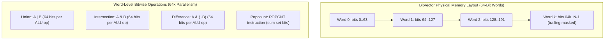

# Bitsets and Bitvectors

> [!NOTE]
> **Dense Packing and Word-Level Parallelism:**
> A bitset or bitvector packs boolean values into contiguous machine words (typically 64-bit unsigned integers `uint64_t`).
> - **Space Efficiency:** Requires exactly 1 bit per element rather than 1 byte (`bool` / `char`) or 4-8 bytes (`int` / pointer), reducing memory footprint by 8x to 64x and dramatically improving L1/L2 cache residency.
> - **Word-Level Parallelism:** Bitwise operations (`&`, `|`, `^`, `~`) process 64 boolean flags in a single CPU cycle. Set union, intersection, and difference execute in $O(N / 64)$ time.
> - Reference implementations: [C++17 Implementation](../../implementations/cpp/bitsets_and_bitvectors.cpp) | [Python Implementation](../../implementations/python/bitsets_and_bitvectors.py)

> [!TIP]
> **Hardware Acceleration & Index Arithmetic:**
> - To locate bit index $i$:
>   - Word index: $W = i / 64 = i \gg 6$
>   - Bit offset within word: $b = i \% 64 = i \ \& \ 63$
>   - Bitmask: $1\text{ULL} \ll b$
> - Modern CPUs execute population count (`POPCNT`) and count trailing zeros (`TZCNT` / `BSF`) in 1-3 clock cycles via hardware intrinsics: `__builtin_popcountll(w)` and `__builtin_ctzll(w)`.

> [!WARNING]
> **Critical Pitfalls:**
> 1. **Undefined Shift Count:** Shifting a 64-bit integer by $\ge 64$ bits (e.g. `1ULL << 64`) is Undefined Behavior in C and C++.
> 2. **Signed Shift Arithmetic:** Always use unsigned types (`uint64_t`, `unsigned long long`). Right-shifting a signed integer performs sign extension (arithmetic right shift), injecting leading ones.
> 3. **Trailing Unused Bits:** In dynamically sized bitvectors where $N$ is not an exact multiple of 64, the unused high bits of the last word must be strictly masked to 0 after inversion (`~`) or bulk operations before computing popcount or equality.



Many problems involve large collections of yes/no values:

- is this number present?
- is this state active?
- has this node been visited?
- which features are enabled?
- which subset of items has been chosen?

A direct representation uses one byte, integer, or boolean object per value.

But this can waste space.

A more compact idea is to store many boolean values inside the bits of machine words.

This leads to **bitsets** and **bitvectors**.

These structures are powerful because one machine-word operation can process many boolean flags at once.

For example, with 64-bit words, one operation can affect 64 bits together.

This can give large practical speedups and much better memory efficiency.

This chapter develops:

- bit-level representation of boolean arrays
- bitwise operations
- compact set operations
- popcount and bit iteration
- dynamic bitvectors vs. fixed-size bitsets
- common algorithmic use cases

---

## 1. What is a bit?

A **bit** is a binary digit:

- `0`
- `1`

A bit can represent a yes/no fact:

- false / true
- absent / present
- off / on
- unvisited / visited

Since a bit stores only two states, it is the most compact possible boolean representation.

---

## 2. What is a bitvector?

A **bitvector** is a sequence of bits.

Example:

```text
1 0 1 1 0 0 1 0
```

This can be interpreted as eight boolean values packed together.

Instead of using one byte or more per flag, we use one bit per flag.

That reduces memory usage by a factor of about 8 compared with one byte per boolean, and often by much more compared with language-level boolean objects.

---

## 3. What is a bitset?

The terms **bitset** and **bitvector** are closely related.

A useful practical distinction is:

- **bitset**: often fixed-size, sometimes language or library provided
- **bitvector**: often dynamic-size or more general

Both represent sets of bits and support bitwise operations efficiently.

This chapter uses both terms in their common practical sense.

---

## 4. Why bitsets are powerful

Bitsets are powerful for two main reasons:

### Space efficiency
Storing $ n $ booleans needs only about:

$$
\lceil n / 8 \rceil
$$

bytes, ignoring small overheads.

### Word-level parallelism
A 64-bit machine word can hold 64 flags.

So one bitwise operation such as AND, OR, or XOR processes 64 positions at once.

This is why bitsets can sometimes deliver a practical “64×” style speedup over naive per-boolean loops.

That speedup is not a universal law, but it is a useful intuition.

---

## 5. Common bitwise operations

For machine words, the most important bitwise operations are:

- AND: `&`
- OR: `|`
- XOR: `^`
- NOT: `~`
- left shift: `<<`
- right shift: `>>`

These operations act on bits directly.

### Example

```text
10110010
AND
11100011
=
10100010
```

Each bit position is processed independently.

---

## 6. Representing a set with bits

Suppose we want a set of integers from 0 to $ n-1 $.

We can let bit $ i $ mean:

- 1 if element $ i $ is present
- 0 if element $ i $ is absent

Then set operations become bit operations.

### Example
- union → OR
- intersection → AND
- symmetric difference → XOR

This makes bitsets a compact form of boolean set.

---

## 7. Single-word bitset example

If the universe size is at most 64, a single 64-bit integer can represent the whole set.

Example:

- bit 0 set means element 0 is present
- bit 5 set means element 5 is present

Then:

- insert element $ i $: set bit $ i $
- remove element $ i $: clear bit $ i $
- test element $ i $: read bit $ i $

This is one of the simplest and most useful low-level patterns.

---

## 8. C++17 single-word bit tricks

```cpp
#include <cstdint>

using U64 = std::uint64_t;

bool contains(U64 mask, int i) {
    return (mask >> i) & 1ULL;
}

void add(U64& mask, int i) {
    mask |= (1ULL << i);
}

void remove(U64& mask, int i) {
    mask &= ~(1ULL << i);
}

void toggle(U64& mask, int i) {
    mask ^= (1ULL << i);
}
```

---

## 9. Python single-word bit tricks

```python
def contains(mask, i):
    return ((mask >> i) & 1) == 1

def add(mask, i):
    return mask | (1 << i)

def remove(mask, i):
    return mask & ~(1 << i)

def toggle(mask, i):
    return mask ^ (1 << i)
```

Python integers are arbitrary precision, so they can represent large bitmasks directly, though the performance model differs from fixed-size machine words.

---

## 10. Dynamic bitvector layout

For larger universes, we usually store bits across multiple machine words.

For example, using 64-bit words:

- bit $ i $ belongs to word $ i / 64 $
- inside that word, its offset is $ i \bmod 64 $

So a bitvector of length $ n $ uses:

$$
\left\lceil \frac{n}{64} \right\rceil
$$

64-bit words.

This is the standard implementation pattern.

---

## 11. C++17 dynamic bitvector

```cpp
#include <vector>
#include <cstdint>
#include <stdexcept>

class BitVector {
public:
    explicit BitVector(int n)
        : n_(n), words_((n + 63) / 64, 0ULL) {}

    int size() const { return n_; }

    void set(int i) {
        validate(i);
        words_[i / 64] |= (1ULL << (i % 64));
    }

    void reset(int i) {
        validate(i);
        words_[i / 64] &= ~(1ULL << (i % 64));
    }

    void flip(int i) {
        validate(i);
        words_[i / 64] ^= (1ULL << (i % 64));
    }

    bool test(int i) const {
        validate(i);
        return (words_[i / 64] >> (i % 64)) & 1ULL;
    }

private:
    int n_;
    std::vector<std::uint64_t> words_;

    void validate(int i) const {
        if (i < 0 || i >= n_) {
            throw std::out_of_range("bit index out of range");
        }
    }
};
```

---

## 12. Python dynamic bitvector

```python
class BitVector:
    def __init__(self, n):
        self.n = n
        self.words = [0] * ((n + 63) // 64)

    def _check(self, i):
        if i < 0 or i >= self.n:
            raise IndexError("bit index out of range")

    def set(self, i):
        self._check(i)
        self.words[i // 64] |= 1 << (i % 64)

    def reset(self, i):
        self._check(i)
        self.words[i // 64] &= ~(1 << (i % 64))

    def flip(self, i):
        self._check(i)
        self.words[i // 64] ^= 1 << (i % 64)

    def test(self, i):
        self._check(i)
        return ((self.words[i // 64] >> (i % 64)) & 1) == 1
```

---

## 13. Set operations on bitvectors

If two bitvectors have the same length, then:

- union = wordwise OR
- intersection = wordwise AND
- symmetric difference = wordwise XOR
- complement = wordwise NOT, with care for trailing unused bits

Each word operation handles 64 bits at once.

This is where much of the practical performance gain comes from.

---

## 14. C++17 wordwise set operations

```cpp
#include <vector>
#include <cstdint>
#include <stdexcept>

std::vector<std::uint64_t> bitwise_or_vectors(
    const std::vector<std::uint64_t>& a,
    const std::vector<std::uint64_t>& b) {

    if (a.size() != b.size()) {
        throw std::invalid_argument("size mismatch");
    }

    std::vector<std::uint64_t> c(a.size());
    for (std::size_t i = 0; i < a.size(); ++i) {
        c[i] = a[i] | b[i];
    }
    return c;
}

std::vector<std::uint64_t> bitwise_and_vectors(
    const std::vector<std::uint64_t>& a,
    const std::vector<std::uint64_t>& b) {

    if (a.size() != b.size()) {
        throw std::invalid_argument("size mismatch");
    }

    std::vector<std::uint64_t> c(a.size());
    for (std::size_t i = 0; i < a.size(); ++i) {
        c[i] = a[i] & b[i];
    }
    return c;
}
```

---

## 15. Popcount

A very important bit operation is **popcount**:

> the number of set bits

For example:

```text
10110100
```

has popcount 4.

Popcount is useful for:

- counting set elements in a bitset
- subset DP
- parity and combinatorics
- fast statistics over bit masks

Many languages and compilers provide efficient built-ins for this.

---

## 16. C++17 popcount helpers

In C++17, a common approach is compiler built-ins.

```cpp
#include <cstdint>

int popcount64(std::uint64_t x) {
    return __builtin_popcountll(x);
}
```

To count all bits in a dynamic bitvector:

```cpp
#include <vector>
#include <cstdint>

long long popcount_vector(const std::vector<std::uint64_t>& words) {
    long long total = 0;
    for (std::uint64_t w : words) {
        total += __builtin_popcountll(w);
    }
    return total;
}
```

---

## 17. Python popcount helpers

Modern Python integers provide `bit_count()`.

```python
def popcount(x):
    return x.bit_count()

def popcount_words(words):
    return sum(w.bit_count() for w in words)
```

This is one of the nicest high-level bit tools in Python.

---

## 18. Iterating over set bits

Sometimes we want not only the count, but the positions of set bits.

A classic low-level trick is:

- isolate the lowest set bit
- remove it
- repeat

For word $ x $, the operation:

$$
x \mathrel{\&=} (x - 1)
$$

clears its lowest set bit.

This makes iteration over set bits efficient.

---

## 19. C++17 iterate set bits in one word

```cpp
#include <vector>
#include <cstdint>

std::vector<int> set_bit_positions(std::uint64_t x) {
    std::vector<int> pos;
    while (x != 0) {
        int b = __builtin_ctzll(x);
        pos.push_back(b);
        x &= (x - 1);
    }
    return pos;
}
```

Here `__builtin_ctzll` gives the number of trailing zeros, which is the index of the lowest set bit.

---

## 20. Python iterate set bits in one word

```python
def set_bit_positions(x):
    pos = []
    while x:
        low = x & -x
        b = low.bit_length() - 1
        pos.append(b)
        x &= x - 1
    return pos
```

---

## 21. Bitset as visited array

One common use of bitsets is as a compact visited structure.

Example applications:

- graph search on dense small-state spaces
- sieve-style marking
- subset states
- memory-sensitive boolean DP

Instead of `visited[i]` as a byte or object, we store it as one bit.

This saves space and improves cache behavior.

---

## 22. Bitset subset representation

Bitmasks are especially useful when the universe is small, such as:

$$
n \le 20 \text{ or } n \le 25
$$

Then a subset can be represented by an integer mask.

Example:

- subset `{0, 2, 4}` becomes binary `10101`

This is foundational for:

- subset DP
- meet-in-the-middle
- brute force over subsets
- combinatorial optimization

---

## 23. Enumerating all subsets

If there are $ n $ items, then every subset corresponds to an integer mask from:

$$
0 \text{ to } 2^n - 1
$$

This makes enumeration simple.

### Example
For each mask:
- bit $ i $ tells whether item $ i $ is included

This is one of the main bridges between combinatorics and bit operations.

---

## 24. C++17 subset enumeration example

```cpp
#include <vector>

std::vector<std::vector<int>> all_subsets(const std::vector<int>& a) {
    int n = static_cast<int>(a.size());
    std::vector<std::vector<int>> result;

    for (int mask = 0; mask < (1 << n); ++mask) {
        std::vector<int> subset;
        for (int i = 0; i < n; ++i) {
            if (mask & (1 << i)) {
                subset.push_back(a[i]);
            }
        }
        result.push_back(subset);
    }

    return result;
}
```

---

## 25. Practical “64× speedup” interpretation

It is common to say bitsets can give a “64× speedup” on 64-bit hardware.

This should be understood carefully.

The real point is:

- one word operation processes 64 boolean positions at once

But actual speed depends on:

- memory layout
- compiler optimization
- branching behavior
- cache effects
- overhead around the bit operations

So the phrase is a useful intuition, not a guarantee.

---

## 26. Fixed-size library bitsets

Some languages or libraries provide built-in fixed-size bitsets.

For example, C++ has `std::bitset<N>`.

These are convenient when the size is known at compile time.

Advantages:
- clear syntax
- built-in bit operations
- good optimization opportunities

But dynamic-size problems often need custom bitvectors or dynamic libraries.

---

## 27. C++17 `std::bitset` example

```cpp
#include <bitset>

std::bitset<16> example() {
    std::bitset<16> b;
    b.set(3);
    b.set(7);
    b.flip(3);
    return b;
}
```

This is concise, but the size `16` must be known at compile time.

---

## 28. Dense vs sparse boolean sets

Bitsets are excellent for **dense or bounded universes**.

For example:
- integers from 0 to $ 10^6 $
- flags over a fixed index range
- graph adjacency for moderate dense graphs

But if the universe is huge and only a few elements are present, hash sets or balanced trees may be better.

So bitsets are not always the right answer.

---

## 29. Bitwise convolution-style thinking

Bitsets are often useful when a boolean problem can be rewritten as parallel word operations.

Examples:

- set intersections
- fast reachability propagation in dense graphs
- boolean DP transitions
- string or pattern filtering with bit-parallel techniques

This style of thinking is an important algorithmic skill.

---

## 30. Complexity summary

For a bitvector of length $ n $, stored in $ w $-bit words:

### Single bit operations
- set/test/reset/flip: $ O(1) $

### Whole-bitvector operations
- union/intersection/XOR: $ O(n / w) $

### Popcount of full vector
- $ O(n / w) $

Compared with per-boolean loops, the word size $ w $ often provides a large constant-factor gain.

---

## 31. Common mistakes

### Mistake 1: shifting by an invalid amount
Shifting by a negative amount or by at least the word width is unsafe or undefined in some languages.

### Mistake 2: using signed integers carelessly
Unsigned types are often safer for bit manipulation.

### Mistake 3: forgetting trailing unused bits
The final word may contain bits outside the logical size.

### Mistake 4: assuming bitsets are always faster
For tiny inputs or sparse sets, other structures may be simpler and just as good.

### Mistake 5: mixing logical and bitwise operators
`&&` is not `&`, and `||` is not `|`.

### Mistake 6: ignoring readability
Bit tricks are powerful, but they should be explained and named clearly.

---

## 32. Recognition checklist

A bitset or bitvector is a strong fit when:

- the data is naturally boolean
- the universe is bounded and indexed
- memory efficiency matters
- set operations are frequent
- word-level parallelism can help

These are strong signs.

---

## 33. Summary

Bitsets and bitvectors store boolean data compactly by packing many flags into machine words.

Their main strengths are:

- very low memory usage
- fast bitwise set operations
- popcount and bit iteration support
- strong practical performance from word-level parallelism

The key idea is simple:

> treat a machine word as many boolean values at once

This makes bitsets one of the most useful low-level tools for compact sets, visited arrays, subset representations, and bit-parallel algorithms.

---

## 34. Practice prompts

1. What is the difference between a bitset and a bitvector?
2. Why can bitsets be much more memory-efficient than boolean arrays?
3. How do OR and AND correspond to set union and intersection?
4. What is popcount?
5. Why can one machine-word operation act like many boolean operations at once?
6. When is a single 64-bit mask enough?
7. How do you find which word contains bit $ i $?
8. Why are bitsets especially useful for subset DP?
9. When is a hash set preferable to a bitset?
10. Why should unsigned integers often be preferred in bit manipulation?
```
