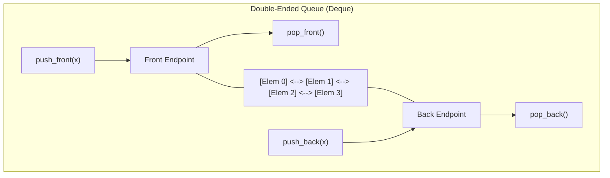

# Deques (Double-Ended Queues)

> [!NOTE]
> **Bidirectional Linear Sequence Access:** A **deque** (double-ended queue) unifies the capabilities of stacks and queues by supporting constant-time insertions and removals at both the front and back:
> - Subsumes LIFO stack behavior (`push_back`, `pop_back`) and FIFO queue behavior (`push_back`, `pop_front`).
> - Forms the foundation for sliding window algorithms and monotonic candidate tracking.
> - Reference implementations: [C++17 Implementation](../../implementations/cpp/deques.cpp) | [Python Implementation](../../implementations/python/deques.py)

> [!TIP]
> **Deque Implementation Comparison:**
>
> | Architecture | Memory Layout | `push/pop` Front/Back | Random Access (`dq[i]`) | Reallocation Cost |
> |---|---|---|---|---|
> | **Circular Buffer** | Single contiguous ring array | $O(1)$ amortized | $O(1)$ via modulo | $O(n)$ full array copy on expand |
> | **Chunked Block Array** | Array of fixed-size blocks (e.g. `std::deque`) | $O(1)$ amortized | $O(1)$ via block math | $O(\text{blocks})$ directory expansion |
> | **Doubly Linked List** | Separate heap node per item | $O(1)$ worst-case | $O(n)$ pointer traversal | Zero (no reallocation ever) |

> [!WARNING]
> **Critical Implementation Traps:**
> 1. **Modulo Index Arithmetic with Negative Offsets:** When pushing to the front, `front - 1` can be negative. Always add capacity before taking modulo: `front = (front - 1 + capacity) % capacity`.
> 2. **Physical vs. Logical Indexing:** A circular deque whose elements span physical slots $[6, 7, 0, 1]$ is logically contiguous. Do not assume index $0$ in memory is the logical front.
> 3. **Monotonic Deque Invariant:** In sliding-window problems, maintain strict monotonic order by popping all dominated candidates from the back before pushing the current element.




A **deque** is a double-ended queue.

It supports insertion and removal at **both ends**:

- front
- back

This makes it more flexible than either a stack or a queue:

- a stack allows access at one end
- a queue inserts at one end and removes at the other
- a deque supports both ends symmetrically

Deques are important in both algorithm design and systems engineering.

They appear in:

- sliding window algorithms
- monotonic queues
- palindrome checking
- undo/redo variants
- task buffering
- standard-library sequence containers

This chapter develops:

- deque operations and semantics
- circular-buffer implementations
- wrap-around indexing
- chunked or block-based deque layouts
- algorithmic uses such as sliding window maximum

---

## 1. What a deque supports

A deque typically supports:

- `push_front(x)`
- `push_back(x)`
- `pop_front()`
- `pop_back()`
- `front()`
- `back()`
- `empty()`
- `size()`

All of these are expected to be $ O(1) $, at least amortized.

That is the core goal of deque design.

---

## 2. Why deques are useful

A deque is useful when important work can arrive or leave at either end.

Examples:

- maintaining a sliding window
- storing candidates in monotonic order
- processing from both ends
- implementing both stacks and queues with one structure

A helpful rule is:

> if both the left edge and the right edge matter, think about a deque

---

## 3. Deque versus stack and queue

A deque generalizes both structures.

### As a stack
Use only one end:
- `push_back`
- `pop_back`

### As a queue
Use opposite ends:
- `push_back`
- `pop_front`

So a deque is strictly more flexible, though sometimes that flexibility is not needed.

---

## 4. Circular-buffer deque idea

One common deque implementation uses a circular buffer.

We keep:

- an array
- a front index
- a size

The elements occupy a cyclic segment of the array.

Then:

- `push_front` moves the front backward and writes
- `push_back` writes at the logical back
- `pop_front` advances the front
- `pop_back` reduces size

This gives efficient access at both ends.

---

## 5. Wrap-around indexing

If the physical array length is `cap`, then logical movement uses modulo arithmetic.

Examples:

- previous index of `i` is $ (i - 1 + cap) \bmod cap $
- next index of `i` is $ (i + 1) \bmod cap $

This wrap-around is what makes the array behave like a ring.

Understanding this clearly is essential for deque implementation.

---

## 6. C++17 circular-buffer deque

```cpp
#include <vector>
#include <stdexcept>

template <typename T>
class CircularDeque {
public:
    explicit CircularDeque(int capacity)
        : data_(capacity), front_(0), size_(0) {}

    bool empty() const { return size_ == 0; }
    bool full() const { return size_ == static_cast<int>(data_.size()); }
    int size() const { return size_; }

    void push_front(const T& value) {
        if (full()) {
            throw std::overflow_error("deque overflow");
        }
        front_ = (front_ - 1 + data_.size()) % data_.size();
        data_[front_] = value;
        ++size_;
    }

    void push_back(const T& value) {
        if (full()) {
            throw std::overflow_error("deque overflow");
        }
        int idx = (front_ + size_) % data_.size();
        data_[idx] = value;
        ++size_;
    }

    void pop_front() {
        if (empty()) {
            throw std::underflow_error("deque underflow");
        }
        front_ = (front_ + 1) % data_.size();
        --size_;
    }

    void pop_back() {
        if (empty()) {
            throw std::underflow_error("deque underflow");
        }
        --size_;
    }

    const T& front() const {
        if (empty()) {
            throw std::underflow_error("deque underflow");
        }
        return data_[front_];
    }

    const T& back() const {
        if (empty()) {
            throw std::underflow_error("deque underflow");
        }
        int idx = (front_ + size_ - 1) % data_.size();
        return data_[idx];
    }

private:
    std::vector<T> data_;
    int front_;
    int size_;
};
```

---

## 7. Python circular-buffer deque

```python
class CircularDeque:
    def __init__(self, capacity):
        self.data = [None] * capacity
        self.front_idx = 0
        self.n = 0

    def empty(self):
        return self.n == 0

    def full(self):
        return self.n == len(self.data)

    def size(self):
        return self.n

    def push_front(self, value):
        if self.full():
            raise OverflowError("deque overflow")
        self.front_idx = (self.front_idx - 1) % len(self.data)
        self.data[self.front_idx] = value
        self.n += 1

    def push_back(self, value):
        if self.full():
            raise OverflowError("deque overflow")
        idx = (self.front_idx + self.n) % len(self.data)
        self.data[idx] = value
        self.n += 1

    def pop_front(self):
        if self.empty():
            raise IndexError("deque underflow")
        value = self.data[self.front_idx]
        self.front_idx = (self.front_idx + 1) % len(self.data)
        self.n -= 1
        return value

    def pop_back(self):
        if self.empty():
            raise IndexError("deque underflow")
        idx = (self.front_idx + self.n - 1) % len(self.data)
        value = self.data[idx]
        self.n -= 1
        return value

    def front(self):
        if self.empty():
            raise IndexError("deque underflow")
        return self.data[self.front_idx]

    def back(self):
        if self.empty():
            raise IndexError("deque underflow")
        idx = (self.front_idx + self.n - 1) % len(self.data)
        return self.data[idx]
```

---

## 8. Dynamic circular-buffer deques

A fixed-capacity deque is useful in bounded settings, but many general-purpose deques must grow.

A common strategy is:

- use a circular buffer
- when full, allocate a larger array
- copy elements in logical order into the new array
- reset `front = 0`

This gives amortized $ O(1) $ insertion at both ends.

So the same amortized-growth idea from dynamic arrays appears again.

---

## 9. Why amortized $ O(1) $ still holds

Resizing is occasional.

If capacity grows geometrically, the total copying work across many operations is linear in the number of inserted elements.

So although one resize step may cost $ O(n) $, the average insertion cost remains constant.

This is the standard amortized argument.

---

## 10. Linked-list deques

A deque can also be implemented with a doubly linked list.

Then:

- front insert/remove touches the head
- back insert/remove touches the tail

All of these are worst-case $ O(1) $.

This is conceptually simple, but pointer overhead can be high.

---

## 11. C++17 doubly linked deque

```cpp
#include <stdexcept>

template <typename T>
class LinkedDeque {
private:
    struct Node {
        T value;
        Node* prev;
        Node* next;
        Node(const T& value) : value(value), prev(nullptr), next(nullptr) {}
    };

public:
    LinkedDeque() : head_(nullptr), tail_(nullptr), size_(0) {}

    ~LinkedDeque() {
        while (head_) {
            Node* next = head_->next;
            delete head_;
            head_ = next;
        }
    }

    bool empty() const { return size_ == 0; }
    int size() const { return size_; }

    void push_front(const T& value) {
        Node* node = new Node(value);
        node->next = head_;
        if (head_) head_->prev = node;
        else tail_ = node;
        head_ = node;
        ++size_;
    }

    void push_back(const T& value) {
        Node* node = new Node(value);
        node->prev = tail_;
        if (tail_) tail_->next = node;
        else head_ = node;
        tail_ = node;
        ++size_;
    }

    void pop_front() {
        if (!head_) throw std::underflow_error("deque underflow");
        Node* old = head_;
        head_ = head_->next;
        if (head_) head_->prev = nullptr;
        else tail_ = nullptr;
        delete old;
        --size_;
    }

    void pop_back() {
        if (!tail_) throw std::underflow_error("deque underflow");
        Node* old = tail_;
        tail_ = tail_->prev;
        if (tail_) tail_->next = nullptr;
        else head_ = nullptr;
        delete old;
        --size_;
    }

    const T& front() const {
        if (!head_) throw std::underflow_error("deque underflow");
        return head_->value;
    }

    const T& back() const {
        if (!tail_) throw std::underflow_error("deque underflow");
        return tail_->value;
    }

private:
    Node* head_;
    Node* tail_;
    int size_;
};
```

---

## 12. Array-backed vs linked-list deques

### Array-backed deque
Advantages:
- cache-friendly
- low per-element overhead
- excellent practical speed

Disadvantages:
- resizing logic is more involved
- fixed-capacity variants need overflow handling

### Linked-list deque
Advantages:
- simple endpoint updates
- worst-case $ O(1) $ operations without resizing

Disadvantages:
- extra pointers
- poor locality
- allocator overhead

In practice, array-backed deque designs are often preferred in performance-sensitive environments.

---

## 13. Chunked deque layouts

Many standard-library deques use a more advanced design than one flat circular array.

A common approach is a **chunked deque** or **block deque**:

- elements are stored in fixed-size blocks
- a separate map or directory points to those blocks
- front and back can grow by adding blocks

This reduces the cost of large contiguous reallocation while keeping better locality than a linked list.

---

## 14. Why chunked layouts are attractive

A chunked deque tries to balance two goals:

- avoid copying the entire sequence on every large expansion
- avoid the poor locality of one-node-per-element linked lists

By storing many elements per block, it gets a middle ground:

- endpoint growth is efficient
- random access is still reasonable
- memory layout is better than a pure linked list

This is why many real deques use blocks internally.

---

## 15. Conceptual chunked deque structure

A chunked deque may maintain:

- an array of block pointers
- a block size such as 32, 64, or another tuned value
- offsets for the front and back positions

When the current front block fills, allocate a new block on the left.
When the current back block fills, allocate a new block on the right.

This gives stable endpoint operations without moving all elements.

---

## 16. Sliding window motivation

One of the most important algorithmic uses of a deque is the **sliding window** pattern.

Suppose we process an array left to right while maintaining a window of recent elements.

We often need to:

- add new elements at the back
- remove expired elements from the front

That is exactly deque behavior.

This makes deques a natural fit for many window problems.

---

## 17. Sliding window maximum idea

In the **sliding window maximum** problem, we want the maximum value in every window of fixed length $ k $.

A plain deque can help, but the most powerful version is a **monotonic deque** storing candidate indices in decreasing value order.

Then:

- the front always holds the current maximum
- expired indices are removed from the front
- weaker candidates are removed from the back

This yields linear time.

---

## 18. Why monotonic deque works

Suppose a new value is greater than or equal to some values at the back.

Those smaller back values can never become the maximum while the new value remains in the window.

So we remove them.

This keeps the deque useful and ordered.

Every index enters once and leaves once, so total work is linear.

---

## 19. Python sliding window maximum with deque discipline

```python
from collections import deque

def sliding_window_max(nums, k):
    dq = deque()  # stores indices
    result = []

    for i, x in enumerate(nums):
        while dq and dq[0] <= i - k:
            dq.popleft()

        while dq and nums[dq[-1]] <= x:
            dq.pop()

        dq.append(i)

        if i >= k - 1:
            result.append(nums[dq[0]])

    return result
```

This is one of the most important practical algorithmic uses of deques.

---

## 20. C++17 sliding window maximum

```cpp
#include <vector>
#include <deque>

std::vector<int> sliding_window_max(const std::vector<int>& nums, int k) {
    std::deque<int> dq; // indices
    std::vector<int> result;

    for (int i = 0; i < static_cast<int>(nums.size()); ++i) {
        while (!dq.empty() && dq.front() <= i - k) {
            dq.pop_front();
        }

        while (!dq.empty() && nums[dq.back()] <= nums[i]) {
            dq.pop_back();
        }

        dq.push_back(i);

        if (i >= k - 1) {
            result.push_back(nums[dq.front()]);
        }
    }

    return result;
}
```

---

## 21. Circular-buffer wrap-around example

Suppose capacity is 8 and the current logical deque occupies:

- physical positions 6, 7, 0, 1

This is normal.

The physical array is not the same as the logical order.

The logical front is at position 6, and the logical back is at position 1.

This example helps explain why modulo indexing is necessary.

---

## 22. Complexity summary

### Circular-buffer deque
- `push_front`: $ O(1) $, amortized if dynamic
- `push_back`: $ O(1) $, amortized if dynamic
- `pop_front`: $ O(1) $
- `pop_back`: $ O(1) $
- `front`: $ O(1) $
- `back`: $ O(1) $

### Linked-list deque
- all endpoint operations: $ O(1) $

This is the central performance profile.

---

## 23. Common mistakes

### Mistake 1: confusing physical order with logical order
In circular arrays, wrapped elements are still contiguous logically.

### Mistake 2: forgetting modulo wrap-around
This breaks front/back movement.

### Mistake 3: not distinguishing full from empty
A circular design usually needs size tracking or a reserved slot convention.

### Mistake 4: using linked lists when locality matters more
Linked deques may be slower in practice despite good asymptotic bounds.

### Mistake 5: misunderstanding monotonic deque logic
The deque stores only useful candidates, not every element.

### Mistake 6: forgetting to remove expired indices in sliding-window problems
Then answers become incorrect.

---

## 24. Recognition checklist

A deque is a strong fit when you need:

- insertions and removals at both ends
- sliding window maintenance
- monotonic window candidates
- front and back access together

These are strong signs.

---

## 25. Summary

A deque is a double-ended queue supporting efficient operations at both front and back.

Important implementation styles include:

- circular buffers
- doubly linked lists
- chunked block layouts

The most important practical ideas are:

- wrap-around indexing in circular buffers
- amortized growth for dynamic array-backed designs
- monotonic deque use in sliding-window algorithms

Deques are a key bridge between basic linear data structures and more advanced algorithmic patterns.

---

## 26. Practice prompts

1. What operations distinguish a deque from a queue?
2. Why is wrap-around indexing necessary in a circular deque?
3. What information must a circular deque track?
4. Why can array-backed deques be faster than linked-list deques in practice?
5. What is a chunked deque layout?
6. Why is a deque natural for sliding windows?
7. What does a monotonic deque store in the sliding-window maximum problem?
8. Why can smaller values at the back be discarded in sliding-window maximum?
9. Why do chunked deques often outperform node-by-node linked structures?
10. When should you choose a deque instead of a stack or queue?
