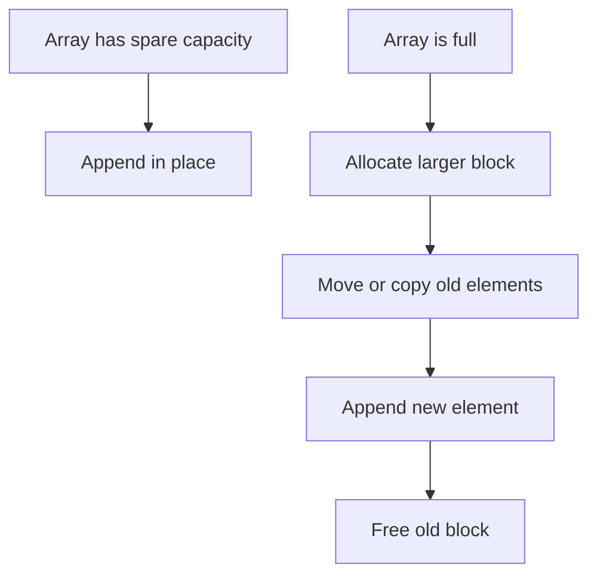

# Dynamic Arrays and Strings

> [!NOTE]
> Dynamic arrays and dynamic strings provide contiguous, indexable storage with amortized $O(1)$ append by growing capacity geometrically, making them one of the most important and practical foundations of modern software systems.

> [!TIP]
> **Core Tradeoff Rule**: If you need indexed access, contiguous scans, and amortized append, dynamic arrays are the default choice. If you need stable node identity or frequent splicing, consider linked structures instead.

---

## 1. Why This Matters

Static arrays are simple and fast, but their size is fixed. Real programs need collections that can grow:

- logs that accumulate events
- parser buffers that absorb input
- strings built incrementally
- vectors of records in analytics pipelines
- dynamic work queues in systems code

A dynamic array solves this by combining:

- contiguous memory
- $O(1)$ indexing
- efficient sequential iteration
- amortized $O(1)$ append
- explicit capacity management

Dynamic strings are the same core idea specialized for characters or bytes.

This structure matters because it is the default sequence container in many ecosystems:

- C++ `std::vector` and `std::string`
- Rust `Vec<T>` and `String`
- Go slices (`reflect.SliceHeader`)
- Java `ArrayList`
- Python `list` (backed by `PyListObject`)
- many kernel and user-space buffer abstractions

It is also one of the best examples of the gap between theoretical and practical performance. In theory, linked lists offer elegant insertion properties. In practice, dynamic arrays often dominate because contiguous memory works with caches, prefetchers, and modern allocators far better.

---

## 2. Core Intuition & Visual Model

### Mental Model

A dynamic array has two distinct notions of size:

- **size**: how many elements are logically present
- **capacity**: how many elements can fit before reallocation is needed

When the array is full and you append one more element, it allocates a larger contiguous block, copies or moves the existing elements, then continues.

### Visual Model



### Example

```text
size = 4, capacity = 8

Index:    0   1   2   3   4   5   6   7
Data:    [A] [B] [C] [D] [ ] [ ] [ ] [ ]
```

Append `E`:

```text
size = 5, capacity = 8

Index:    0   1   2   3   4   5   6   7
Data:    [A] [B] [C] [D] [E] [ ] [ ] [ ]
```

Now suppose `size = capacity = 8` and we append again. The array must grow:

```text
Old block capacity 8  ->  New block capacity 16

Old: [A B C D E F G H]
New: [A B C D E F G H I _ _ _ _ _ _ _]
```

The expensive step is not every append. It happens only at occasional growth points. That is why the average, or **amortized**, append cost remains constant.

---

## 3. Formal Definition & Invariants

A dynamic array maintains:

- a pointer to contiguous storage
- a logical size $n$
- a capacity $c$, where $0 \le n \le c$

### Core Invariants

1. **Contiguity invariant**: All elements occupy consecutive memory locations.
2. **Size-capacity invariant**: The logical size never exceeds the capacity ($n \le c$).
3. **Indexing invariant**: Element $i$ is accessible in $O(1)$ time by direct address arithmetic (`base + i * sizeof(T)`).
4. **Growth invariant**: When reallocation occurs, a larger contiguous block is created and the old elements are copied or moved into it.
5. **Order-preservation invariant**: Reallocation preserves element order.

For dynamic strings, these invariants are identical, with the element type usually being `char`, `uint8_t`, or a UTF code unit.

---

## 4. Key Operations & Complexity

| Operation | Average Case | Worst Case | Space (Auxiliary) | Description |
| :--- | :--- | :--- | :--- | :--- |
| `Index(i)` | $O(1)$ | $O(1)$ | $O(1)$ | Direct access by offset |
| `Append(x)` | $O(1)$ amortized | $O(n)$ | $O(1)$ or $O(n)$ during growth | Add element at end |
| `PopBack()` | $O(1)$ | $O(1)$ | $O(1)$ | Remove last element |
| `Reserve(k)` | $O(n)$ only if growth occurs | $O(n)$ | $O(n)$ during reallocation | Ensure capacity at least $k$ |
| `Resize(k)` | $O(|k-n|)$ plus possible growth | $O(n)$ | depends | Change logical size |
| `Insert(pos, x)` | $O(n)$ | $O(n)$ | $O(1)$ or $O(n)$ if growth | Shift suffix right |
| `Erase(pos)` | $O(n)$ | $O(n)$ | $O(1)$ | Shift suffix left |
| Sequential iteration | $O(n)$ | $O(n)$ | $O(1)$ | Cache-friendly stream traversal |

### State Transition Summary

- **Append without growth ($n < c$)**:
  1. Write new element into `data[size]`.
  2. Increment `size` ($\Delta \Phi = +2$ virtual credits stored).
- **Append with growth ($n = c$)**:
  1. Allocate larger contiguous buffer of physical capacity $\lceil g \cdot c \rceil$.
  2. Move or copy $n$ existing elements into the new block.
  3. Deallocate the old memory block.
  4. Update `data` pointer and physical `capacity`.
  5. Write the new element into `data[size]` and increment `size`.

---

## 5. The Amortized Math: Why Geometric Growth Works

This is the central mathematical principle underpinning dynamic arrays.

### 5.1 Aggregate Analysis for Geometric Growth

Suppose capacity grows by a constant factor $g > 1$. For simplicity, imagine capacities:

$$1,\ g,\ g^2,\ g^3,\ \dots$$

Each reallocation copies all current elements.

If the final size is about $n$, then the total number of moved elements across all growth steps is:

$$1 + g + g^2 + \dots + g^k$$

where $g^k \approx n$.

This is a standard geometric series:

$$1 + g + g^2 + \dots + g^k = \frac{g^{k+1}-1}{g-1}$$

Since $g^k \approx n$, this evaluates to $O(n)$.

That means the **total** reallocation work across $n$ appends is strictly linear, so the amortized cost per append is:

$$\frac{O(n)}{n} = O(1)$$

> [!IMPORTANT]
> If capacity grows geometrically by any fixed factor $g > 1$, append is amortized $O(1)$.

---

### 5.2 Why Arithmetic Growth Fails

Now suppose capacity grows by a fixed additive amount $k$:

$$k,\ 2k,\ 3k,\ 4k,\ \dots$$

To reach size $n$, there are about $n/k$ reallocations.

The copied work is:

$$k + 2k + 3k + \dots + mk$$

for $m \approx n/k$.

This sums to:

$$k \cdot \frac{m(m+1)}{2} = \Theta(m^2 k)$$

Since $m = \Theta(n/k)$, total work becomes $\Theta(n^2)$, meaning amortized append degrades to $\Theta(n)$.

> [!CAUTION]
> Arithmetic growth collapses performance to quadratic time. Geometric growth is an absolute requirement for practical dynamic arrays.

---

### 5.3 Potential-Method Intuition

Using the physicist's potential method ($\Phi$):
- Let each cheap append deposit 3 units of virtual credit:
  - 1 credit pays for the immediate write into the buffer.
  - 1 credit is saved with the newly written element.
  - 1 credit is stored to pay for copying an older element that has not yet contributed to future reallocations.
- When capacity is reached and the array must double, every element in the array has already accumulated exactly 1 credit of prepaid copying cost.
- The expensive reallocation step consumes this stored potential ($\Delta \Phi$), resulting in an amortized cost of $O(1)$ per operation.

---

## 6. Growth Factor Engineering: 2.0 vs 1.5 vs Allocator Reuse

The growth factor is not just an asymptotic constant; it directly governs:
- memory headroom waste
- copy frequency
- allocator reuse & fragmentation
- peak RSS and latency spikes

### 6.1 The Tradeoff Landscape

- **Larger factor ($g = 2.0$)**: Fewer reallocations, fewer copies, but higher memory waste (up to $50\%$ tail headroom) and severe allocator fragmentation.
- **Smaller factor ($g = 1.5$)**: Tighter memory usage, better chances of allocator reuse, lower peak RSS, at the cost of slightly more frequent reallocations.

---

### 6.2 Why Factor 2.0 Harms Allocator Reuse

If capacities double:

$$1,\ 2,\ 4,\ 8,\ 16,\ \dots,\ 2^k$$

The sum of all previously freed smaller blocks is:

$$\sum_{i=0}^{k-1} 2^i = 2^k - 1$$

The next required block has size $2^k$, which is strictly greater than the sum of all previously freed blocks combined:

$$2^k - 1 < 2^k$$

**Physical Consequence**: Even if all previously deallocated buffers are adjacent in the virtual address space and fully coalesced by the heap allocator, their total contiguous size can **never** satisfy the next allocation request. The allocator is forced to continually carve out fresh virtual memory at higher addresses, leading to address-space bloat and fragmentation.

---

### 6.3 Why Factor 1.5 ($g < \phi$) Enables Heap Recycling

Let the growth factor be $g$. For the accumulated freed memory to eventually satisfy a future allocation request:

$$\sum_{i=0}^{k-1} g^i \ge g^k \implies \frac{g^k - 1}{g - 1} \ge g^k$$

Asymptotically:

$$\frac{1}{g - 1} \ge 1 \implies g \le 2$$

To ensure that old chunks reliably coalesce with safety margins, the mathematical golden-ratio threshold is:

$$g < \phi = \frac{1 + \sqrt{5}}{2} \approx 1.618$$

This is why factor $1.5$ (used in MSVC STL, Facebook's `folly::fbvector`, and Java's `ArrayList`) is chosen in memory-sensitive systems:
- After a small sequence of reallocations, the freed memory blocks coalesce to satisfy the next allocation in place.
- Drastically lowers fragmentation pressure in long-running services.

### Measured Empirical Verification (`benchmarks/growth_factor_1_5_vs_2_0.cpp`)

Tested on $N = 20,000,000$ sequential appends without pre-allocation:

| Metric | Factor 2.0x (GCC/Clang) | Factor 1.5x (MSVC/Folly) | Empirical Tradeoff |
| :--- | :--- | :--- | :--- |
| **Number of Reallocations** | 26 | 43 | 1.5x triggers ~1.7x more reallocations |
| **Total Elements Copied** | 33,554,431 | 53,813,974 | 1.60x more copying |
| **Final Allocated Capacity** | 33,554,432 (128 MB) | 26,906,977 (102 MB) | **1.5x saves 26 MB of RAM** |
| **Tail Wasted Capacity (%)** | 40.40% | 25.67% | **14.73% less wasted memory headroom** |
| **Wall-Clock Realloc Time** | 109.41 ms | 114.33 ms | 2.0x slightly faster (fewer realloc calls) |

---

## 7. Reserve vs. Resize

This distinction is one of the most common sources of production bugs and interview mistakes.

### `reserve(k)`
- Changes **capacity** only.
- Guarantees space for at least $k$ elements without triggering reallocation.
- Logical size remains unchanged; no elements are constructed or initialized.
- Indexing into newly reserved slots (`vec[k-1]`) is **undefined behavior**.

### `resize(k)`
- Changes the **logical size**.
- If $k > n$, new default-constructed elements are instantiated.
- If $k < n$, surplus elements are destroyed.

```text
Initial:
size = 3, capacity = 4
[A B C _]

reserve(10):
size = 3, capacity = 10
[A B C _ _ _ _ _ _ _]

resize(6):
size = 6, capacity = 10
[A B C x x x _ _ _ _]  (where x denotes constructed default elements)
```

---

## 8. Reallocation, Moves, and Invalidation Rules

### 8.1 Invalidation Mechanics

1. **On Growth Reallocation**:
   If capacity is exceeded, storage is reallocated elsewhere. **All pointers, iterators, and references to all elements are immediately invalidated**.
2. **On Middle Insert or Erase**:
   Even if capacity is sufficient, shifting elements invalidates all iterators and references pointing at or beyond the modification point.

### 8.2 Virtual-Memory Optimizations

- **`realloc` (C standard library)**: The allocator attempts in-place virtual page expansion before allocating a new block and copying.
- **`mremap` (Linux kernel)**: For allocations backed by `mmap`, `mremap` modifies virtual page table mappings directly, moving gigabyte buffers in microseconds without physical memory copies.

---

## 9. Small String Optimization (SSO) & Small Vector Optimization (SVO)

Most strings and vectors in production code are short (e.g. UUIDs, enum names, JSON keys, HTTP headers). Allocating 8–16 byte payloads on the heap incurs massive allocator overhead.

### 9.1 The 24-Byte Layout (64-bit Architecture)

A standard heap-allocated vector or string stores 3 words (24 bytes):
- Data pointer (`char*` / `T*`): 8 bytes
- Size (`size_t`): 8 bytes
- Capacity (`size_t`): 8 bytes

SSO repurposes this identical 24-byte footprint via a union:

```text
Heap Mode (24 bytes):
+--------------------+--------------------+--------------------+
|  char* data_ptr    |   size_t size      |  size_t capacity   |
+--------------------+--------------------+--------------------+

Inline / SSO Mode (24 bytes):
+-------------------------------------------------+------------+
|        char inline_buffer[22 or 15 bytes]       | size/flags |
+-------------------------------------------------+------------+
```

- **GCC `libstdc++` (15-byte SSO)**: Stores 15 characters inline plus a null terminator and metadata.
- **Clang `libc++` (22-byte SSO)**: Uses a clever bit-stealing trick in the lowest flag bit to store up to 22 characters inline on 64-bit platforms.

### Benefits in High-Performance Systems
- **Zero heap allocation** for short strings.
- Completely avoids allocator locks and heap fragmentation.
- Inline buffer is cache-resident within the containing struct.

---

## 10. Hardware Locality & Cache Reality

Dynamic arrays are the canonical example of hardware-friendly memory layout.

### Why Contiguous Memory Dominates

1. **Spatial Locality**: When element `arr[i]` is loaded, the hardware cache line (64 bytes) automatically pulls in the next 15 integers into L1 cache for free.
2. **Hardware Stream Prefetcher**: Modern CPUs detect sequential memory access patterns and aggressively prefetch subsequent cache lines ahead of execution.
3. **No Pointer Chasing**: Zero indirection delays; no dependency chains between successive loads.

### Physical Benchmark: `std::vector` vs. `std::list` (`benchmarks/vector_vs_linked_list.cpp`)

Executed on $N = 10,000,000$ elements:

| Metric | `std::vector` (Contiguous) | `std::list` (Linked Nodes) | Empirical Reality |
| :--- | :--- | :--- | :--- |
| **Memory Footprint (Payload)** | 38 MB | 190 MB (excl. heap headers) | **Vector uses 6.0x less RAM** |
| **Allocation Latency (10M appends)** | 21.01 ms | 315.28 ms | **Vector is 15.0x faster** |
| **Sequential Traversal (Sum)** | 25.46 ms | 37.85 ms | **Vector wins via L1 stream prefetch** |

> [!NOTE]
> In real-world fragmented heaps where list nodes are non-contiguously dispersed across different memory pages, traversal latency degrades by 10x–50x due to cache line misses and TLB churn.

---

## 11. Production Systems & Real-World Implementations

- **C++ `std::vector` & `std::string`**: Industry standard contiguous containers with RAII, move semantics, and allocator support.
- **Rust `Vec<T>` & `String`**: Triple-word layout (`ptr`, `cap`, `len`) with strict compile-time borrow checking preventing iterator invalidation at compile time.
- **Go Slices**: Lightweight 24-byte structs (`reflect.SliceHeader` with `Data`, `Len`, `Cap`) pointing to underlying contiguous backing arrays.
- **Linux Kernel Buffers**: Page-aligned contiguous buffers (`alloc_pages`, `kmalloc`) favored for network packet descriptors (`sk_buff`) to maximize DMA and ring buffer streaming throughput.

---

## 12. Verified Implementations

Tested reference implementations with full unit test suites are available in the repository:
- **C++17 Implementation**: [`implementations/cpp/dynamic_array.cpp`](../../implementations/cpp/dynamic_array.cpp) (Rule-of-5 RAII, bounds checking, geometric resizing, and move semantics).
- **Python Implementation**: [`implementations/python/dynamic_array.py`](../../implementations/python/dynamic_array.py) (Contiguous memory array backed by `ctypes.py_object` buffers with full `unittest` suite).

### Python Conceptual Walkthrough

```python
import ctypes

class DynamicArray:
    """Contiguous dynamic array backed by ctypes py_object."""

    def __init__(self):
        self._size = 0
        self._capacity = 1
        self._array = (self._capacity * ctypes.py_object)()

    def append(self, value):
        if self._size == self._capacity:
            self._resize(2 * self._capacity)
        self._array[self._size] = value
        self._size += 1

    def _resize(self, new_capacity):
        new_array = (new_capacity * ctypes.py_object)()
        for i in range(self._size):
            new_array[i] = self._array[i]
        self._array = new_array
        self._capacity = new_capacity

    def __getitem__(self, index):
        if not 0 <= index < self._size:
            raise IndexError("Index out of bounds")
        return self._array[index]
```

### C++17 Conceptual Walkthrough

```cpp
#include <cstddef>
#include <stdexcept>
#include <utility>

template <typename T>
class DynamicArray {
private:
    T* data_{nullptr};
    std::size_t size_{0};
    std::size_t capacity_{0};

    void reallocate(std::size_t new_cap) {
        T* new_data = new T[new_cap];
        for (std::size_t i = 0; i < size_; ++i) {
            new_data[i] = std::move(data_[i]);
        }
        delete[] data_;
        data_ = new_data;
        capacity_ = new_cap;
    }

public:
    DynamicArray() = default;
    ~DynamicArray() { delete[] data_; }

    void push_back(const T& val) {
        if (size_ == capacity_) {
            reallocate(capacity_ == 0 ? 1 : capacity_ * 2);
        }
        data_[size_++] = val;
    }

    T& operator[](std::size_t idx) { return data_[idx]; }
    std::size_t size() const noexcept { return size_; }
    std::size_t capacity() const noexcept { return capacity_; }
};
```

---

## 13. When NOT to Use This

1. **Frequent Arbitrary Insertions/Deletions**: Shifting elements requires $O(n)$ memory writes; use a linked list or unrolled list.
2. **Stable References Required**: If external code holds pointers to elements across mutations, dynamic array reallocation will cause dangling pointers; use an intrusive linked list or node-based structure.
3. **Cyclic Streaming Buffers**: For fixed-capacity queues or producer-consumer pipelines, use a contiguous **Ring Buffer** (`ring-buffers.md`) instead of resizing.
4. **Heavy Mid-Document Text Editing**: Frequent insertions in large texts trigger massive copies; use **Gap Buffers**, **Ropes**, or **Piece Tables**.

---

## 14. Common Pitfalls & Interview Traps

### 1. `std::vector<bool>` Proxy Reference Trap
`std::vector<bool>` is a space-optimized specialization packing 8 booleans per byte. Calling `auto& x = vec[0];` fails to compile because `operator[]` returns a temporary `std::vector<bool>::reference` proxy object, not a real `bool&`.

### 2. Iterator Invalidation in Loops
```cpp
// BUG: Reallocation inside loop invalidates 'it' and 'vec.end()'
for (auto it = vec.begin(); it != vec.end(); ++it) {
    if (*it == target) vec.push_back(42); 
}
```

### 3. `shrink_to_fit()` is Non-Binding
In C++, `shrink_to_fit()` is a non-binding request. To guarantee deallocation of excess capacity, use the swap idiom:
```cpp
std::vector<T>(vec).swap(vec);
```

---

## 15. Curated Problems & Practice

| Problem | Platform | Difficulty | Core Concept |
| :--- | :--- | :--- | :--- |
| **[LeetCode 622 — Design Circular Queue](https://leetcode.com/problems/design-circular-queue/)** | LeetCode | Medium | Contiguous circular buffer indexing without resizing |
| **[LeetCode 641 — Design Circular Deque](https://leetcode.com/problems/design-circular-deque/)** | LeetCode | Medium | Bidirectional contiguous buffer management |
| **[LeetCode 443 — String Compression](https://leetcode.com/problems/string-compression/)** | LeetCode | Medium | In-place contiguous string buffer compaction |
| **[LeetCode 271 — Encode and Decode Strings](https://leetcode.com/problems/encode-and-decode-strings/)** | LeetCode | Medium | Serialization and contiguous string buffer sizing |

---

## 16. Further Reading & Cross-References

- **Machine Model**: [`cpu-cache-and-memory.md`](../03-machine-model-and-performance/cpu-cache-and-memory.md) — Hardware prefetching, cache lines, and spatial locality.
- **Tradeoff Engineering**: [`theoretical-vs-practical-performance.md`](../22-benchmarking-and-tradeoffs/theoretical-vs-practical-performance.md) — Big-O theory vs. physical hardware reality.
- **Next in Cluster B**:
  - [`linked-lists.md`](linked-lists.md) — Pointer chasing, intrusive lists, and node cache overhead.
  - [`ring-buffers.md`](ring-buffers.md) — Lock-free SPSC queues, Linux `kfifo`, and modular ring indexing.
