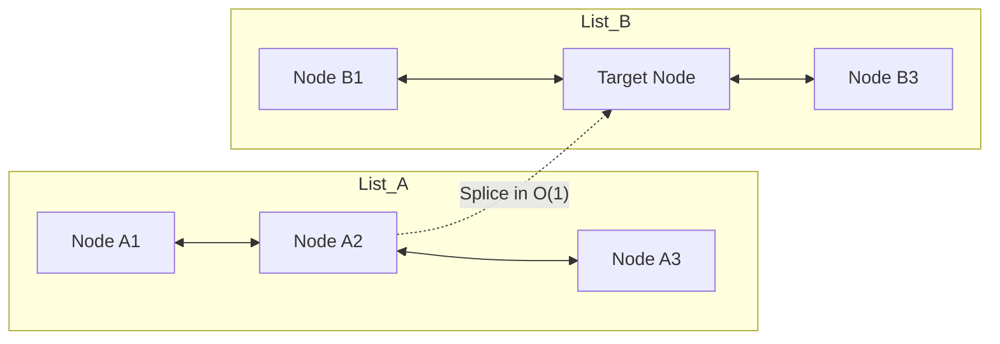
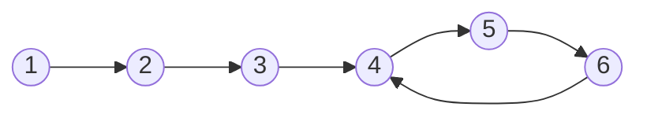

# Linked Lists

> [!NOTE]
> A linked list stores elements as separate nodes connected by pointers. This makes local node re-linking and splicing very cheap, but usually sacrifices memory efficiency, cache locality, and traversal speed compared with contiguous arrays.

> [!TIP]
> The real strength of linked lists is **not** "fast middle insertion" in general. Their real strength is **$O(1)$ re-linking when you already hold the node or iterator**.

> [!WARNING]
> If you do not already hold a direct pointer or iterator to the target position, linked-list insertion is dominated by the $O(n)$ pointer-chasing traversal needed to locate that position.

---

## 1. Why This Matters

Linked lists are one of the first dynamic data structures taught in computer science.

They are used to introduce:
- pointers and dynamic memory management
- insertion and deletion without memory relocation
- traversal and structural invariants
- node-based container architectures

However, they are also one of the most misunderstood structures. Textbooks frequently emphasize $O(1)$ insertion and $O(1)$ deletion, leading developers to assume linked lists are generally faster than arrays for mutable sequences. In modern hardware systems, that assumption is almost always false.

Linked lists matter because they teach a critical systems engineering lesson:

> A theoretically optimal asymptotic property can lose dramatically in practice when hardware memory hierarchy, cache line utilization, and traversal costs are accounted for.

They remain indispensable in specialized domains:
- when **stable node identity** is mandatory (pointers to elements must never be invalidated by container mutations)
- when you already possess direct node handles (e.g. hash-mapped nodes in an LRU cache)
- when **$O(1)$ splicing** of entire ranges between lists is required without allocations or copies
- when building **intrusive systems containers** (such as the Linux kernel's `struct list_head`)
- when implementing classic pointer patterns such as Floyd's cycle detection

---

## 2. Core Intuition & Visual Model

A linked list stores each element in an independently allocated heap node. Each node contains:
- the payload data
- one or more pointers to adjacent nodes

Instead of occupying contiguous physical memory, nodes are scattered across the heap address space.

### Singly Linked List

Each node stores a payload and a forward pointer:

```text
[A|•] -> [B|•] -> [C|•] -> null
```

### Doubly Linked List

Each node stores backward and forward links:

```text
null <- [•|A|•] <-> [•|B|•] <-> [•|C|•] -> null
```

### Circular Linked List

The tail wraps directly back to the head:

```text
[A] -> [B] -> [C]
 ^             |
 |_____________|
```

### Mental Model

A linked list is a decentralized web of nodes optimized for **local pointer rewiring**, completely sacrificing random indexing and spatial cache locality.

---

## 3. Formal Definition & Invariants

A linked list is a node-based sequence structure where each node represents one element and stores links to adjacent nodes.

### Singly Linked List Invariants
1. Each node stores a value and a `next` pointer.
2. The final node points to `null`.
3. The `head` pointer references the first node, or is `null` if empty.

### Doubly Linked List Invariants
1. Each node stores `prev`, `data`, and `next`.
2. For any internal node $x$:
   - If $x.\text{next} = y$, then $y.\text{prev} = x$.
   - If $x.\text{prev} = z$, then $z.\text{next} = x$.
3. The head node has $x.\text{prev} = \text{null}$ (unless using circular sentinels).
4. The tail node has $x.\text{next} = \text{null}$ (unless using circular sentinels).

### Sentinel-Node Invariant
Production doubly linked lists use sentinel (dummy) nodes at the boundaries:
- A dummy `head` and dummy `tail`, or a single circular root sentinel.
- **Invariant**: The list is never empty at the pointer level; `head.next` always points to either a valid node or `tail`.
- Eliminates edge-case null checks during insertion, deletion, and splicing.

---

## 4. Physical Node Memory Overhead & Layout

This is why linked lists lose so decisively to contiguous arrays in practice.

### 4.1 Node Anatomy on 64-Bit Architectures

Suppose your payload is a single 4-byte integer or an 8-byte pointer/timestamp:

```text
64-bit Doubly Linked Node:
+-------------------+-------------------+-------------------+
|  Node* prev (8B)  |   Payload (8B)    |  Node* next (8B)  |
+-------------------+-------------------+-------------------+
= 24 bytes payload + pointers

Heap Allocator Chunk (glibc malloc / jemalloc):
+-------------------+---------------------------------------+
| Header (8-16B)    |  User Payload & Pointers (24-32B)     |
+-------------------+---------------------------------------+
= 32 to 48 bytes physical RAM per node!
```

### Memory Efficiency Comparison
- For an 8-byte payload:
  - `std::vector<int64_t>`: **8 bytes** per element ($100\%$ payload density).
  - `std::list<int64_t>`: **32–48 bytes** per element (**$75\%$ to $83\%$ memory overhead**).

### Physical Consequence
- Only 1 or 2 linked list nodes fit inside a single 64-byte L1 CPU cache line.
- An array fits 8 to 16 elements in that identical cache line.
- Iterating a linked list forces the CPU memory bus to fetch 4x–6x more bytes, mostly consisting of pointer metadata.

---

## 5. List Variants & Architectural Taxonomy

| Variant | Pointers / Node | Directionality | Memory Overhead | Best Production Fit |
| :--- | :--- | :--- | :--- | :--- |
| **Singly Linked** | 1 (`next`) | Forward only | Low (8B / node) | Free lists, memory pools, simple LIFO chains |
| **Doubly Linked** | 2 (`prev`, `next`) | Bidirectional | High (16B / node) | LRU cache recency lists, Deques |
| **Circular Linked** | 1 or 2 | Cyclic | Low / High | Schedulers, round-robin dispatch queues |
| **Intrusive List** | 2 (`prev`, `next`) | Bidirectional | **Zero heap wrapper overhead** | Operating system kernels (Linux `struct list_head`) |

---

### 5.4 Intrusive Linked Lists (The Linux Kernel Pattern)

In a traditional **non-intrusive** container (`std::list<T>`), the container manages independent wrapper nodes that point to or contain $T$. Each insertion invokes `malloc()`.

In an **intrusive** list, the links are embedded directly within the data structure itself:

```c
// Linux kernel <linux/types.h>
struct list_head {
    struct list_head *next, *prev;
};

// User data structure
struct task_struct {
    pid_t pid;
    char comm[16];
    struct list_head tasks; // Embedded list node!
};
```

To recover the parent struct from a pointer to `tasks`, the kernel uses the famous `container_of` macro:

```c
#define container_of(ptr, type, member) ({                      \
    const typeof( ((type *)0)->member ) *__mptr = (ptr);        \
    (type *)( (char *)__mptr - offsetof(type, member) );})
```

#### Why Kernels Use Intrusive Containers
1. **Zero Allocator Overhead**: Inserting an object into 5 different lists requires zero heap allocations. The object simply embeds 5 `struct list_head` members.
2. **Predictable Latency**: No risk of `ENOMEM` or allocator lock contention during list insertion.
3. **Cache Line Sharing**: Node pointers reside on the same cache line as the payload itself.

---

## 6. The $O(1)$ Insertion/Deletion Myth vs. Reality

### 6.1 The Textbook Myth

Textbooks frequently state: *"Linked lists have $O(1)$ middle insertion."*

In practice:
- Unless you already possess an exact pointer or iterator to the insertion target, you must traverse from the head.
- Traversal costs:

$$O(n)$$

Because linked-list traversal is non-contiguous, pointer-chasing, and branch-unfriendly, finding the target index $k$ is dramatically slower than searching an array.

### 6.2 The True Superpower: $O(1)$ Splicing

Linked lists truly dominate when you **already possess the node pointer**. Splicing an entire chain or extracting a node is strictly $O(1)$ pointer reassignment without allocating memory or moving elements:



### Case Study: High-Performance LRU Cache
An LRU (Least Recently Used) cache requires two operations:
1. Fast lookup by key ($O(1)$ via Hash Table).
2. Fast recency promotion ($O(1)$ via Doubly Linked List).

When key $K$ is accessed:
- The hash table returns a direct `Node*`.
- The linked list unlinks `Node*` and moves it to the head in $O(1)$ time via `splice()`.
- No array elements are shifted; zero heap reallocations occur.

---

## 7. Key Operations & Complexity

| Operation | Average Case | Worst Case | Space (Auxiliary) | Description |
| :--- | :--- | :--- | :--- | :--- |
| `PushFront(x)` | $O(1)$ | $O(1)$ | $O(1)$ | Prepend node at head |
| `PushBack(x)` (with tail) | $O(1)$ | $O(1)$ | $O(1)$ | Append node at tail |
| `InsertAfter(node, x)` | $O(1)$ | $O(1)$ | $O(1)$ | Insert immediately after known node |
| `Erase(node)` (doubly linked) | $O(1)$ | $O(1)$ | $O(1)$ | Unlink and deallocate known node |
| `Find(value)` | $O(n)$ | $O(n)$ | $O(1)$ | Linear pointer traversal until match |
| `Index(i)` | $O(n)$ | $O(n)$ | $O(1)$ | Pointer chasing through $i$ links |
| `Splice(pos, other, node)` | $O(1)$ | $O(1)$ | $O(1)$ | Transfer node between lists via pointer rewiring |
| Traversal | $O(n)$ | $O(n)$ | $O(1)$ | Pointer-chasing iteration across heap nodes |

### State Transition Mechanics

- **Insertion After Known Node $x$**:
  1. Allocate new node $y$.
  2. Set $y.\text{next} = x.\text{next}$.
  3. If doubly linked, set $x.\text{next}.\text{prev} = y$ and $y.\text{prev} = x$.
  4. Set $x.\text{next} = y$.
- **Deletion of Known Node $x$ in Doubly Linked List**:
  1. Let $p = x.\text{prev}$ and $q = x.\text{next}$.
  2. Set $p.\text{next} = q$.
  3. Set $q.\text{prev} = p$.
  4. Deallocate $x$ (or return to memory pool).
- **$O(1)$ Splice**:
  1. Detach node from source list by linking its neighbors together.
  2. Splice node before target position in destination list.
  3. Zero payload copies; zero heap allocations.

---

## 8. Cache Misses, TLB Pressure & Hardware Reality

### Pointer Chasing vs. Hardware Streaming Prefetchers

- **Dynamic Array**: Elements are physically adjacent in virtual memory. Hardware prefetchers detect sequential access and fetch cache lines into L1/L2 before instructions execute.
- **Linked List**: Each node is allocated independently on the heap. Nodes are scattered across virtual address pages.
  - Traversing requires dereferencing `curr = curr->next`. The CPU cannot know the address of the next node until the current node's memory read completes (a serialized dependency chain).
  - Triggers frequent L1/L2 cache line misses and TLB (Translation Lookaside Buffer) page walks.

### Measured Benchmark: `std::vector` vs. `std::list` (`benchmarks/vector_vs_linked_list.cpp`)

Executed on $N = 10,000,000$ elements:

| Metric | `std::vector` (Contiguous) | `std::list` (Linked Nodes) | Empirical Reality |
| :--- | :--- | :--- | :--- |
| **Memory Footprint (Payload)** | 38 MB | 190 MB (excl. heap padding) | **Vector uses 6.0x less RAM** |
| **Allocation Latency (10M appends)** | 21.01 ms | 315.28 ms | **Vector is 15.0x faster** |
| **Sequential Traversal (Sum)** | 25.46 ms | 37.85 ms | **Vector wins via stream prefetch** |

> [!NOTE]
> In real-world fragmented heaps where list nodes are non-contiguously dispersed across disparate memory pages over days of uptime, traversal latency degrades by 10x–50x due to cache line misses and TLB thrashing.

---

## 8. Algorithmic Patterns & Pointer Manipulations

### 8.1 Floyd's Cycle Detection (Tortoise and Hare)

Detects whether a linked list contains a cycle using $O(n)$ time and $O(1)$ auxiliary space.



#### The Math of Convergence
Let:
- Non-cyclic lead-in length = $k$
- Cycle length = $C$
- Slow pointer advances 1 step/iteration; Fast pointer advances 2 steps/iteration.

When Slow enters the cycle at step $k$:
- Fast is already at position $(2k) \pmod C$.
- The distance between them inside the cycle is $(2k - k) \pmod C = k \pmod C$.
- With each subsequent step, Fast closes the gap by $(2 - 1) = 1$ step modulo $C$.
- Fast is guaranteed to catch Slow in at most $C$ iterations. Total time: $O(k + C) = O(n)$.

#### Recovering the Cycle Start Node
1. Detect intersection point between Fast and Slow.
2. Reset Slow to the list `head`, keeping Fast at the intersection.
3. Advance both pointers 1 step at a time. The node where they meet is the exact cycle entry!

---

### 8.2 Fast and Slow Pointers for Midpoint

To find the middle of a linked list in a single pass:
- `slow` advances 1 step.
- `fast` advances 2 steps.
- When `fast` reaches the end (`fast == null` or `fast.next == null`), `slow` is positioned exactly at the midpoint.
- Essential for merge sort on linked lists and palindrome verification.

---

### 8.3 In-Place Iterative Reversal

Reversing a singly linked list in $O(n)$ time and $O(1)$ auxiliary space requires maintaining three pointers: `prev`, `curr`, and `next`.

```text
Initial State:
prev(null)    curr(1) -> [2] -> [3] -> null

Step 1: Save next = curr.next (2)
Step 2: Rewire curr.next = prev (null)
Step 3: Advance prev = curr (1), curr = next (2)

Final State:
null <- [1] <- [2] <- [3](prev)    curr(null)
```

---

## 9. Verified Implementations

Tested reference implementations with full unit test suites are live in the repository:
- **C++17 Implementation**: [`implementations/cpp/doubly_linked_list.cpp`](../../implementations/cpp/doubly_linked_list.cpp) (Sentinel-based doubly linked list with RAII memory management, iterator stability, and zero-allocation $O(1)$ `splice()`).
- **Python Implementation**: [`implementations/python/doubly_linked_list.py`](../../implementations/python/doubly_linked_list.py) (Sentinel-based list with $O(1)$ splice and full `unittest` test suite).

### C++17 Reference Snippet (`DoublyLinkedList`)

```cpp
template <typename T>
class DoublyLinkedList {
public:
    struct Node {
        T data;
        Node* prev{nullptr};
        Node* next{nullptr};
        explicit Node(const T& val) : data(val) {}
    };

private:
    Node* head_sentinel_;
    Node* tail_sentinel_;
    std::size_t size_{0};

public:
    // O(1) Splice: Transfers 'node' from 'other' into 'this' before 'pos'
    void splice(Node* pos, DoublyLinkedList& other, Node* node) {
        if (node == other.head_sentinel_ || node == other.tail_sentinel_) return;

        // Detach from 'other'
        node->prev->next = node->next;
        node->next->prev = node->prev;
        --other.size_;

        // Attach into 'this' before 'pos'
        node->prev = pos->prev;
        node->next = pos;
        pos->prev->next = node;
        pos->prev = node;
        ++size_;
    }
};
```

---

## 10. When NOT to Use Linked Lists

Do **not** use a linked list when:
1. **Indexed Access Matters**: Accessing element $i$ requires $O(n)$ pointer chasing.
2. **Cache-Sensitive Iteration**: Dynamic arrays stream 10x–50x faster due to spatial locality and L1 hardware prefetching.
3. **Memory Footprint is Constrained**: 70%–80% of RAM is consumed by pointers and allocator metadata.
4. **Target Location Must Be Looked Up**: If you do not hold a direct node pointer, insertion still costs $O(n)$.

---

## 11. Implementation Traps & Memory Pitfalls

### 1. Recursive Destructor Call-Stack Overflow
In languages with automatic memory management or naive C++ destructors:
```cpp
// DANGEROUS: Recursive destruction of 1,000,000 nodes blows the OS stack
~Node() { delete next; }
```
**Remedy**: Always destroy linked list nodes iteratively using a loop.

### 2. Dangling Pointers After Splice or Erase
When splicing or unlinking nodes, external iterators or raw pointers pointing to the erased node become dangling references. Always zero out `node->prev` and `node->next` on detached nodes.

### 3. Sentinel Misuse
Accidentally dereferencing `head_sentinel_->data` when sentinels are allocated without initializing $T$. Always allocate sentinel nodes with raw buffer storage or explicit placeholder tags.

---

## 12. Curated Problems & Practice

| Problem | Platform | Difficulty | Core Concept |
| :--- | :--- | :--- | :--- |
| **[LeetCode 141 — Linked List Cycle](https://leetcode.com/problems/linked-list-cycle/)** | LeetCode | Easy | Floyd's tortoise and hare cycle detection |
| **[LeetCode 142 — Linked List Cycle II](https://leetcode.com/problems/linked-list-cycle-ii/)** | LeetCode | Medium | Cycle detection and mathematical entry-point recovery |
| **[LeetCode 206 — Reverse Linked List](https://leetcode.com/problems/reverse-linked-list/)** | LeetCode | Easy | In-place iterative three-pointer reversal |
| **[LeetCode 876 — Middle of the Linked List](https://leetcode.com/problems/middle-of-the-linked-list/)** | LeetCode | Easy | Fast & slow pointer midpoint finding |
| **[LeetCode 146 — LRU Cache](https://leetcode.com/problems/lru-cache/)** | LeetCode | Medium | Hash map + Doubly Linked List with $O(1)$ splice |

---

## 13. Further Reading & Cross-References

- **Contiguous Counterpart**: [`dynamic-arrays-and-strings.md`](dynamic-arrays-and-strings.md) — Contiguous memory, amortized $O(1)$ resizing, and SSO.
- **Hardware Realities**: [`cpu-cache-and-memory.md`](../03-machine-model-and-performance/cpu-cache-and-memory.md) — Why pointer-chasing degrades CPU prefetching.
- **Next in Cluster B**:
  - [`ring-buffers.md`](ring-buffers.md) — Circular arrays, lock-free SPSC queues, and Linux `kfifo`.
