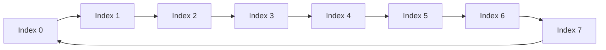
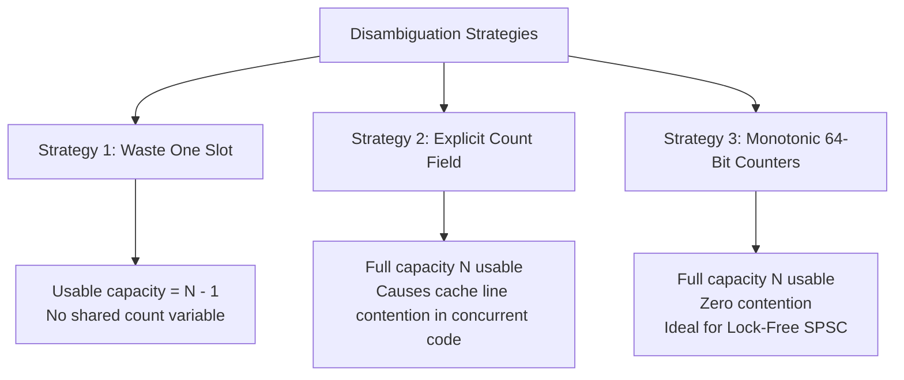

# Ring Buffers

> [!NOTE]
> A ring buffer (circular queue) is a fixed-capacity FIFO data structure built on contiguous memory where the logical end wraps back to the beginning. It provides deterministic $O(1)$ enqueue and dequeue, excellent hardware cache locality, and is the foundational data path in operating system kernels, network packet pipelines, audio DSP, flight recorders, and low-latency concurrent messaging.

> [!TIP]
> A production ring buffer is not just an academic circular queue. In real-world systems, it is an engineered, hardware-friendly data path combining power-of-two sizing, single-cycle bitwise masking, cache-line isolation, and atomic memory-ordering semantics.

> [!WARNING]
> A ring buffer is easy to implement incorrectly if the full/empty invariant is not formalized first. Most production bugs arise from mixing one-slot-waste logic, count-based logic, and monotonic-counter logic in the same codebase.

### Linear Memory Trilogy: The Tradeoff Matrix

| Structure | Memory Layout | Mutation Properties | Hardware Strengths | Best Fit |
| :--- | :--- | :--- | :--- | :--- |
| **Dynamic Array** | Contiguous, Resizable | Amortized $O(1)$ append, $O(n)$ shifts | L1/L2 prefetching, $O(1)$ indexing | General-purpose sequential storage |
| **Linked List** | Scattered Heap Nodes | $O(1)$ splice / relink with node handle | Stable addresses, zero-copy node transfers | LRU caches, intrusive kernel lists |
| **Ring Buffer** | Contiguous, Fixed-Capacity | Deterministic $O(1)$ push / pop | Zero allocations, mechanical sympathy, SPSC | Streaming pipelines, OS drivers, NIC rings |

---

## 1. Why This Matters

Many production systems require a queue with stringent physical constraints:
- bounded memory footprint with zero allocations on the hot path
- strictly deterministic, constant-time push and pop
- contiguous memory layout maximizing cache line utilization
- predictable, low tail latency
- lock-free producer-consumer synchronization

Standard alternatives fall short under these requirements:
- **Dynamic Arrays (`std::vector`)**: Growing requires reallocating, copying elements, triggering latency spikes, and invalidating pointers.
- **Linked Lists (`std::list`)**: Avoid reallocation, but incur per-node heap allocations, pointer chasing, high memory overhead (70%–80% RAM waste), and severe cache misses.

A **Ring Buffer** occupies the optimal middle ground:
- fixed capacity pre-allocated upfront
- contiguous memory layout
- zero per-element heap allocations
- lightning-fast enqueue and dequeue at both ends of the logical stream

---

## 2. Core Circular Intuition & Visual Model

A ring buffer stores elements in a flat, contiguous array, but applies wraparound arithmetic so that the end connects logically to the beginning.

### Example

Suppose physical capacity is 8:

```text
Index:   0 1 2 3 4 5 6 7
Buffer: [A B C D _ _ _ _]
Head = 0 (next read)
Tail = 4 (next write)
```

After dequeuing two items (`A` and `B`):

```text
Index:   0 1 2 3 4 5 6 7
Buffer: [_ _ C D _ _ _ _]
Head = 2
Tail = 4
```

Now enqueuing 4 more items (`E`, `F`, `G`, `H`):

```text
Index:   0 1 2 3 4 5 6 7
Buffer: [G H C D E F _ _]
Head = 2
Tail = 0 (wrapped around!)
```

The physical memory remains a flat, contiguous array, while the logical queue wraps seamlessly across the boundary.

### Visual Model



---

## 3. Formal Definition & Invariants

A ring buffer of capacity $N$ stores elements in an array `buffer[0..N-1]` and tracks queue boundaries via `head` (read) and `tail` (write) indicators.

### Core Invariants

1. **Contiguity Invariant**: Storage is physically contiguous in memory.
2. **FIFO Invariant**: Elements are dequeued strictly in the order they were enqueued.
3. **Wraparound Invariant**: Advancing beyond index $N - 1$ returns to index $0$.
4. **Boundary Invariant**: `head` indicates the next element to read; `tail` indicates the next available slot to write.
5. **Capacity Invariant**: The number of valid elements never exceeds the defined capacity limit ($0 \le \text{size} \le N$).
6. **Concurrency Invariant**: In concurrent SPSC environments, data written by the producer must become visible to the consumer before the tail index update announcing that data becomes visible (Release/Acquire ordering).

---

## 4. Key Operations & Complexity

| Operation | Average Case | Worst Case | Space (Auxiliary) | Description |
| :--- | :--- | :--- | :--- | :--- |
| `Enqueue(x)` | $O(1)$ | $O(1)$ | $O(1)$ | Write at tail and advance pointer |
| `Dequeue()` | $O(1)$ | $O(1)$ | $O(1)$ | Read at head and advance pointer |
| `Peek()` | $O(1)$ | $O(1)$ | $O(1)$ | Inspect next available element |
| `IsEmpty()` | $O(1)$ | $O(1)$ | $O(1)$ | Compare head and tail boundaries |
| `IsFull()` | $O(1)$ | $O(1)$ | $O(1)$ | Evaluate capacity threshold |
| `Drain()` | $O(n)$ | $O(n)$ | $O(1)$ | Consume all buffered elements sequentially |

---

## 5. Circular Indexing Mechanics

### 5.1 Modular Arithmetic

The mathematical representation of wraparound indexing is:

$$\text{next} = (\text{index} + 1) \bmod N$$

While mathematically elegant, a general modulo operation (`%`) on dynamic variables compiles to a hardware integer division instruction (`idiv` on x86). Integer division is notorious for high latency: **10 to 40 CPU cycles** compared to 1 cycle for addition or bitwise operations.

---

### 5.2 Power-of-Two Bitwise Masking

If capacity $N$ is constrained to a power of two:

$$N = 2^k$$

Then for any integer $i$:

$$i \bmod N = i \mathbin{\&} (N - 1)$$

### Example: $N = 8 = 2^3$
```text
N     = 8  = 0b00001000
N - 1 = 7  = 0b00000111 (Bitmask)

If index = 8:
8 & 7 = 0b00001000 & 0b00000111 = 0b00000000 = 0 (Wrapped!)

If index = 9:
9 & 7 = 0b00001001 & 0b00000111 = 0b00000001 = 1
```

### Why Production Systems Enforce Power-of-Two Sizing
1. Replaces a 20-cycle division instruction with a **1-cycle bitwise AND**.
2. Eliminates branch mispredictions associated with `if (index >= N) index = 0;`.
3. Standard requirement in Linux kernel `kfifo`, DPDK, and LMAX Disruptor.

---

## 6. Full vs. Empty Disambiguation Problem

When `head == tail`, does the ring buffer contain $0$ items (empty) or $N$ items (full)?

```text
Empty:  Head == Tail (0 items)
Full:   Head == Tail (N items after complete wraparound)
```

Three production strategies solve this ambiguity:



### 6.1 Strategy 1: Waste One Slot
- **Rule**:
  - `empty = (head == tail)`
  - `full  = ((tail + 1) & mask) == head`
- **Tradeoff**: Simple, but an 8-slot buffer only stores 7 elements.

### 6.2 Strategy 2: Explicit Size/Count Variable
- **Rule**: Maintain an integer `count`.
  - `empty = (count == 0)`
  - `full  = (count == N)`
- **Tradeoff**: Usable capacity is $N$, but in multithreaded code, both producer and consumer write to `count`, creating a severe cache-coherence bottleneck.

### 6.3 Strategy 3: Monotonically Increasing 64-Bit Sequence Counters (The Gold Standard)
- `head` and `tail` are 64-bit unsigned integers that **never wrap around** modulo $N$. They increment continuously:
  - Enqueue: `buffer[tail & mask] = val; ++tail;`
  - Dequeue: `val = buffer[head & mask]; ++head;`
- **Full / Empty Evaluation**:
  - `size  = tail - head`
  - `empty = (head == tail)`
  - `full  = (tail - head == N)`
- **Advantages**:
  - Full $N$ capacity utilized (zero wasted slots).
  - No shared `count` variable.
  - Producer writes only `tail`; consumer writes only `head`.
  - A 64-bit integer incrementing at 100 million ops/second will not overflow for over **5,800 years**.

---

## 7. Buffer Policies: Rejection vs. Overwrite

| Feature | Rejection / Bounded Policy | Overwrite / Circular Log Policy |
| :--- | :--- | :--- |
| **Behavior When Full** | Reject push (return `false`) or block thread | Overwrite oldest element (`++head`), accept new write |
| **Data Preservation** | Zero loss; guarantees strict backpressure | Drops stale history; preserves freshest window |
| **Primary Domain** | Network sockets, thread pool tasks, message queues | Flight recorders, audio DSP, sensor telemetry, in-memory logs |

---

## 8. Hardware Concurrency & Mechanical Sympathy

### 8.1 Lock-Free Single-Producer Single-Consumer (SPSC)

In an SPSC queue:
- **Thread 1 (Producer)**: Only writes data and modifies `tail`. Reads `head` to check fullness.
- **Thread 2 (Consumer)**: Only reads data and modifies `head`. Reads `tail` to check emptiness.

Because neither counter has multiple writers, **no mutexes, locks, or Compare-And-Swap (CAS) loops are required!**

#### Memory Ordering Semantics (C++11 `<atomic>`)
- **Producer**:
  ```cpp
  buffer[tail & mask] = item;
  tail.store(tail + 1, std::memory_order_release); // Publish data
  ```
- **Consumer**:
  ```cpp
  size_t current_tail = tail.load(std::memory_order_acquire); // Synchronize
  item = buffer[head & mask];
  head.store(head + 1, std::memory_order_release);
  ```

### 8.2 False Sharing & Cache Line Invalidation

A standard CPU cache line is **64 bytes**. If `head` and `tail` share the same 64-byte line:
- Producer writes `tail` $\implies$ invalidates L1 cache line on the consumer's CPU core.
- Consumer writes `head` $\implies$ invalidates L1 cache line on the producer's CPU core.
- **Result**: Severe **cache line bouncing** (false sharing), degrading throughput by 5x–10x even though both threads are modifying different variables!

#### Mechanical Sympathy Solution: Cache-Line Padding
```cpp
struct alignas(64) SPSCQueue {
    // Cache Line 1 (Producer Private)
    alignas(64) std::atomic<uint64_t> tail{0};
    uint64_t cached_head{0};

    // Cache Line 2 (Consumer Private)
    alignas(64) std::atomic<uint64_t> head{0};
    uint64_t cached_tail{0};

    // Storage
    T* buffer;
    uint64_t mask;
};
```

---

## 9. Production Systems Case Studies

### 9.1 Linux Kernel `kfifo`
Located in `include/linux/kfifo.h`, `kfifo` is the standard kernel byte/record queue.
- **Power-of-two enforcement**: Sizing is validated via `is_power_of_2()`.
- **Memory barriers**: Uses `smp_wmb()` (write memory barrier) before updating `in` (tail), and `smp_rmb()` (read memory barrier) before reading data.
- **Out-of-tree zero-copy**: Supports streaming directly into device DMA buffers.

### 9.2 LMAX Disruptor
Developed for high-frequency trading (processing 6+ million orders/second with sub-microsecond latency):
- Pre-allocated contiguous memory ring buffer eliminating garbage collection overhead.
- Monotonic sequence numbers with ring masking.
- Explicit CPU cache-line padding (7 long fields = 56 bytes padding around variables).
- Batching consumers: A consumer lagging behind can read all available items up to `tail` in a single pass without atomic writes.

### 9.3 DPDK (Data Plane Development Kit) `rte_ring`
DPDK's lockless memory ring is used for high-performance packet processing in telecom and cloud networks:
- Contiguous memory allocation on hugepages (2 MB / 1 GB pages) to eliminate TLB misses.
- Watermark support for network congestion detection.

---

## 10. Verified Implementations

Tested reference implementations with full unit test coverage are live in the repository:
- **C++17 Implementation**: [`implementations/cpp/ring_buffer.cpp`](../../implementations/cpp/ring_buffer.cpp) (Power-of-two rounding, monotonic sequence tracking, zero-division bitwise masking, and both rejection and overwrite policies).
- **Python Implementation**: [`implementations/python/ring_buffer.py`](../../implementations/python/ring_buffer.py) (Power-of-two bitwise circular queue with full `unittest` test suite).

### C++17 Reference Snippet

```cpp
template <typename T>
class RingBuffer {
private:
    std::vector<T> buffer_;
    std::size_t capacity_;
    std::size_t mask_;
    std::size_t head_{0}; // Monotonic read counter
    std::size_t tail_{0}; // Monotonic write counter

public:
    explicit RingBuffer(std::size_t requested_capacity) {
        // Round up to nearest power of two
        capacity_ = next_power_of_two(requested_capacity);
        mask_ = capacity_ - 1;
        buffer_.resize(capacity_);
    }

    bool push(const T& item) {
        if (full()) return false; // Rejection policy
        buffer_[tail_ & mask_] = item;
        ++tail_;
        return true;
    }

    void push_overwrite(const T& item) {
        if (full()) ++head_; // Drop oldest item
        buffer_[tail_ & mask_] = item;
        ++tail_;
    }

    std::optional<T> pop() {
        if (empty()) return std::nullopt;
        T val = std::move(buffer_[head_ & mask_]);
        ++head_;
        return val;
    }

    [[nodiscard]] bool empty() const noexcept { return head_ == tail_; }
    [[nodiscard]] bool full() const noexcept { return (tail_ - head_) == capacity_; }
    [[nodiscard]] std::size_t size() const noexcept { return tail_ - head_; }
};
```

---

## 11. When NOT to Use Ring Buffers

1. **Unbounded Growing Capacity Required**: If buffer growth cannot be bounded, use a **Dynamic Array** (`dynamic-arrays-and-strings.md`).
2. **Arbitrary Middle Element Removal**: Ring buffers are strictly FIFO. If arbitrary elements must be removed or spliced, use a **Doubly Linked List** (`linked-lists.md`).
3. **Complex Multi-Producer Multi-Consumer (MPMC) Without High Contention Tolerance**: MPMC ring buffers require complex CAS loops and sequence reservations; for simple multi-threaded workloads, an OS-backed queue with a mutex may be simpler and less prone to ABA hazards.

---

## 12. Implementation Traps & Interview Pitfalls

### 1. Integer Rollover Bugs
With 32-bit integers, a high-throughput network card handling 10 million packets per second will overflow `tail` in **7 minutes** ($2^{32} / 10^7 \approx 429\text{ seconds}$). In 64-bit architectures, rollover takes thousands of years. Always use `uint64_t` for monotonic counters.

### 2. Assuming Power-of-Two Without Validation
Writing `index & (capacity - 1)` when `capacity` is 10 yields a mask of 9 (`0b1001`), completely breaking wraparound addressing. Always validate or round up capacity to the nearest power of two.

### 3. Missing Memory Fences in SPSC
Writing `tail.store(t, std::memory_order_relaxed)` allows the CPU or compiler to reorder writing the data payload *after* publishing the tail, causing the consumer to read uninitialized memory! Always use `memory_order_release` for publishing and `memory_order_acquire` for loading.

---

## 13. Curated Problems & Practice

| Problem | Platform | Difficulty | Core Concept |
| :--- | :--- | :--- | :--- |
| **[LeetCode 622 — Design Circular Queue](https://leetcode.com/problems/design-circular-queue/)** | LeetCode | Medium | Fixed-capacity FIFO with circular wraparound arithmetic |
| **[LeetCode 641 — Design Circular Deque](https://leetcode.com/problems/design-circular-deque/)** | LeetCode | Medium | Bidirectional wraparound buffer operations |
| **[DPDK / Linux `kfifo` Study](https://github.com/torvalds/linux/blob/master/include/linux/kfifo.h)** | Linux Kernel | Advanced | Lock-free SPSC buffer, power-of-two mask, and memory barriers |

---

## 14. Further Reading & Cross-References

- **Linear Memory Trilogy**:
  - [`dynamic-arrays-and-strings.md`](dynamic-arrays-and-strings.md) — Contiguous resizable memory, geometric growth, and SSO.
  - [`linked-lists.md`](linked-lists.md) — Node-based pointer chasing, $O(1)$ splice, and intrusive Linux lists.
- **Hardware Realities**:
  - [`cpu-cache-and-memory.md`](../03-machine-model-and-performance/cpu-cache-and-memory.md) — Cache lines, false sharing, and hardware stream prefetchers.
  - [`theoretical-vs-practical-performance.md`](../22-benchmarking-and-tradeoffs/theoretical-vs-practical-performance.md) — Why hardware memory layout dominates Big-O notation.
