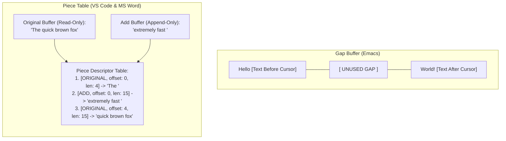
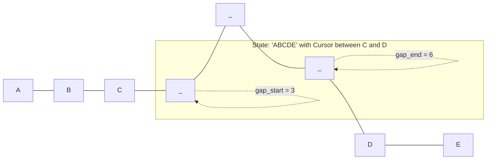
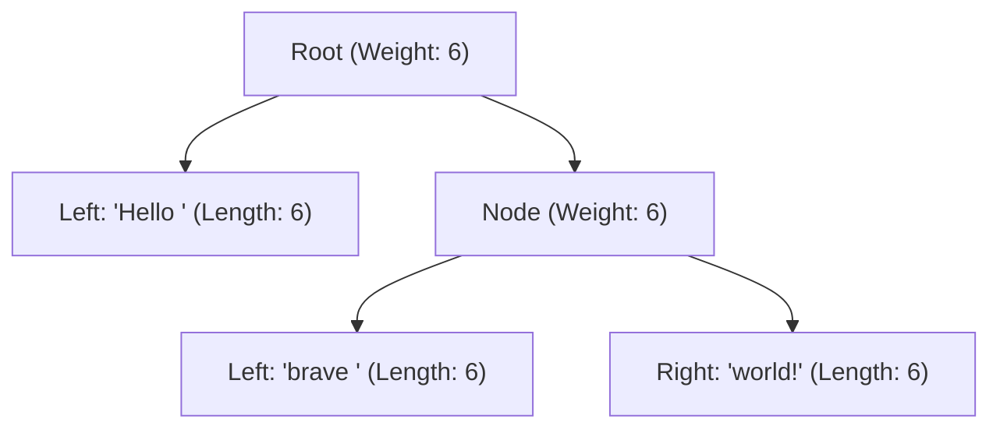
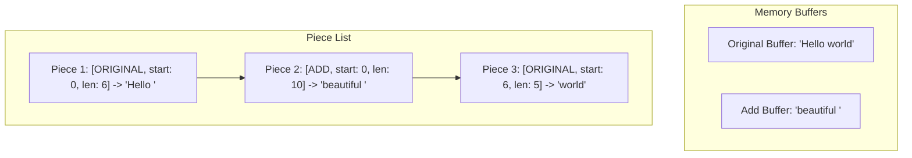

# Ropes, Gap Buffers, and Piece Tables

> [!NOTE]
> **The Text Editor Data Structure Conundrum:**
> If a text editor represented a 100-megabyte document as a simple contiguous string (`std::string` or `char[]`), inserting a single character at the start of the file would require copying 100 MB of data down by one byte ($O(N)$ write penalty).
> Over decades of systems engineering, three primary data structures emerged to solve this challenge:
> 1. **Gap Buffers (Finseth, 1991):** The classic engine of GNU Emacs. Uses a single flat buffer with an active "hole" at the cursor, achieving **$O(1)$ localized typing**.
> 2. **Ropes (Boehm, Atkinson, & Plass, 1995):** A binary tree of immutable string fragments, enabling **$O(1)$ concatenation** and **$O(\log N)$ splits and arbitrary insertions**.
> 3. **Piece Tables (Crowley, 1998):** The engine of Microsoft Word and VS Code. Decouples text into an immutable Original Buffer, an append-only Add Buffer, and a lightweight sequence of piece descriptors.

> [!TIP]
> **Why VS Code Chose Piece Tables:**
> In 2018, the VS Code engineering team replaced their previous line-based array model with a balanced **Piece Table**:
> - Loading a 1 GB file takes $O(1)$ time via OS memory-mapping (`mmap`), as the Original Buffer is never modified.
> - Typing appends directly to the Add Buffer without copying previous text.
> - Undo/Redo is trivial and lightning fast: simply save snapshots of the lightweight piece descriptors without cloning string buffers.

> [!WARNING]
> **Piece Fragmentation:**
> In naive Piece Tables, typing 10,000 characters one by one can create 10,000 tiny piece descriptors of length 1.
> Production implementations must implement **piece coalescing**: if a consecutive insertion directly follows the previous insertion in the Add Buffer, expand the length of the existing piece rather than creating a new descriptor.



---

## 1. Core Mental Model & Motivation

A text editor must handle millions of characters while supporting rapid interactive edits:
1. **Locality of Edits:** Humans type characters sequentially at a cursor position, then navigate to another location and type again.
2. **Massive File Sizes:** A user opening a 2 GB log file expects instantaneous load times without waiting for multi-gigabyte memory copies.
3. **Infinite Undo/Redo:** Reverting an action must not re-allocate massive string buffers.

---

## 2. Gap Buffers: The Engine of Emacs

A **Gap Buffer** stores text in a single flat array of size $Capacity$, maintaining an unused region (the "gap") between index `gap_start` and `gap_end`:
$$\text{Text before cursor} = \text{buffer}[0 \dots \text{gap\_start} - 1]$$
$$\text{Unused gap space} = \text{buffer}[\text{gap\_start} \dots \text{gap\_end} - 1]$$
$$\text{Text after cursor} = \text{buffer}[\text{gap\_end} \dots Capacity - 1]$$



### 2.1 Typing ($O(1)$)
When the user types character `c`:
- Write `buffer[gap_start] = c`.
- Increment `gap_start++`.
- If `gap_start == gap_end` (gap exhausted), double buffer capacity and copy the right text block to the end of the new buffer.

### 2.2 Moving the Cursor ($O(\Delta)$)
To move the cursor $k$ positions left or right:
- Moving Left: Copy characters from `buffer[gap_start - 1]` to `buffer[gap_end - 1]`, then decrement both pointers.
- Moving Right: Copy characters from `buffer[gap_end]` to `buffer[gap_start]`, then increment both pointers.

---

## 3. Ropes: The Immutable Binary Tree

A **Rope** is a binary search tree of string fragments:
- **Leaf Nodes:** Store small fixed-capacity immutable string chunks (typically 512–1024 characters).
- **Internal Nodes:** Store no text, but maintain a scalar **weight**:
  $$\text{weight}(u) = \text{total characters in the left subtree of } u$$



### 3.1 Indexing (`char_at(index)`) ($O(\log N)$)
```text
CharAt(node, i):
    if node is leaf:
        return node.str[i]
    if i < node.weight:
        return CharAt(node.left, i)
    else:
        return CharAt(node.right, i - node.weight)
```

### 3.2 Concatenation (`concat(R1, R2)`) ($O(1)$)
Simply create a new root node with `left = R1`, `right = R2`, and `weight = R1.total_length`!

### 3.3 Splitting (`split(R, i)`) ($O(\log N)$)
Splits rope $R$ at index $i$ into two independent ropes $R_1$ and $R_2$ by cutting along the search path and combining orphaned subtrees.

---

## 4. Piece Tables: The Modern Architecture of VS Code

A Piece Table decouples the text document into three components:
1. **Original Buffer:** An immutable buffer holding the initial file content (loaded once, read-only).
2. **Add Buffer:** An append-only buffer where all typed characters are placed sequentially.
3. **Piece Sequence:** A doubly linked list or balanced tree of **Piece Descriptors**:
   ```cpp
   struct Piece {
       BufferType buffer; // ORIGINAL or ADD
       size_t start;      // Start offset in buffer
       size_t length;     // Character count
   };
   ```



### 4.1 Insertion at Logical Position $pos$
1. Locate the piece $P$ containing logical index $pos$.
2. Append the new text to the end of the Add Buffer at offset $add\_offset$.
3. Split piece $P$ into $P_{left}$ and $P_{right}$.
4. Insert new piece $P_{new} = \{\text{ADD}, add\_offset, \text{new\_len}\}$ between $P_{left}$ and $P_{right}$.

### 4.2 Deletion between $pos$ and $pos + len$
Adjust or split the boundary pieces to exclude the deleted range. The underlying buffers remain completely untouched!

---

## 5. Algorithmic Complexity Comparison

| Data Structure | Sequential Typing at Cursor | Random Cursor Jump | Insert / Delete at Arbitrary Pos | Large File Load Time | Undo / Redo Complexity |
| :--- | :--- | :--- | :--- | :--- | :--- |
| **Contiguous Array (`std::string`)** | $O(N)$ | $O(1)$ | $O(N)$ | $O(N)$ | $O(N)$ |
| **Gap Buffer (Emacs)** | **$O(1)$** | $O(N)$ | $O(N)$ | $O(N)$ | $O(N)$ |
| **Rope (Boehm)** | $O(\log N)$ | $O(\log N)$ | **$O(\log N)$** | $O(N)$ (Tree build) | $O(\log N)$ (Persistent) |
| **Piece Table (VS Code)** | **$O(1)$ coalesced** | $O(\log P)$ | **$O(\log P)$** ($P \ll N$) | **$O(1)$ via `mmap`** | **$O(1)$ descriptor snapshot** |

---

## 6. High-Performance Engineering & Memory Management

### 6.1 Piece Coalescing Optimization
When typing continuously, consecutive keystrokes append to the Add Buffer sequentially.
Instead of generating thousands of 1-character pieces:
```cpp
if (!pieces.empty() && pieces.back().buffer == ADD &&
    pieces.back().start + pieces.back().length == new_add_offset) {
    pieces.back().length += new_len; // Coalesce in place!
}
```

### 6.2 Zero-Copy File Loading
For a 10 GB file:
- `std::string` requires 10 GB of heap allocation and minutes of disk reads.
- Piece Table uses `mmap()` to map the file into virtual address space, sets `Piece{ORIGINAL, 0, 10GB}`, and loads instantly with zero memory overhead!

---

## 7. Edge Cases & Failure Modes

1. **Gap Buffer Empty / Full:** Growing the buffer requires re-allocating and copying existing text blocks around the expanded gap.
2. **Deleting Across Multiple Pieces:** When a deletion span covers multiple piece boundaries, intermediate pieces are deleted while the start and end pieces are truncated.
3. **Empty Pieces:** Operations that delete an entire piece must remove the piece descriptor from the sequence to avoid dead node accumulation.

---

## 8. Reference Implementation Architecture

Both C++17 and Python 3 reference implementations implement:
- **`GapBuffer`**:
  - Direct cursor typing, cursor shifting, backward deletion, and buffer resizing.
- **`PieceTable`**:
  - Original and Add buffers, piece descriptor list, piece coalescing, and document rendering.
- Comprehensive differential verification against standard strings.

---

## 9. Differential Testing & Oracle Verification Strategy

- Both `GapBuffer` and `PieceTable` are differentially tested against a naive string oracle across 1,000 randomized text editing commands:
  - `insert(pos, text)`
  - `delete(pos, len)`
  - `render_text()`
- Character-for-character equality is strictly asserted after every operation.

---

## 10. Engineering Pitfalls & Optimization Notes

> [!CAUTION]
> **Line Number Indexing in Piece Tables:**
> Searching for line/column coordinates in a flat piece list requires scanning piece lengths. Production editors (like VS Code) store pieces in an augmented Red-Black tree where each node maintains both character length and line break counts (`\n`), enabling $O(\log P)$ line jumping!

---

## 11. Real-World Applications & Industry Context

1. **Visual Studio Code:** Migrated from a line-array model to a balanced Piece Table in 2018, reducing editor memory usage by $90\%$ on large files.
2. **Microsoft Word:** Used piece tables since Word 1.0 (1983) to enable fast disk paging on 128KB RAM computers.
3. **GNU Emacs:** Powered by gap buffers; optimized for sub-millisecond typing latencies on terminal interfaces.

---

## 12. Curated Academic References

1. **Boehm, Hans-J., Atkinson, Russ, & Plass, Michael (1995):** *Ropes: An alternative to strings*. Software: Practice and Experience, 25(12), pp. 1315–1330.
2. **Finseth, Craig A. (1991):** *The Craft of Text Editing: Emacs for the Modern World*. Springer-Verlag.
3. **Crowley, Charles (1998):** *Data structures for text sequences*. University of New Mexico Technical Report.
