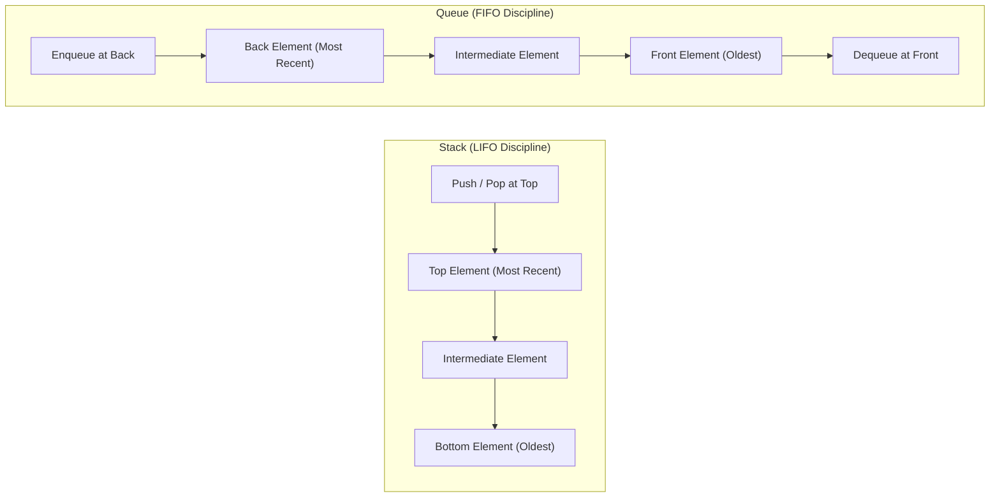

# Stacks and Queues

> [!NOTE]
> **Fundamental Linear Access Disciplines:** Stacks and queues impose strict ordering constraints on element insertion and removal:
> - **Stack (LIFO — Last In, First Out):** Push and pop occur exclusively at the top. Governs call stacks, recursion simulation, expression evaluation, syntax parsing, and monotonic candidate stacks.
> - **Queue (FIFO — First In, First Out):** Enqueue occurs at the back, dequeue occurs at the front. Governs breadth-first search, task scheduling, event buffering, and producer-consumer pipelines.
> - Reference implementations: [C++17 Implementation](../../implementations/cpp/stacks_and_queues.cpp) | [Python Implementation](../../implementations/python/stacks_and_queues.py)

> [!TIP]
> **Architectural Trade-offs: Array vs. Node-Backed:**
>
> | Implementation | Cache Locality | Memory Overhead | `push` / `enqueue` | `pop` / `dequeue` | Best Use Case |
> |---|---|---|---|---|---|
> | **Dynamic Array Stack** | Excellent (contiguous) | Minimal (capacity slack) | $O(1)$ amortized | $O(1)$ | General-purpose stacks |
> | **Linked List Stack** | Poor (pointer-chasing) | High ($8\text{B}$ pointer/node) | $O(1)$ worst-case | $O(1)$ | Real-time / zero latency spike |
> | **Circular Buffer Queue** | Excellent (ring array) | None (bounded buffer) | $O(1)$ | $O(1)$ | High-throughput bounded queues |
> | **Linked List Queue** | Poor (heap alloc per node)| High (pointers + allocator) | $O(1)$ worst-case | $O(1)$ | Unbounded dynamic queues |

> [!WARNING]
> **Critical Traps & Anti-Patterns:**
> 1. **Python `list.pop(0)` Anti-Pattern:** In Python, calling `list.pop(0)` shifts all remaining elements left in memory, turning an intended $O(1)$ queue into an $O(n)$ bottleneck. Use `collections.deque` or a circular buffer for $O(1)$ pops.
> 2. **Circular Buffer Wrap-Around Arithmetic:** Ensure `tail = (tail + 1) % capacity` and `head = (head + 1) % capacity`. Explicitly track `size` to disambiguate the full state from the empty state when `head == tail`.
> 3. **Underflow Protection:** Attempting `pop()`, `top()`, or `front()` on an empty container must throw an exception or return an optional/sentinel; never allow unchecked undefined memory access.




Stacks and queues are among the simplest and most important data structures.

They both store a sequence of elements, but they differ in the order in which elements are removed:

- a **stack** uses **LIFO**: last in, first out
- a **queue** uses **FIFO**: first in, first out

These two access disciplines appear constantly in algorithm design:

- stacks in parsing, recursion simulation, undo systems, monotonic structures
- queues in breadth-first search, scheduling, buffering, producer-consumer pipelines

This chapter develops:

- the LIFO and FIFO ideas
- core stack and queue operations
- array-backed and node-backed implementations
- amortized complexity for dynamic arrays
- circular queues
- practical engineering trade-offs

---

## 1. The stack discipline

A **stack** removes the most recently inserted element first.

This is called:

**LIFO** — last in, first out.

You can think of a stack like a pile of trays:

- place a tray on top
- remove from the top

The top is the only accessible end.

---

## 2. Core stack operations

A stack typically supports:

- `push(x)` — insert `x` on top
- `pop()` — remove the top element
- `top()` or `peek()` — inspect the top element without removing it
- `empty()` — test whether the stack has no elements
- `size()` — number of stored elements

These operations are usually designed to run in constant time.

---

## 3. Stack example

Suppose we perform:

1. `push(5)`
2. `push(8)`
3. `push(2)`
4. `pop()`

The stack evolves as:

```text
[]
[5]
[5, 8]
[5, 8, 2]
[5, 8]
```

The removed element is `2`, because it was inserted most recently.

That is exactly the LIFO rule.

---

## 4. Common stack applications

Stacks appear naturally when work must be undone in reverse order.

Examples:

- function call stacks
- parenthesis matching
- expression evaluation
- depth-first search
- undo / redo systems
- monotonic stack algorithms

A useful rule is:

> if the most recent unfinished thing should be handled next, a stack is a strong candidate

---

## 5. Array-backed stacks

One of the simplest stack implementations uses an array or dynamic array.

We keep:

- an array of elements
- an index or size telling where the top is

### Idea
- `push(x)` places `x` at the next free position
- `pop()` decreases the size
- `top()` reads the last stored element

This is simple and cache-friendly.

---

## 6. C++17 array-backed stack

```cpp
#include <vector>
#include <stdexcept>

template <typename T>
class ArrayStack {
public:
    bool empty() const { return data_.empty(); }
    int size() const { return static_cast<int>(data_.size()); }

    void push(const T& value) {
        data_.push_back(value);
    }

    void pop() {
        if (data_.empty()) {
            throw std::underflow_error("stack underflow");
        }
        data_.pop_back();
    }

    const T& top() const {
        if (data_.empty()) {
            throw std::underflow_error("stack underflow");
        }
        return data_.back();
    }

private:
    std::vector<T> data_;
};
```

---

## 7. Python array-backed stack

```python
class ArrayStack:
    def __init__(self):
        self.data = []

    def empty(self):
        return len(self.data) == 0

    def size(self):
        return len(self.data)

    def push(self, value):
        self.data.append(value)

    def pop(self):
        if not self.data:
            raise IndexError("stack underflow")
        return self.data.pop()

    def top(self):
        if not self.data:
            raise IndexError("stack underflow")
        return self.data[-1]
```

In Python, the built-in list already works very well as a stack.

---

## 8. Amortized complexity of dynamic-array stacks

When a stack uses a dynamic array, `push` may occasionally trigger reallocation and copying.

That one operation can cost more than $ O(1) $.

But if the array grows geometrically, such as doubling capacity when full, then the total cost of many pushes is linear.

So:

- worst-case single `push`: can be larger than $ O(1) $
- amortized `push`: $ O(1) $

This is an important distinction.

---

## 9. Why amortized $ O(1) $ push is true

If capacity doubles whenever full, then copying happens only at capacities like:

$$
1, 2, 4, 8, 16, \dots
$$

The total copying cost across $ n $ pushes is bounded by a geometric series:

$$
1 + 2 + 4 + \dots < 2n
$$

So the average extra work per push is constant.

This is the standard amortized analysis for dynamic arrays.

---

## 10. Linked-list stacks

A stack can also be implemented with a singly linked list.

We keep a pointer to the head node, which is the top of the stack.

Then:

- `push` inserts a new node at the head
- `pop` removes the head
- `top` reads the head value

All of these are worst-case $ O(1) $.

---

## 11. C++17 linked-list stack

```cpp
#include <stdexcept>

template <typename T>
class LinkedStack {
private:
    struct Node {
        T value;
        Node* next;
        Node(const T& value, Node* next) : value(value), next(next) {}
    };

public:
    LinkedStack() : head_(nullptr), size_(0) {}

    ~LinkedStack() {
        while (head_) {
            Node* next = head_->next;
            delete head_;
            head_ = next;
        }
    }

    bool empty() const { return head_ == nullptr; }
    int size() const { return size_; }

    void push(const T& value) {
        head_ = new Node(value, head_);
        ++size_;
    }

    void pop() {
        if (!head_) {
            throw std::underflow_error("stack underflow");
        }
        Node* old = head_;
        head_ = head_->next;
        delete old;
        --size_;
    }

    const T& top() const {
        if (!head_) {
            throw std::underflow_error("stack underflow");
        }
        return head_->value;
    }

private:
    Node* head_;
    int size_;
};
```

---

## 12. Array-backed vs. node-backed stacks

### Array-backed stack
Advantages:
- simple
- good cache locality
- low per-element overhead

Disadvantages:
- occasional resizing cost
- capacity management matters

### Linked-list stack
Advantages:
- no resizing
- each operation worst-case $ O(1) $

Disadvantages:
- extra pointer memory
- worse cache locality
- dynamic allocation overhead

In practice, array-backed stacks are often preferred unless linked behavior is specifically needed.

---

## 13. The queue discipline

A **queue** removes the oldest inserted element first.

This is called:

**FIFO** — first in, first out.

You can think of a queue like a line of people:

- new arrivals join at the back
- service happens at the front

So insertion and removal happen at opposite ends.

---

## 14. Core queue operations

A queue typically supports:

- `push(x)` or `enqueue(x)` — insert at the back
- `pop()` or `dequeue()` — remove from the front
- `front()` — inspect the front element
- `empty()`
- `size()`

These should ideally run in constant time.

---

## 15. Queue example

Suppose we perform:

1. `enqueue(5)`
2. `enqueue(8)`
3. `enqueue(2)`
4. `dequeue()`

The queue evolves as:

```text
[]
[5]
[5, 8]
[5, 8, 2]
[8, 2]
```

The removed element is `5`, because it entered first.

That is exactly the FIFO rule.

---

## 16. Common queue applications

Queues appear when work should be processed in arrival order.

Examples:

- breadth-first search
- task scheduling
- print spooling
- packet buffering
- simulations
- event processing

A useful rule is:

> if the earliest waiting item should be handled next, a queue is a strong candidate

---

## 17. Why a naive array queue is problematic

If we store a queue in a simple array and always keep the front at index 0, then removing from the front requires shifting all later elements left.

That makes `dequeue` cost:

$$
O(n)
$$

which is too slow for repeated queue operations.

So a good queue implementation must avoid front shifting.

---

## 18. Linked-list queue

A queue can be implemented with a linked list using:

- a head pointer for the front
- a tail pointer for the back

Then:

- enqueue at the tail
- dequeue from the head

Both operations are worst-case $ O(1) $.

---

## 19. C++17 linked-list queue

```cpp
#include <stdexcept>

template <typename T>
class LinkedQueue {
private:
    struct Node {
        T value;
        Node* next;
        Node(const T& value) : value(value), next(nullptr) {}
    };

public:
    LinkedQueue() : head_(nullptr), tail_(nullptr), size_(0) {}

    ~LinkedQueue() {
        while (head_) {
            Node* next = head_->next;
            delete head_;
            head_ = next;
        }
    }

    bool empty() const { return head_ == nullptr; }
    int size() const { return size_; }

    void push(const T& value) {
        Node* node = new Node(value);
        if (tail_) {
            tail_->next = node;
        } else {
            head_ = node;
        }
        tail_ = node;
        ++size_;
    }

    void pop() {
        if (!head_) {
            throw std::underflow_error("queue underflow");
        }
        Node* old = head_;
        head_ = head_->next;
        if (!head_) tail_ = nullptr;
        delete old;
        --size_;
    }

    const T& front() const {
        if (!head_) {
            throw std::underflow_error("queue underflow");
        }
        return head_->value;
    }

private:
    Node* head_;
    Node* tail_;
    int size_;
};
```

---

## 20. Python linked-list queue

```python
class LinkedQueue:
    class _Node:
        def __init__(self, value):
            self.value = value
            self.next = None

    def __init__(self):
        self.head = None
        self.tail = None
        self.n = 0

    def empty(self):
        return self.head is None

    def size(self):
        return self.n

    def push(self, value):
        node = self._Node(value)
        if self.tail:
            self.tail.next = node
        else:
            self.head = node
        self.tail = node
        self.n += 1

    def pop(self):
        if self.head is None:
            raise IndexError("queue underflow")
        value = self.head.value
        self.head = self.head.next
        if self.head is None:
            self.tail = None
        self.n -= 1
        return value

    def front(self):
        if self.head is None:
            raise IndexError("queue underflow")
        return self.head.value
```

---

## 21. Circular queue idea

A very efficient array-based queue uses a **circular buffer**.

Instead of shifting elements, we keep indices:

- `head` for the front
- `tail` for the next insertion position

When an index reaches the end of the array, it wraps back to 0.

This avoids costly shifting and gives constant-time queue operations.

---

## 22. Circular queue invariant

In a circular queue:

- elements occupy a cyclic interval of the underlying array
- the logical order may wrap around the physical end

A common design stores:

- `head`
- `tail`
- `size`

Then:

- enqueue writes at `tail`, moves `tail = (tail + 1) % capacity`
- dequeue reads at `head`, moves `head = (head + 1) % capacity`

This is simple and robust.

---

## 23. C++17 circular queue

```cpp
#include <vector>
#include <stdexcept>

template <typename T>
class CircularQueue {
public:
    explicit CircularQueue(int capacity)
        : data_(capacity), head_(0), tail_(0), size_(0) {}

    bool empty() const { return size_ == 0; }
    bool full() const { return size_ == static_cast<int>(data_.size()); }
    int size() const { return size_; }

    void push(const T& value) {
        if (full()) {
            throw std::overflow_error("queue overflow");
        }
        data_[tail_] = value;
        tail_ = (tail_ + 1) % data_.size();
        ++size_;
    }

    void pop() {
        if (empty()) {
            throw std::underflow_error("queue underflow");
        }
        head_ = (head_ + 1) % data_.size();
        --size_;
    }

    const T& front() const {
        if (empty()) {
            throw std::underflow_error("queue underflow");
        }
        return data_[head_];
    }

private:
    std::vector<T> data_;
    int head_;
    int tail_;
    int size_;
};
```

---

## 24. Python circular queue

```python
class CircularQueue:
    def __init__(self, capacity):
        self.data = [None] * capacity
        self.head = 0
        self.tail = 0
        self.n = 0

    def empty(self):
        return self.n == 0

    def full(self):
        return self.n == len(self.data)

    def size(self):
        return self.n

    def push(self, value):
        if self.full():
            raise OverflowError("queue overflow")
        self.data[self.tail] = value
        self.tail = (self.tail + 1) % len(self.data)
        self.n += 1

    def pop(self):
        if self.empty():
            raise IndexError("queue underflow")
        value = self.data[self.head]
        self.head = (self.head + 1) % len(self.data)
        self.n -= 1
        return value

    def front(self):
        if self.empty():
            raise IndexError("queue underflow")
        return self.data[self.head]
```

---

## 25. Why circular queues are useful

Circular queues are widely used when capacity is fixed or bounded.

Examples:

- bounded buffers
- embedded systems
- producer-consumer queues
- packet and stream buffers

They are efficient because they reuse array space without moving elements.

---

## 26. Dynamic array queue versus circular queue

A queue can also use a dynamic circular buffer that resizes when full.

This combines:

- the constant-time wrap-around logic of a circular queue
- the flexibility of dynamic growth

As with dynamic arrays, resizing gives amortized $ O(1) $ insertion.

This is how many standard-library queue-like structures are engineered internally.

---

## 27. Complexity summary

### Stack
- `push`: $ O(1) $ amortized for dynamic array, $ O(1) $ worst-case for linked list
- `pop`: $ O(1) $
- `top`: $ O(1) $

### Queue
- linked-list queue:
  - `push`: $ O(1) $
  - `pop`: $ O(1) $
  - `front`: $ O(1) $

- circular queue:
  - `push`: $ O(1) $
  - `pop`: $ O(1) $
  - `front`: $ O(1) $

These are the central guarantees.

---

## 28. Common mistakes

### Mistake 1: using a list front-pop in Python as a queue
`list.pop(0)` is $ O(n) $, not $ O(1) $.

### Mistake 2: shifting array elements on every dequeue
That destroys queue efficiency.

### Mistake 3: forgetting empty-structure checks
`pop` and `top` or `front` need underflow handling.

### Mistake 4: confusing stack and queue discipline
LIFO and FIFO solve different problems.

### Mistake 5: mishandling circular wrap-around
Use modulo carefully and track size clearly.

### Mistake 6: ignoring amortized analysis
Dynamic-array stack or queue operations may occasionally be expensive, but still have amortized $ O(1) $ time.

---

## 29. Recognition checklist

Use a **stack** when:

- the most recent item should be processed next
- nested structure must be tracked
- backtracking or reversal is involved

Use a **queue** when:

- the oldest waiting item should be processed next
- breadth-first exploration is needed
- work should be processed in arrival order

These are strong signals.

---

## 30. Summary

Stacks and queues are foundational linear data structures.

A stack uses:

- **LIFO**
- insert and remove at the same end

A queue uses:

- **FIFO**
- insert at the back, remove from the front

Important implementation choices include:

- array-backed versus node-backed
- amortized dynamic growth
- circular-buffer design for queues

These structures are simple, but they appear everywhere in algorithms and systems because they encode two essential processing disciplines: **most recent first** and **oldest first**.

---

## 31. Practice prompts

1. What is the difference between LIFO and FIFO?
2. Why is a stack a natural model for function calls?
3. Why is a queue a natural model for BFS?
4. Why is `push_back` / `pop_back` a good basis for an array-backed stack?
5. Why is shifting elements a bad idea for queues?
6. How does a circular queue avoid shifting?
7. What does amortized $ O(1) $ mean for a dynamic-array stack?
8. When might a linked-list implementation be preferred?
9. Why is `list.pop(0)` a poor queue operation in Python?
10. What information must a circular queue track to work correctly?
