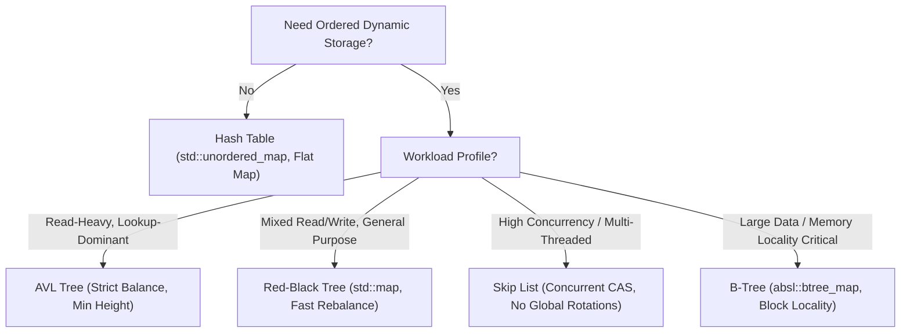

# AVL and Red-Black Trees

> [!NOTE]
> AVL trees and Red-Black trees are self-balancing binary search trees that maintain ordered data while guaranteeing $O(\log n)$ search, insertion, and deletion. AVL trees enforce stricter balance for faster lookups, while Red-Black trees relax balance slightly to reduce rebalancing cost during updates.
>
> Reference implementations: [C++17 Implementation](../../implementations/cpp/avl_tree.cpp) | [Python Implementation](../../implementations/python/avl_tree.py)

> [!TIP]
> The core tradeoff is simple: AVL trees optimize search height more aggressively, while Red-Black trees optimize update simplicity and bounded rotation cost. Both solve the same problem, but with different balance philosophies.

> [!IMPORTANT]
> **Ordered Dictionary Comparison at a Glance:**
> - **AVL Tree**: Stricter balance ($h < 1.44 \log_2 n$), shorter height, optimal for read-heavy workloads.
> - **Red-Black Tree**: Looser balance ($h \le 2 \log_2(n+1)$), at most 2 rotations on insert, at most 3 rotations on delete, industry standard for general-purpose libraries.
> - **Skip List**: Randomized balance, zero tree rotations, optimal for lock-free concurrency.
> - **B-Tree / B+ Tree**: High fanout, cache-line and page friendly, dominant in disk and database storage engines.

---

## 1. Why This Matters

A plain binary search tree can become disastrously unbalanced.

If keys arrive in sorted order, the tree may degenerate into a linear chain:

```text
1
 \
  2
   \
    3
     \
      4
       \
        5
```

When this degeneration occurs:
- search degrades to $O(n)$
- insertion degrades to $O(n)$
- deletion degrades to $O(n)$

This destroys the primary motivation for using a binary search tree in the first place.

Self-balancing BSTs solve this by enforcing structural invariants after updates so that the tree height stays strictly logarithmic.

This guarantees:
- ordered search
- predecessor and successor queries
- range scans
- ordered iteration
- deterministic $O(\log n)$ worst-case performance

Two of the most important balanced BST families are:
- **AVL trees** (Adelson-Velsky and Landis, 1962)
- **Red-Black trees** (Bayer, Guibas, and Sedgewick, 1978)

They embody two contrasting engineering strategies:
- **AVL**: Stricter balance, shorter trees, stronger lookup performance.
- **Red-Black**: Looser balance, fewer rotations, superior update pragmatism.

These structures are foundational to modern computing infrastructure:
- C++ standard library (`std::map`, `std::set` in `<stl_tree.h>`)
- Java runtime (`java.util.TreeMap`, `java.util.TreeSet`)
- Operating systems (the Linux kernel `rbtree` in `lib/rbtree.c`)
- Process schedulers (Completely Fair Scheduler virtual runtime tracking)
- Memory management (Virtual Memory Area / VMA indexing)

They also provide the deterministic, rotation-based counterpart to the randomized express lanes explored in our skip-list chapter.

---

## 2. Core Binary Search Tree Fundamentals

Both AVL and Red-Black trees are binary search trees, which means every node obeys the fundamental BST ordering rule:

For every node $v$:
- all keys in the left subtree of $v$ are strictly less than $\text{key}(v)$
- all keys in the right subtree of $v$ are strictly greater than $\text{key}(v)$

This invariant guarantees:
- ordered binary search in $O(h)$ time
- in-order traversal visits all elements in sorted order in $O(n)$ time
- exact predecessor and successor lookups in $O(h)$ time

Balancing does **not** modify the BST ordering rule; it only constrains the topological shape of the tree to guarantee that $h = O(\log n)$.

---

## 3. AVL Trees: Theoretical Foundations & Balance Invariants

AVL trees were the first self-balancing binary search trees ever discovered. They enforce a strict local height differential at every node.

### 3.1 Balance Factor Invariant

For every node $v$, the **balance factor** is defined as:

$$
BF(v) = h_L(v) - h_R(v)
$$

where $h_L(v)$ is the height of the left subtree and $h_R(v)$ is the height of the right subtree (with the height of an empty subtree defined as $0$, and a leaf node having height $1$).

The **AVL invariant** mandates that:

$$
BF(v) \in \{-1, 0, 1\} \quad \forall v \in T
$$

No node may have one subtree that is more than one level taller than its sibling subtree.

---

### 3.2 Why Strict Local Balance Matters

Because every node is tightly bounded, the entire tree stays compact. This produces:
- minimal search tree depth
- minimal pointer dereferences per lookup
- optimal read-heavy throughput

The tradeoff is that insertions and deletions require active height tracking and may trigger structural rotations along the upward traversal path.

---

### 3.3 Fibonacci Minimal-Tree Derivation

To find the theoretical maximum height of an AVL tree containing $n$ nodes, consider the minimal number of nodes $N(h)$ required to build an AVL tree of height $h$.

To construct height $h$ with the fewest possible nodes while satisfying the AVL invariant:
- one child subtree must have height $h - 1$
- the other child subtree must have height $h - 2$

This gives the recurrence:

$$
N(h) = 1 + N(h - 1) + N(h - 2)
$$

with base cases $N(0) = 0$ (empty tree) and $N(1) = 1$ (single node):

$$
\begin{aligned}
N(1) &= 1 \\
N(2) &= 1 + 1 + 0 = 2 \\
N(3) &= 1 + 2 + 1 = 4 \\
N(4) &= 1 + 4 + 2 = 7 \\
N(5) &= 1 + 7 + 4 = 12
\end{aligned}
$$

Notice that adding $1$ to both sides reveals:

$$
N(h) + 1 = (N(h - 1) + 1) + (N(h - 2) + 1)
$$

Letting $S(h) = N(h) + 1$, we observe that $S(h) = S(h - 1) + S(h - 2)$, which is the exact Fibonacci recurrence:

$$
N(h) = F_{h + 2} - 1
$$

where $F_k$ is the $k$-th Fibonacci number.

Using Binet's formula for Fibonacci numbers ($F_k \approx \frac{\varphi^k}{\sqrt{5}}$ where the golden ratio $\varphi = \frac{1 + \sqrt{5}}{2} \approx 1.618$):

$$
n \ge N(h) \approx \frac{\varphi^{h + 2}}{\sqrt{5}} - 1
$$

Taking the base-$\varphi$ logarithm on both sides yields the classical AVL upper bound:

$$
h < \frac{\log_2(n + 2)}{\log_2 \varphi} - 0.328 \approx 1.4404 \log_2(n + 2) - 0.328
$$

---

### 3.4 The AVL Height Upper Bound

In the absolute worst case (a Fibonacci tree), an AVL tree with $n$ nodes has height:

$$
h < 1.44 \log_2(n + 2)
$$

For comparison, a perfectly balanced complete binary tree has height $\lceil \log_2(n + 1) \rceil \approx 1.00 \log_2 n$. 

An AVL tree is at most **44% taller** than a theoretically perfect binary tree. This tight bound minimizes cache-line traversals on read paths.

---

## 4. Red-Black Trees: Theoretical Foundations & Balance Invariants

Red-Black trees relax the strict height differential constraint. Instead of storing explicit integer heights at every node, each node stores a single bit representing a color: **RED** or **BLACK**.

### 4.1 The Five Classic Red-Black Invariants

A valid Red-Black tree satisfies five structural invariants:

1. **Node Color**: Every node is colored either RED or BLACK.
2. **Root Property**: The root node is always BLACK.
3. **Leaf Property**: All external leaves (NIL sentinels) are BLACK.
4. **Red Property**: If a node is RED, both of its children must be BLACK (no two RED nodes may appear consecutively on any path).
5. **Black-Height Property**: Every path from any given node down to any of its descendant NIL leaves contains the exact same number of BLACK nodes.

The number of black nodes on any path from node $v$ down to a leaf (excluding $v$ itself) is called the **black-height** of $v$, denoted $bh(v)$.

```text
               [13:B]
             /        \
         [8:R]        [17:R]
        /     \       /     \
     [1:B]  [11:B] [15:B]  [25:B]
      / \    / \    / \     / \
     N   N  N   N  N   N   N   N  (NIL leaves: All Black)
```

---

### 4.2 Black-Height and Height Upper Bound Proof

**Theorem**: A Red-Black tree with $n$ internal nodes has height:

$$
h \le 2 \log_2(n + 1)
$$

**Proof**:
1. **Lower bound on internal nodes**: We claim that the subtree rooted at any node $v$ contains at least $2^{bh(v)} - 1$ internal nodes.
   - *Base Case*: If $v$ is a NIL leaf, $bh(v) = 0$, and the subtree has $2^0 - 1 = 0$ internal nodes.
   - *Inductive Step*: Consider an internal node $v$ with children $c_1$ and $c_2$. The black-height of each child is either $bh(v)$ (if the child is RED) or $bh(v) - 1$ (if the child is BLACK). In both cases, $bh(c_i) \ge bh(v) - 1$.
   - By induction, the number of internal nodes in the subtree rooted at $v$ is:
     $$
     \text{nodes}(v) = 1 + \text{nodes}(c_1) + \text{nodes}(c_2) \ge 1 + (2^{bh(v)-1} - 1) + (2^{bh(v)-1} - 1) = 2^{bh(v)} - 1
     $$
2. **Relating total height $h$ to black-height $bh$**: By Invariant 4, no two RED nodes can be adjacent. Therefore, along any simple path from the root to a NIL leaf, at most half the nodes can be RED.
   $$
   bh(\text{root}) \ge \frac{h}{2}
   $$
3. **Combining the bounds**:
   $$
   n \ge 2^{bh(\text{root})} - 1 \ge 2^{h/2} - 1
   $$
   $$
   n + 1 \ge 2^{h/2} \implies \log_2(n + 1) \ge \frac{h}{2} \implies h \le 2 \log_2(n + 1)
   $$

---

### 4.3 Why Red-Black Balance Is Looser

Because paths are bounded by black-height rather than strict height equality, the shortest possible path consists entirely of black nodes (length $bh$), while the longest possible path alternates between red and black nodes (length $2 \cdot bh$).

Thus, the longest path in a Red-Black tree is at most **twice as long** as the shortest path. 

This relaxation dramatically reduces the number of structural rotations required during updates:
- AVL insertion: at most 2 rotations (1 single or 1 double rotation).
- AVL deletion: up to $O(\log n)$ rotations cascading to the root.
- **Red-Black insertion: at most 2 rotations**.
- **Red-Black deletion: at most 3 rotations**.

---

## 5. Structural Contrast: AVL vs. Red-Black

| Feature | AVL Tree | Red-Black Tree |
| :--- | :--- | :--- |
| **Balance Metric** | Height difference $BF \in \{-1, 0, 1\}$ | Color invariants & uniform black-height |
| **Worst-Case Height** | $\approx 1.44 \log_2 n$ | $\le 2.00 \log_2(n + 1)$ |
| **Typical Height** | $\approx 1.01 \log_2 n$ | $\approx 1.20 \log_2 n$ |
| **Lookup Performance** | ~10–15% faster (shorter path depth) | Slightly slower due to deeper leaf paths |
| **Insertion Rotations** | $\le 2$ rotations (single or double) | $\le 2$ rotations |
| **Deletion Rotations** | $O(\log n)$ worst-case rotations | $\le 3$ rotations |
| **Node Overhead** | Height field (typically 4 bytes / 32-bit int) | 1 bit color (often packed into parent pointer) |
| **Primary Use Case** | Read-heavy lookups, static sets | Mixed workloads, general-purpose standard libraries |

---

## 6. Rotation Mechanics

Tree rotations are local pointer adjustments that change the topological shape of a binary search tree while strictly preserving in-order key ordering.

### 6.1 Right Rotation (Clockwise)

A right rotation around node $y$ lifts its left child $x$ to become the new parent, shifting $x$'s right child $B$ to become $y$'s left child:

```text
         y                                x
        / \                              / \
       x   C     --- Right Rotate --->  A   y
      / \                                  / \
     A   B                                B   C
```

**Key Invariant**:
$$
\text{In-order before}: A < x < B < y < C
$$
$$
\text{In-order after}:  A < x < B < y < C
$$

---

### 6.2 Left Rotation (Counter-Clockwise)

A left rotation around node $x$ lifts its right child $y$ to become the new parent, shifting $y$'s left child $B$ to become $x$'s right child:

```text
       x                                  y
      / \                                / \
     A   y      --- Left Rotate --->    x   C
        / \                            / \
       B   C                          A   B
```

---

### 6.3 The Four Classical Imbalance Configurations

When an insertion or deletion breaks the balance factor at ancestor node $z$, the violation belongs to one of four canonical geometric configurations:

```text
    1. Left-Left (LL)          2. Right-Right (RR)
          z                          z
         /                            \
        y                              y
       /                                \
      x                                  x
   Fix: RotateRight(z)        Fix: RotateLeft(z)

    3. Left-Right (LR)         4. Right-Left (RL)
          z                          z
         /                            \
        y                              y
         \                            /
          x                          x
   Fix: RotateLeft(y)         Fix: RotateRight(y)
        RotateRight(z)             RotateLeft(z)
```

---

## 7. AVL Rebalancing Algorithms

### 7.1 Insertion Rebalancing
1. Execute standard recursive BST insertion.
2. Backtrack up the recursive call stack, updating the height of each ancestor:
   $$
   h(v) = 1 + \max(h(v.left), h(v.right))
   $$
3. Compute $BF(v) = h(v.left) - h(v.right)$.
4. If $|BF(v)| > 1$, apply the rotation corresponding to the path of the inserted key:
   - **LL ($BF > 1$ and key $< v.left.key$)**: Single `RotateRight(v)`.
   - **RR ($BF < -1$ and key $> v.right.key$)**: Single `RotateLeft(v)`.
   - **LR ($BF > 1$ and key $> v.left.key$)**: `RotateLeft(v.left)` followed by `RotateRight(v)`.
   - **RL ($BF < -1$ and key $< v.right.key$)**: `RotateRight(v.right)` followed by `RotateLeft(v)`.
5. Once a rotation is completed at the lowest unbalanced ancestor, the height of that subtree is restored to its pre-insertion height. **No further rotations are required above this point**.

---

### 7.2 Deletion Rebalancing
1. Execute standard BST deletion (if 2 children, swap with in-order successor and delete successor).
2. Backtrack up the path to the root, updating heights and checking balance factors.
3. If an ancestor becomes unbalanced ($|BF| > 1$), apply the appropriate rotation.
4. **Critical Difference**: Unlike insertion, rebalancing an ancestor after deletion can decrease the height of the restructured subtree. This height reduction may cause the grandparent to violate the AVL property. Therefore, rotations can cascade all the way to the root ($O(\log n)$ rotations).

---

## 8. Red-Black Insertion Mechanics

When inserting key $k$:
1. Perform normal BST insertion and place a new node $z$ at a leaf position.
2. Color $z$ **RED**:
   $$
   z.color = \text{RED}
   $$
   *(Coloring $z$ red preserves Invariant 5 [black-height], but may violate Invariant 4 [no consecutive red nodes] if $z$'s parent is also red).*
3. Call `rb_insert_fixup(z)` to restore invariants.

### 8.1 Insertion Fixup Cases (Parent is Left Child of Grandparent)

Let $P = z.parent$, $G = P.parent$, and $U = G.right$ (the uncle of $z$).

#### Case 1: Uncle $U$ is RED (Recoloring Cascade)
Both parent and uncle are red.
- **Action**: Recolor $P \to \text{BLACK}$, $U \to \text{BLACK}$, $G \to \text{RED}$.
- **Propagation**: Advance $z \leftarrow G$. Continue loop. No rotations required.

```text
        [G:B]                   [G:R]  <-- z moves here
       /     \                 /     \
    [P:R]   [U:R]   ===>    [P:B]   [U:B]
    /                       /
  [z:R]                   [z:R]
```

#### Case 2: Uncle $U$ is BLACK and $z$ is a Right Child (Triangle / Inner Case)
- **Action**: Rotate left around parent $P$. Advance $z \leftarrow P$.
- **Result**: Transforms the tree into Case 3 (straight line) without changing black heights.

```text
      [G:B]                   [G:B]
     /     \                 /     \
  [P:R]   [U:B]   ===>    [z:R]   [U:B]
     \                    /
    [z:R]               [P:R]
```

#### Case 3: Uncle $U$ is BLACK and $z$ is a Left Child (Line / Outer Case)
- **Action**: Recolor $P \to \text{BLACK}$, $G \to \text{RED}$. Rotate right around grandparent $G$.
- **Result**: Both children of $P$ are now black. The loop terminates immediately!

```text
        [G:B]                     [P:B]
       /     \                   /     \
    [P:R]   [U:B]   ===>      [z:R]   [G:R]
    /                                    \
  [z:R]                                 [U:B]
```

**Key Result**: Because Case 3 terminates and Case 2 transitions to Case 3, Red-Black insertion performs **at most 2 rotations**.

---

## 9. Red-Black Deletion Mechanics

When a node $y$ is removed, let $x$ be the node that moves into $y$'s original position.
- If $y$ was RED, no black-height invariants are violated.
- If $y$ was BLACK, removing it removes a black node from all paths through $x$, violating Invariant 5.

We conceptualize $x$ as holding an extra unit of blackness: a **"double-black"** node. The deletion fixup procedure shifts this double-black up the tree or absorbs it into a red node.

### 9.1 Deletion Fixup Cases (Node $x$ is Left Child)

Let $W = x.parent.right$ be the sibling of $x$.

#### Case 1: Sibling $W$ is RED
- **Action**: Recolor $W \to \text{BLACK}$, $parent \to \text{RED}$. Rotate left around $parent$.
- **Result**: Converts into Case 2, 3, or 4 where sibling is black.

#### Case 2: Sibling $W$ is BLACK and Both of $W$'s Children are BLACK
- **Action**: Recolor $W \to \text{RED}$.
- **Result**: Double-black moves up to $parent$. Continue loop with $x \leftarrow parent$.

#### Case 3: Sibling $W$ is BLACK, Left Child of $W$ is RED, Right Child is BLACK
- **Action**: Recolor $W.left \to \text{BLACK}$, $W \to \text{RED}$. Rotate right around $W$.
- **Result**: Converts into Case 4.

#### Case 4: Sibling $W$ is BLACK and Right Child of $W$ is RED
- **Action**: Recolor $W \to parent.color$, $parent \to \text{BLACK}$, $W.right \to \text{BLACK}$. Rotate left around $parent$.
- **Result**: The double-black is completely eliminated! The loop terminates.

**Key Result**: Red-Black deletion requires **at most 3 rotations** in all cases.

---

## 10. Production Systems Case Studies

### 10.1 The Linux Kernel `rbtree` (`include/linux/rbtree.h`)

The Linux kernel implements Red-Black trees in `lib/rbtree.c`. Rather than using an academic wrapper pattern, it employs two foundational systems optimizations:

#### 1. Intrusive Data Structure Design
The tree node metadata is embedded directly inside the host kernel struct:

```c
struct rb_node {
    unsigned long  __rb_parent_color;
    struct rb_node *rb_right;
    struct rb_node *rb_left;
} __attribute__((aligned(sizeof(long))));
```

The containing object is retrieved at zero cost using the `container_of()` macro, eliminating separate heap allocations.

#### 2. Pointer Tagging / Bit-Stealing Optimization
On modern architectures, `struct rb_node` pointers are aligned to 4-byte (32-bit) or 8-byte (64-bit) boundaries. Consequently, the lowest 2 or 3 bits of any node pointer are guaranteed to be zero:

```text
Pointer: 0xFFFF888012345600  -->  Binary ends in ...000
                                                        ^^
                                         Bits used to store color!
```

The kernel stores both the parent pointer and the node color in a single `unsigned long __rb_parent_color`:
- Bit 0: `0` for RED, `1` for BLACK.
- Remaining bits: Parent pointer address (`__rb_parent_color & ~3UL`).

This saves 8 bytes per node on 64-bit architectures and ensures `struct rb_node` is exactly 24 bytes (3 machine words: parent/color, left, right).

---

### 10.2 Completely Fair Scheduler (CFS)

The Linux CFS scheduler (`kernel/sched/fair.c`) manages runnable tasks ordered by their virtual runtime (`vruntime`):

```c
struct sched_entity {
    struct load_weight load;
    struct rb_node     run_node;
    u64                vruntime;
    /* ... */
};
```

- When a CPU selects the next task to execute, it must find the task with the smallest `vruntime`.
- In an unmodified BST, finding the minimum takes $O(\log n)$ by walking `curr = curr->left`.
- To make task selection $O(1)$, Linux uses an **augmented cached tree** (`struct rb_root_cached`), which maintains a direct pointer `rb_leftmost` to the minimum element.
- When the leftmost task is picked, it is executed, its `vruntime` increases, and it is re-inserted into the rbtree in $O(\log n)$ time.

---

### 10.3 Virtual Memory Area (VMA) Tracking

Every Linux process has a collection of memory regions represented by `struct vm_area_struct`. These regions represent memory-mapped files, the heap, the stack, and shared libraries:

- When an application triggers a page fault, the kernel must quickly determine if the faulting address falls inside an existing VMA.
- Linux maintains all VMAs in an address-ordered Red-Black tree (`mm_struct->mm_rb`).
- Looking up an address takes $O(\log n)$ time, ensuring deterministic response times regardless of process memory complexity.

---

### 10.4 Why Standard Libraries Chose Red-Black over AVL

Both C++ (`std::map`, `std::set`) and Java (`TreeMap`, `TreeSet`) chose Red-Black trees as their underlying engine.

The rationales:
1. **Bounded Rotation Overhead**: Red-Black trees guarantee at most 2 rotations on insert and at most 3 rotations on erase. AVL deletion can trigger cascading rotations up the entire height.
2. **Standard Library Workload Diversity**: Standard library containers are general-purpose. In mixed workloads with frequent insertions and deletions, Red-Black trees exhibit lower write latencies.
3. **Memory Footprint**: By packing color into pointer alignment bits or a single byte, Red-Black nodes require minimal metadata compared to explicit integer height fields.

---

## 11. Hardware Locality & Practical Engineering Tradeoffs

> [!WARNING]
> Although AVL and Red-Black trees guarantee $O(\log n)$ operations, they are still pointer-heavy structures. On modern hardware, flat hash tables and cache-conscious B-trees can outperform them substantially for point lookup because asymptotic depth does not eliminate cache misses.

### 11.1 Pointer-Chasing Cache Latency

In an $N = 10^6$ element Red-Black tree:
- Tree height is approximately $20$ levels.
- Nodes are allocated independently on the heap, scattered across disjoint memory addresses and pages.
- Every step down the tree dereferences a pointer, triggering an L1/L2/L3 cache miss or TLB miss:

```text
Root (0x1040) ---> Left (0x7F20) ---> Right (0x3A00) ---> Left (0x9E80)
   Cache Miss!        Cache Miss!        Cache Miss!        Cache Miss!
```

Traversing 20 levels incurs ~20 serialized memory stalls (~100–200 CPU cycles each), explaining why tree traversals take microseconds while flat array operations take nanoseconds.

---

### 11.2 Empirical Hardware Benchmark Connection

From our physical benchmark harness on Linux x86_64 ($N = 1,000,000$ 64-bit random keys):

| Metric | Skip List ($p = 0.5$) | `std::map` (Red-Black Tree) | `std::unordered_map` (Hash Table) |
| :--- | :---: | :---: | :---: |
| **Ordering Guarantee** | Sorted (Expected $O(\log N)$) | Sorted (Strict $O(\log N)$) | Unordered (Expected $O(1)$) |
| **Random Insert (1M keys)** | 2317 ms (0.43 M ops/s) | 1806 ms (0.55 M ops/s) | 342 ms (2.93 M ops/s) |
| **Point Lookup: Hits (1M)** | 2148 ms (2148 ns/op) | 2356 ms (2356 ns/op) | 120 ms (120 ns/op) |
| **Point Lookup: Misses (1M)** | 2422 ms (2422 ns/op) | 1821 ms (1821 ns/op) | 118 ms (118 ns/op) |
| **Range Scan (5,000 queries)** | 13.89 ms | 9.03 ms | N/A (Requires $O(N)$ full table scan) |
| **Allocated RAM (RSS)** | ~50 MB (53 bytes/node) | ~61 MB (64 bytes/node) | ~38 MB (40 bytes/node) |

#### Empirical Conclusions:
1. **Hash Tables vs. Trees**: `std::unordered_map` is **19.6x faster** on point lookups ($120$ ns vs. $2356$ ns) because it computes a hash and accesses contiguous memory directly. However, it cannot perform range queries.
2. **Red-Black Tree vs. Skip List**: `std::map` had faster insertion (1806 ms vs. 2317 ms) and faster range scanning (9.03 ms vs. 13.89 ms). However, the Skip List achieved lower memory usage (50 MB vs. 61 MB) and faster hits ($2148$ ns vs. $2356$ ns).

---

### 11.3 When to Replace a BST with a B-Tree or Flat Array

Modern cache-conscious systems frequently replace classic node-based BSTs with:
1. **In-Memory B-Trees (`absl::btree_map`)**: By packing multiple keys into a single 64-byte or 128-byte node, B-Trees fit entire node blocks into a single CPU cache line, cutting cache misses by 3x–5x.
2. **Flat Sorted Vectors (`boost::container::flat_map`)**: If the dataset is built once and queried repeatedly, a contiguous sorted array traversed via `std::lower_bound` achieves superior spatial prefetching.

---

## 12. Decision Framework



| Structure | Ordered | Point Lookup | Insert / Erase | Cache Locality | Rotation Bound | Primary Systems Niche |
| :--- | :---: | :---: | :---: | :---: | :---: | :--- |
| **AVL Tree** | Yes | $O(\log n)$ (Fastest) | $O(\log n)$ | Poor | $O(\log n)$ delete | Read-heavy databases, lookup tables |
| **Red-Black Tree** | Yes | $O(\log n)$ | $O(\log n)$ | Poor | $\le 2$ ins, $\le 3$ del | C++ `std::map`, Java `TreeMap`, Linux kernel |
| **Skip List** | Yes | $O(\log n)$ expected | $O(\log n)$ expected | Poor | Zero rotations | Redis `zset`, RocksDB MemTable, concurrent sets |
| **B-Tree / B+ Tree** | Yes | $O(\log_B n)$ | $O(\log_B n)$ | Excellent | Node splits/merges | Storage engines (PostgreSQL, InnoDB, filesystems) |
| **Hash Table** | No | $O(1)$ expected | $O(1)$ expected | High (Open Addressing) | None | In-memory caches, symbol tables, key-value stores |

---

## 13. Curated Problems & Further Reading

### Curated Practice Problems
1. **LeetCode 98 — Validate Binary Search Tree** *(Medium)*
   - Validates understanding of the foundational BST ordering invariant across full subtrees.
2. **LeetCode 110 — Balanced Binary Tree** *(Easy/Medium)*
   - Direct verification of the AVL balance factor condition ($|h_L - h_R| \le 1$).
3. **LeetCode 1382 — Balance a Binary Search Tree** *(Medium)*
   - Converts an arbitrary unbalanced tree into an optimal height-balanced BST via in-order extraction.
4. **Linux Kernel `rbtree` Case Study** *(Systems)*
   - Inspect `include/linux/rbtree.h` and `kernel/sched/fair.c` to study intrusive pointer tagging and augmented leftmost pointers in production.

### Internal Encyclopedia Links
- [`skip-lists.md`](../07-hashing-randomization-and-probabilistic/skip-lists.md) — Randomized ordered alternative without tree rotations
- [`b-trees-and-b-plus-trees.md`](b-trees-and-b-plus-trees.md) — Cache-conscious high-fanout trees for block storage
- [`tries-and-radix-trees.md`](tries-and-radix-trees.md) — Prefix trees for string keys and IP routing
- [`choosing-the-right-data-structure.md`](../22-benchmarking-and-tradeoffs/choosing-the-right-data-structure.md) — Architectural selection guide
- [`cpu-cache-and-memory.md`](../03-machine-model-and-performance/cpu-cache-and-memory.md) — Hardware latency, cache lines, and memory hierarchies
