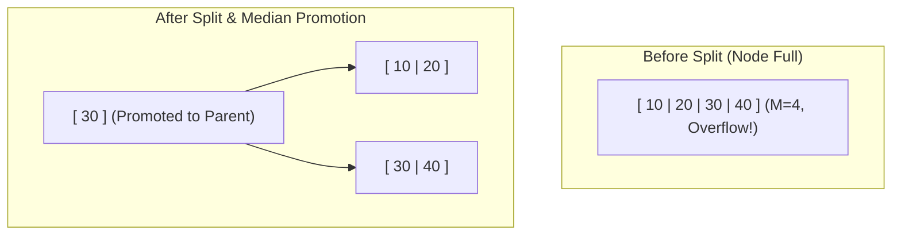

# B-Trees & B+ Trees: Principles, Paging & Storage Engines

> [!NOTE]
> B-Trees and B+ Trees are self-balancing $M$-way search trees designed specifically for storage systems that read and write large blocks of memory (disk pages, flash blocks, or memory pages). They form the backbone of virtually every relational database on earth (PostgreSQL, SQLite, MySQL InnoDB, Oracle).

---

## 1. Why This Matters: The Disks & Paging Dilemma

In traditional in-memory data structures like AVL or Red-Black trees, every node has a fan-out of 2. For $10^9$ (one billion) records, the tree height is:
$$h \approx \log_2(10^9) \approx 30$$

If this tree resides on disk:
* Traversal requires **30 random disk reads**.
* On a mechanical hard drive ($10\text{ ms}$ per seek), this takes **300 milliseconds per query** (unusable).
* Even on an enterprise NVMe SSD ($20\text{ }\mu\text{s}$ per random read), 30 sequential dependent read stalls take **0.6 milliseconds**, bottlenecking throughput.

### The B-Tree Breakthrough (Bayer & McCreight, 1970)
Instead of 2 children per node, make each node match the **operating system storage page size** ($4\text{ KB}$ or $8\text{ KB}$), holding hundreds of keys per node ($M \approx 500$).

For $10^9$ keys with a fan-out of $M = 500$:
$$h \approx \log_{500}(10^9) \approx 3.3$$

**A billion records can be indexed in only 3 to 4 disk accesses!** Furthermore, because the root node and second level are cached permanently in RAM (the database buffer pool), queries frequently require only **1 single physical disk I/O**.

---

## 2. Core Intuition & The Structural Difference

### B-Tree vs. B+ Tree

```text
B-TREE:
Keys and User Data are stored in ALL nodes (Internal + Leaf).
               [ 20 : Data ]
              /             \
    [ 10 : Data ]         [ 30 : Data ]

* Advantage: If searching for 20, stops early at root.
* Disadvantage: Keys take up space in internal nodes, drastically reducing fan-out.
  Range scans require complex in-order tree traversals across random disk blocks.
──────────────────────────────────────────────────────────────────────────────────
B+ TREE (Modern Standard):
Internal nodes store ONLY routing keys and child pointers.
ALL data records are stored exclusively in Leaf nodes.
Leaf nodes are linked in a continuous doubly-linked list.

               [   20   |   40   ]           <-- Routing keys only (Massive Fan-out)
              /         |         \
      [ 10 | 15 ]  [ 20 | 30 ]  [ 40 | 50 ]  <-- Routing keys
       /    \       /    \       /    \
     ┌────┐ ┌────┐ ┌────┐ ┌────┐ ┌────┐ ┌────┐
     │ D1 │ │ D2 │ │ D3 │ │ D4 │ │ D5 │ │ D6 │  <-- Data records in leaves
     └────┘ └────┘ └────┘ └────┘ └────┘ └────┘
       └───►  └───►  └───►  └───►  └───►        <-- Doubly linked list for range scans!
```

### Why B+ Trees Won in Production Databases
1. **Higher Fan-Out**: Internal nodes do not waste bytes storing payloads; they pack thousands of routing keys per $4\text{ KB}$ page, keeping tree height minimal ($3-4$ levels).
2. **Blazing Fast Range Scans**: A SQL query like `SELECT * FROM users WHERE age BETWEEN 21 AND 30` traverses down to leaf node 21 in $O(\log_B N)$, and then simply walks the sequential linked list horizontally across leaves. Zero vertical tree re-traversals needed!

---

## 3. Formal Invariants (Order $M$)

A B+ Tree of order $M$ (where each node can have at most $M$ children) maintains the following strict mathematical invariants:

1. **Node Capacity**:
   * Every internal node (except root) has at least $\lceil M/2 \rceil$ children and at most $M$ children.
   * Every leaf node contains between $\lceil (M-1)/2 \rceil$ and $M-1$ keys.
2. **Root Invariant**:
   * The root has at least 2 children if it is not a leaf.
3. **Perfect Leaf Balance**:
   * **All leaf nodes are at the exact same depth.** The tree grows strictly upward from root splits, guaranteeing zero balance degradation.
4. **Ordering**:
   * For an internal node with keys $K_1 < K_2 < \dots < K_{k-1}$, subtree $P_i$ contains all keys in $[K_{i-1}, K_i)$.

---

## 4. Key Operations & State Transitions

### 1. Search: $O(\log_B N)$ Disk I/O + $O(\log M)$ in-memory search
* At each node, perform binary search over the sorted keys within the page.
* Follow the corresponding child pointer down until reaching a leaf node.

### 2. Insertion: Growing from the Bottom Up
1. Traverse to the appropriate leaf node.
2. If the leaf has space ($< M-1$ keys), insert the key in sorted order.
3. **If the leaf is full (Split)**:
   * Split the leaf into two leaves, each with half the keys.
   * Copy the middle key up to the parent node.
   * If the parent becomes full, split the parent recursively.
   * If the root splits, create a brand new root node with 2 children. **This is how B-Trees grow in height: from the root up!**



### 3. Deletion: Underflow & Merging
1. Remove key from the leaf.
2. If the leaf falls below $\lceil (M-1)/2 \rceil$ keys (**Underflow**):
   * **Borrow (Rotation)**: If an immediate sibling has extra keys ($> \lceil M/2 \rceil$), borrow a key from the sibling and adjust the parent separator.
   * **Merge**: If both siblings are at minimum capacity, merge the underflowing node with its sibling and pull down the separator key from the parent.

---

## 5. Hardware, Storage & Page Layout

Inside a real database storage engine (e.g. PostgreSQL `nbtree` or SQLite), a B+ Tree node is physically stored as an array of bytes representing a disk page (usually $4096$ or $8192$ bytes).

### Slotted Page Architecture (Inside a single B+ Tree Node)

```text
+-----------------------------------------------------------------------+
| PAGE HEADER (LSN, Page Type, Free Space Pointer, Flags)               |
+-----------------------------------------------------------------------+
| Line Pointers Array (Offsets pointing to items at bottom of page)     |
| [ Offset 0 ] [ Offset 1 ] [ Offset 2 ] ...                            |
| ───────┐         └──────────────┐                                     |
|        ▼                        ▼                                     |
|                      ====================                             |
|                      UNALLOCATED FREE GAP                             |
|                      ====================                             |
|                                 ▲                                     |
|                                 │                                     |
| ... [ Key 2 Payload ] [ Key 1 Payload ] [ Key 0 Payload ]             |
+-----------------------------------------------------------------------+
| SPECIAL SPACE (Doubly-linked list pointers: NextPageID, PrevPageID)   |
+-----------------------------------------------------------------------+
```

* **Line Pointers grow downwards**; **Tuples/Keys grow upwards**.
* Keys are kept sorted logically via the Line Pointer array, allowing insertions without shifting heavy variable-length data tuples around.

---

## 6. Real-World Case Studies

### 1. PostgreSQL: `nbtree` & Lehman-Yao Concurrency
* PostgreSQL implements a variant of the **Lehman & Yao B-Tree algorithm**.
* In standard B-Trees, splitting a node requires holding exclusive write locks across the child, parent, and sibling simultaneously (lock coupling).
* Lehman-Yao introduces a "Right-Link" pointer on internal nodes. If a search query races with an uncommitted page split, it follows the right-link pointer horizontally to find the moved key without deadlocking or holding long locks.

### 2. SQLite: Dual B-Tree Architecture
* SQLite uses two distinct B-Tree variants within a single file:
  * **Table B-Trees (B+ Trees)**: Leaf pages store integer primary keys (`rowid`) mapped to table row payload data.
  * **Index B-Trees (Standard B-Trees)**: Secondary index pages store indexed values and point to the corresponding `rowid`.

### 3. MySQL InnoDB: Clustered Index
* In MySQL InnoDB, tables are organized strictly as clustered B+ Trees. The table *is* the primary key B+ Tree. All secondary indexes store the primary key value as their leaf pointer, requiring a secondary lookup (bookmark lookup) into the primary clustered B+ Tree.

---

## 7. Comparative Architecture: B+ Tree vs. LSM-Tree

| Metric / Dimension | B+ Tree (e.g. Postgres, SQLite) | LSM-Tree (e.g. RocksDB, Cassandra) |
| :--- | :--- | :--- |
| **Primary Target Hardware** | Reads from SSD / DRAM, in-place disk pages | High-velocity sequential writes to SSD / NVMe |
| **Point Read Latency** | **$O(\log_B N)$** (Fast, predictable, 1-2 I/Os) | $O(\log N)$ across MemTable + SSTables (Slower, requires Bloom filters) |
| **Write Performance** | Random in-place page writes (Write amplification from dirty page flushing) | **Append-only sequential writes** to WAL + MemTable (Extreme write throughput) |
| **Range Queries** | **Unbeatable**: Walk horizontal linked list of leaf pages | Merges iterators across multiple disk runs (Slower) |
| **Concurrency Model** | Page-level latching / Lock coupling | Mostly lock-free MemTables; background compaction threads |

---

## 8. Canonical Python Implementation (Educational B-Tree)

```python
class BTreeNode:
    def __init__(self, leaf=False):
        self.leaf = leaf
        self.keys = []
        self.children = []

class BTree:
    def __init__(self, t):
        """t is the minimum degree: nodes have [t-1, 2t-1] keys."""
        self.root = BTreeNode(leaf=True)
        self.t = t

    def search(self, k, node=None):
        if node is None:
            node = self.root
        i = 0
        while i < len(node.keys) and k > node.keys[i]:
            i += 1
        if i < len(node.keys) and k == node.keys[i]:
            return (node, i)
        if node.leaf:
            return None
        return self.search(k, node.children[i])

    def insert(self, k):
        root = self.root
        if len(root.keys) == 2 * self.t - 1:
            new_root = BTreeNode(leaf=False)
            new_root.children.append(self.root)
            self._split_child(new_root, 0)
            self.root = new_root
            self._insert_non_full(new_root, k)
        else:
            self._insert_non_full(root, k)

    def _insert_non_full(self, node, k):
        i = len(node.keys) - 1
        if node.leaf:
            node.keys.append(None)
            while i >= 0 and k < node.keys[i]:
                node.keys[i + 1] = node.keys[i]
                i -= 1
            node.keys[i + 1] = k
        else:
            while i >= 0 and k < node.keys[i]:
                i -= 1
            i += 1
            if len(node.children[i].keys) == 2 * self.t - 1:
                self._split_child(node, i)
                if k > node.keys[i]:
                    i += 1
            self._insert_non_full(node.children[i], k)

    def _split_child(self, parent, i):
        t = self.t
        y = parent.children[i]
        z = BTreeNode(leaf=y.leaf)
        parent.children.insert(i + 1, z)
        parent.keys.insert(i, y.keys[t - 1])

        z.keys = y.keys[t:(2 * t - 1)]
        y.keys = y.keys[0:(t - 1)]

        if not y.leaf:
            z.children = y.children[t:(2 * t)]
            y.children = y.children[0:t]
```

---

## 9. Common Pitfalls & Edge Cases

1. **Midpoint Overflow in Page Calculations**: In C/C++, computing binary search offsets within page memory buffers using `(low + high) / 2` can overflow integer bounds on large buffers. Always use `low + (high - low) / 2`.
2. **Ignoring Page Alignment**: In systems programming (C/C++ / Rust), allocating a B-Tree node without aligning to the OS page boundary (`posix_memalign` or `alignas(4096)`) forces the operating system kernel to issue double I/Os across page splits.
3. **Underflow Cascade Deadlocks**: Poorly implemented concurrency protocols that lock upwards when rebalancing underflowing nodes during deletion can cause circular deadlocks.

---

## 10. Further Reading & Landmark Papers

* **Bayer, R., & McCreight, E. (1970)**: *"Organization and Maintenance of Large Ordered Indices"*. Acta Informatica.
* **Lehman, P. L., & Yao, S. B. (1981)**: *"Efficient Locking for Concurrent Operations on B-Trees"*. ACM Transactions on Database Systems (TODS).
* **Goetz Graefe (2011)**: *"Modern B-Tree Techniques"*. Foundations and Trends in Databases. (The definitive modern systems reference).
