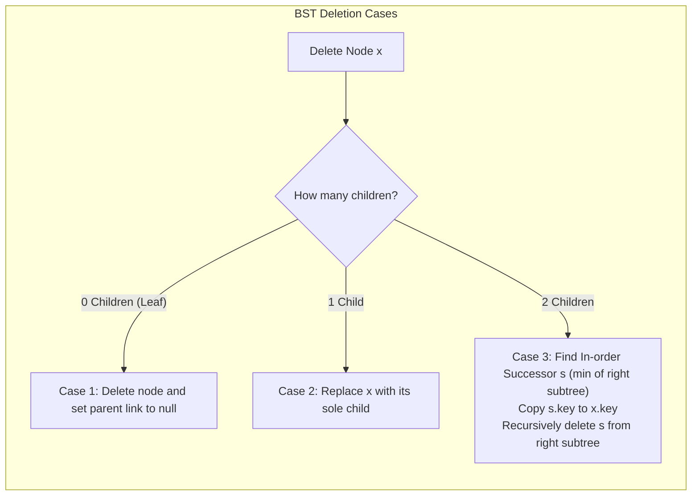

# Binary Search Trees (BSTs)

> [!NOTE]
> **The Binary Search Invariant:** A **Binary Search Tree (BST)** organizes nodes such that for every node $u$:
> - All keys in the left subtree are strictly smaller: $\forall v \in \text{left}(u), \text{key}(v) < \text{key}(u)$.
> - All keys in the right subtree are strictly larger: $\forall v \in \text{right}(u), \text{key}(v) > \text{key}(u)$.
> - An **in-order traversal** visits keys in strictly increasing sorted order.
> - Supports average-case $O(\log n)$ search, insert, and delete operations.
> - Reference implementations: [C++17 Implementation](../../implementations/cpp/binary_search_tree.cpp) | [Python Implementation](../../implementations/python/binary_search_tree.py)

> [!TIP]
> **The Three BST Deletion Cases:**
>
> | Case | Node Structure | Deletion Mechanism | Subtree Reconnection |
> |---|---|---|---|
> | **Case 1: Leaf** | 0 children | Free/delete node directly | Parent pointer set to `nullptr` |
> | **Case 2: Single Child** | 1 child (left or right) | Bypass node | Child promoted directly to parent's slot |
> | **Case 3: Two Children** | 2 children | Value swap with in-order successor | Copy successor value $\to$ recursively delete successor from right subtree |

> [!WARNING]
> **Critical BST Pitfalls & Degeneracy:**
> 1. **Tree Skewing (Pathological $O(n)$ Height):** Inserting sorted data (e.g. $[1, 2, 3, 4, 5]$) causes unaugmented BSTs to degrade into a linked list of height $n$, turning $O(\log n)$ search into $O(n)$ linear scans. Use self-balancing trees like [AVL and Red-Black Trees](avl-and-red-black-trees.md) or randomized [Treaps](treaps.md) when adversarial or ordered inputs are possible.
> 2. **Memory Leaks during Node Replacement:** In Case 3 deletion, never delete the target node's memory directly before replacing its key, or children pointers will be orphaned.
> 3. **Duplicate Key Policy:** Standard BSTs disallow duplicates. If duplicates are required, store a frequency counter `count` within the node rather than inserting duplicate nodes into subtrees.




A **binary search tree** is a hierarchical structure where each node contains a key, and:

- All keys in the left subtree are less than the node’s key
- All keys in the right subtree are greater than the node’s key

BSTs support efficient search, insertion, and deletion, and are foundational for many advanced structures.

This chapter develops:

- BST invariant and structure
- Recursive and iterative search
- Insertion logic
- Deletion: three cases (leaf, one child, two children)
- Predecessor and successor role

---

## 1. BST Invariant

For any node with key `k`:

- Left subtree: keys < `k`
- Right subtree: keys > `k`

This invariant enables binary search at each step.

---

## 2. Search in BST

### Recursive

```cpp
Node* search(Node* root, int key) {
    if (!root || root->key == key) return root;
    if (key < root->key) return search(root->left, key);
    else return search(root->right, key);
}
```

### Iterative

```cpp
Node* search(Node* root, int key) {
    while (root && root->key != key) {
        root = (key < root->key) ? root->left : root->right;
    }
    return root;
}
```

---

## 3. Insertion in BST

- Start at root, follow left/right by key comparison
- Insert at null spot

### Example

```cpp
Node* insert(Node* root, int key) {
    if (!root) return new Node(key);
    if (key < root->key) root->left = insert(root->left, key);
    else if (key > root->key) root->right = insert(root->right, key);
    return root;
}
```

---

## 4. Deletion in BST — Three Cases

Deletion is more involved. Three cases:

### Case 1: Leaf Node

- Just remove the node.

### Case 2: One Child

- Replace node with its child.

### Case 3: Two Children

- Find predecessor (max in left subtree) or successor (min in right subtree)
- Replace node's key with predecessor/successor
- Delete predecessor/successor from subtree

### Example

```cpp
Node* delete(Node* root, int key) {
    if (!root) return nullptr;
    if (key < root->key) root->left = delete(root->left, key);
    else if (key > root->key) root->right = delete(root->right, key);
    else {
        if (!root->left) {
            Node* right = root->right;
            delete root;
            return right;
        }
        else if (!root->right) {
            Node* left = root->left;
            delete root;
            return left;
        }
        else {
            Node* succ = root->right;
            while (succ->left) succ = succ->left;
            root->key = succ->key;
            root->right = delete(root->right, succ->key);
        }
    }
    return root;
}
```

---

## 5. Predecessor and Successor

- **Predecessor:** max node in left subtree
- **Successor:** min node in right subtree

Used for deletion and in-order traversal.

---

## 6. Recursive vs. Iterative

- Recursive is elegant and clear, but may risk stack overflow for deep trees.
- Iterative uses explicit stack or pointer manipulation.

---

## 7. Engineering Pitfalls

- Forgetting to handle duplicate keys (policy: allow or disallow)
- Not updating parent pointers (if maintained)
- Memory leaks in node deletion

---

## 8. BST Performance

- Balanced BST: $ O(\log n) $ for search/insert/delete
- Unbalanced: can degrade to $ O(n) $ (linked list)

Self-balancing BSTs (AVL, Red-Black) maintain balance automatically.

---

## 9. Summary Table

| Operation | Recursive | Iterative | Typical Complexity |
|---|---|---|---|
| Search | Yes | Yes | $ O(\log n) $ |
| Insert | Yes | Yes | $ O(\log n) $ |
| Delete | Yes | Yes | $ O(\log n) $ |

---

## 10. Practice Prompts

1. What is the BST invariant?
2. What are the three deletion cases?
3. How do you find predecessor/successor?
4. What is the risk of unbalanced BSTs?
5. When is recursive vs. iterative search preferred?

---

## 11. Suggested Next Topics

- Treaps
- AVL trees
- Red-Black trees
