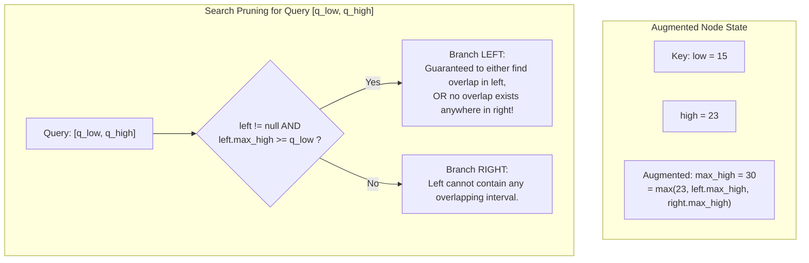
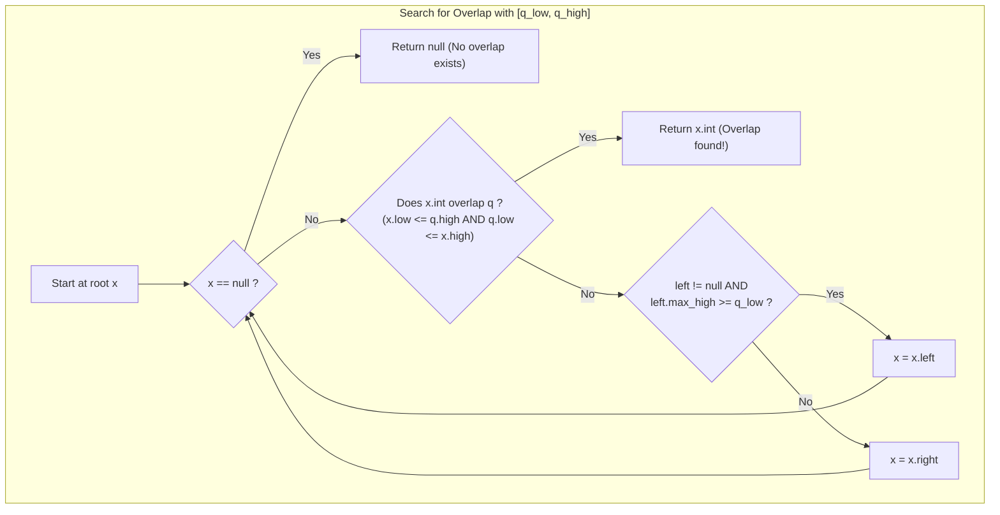

# Interval Trees

> [!NOTE]
> **The Stabbing & Overlap Paradigm:**
> An **Interval Tree (Edelsbrunner, 1980; McCreight, 1980)** is an augmented balanced binary search tree designed to store dynamic sets of intervals $[low, high]$ and efficiently answer:
> 1. **Interval Stabbing Query:** Locate all intervals containing a target point $p$ ($low \le p \le high$).
> 2. **Interval Overlap Query:** Locate an interval (or all $k$ intervals) that overlap with a query interval $[q_{low}, q_{high}]$.
> While a naive linear scan requires $O(N)$ time, an augmented Interval Tree finds an overlapping interval in **$O(\log N)$ worst-case time**, and all $k$ overlapping intervals in **$O(k + \log N)$ time**.

> [!TIP]
> **The Subtree `max_high` Augmentation:**
> Every node $x$ stores:
> 1. An interval $x.int = [x.low, x.high]$, keyed by $x.low$ in standard BST order.
> 2. An augmented attribute:
>    $$x.max\_high = \max(x.high, \text{left}(x).max\_high, \text{right}(x).max\_high)$$
> This single scalar augmentation enables a deterministic $O(1)$ decision at each step to prune entire subtrees during overlap searches.

> [!WARNING]
> **Rotation Maintenance Invariant:**
> Whenever tree rebalancing occurs (e.g. during Red-Black or AVL rotations), the `max_high` attribute of rotated nodes must be recomputed **bottom-up**:
> First recompute the rotated child's `max_high`, and only then recompute the new subtree root's `max_high`.
> Failing to maintain `max_high` during rotations silently breaks search pruning.



---

## 1. Core Mental Model & Motivation

Interval intersection is one of the most fundamental operations in systems programming and computer science:
- **Operating System Memory Management:** In the Linux kernel, every process's virtual address space consists of non-overlapping or queried virtual memory areas (VMAs). The kernel uses augmented Red-Black interval trees (`mm/interval_tree.c`) to rapidly determine which VMA covers a faulting address.
- **High-Performance Calendaring & Scheduling:** Detecting room booking conflicts, doctor appointment overlaps, and meeting invites.
- **Window Management & 2D Graphics:** Finding overlapping UI widgets, collision detection bounding boxes, and audio clip timeline segments.
- **Computational Genomics:** Mapping sequenced DNA reads to reference genome chromosome annotation regions.

---

## 2. Mathematical Formulation & Structural Invariants

### 2.1 The Interval Overlap Condition
Two closed intervals $i = [i_{low}, i_{high}]$ and $q = [q_{low}, q_{high}]$ **overlap** ($i \cap q \neq \emptyset$) if and only if:
$$i_{low} \le q_{high} \quad \text{and} \quad q_{low} \le i_{high}$$

### 2.2 Invariant 1: BST Low-Key Ordering
The underlying binary search tree is keyed strictly on the low endpoint:
$$\forall y \in \text{left}(x), \quad y.low \le x.low$$
$$\forall z \in \text{right}(x), \quad x.low \le z.low$$

### 2.3 Invariant 2: Subtree Max Endpoint
For every node $x$ in tree $T$:
$$x.max\_high = \max \Big( x.high, \quad \max_{y \in \text{subtree}(x)} y.high \Big)$$
Locally, this satisfies the recursive relation:
$$x.max\_high = \max(x.high, \quad \text{left}(x).max\_high, \quad \text{right}(x).max\_high)$$
with the convention that $\text{null}.max\_high = -\infty$.

---

## 3. The Search Pruning Theorem

The algorithm for finding an interval that overlaps $q = [q_{low}, q_{high}]$ starting at root $x$ is deceptively simple:

```text
IntervalSearch(x, q):
    while x != null and not Overlap(x.int, q):
        if x.left != null and x.left.max_high >= q_low:
            x = x.left
        else:
            x = x.right
    return x
```

### Formal Correctness Proof (CLRS Theorem 14.1):
We must prove that:
1. If we branch **left**, either there is an overlapping interval in the left subtree, or there is **no** overlapping interval in the right subtree.
2. If we branch **right**, there can be **no** overlapping interval in the left subtree.

#### Case 1: We branch Left (`x.left.max_high >= q_low`)
Suppose there is no interval in the left subtree that overlaps $q$.
By definition of `max_high`, there is some interval $y$ in the left subtree such that:
$$y.high = x.left.max\_high \ge q_{low}$$
Since $y$ does not overlap $q$, and $y.high \ge q_{low}$, the only way $y$ can fail to overlap $q$ is if:
$$y.low > q_{high}$$
By Invariant 1 (BST ordering keyed on $low$):
$$q_{high} < y.low \le x.low \le z.low \quad \forall z \in \text{right}(x)$$
Therefore, for every interval $z$ in the right subtree, $z.low > q_{high}$, which means **no interval in the right subtree can ever overlap $q$**.
Thus, branching left was completely safe: either we find an overlap in the left subtree, or no overlap exists anywhere in the entire subtree!

#### Case 2: We branch Right (`x.left == null` or `x.left.max_high < q_low`)
If $x.left == null$, the left subtree is empty.
If $x.left.max\_high < q_{low}$, then for all intervals $y$ in the left subtree:
$$y.high \le x.left.max\_high < q_{low}$$
Thus, no interval $y$ in the left subtree can satisfy $y.high \ge q_{low}$, meaning **no interval in the left subtree can overlap $q$**.
Branching right is completely safe. $\blacksquare$

---

## 4. Concrete Operations & Step-by-Step State Transitions



### 4.1 Insertion ($O(\log N)$)
1. Insert new interval $i = [i_{low}, i_{high}]$ as in a standard BST keyed by $i_{low}$.
2. Initialize $new\_node.max\_high = i_{high}$.
3. Walk back up the access path to the root:
   - For each ancestor $p$, update:
     $$p.max\_high = \max(p.high, p.left.max\_high, p.right.max\_high)$$
   - If rebalancing rotations occur, recompute `max_high` for the child first, then the parent.

### 4.2 Deletion ($O(\log N)$)
1. Locate interval $i$ and delete as in standard BST.
2. Walk back up to the root, updating `max_high` on all affected ancestors and performing necessary rotations with bottom-up `max_high` repair.

### 4.3 All-Overlaps Query ($O(k + \log N)$)
To find **all** $k$ intervals overlapping $q$:
```text
FindAllOverlaps(x, q, results):
    if x == null: return
    if x.left != null and x.left.max_high >= q_low:
        FindAllOverlaps(x.left, q, results)
    if Overlap(x.int, q):
        results.push_back(x.int)
    if x.right != null and x.low <= q_high:
        FindAllOverlaps(x.right, q, results)
```

---

## 5. Algorithmic Complexity Analysis

| Operation | Time Complexity | Auxiliary Space | Notes |
| :--- | :--- | :--- | :--- |
| `find_any_overlap(q)` | **$O(\log N)$** | $O(1)$ | Prunes half the tree at each step |
| `find_all_overlaps(q)`| **$O(k + \log N)$** | $O(k)$ output | $k$ = number of overlapping intervals |
| `stabbing_query(p)` | **$O(k + \log N)$** | $O(k)$ output | Equivalent to query $[p, p]$ |
| `insert(i)` | **$O(\log N)$** | $O(1)$ | Standard balanced BST insertion |
| `erase(i)` | **$O(\log N)$** | $O(1)$ | Standard balanced BST deletion |

---

## 6. High-Performance Engineering & Rotation Repair

When balancing the tree via rotations (e.g. using Treap priorities or AVL balance factors), updating `max_high` must obey strict dependency order:

```cpp
void rotate_left(Node*& x) {
    Node* y = x->right;
    x->right = y->left;
    y->left = x;

    // 1. Recompute x (now child) FIRST
    update_max_high(x);
    // 2. Recompute y (new root) SECOND
    update_max_high(y);

    x = y;
}
```

---

## 7. Edge Cases & Failure Modes

1. **Zero-Length / Point Intervals:** Querying single points $[p, p]$. Handled seamlessly by the standard overlap predicate $low \le p \le high$.
2. **Duplicate Low Keys:** Multiple intervals sharing the exact same $low$ (e.g. $[10, 20]$ and $[10, 50]$). Handled cleanly by using $[low, high]$ lexicographical tie-breaking or placing duplicates in the right subtree.
3. **Empty Tree & Miss Searches:** Query intervals that overlap nothing return `nullptr` without traversing unnecessary subtrees.

---

## 8. Arthur's Two-Layer API Implementation

Following repository standards:
- **Layer A (Fast Core API):**
  - `const Interval& find_overlap(const Interval& q) const`: Precondition: an overlap exists, debug `assert(!empty())`.
  - `void insert(int64_t low, int64_t high)`
  - `bool erase(int64_t low, int64_t high)`
- **Layer B (Safe Adapter API):**
  - `const Interval* try_find_overlap(const Interval& q) const`: Returns pointer or `nullptr`.
  - `std::vector<Interval> find_all_overlaps(const Interval& q) const`: Returns all intersecting intervals.
  - `std::vector<Interval> stabbing_query(int64_t point) const`: Returns all intervals covering `point`.

---

## 9. Differential Testing & Oracle Verification Strategy

To guarantee search pruning correctness and structural invariants:
- Both single-overlap and all-overlaps queries are differentially tested against a naive `std::vector<Interval>` linear scan oracle across 1,000 randomized operations.
- Every node's `max_high` invariant is recursively asserted to equal the exact maximum endpoint of its subtree.

---

## 10. Engineering Pitfalls & Optimization Notes

> [!CAUTION]
> **Right Subtree Pruning in All-Overlaps:**
> When searching for *all* overlapping intervals, do NOT blindly search both children.
> Only traverse the right subtree if $x.low \le q_{high}$!
> If $x.low > q_{high}$, then by BST ordering, every node in the right subtree has $low \ge x.low > q_{high}$, so none of them can overlap $q$. Skipping the right subtree when $x.low > q_{high}$ preserves the optimal $O(k + \log N)$ bound.

---

## 11. Real-World Applications & Industry Context

1. **Linux Kernel Virtual Memory (`mm/interval_tree.c`):** Manages anonymous and file-backed memory mappings to resolve page faults in sub-microsecond time.
2. **Audio/Video Editing Timelines:** Software like Adobe Premiere and Blender uses interval trees to locate overlapping video transitions, audio tracks, and keyframes.
3. **Genomic Sequence Alignment:** Tools like BEDTools use interval trees to find gene overlaps and transcription factor binding sites across billions of base pairs.

---

## 12. Curated Academic References

1. **Edelsbrunner, Herbert (1980):** *Dynamic rectangle intersection searching*. Institute for Information Processing, Technical Report.
2. **McCreight, Edward M. (1980):** *Efficient algorithms for enumerating intersecting intervals and rectangles*. Xerox PARC Technical Report.
3. **Cormen, Leiserson, Rivest, Stein (CLRS):** *Introduction to Algorithms* (3rd ed.). MIT Press. Chapter 14: "Augmenting Data Structures" (Section 14.3: Interval trees).
