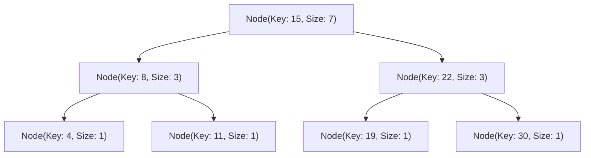
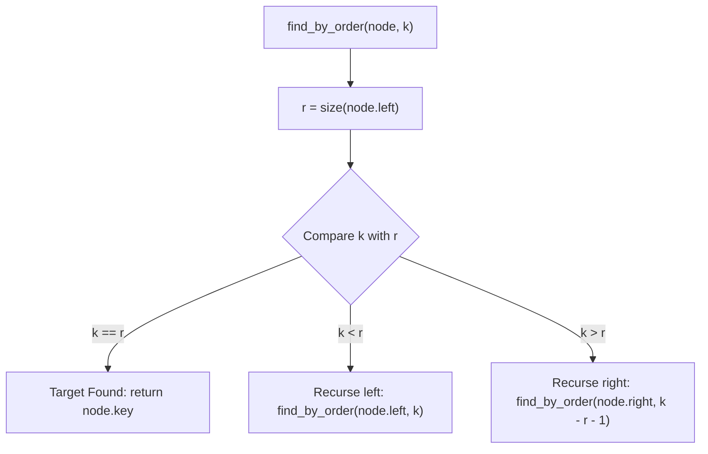
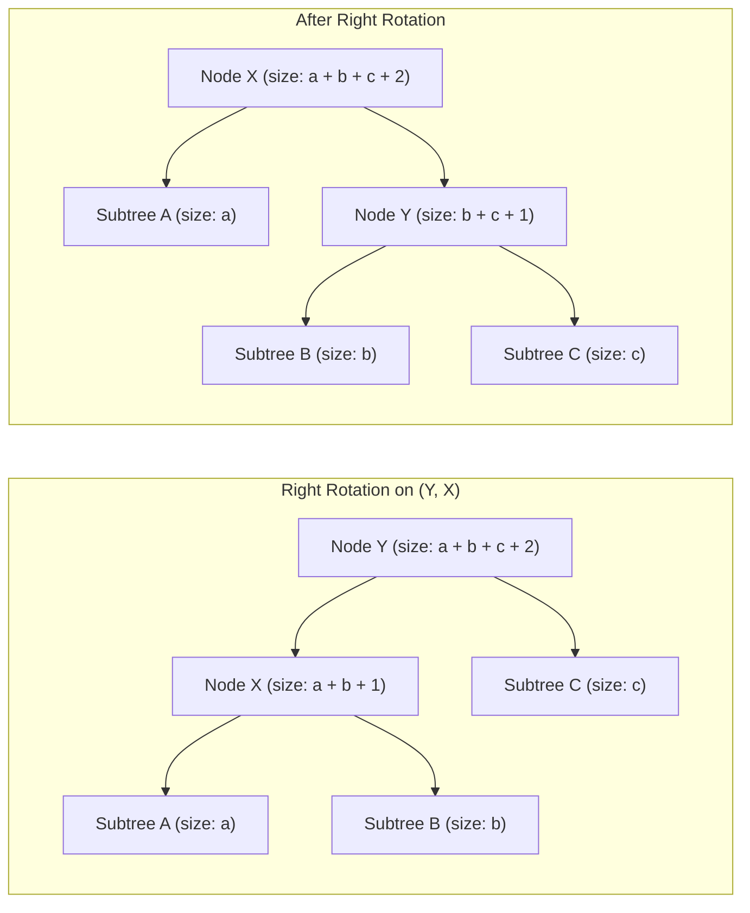

# Order-Statistic Trees

> [!NOTE]
> **Dynamic Rank and Select on Ordered Sets:**
> Standard balanced binary search trees (e.g., `std::set`, Red-Black trees) answer membership (`contains`) and predecessor/successor in $O(\log n)$ time, but finding the $k$-th smallest element requires $O(n)$ in-order iteration.
> An **Order-Statistic Tree (OST)** augments each tree node with the subtree size, unlocking two essential operations in $O(\log n)$ time:
> 1. **`find_by_order(k)` (Select):** Returns the key of rank $k$ (the $k$-th smallest element).
> 2. **`order_of_key(x)` (Rank):** Returns the number of strictly smaller elements present in the tree.

> [!TIP]
> **Local Invariant Maintenance During Rotations in $O(1)$:**
> For any node $x$, the subtree size invariant is:
> $$\text{size}(x) = 1 + \text{size}(x.\text{left}) + \text{size}(x.\text{right}) \quad (\text{with } \text{size}(\text{null}) = 0)$$
> When a tree rotation occurs (e.g., during rebalancing in an AVL tree, Red-Black tree, or Treap), **only the two rotated nodes have their subtree compositions altered**. Subtree sizes for all ancestors and unaffected descendants remain unchanged, allowing $O(1)$ size updates per rotation.

> [!WARNING]
> **0-Indexed vs 1-Indexed Convention Traps:**
> Competitive programming libraries (notably GCC's `__gnu_pbds::tree`) standardise on **0-indexed ranks**:
> - `find_by_order(0)` returns the absolute minimum element.
> - `order_of_key(min_element)` returns $0$.
> If a query requests the $k$-th element using 1-based indexing, query `find_by_order(k - 1)`. Querying with $k \ge n$ triggers out-of-bounds invalid iterator dereferences.



---

## 1. Algorithmic Mechanics: Select and Rank

### 1.1 `find_by_order(k)` (The Select Operation)
Finds the element with 0-based rank $k$ in the tree ($0 \le k < \text{size}(\text{root})$):



#### Step-by-Step Trace:
- Let $r = \text{size}(x.\text{left})$ be the number of elements in $x$'s left subtree.
- **Case $k = r$:** Exactly $k$ elements are smaller than $x$. Therefore, node $x$ is the target element.
- **Case $k < r$:** The $k$-th element lies in the left subtree. Recurse to $x.\text{left}$ with rank $k$.
- **Case $k > r$:** The $k$-th element lies in the right subtree. Because the left subtree ($r$ nodes) and the current node ($1$ node) are smaller than any element in the right subtree, subtract $r + 1$ and recurse to $x.\text{right}$ with rank $k - (r + 1)$.
- **Time Complexity:** $O(\text{height}) = O(\log n)$ on balanced trees.

---

### 1.2 `order_of_key(x)` (The Rank Operation)
Computes the count of keys in the tree strictly smaller than $x$:

1. Initialize running rank `rank = 0`.
2. Start at `curr = root`.
3. While `curr != null`:
   - If $x \le \text{curr}.\text{key}$: Move to `curr.left` (no elements confirmed smaller yet).
   - If $x > \text{curr}.\text{key}$: The current node and its entire left subtree are strictly smaller than $x$. Accumulate $\text{size}(\text{curr}.\text{left}) + 1$ into `rank`, and move to `curr.right`.
4. Return `rank`.
- **Time Complexity:** $O(\text{height}) = O(\log n)$.

---

## 2. Tree Rotation with Subtree Size Maintenance

When maintaining balance via tree rotations, sizes update locally in $O(1)$ time:



```cpp
void update_size(Node* node) {
    if (node) {
        node->size = 1 + get_size(node->left) + get_size(node->right);
    }
}

Node* rotate_right(Node* y) {
    Node* x = y->left;
    y->left = x->right;
    x->right = y;
    update_size(y); // Update child first!
    update_size(x); // Update new root second!
    return x;
}
```

---

## 3. Implementation Strategies: Treap vs PBDS

| Feature | Augmented Treap (Custom) | GCC PBDS (`__gnu_pbds::tree`) | Augmented AVL / Red-Black |
| :--- | :--- | :--- | :--- |
| **Code Length** | ~100 lines | 3 lines of typedef | ~250 lines |
| **Balance Mechanism** | Randomized priority heap | Red-Black tree invariants | Deterministic height/color balancing |
| **Operations Supported** | Rank, Select, Split, Merge, Range reverse | Rank, Select, Standard `std::set` API | Rank, Select |
| **Portability** | Universal (Standard C++17, Python) | GCC / Clang only | Universal |
| **Cache Locality** | Node pointer overhead | Node pointer overhead | Node pointer overhead |

---

## 4. Complexity Analysis Matrix

| Operation | Average Time | Worst-Case Time | Auxiliary Space | Remarks |
| :--- | :---: | :---: | :---: | :--- |
| **`insert(val)`** | $O(\log n)$ | $O(\log n)$ | $O(1)$ | Allocates 1 node, updates path sizes |
| **`erase(val)`** | $O(\log n)$ | $O(\log n)$ | $O(1)$ | Decrements path sizes, frees node |
| **`find_by_order(k)`** | $O(\log n)$ | $O(\log n)$ | $O(1)$ | Traverses downward guided by left subtree size |
| **`order_of_key(x)`** | $O(\log n)$ | $O(\log n)$ | $O(1)$ | Accumulates left subtree sizes along right branches |
| **Space Complexity** | $\Theta(n)$ | $\Theta(n)$ | $\Theta(n)$ | 1 additional `size_t` (4 or 8 bytes) per node |

---

## 5. Common Pitfalls & Anti-Patterns

### Anti-Pattern 1: Out-of-Order Size Updating in Rotations
```cpp
// ANTI-PATTERN: Updating the new root before the rotated child
update_size(x); // BUG: y's size is not yet updated! x uses stale size of y
update_size(y);

// CORRECT: Bottom-up update
update_size(y); // Update child first
update_size(x); // Update root second
```

### Anti-Pattern 2: Multiset Support Without Unique Keys
An OST storing identical keys in a naive BST structure can distort rank queries. To support duplicate elements:
1. Store a frequency count `count` at each node: $\text{size}(x) = \text{count}(x) + \text{size}(x.\text{left}) + \text{size}(x.\text{right})$.
2. OR store pairs `(key, unique_id)`.

---

## 6. Curated References & Related Problems

1. **CLRS Chapter 14.1:** *Augmenting Data Structures: Order-Statistic Trees*.
2. **GCC libstdc++ Documentation:** *Policy-Based Data Structures (`pb_ds`)*.
3. **LeetCode 315:** *Count of Smaller Numbers After Self* (Direct `order_of_key` insertion sweep).
4. **LeetCode 493:** *Reverse Pairs* (Dynamic rank queries).
5. **Codeforces 1042D:** *Petya and Array* (Dynamic prefix sum rank queries).
