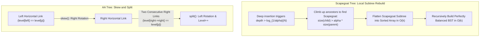
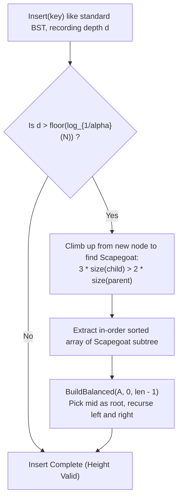
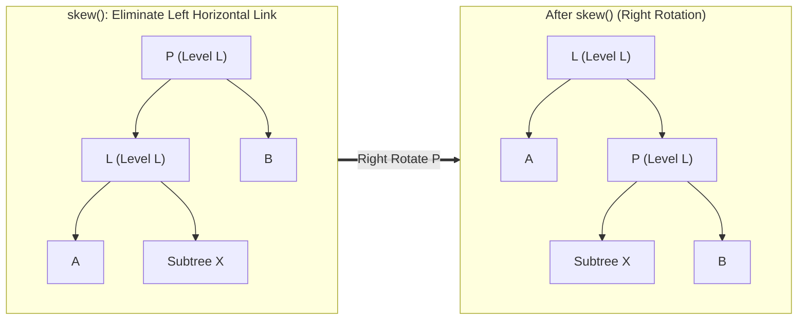

# Scapegoat and AA Trees

> [!NOTE]
> **Two Divergent Philosophies of Balanced Trees:**
> When standard AVL or Red-Black trees are too complex or memory-intensive, two elegant alternatives emerge:
> 1. **Scapegoat Trees (Galperin & Rivest, 1993):** An amortized weight-balanced BST that stores **zero balance metadata** per node. It allows trees to become temporarily unbalanced, and when an insertion penetrates too deep, it locates an unbalanced ancestor (the **scapegoat**) and completely rebuilds its subtree into perfect balance in linear time.
> 2. **AA Trees (Arne Andersson, 1993):** A radical simplification of Red-Black trees that disallows left-leaning red links. By enforcing that only right horizontal links are permitted, all 7 complex Red-Black rotation cases collapse into just **two primitive operations: `skew` and `split`**.

> [!TIP]
> **Strict $O(\log N)$ Searches with Zero Memory Overhead:**
> Unlike Splay Trees (where individual searches can take $O(N)$), a Scapegoat Tree guarantees that the tree height never exceeds $\lfloor \log_{1/\alpha}(N) \rfloor$.
> For $\alpha = 2/3$, the maximum depth is $\le 2.41 \log_2 N$.
> Therefore, **every search operation is guaranteed $O(\log N)$ worst-case time**, all while using zero extra memory bits per node!

> [!WARNING]
> **Avoid Floating-Point Math in Scapegoat Checks:**
> When checking the $\alpha$-weight balance condition for $\alpha = 2/3$:
> $\text{size}(\text{child}) > \frac{2}{3} \text{size}(\text{parent}) \iff 3 \cdot \text{size}(\text{child}) > 2 \cdot \text{size}(\text{parent})$.
> Always use exact integer arithmetic to avoid floating-point rounding errors on boundaries.



---

## 1. Scapegoat Trees: Mathematical Foundations

A Scapegoat Tree is parameterized by a balance factor $\alpha \in (0.5, 1.0)$, typically chosen as $\alpha = 2/3$.

### 1.1 $\alpha$-Weight Balance
A node $u$ is **$\alpha$-weight-balanced** if both of its children satisfy:
$$\text{size}(\text{left}) \le \alpha \cdot \text{size}(u)$$
$$\text{size}(\text{right}) \le \alpha \cdot \text{size}(u)$$
where $\text{size}(u) = 1 + \text{size}(\text{left}) + \text{size}(\text{right})$.

### 1.2 $\alpha$-Height Balance
A binary search tree of size $N$ is **$\alpha$-height-balanced** if:
$$\text{height}(\text{root}) \le \lfloor \log_{1/\alpha}(N) \rfloor = \left\lfloor \frac{\ln N}{\ln(1/\alpha)} \right\rfloor$$
For $\alpha = 2/3$, $\frac{1}{\ln(3/2)} \approx 2.466$, meaning the height never exceeds $\approx 2.47 \log_2 N$.

### 1.3 The Scapegoat Theorem & Amortized Cost
When an inserted node exceeds the maximum allowable height, an ancestor $w$ on the access path is guaranteed to violate the $\alpha$-weight-balanced property:
$$\text{size}(\text{child}) > \alpha \cdot \text{size}(w)$$
This node $w$ is the **scapegoat**.
- Flattening $w$'s subtree of size $k$ takes $O(k)$ time.
- Rebuilding $w$'s subtree into a completely balanced tree takes $O(k)$ time.
- Since the rebuilt subtree is now perfectly balanced (each child has size $\approx k/2$), it requires at least $(\alpha - 0.5) k$ insertions or deletions before $w$ can become unbalanced again.
- Therefore, the $O(k)$ rebuilding cost is amortized across $\Omega(k)$ operations, yielding **$O(\log N)$ amortized insertion and deletion**.

---

## 2. Scapegoat Tree Operations



### 2.1 Insertion Algorithm
1. Insert `key` into the tree using standard BST insertion, tracking the insertion depth $d$.
2. Increment node count $N \mathrel{+}= 1$. Update $M = \max(M, N)$.
3. If $d > \lfloor \log_{1/\alpha}(N) \rfloor$:
   - Climb from the inserted node up toward the root.
   - For each ancestor $p$, compute $\text{size}(p)$.
   - The first ancestor satisfying $\text{size}(\text{child}) > \alpha \cdot \text{size}(p)$ is selected as the scapegoat.
   - Rebuild the scapegoat's subtree.

### 2.2 Deletion Algorithm
1. Delete `key` using standard BST deletion.
2. Decrement node count $N \mathrel{-}= 1$.
3. If $N < \alpha \cdot M$:
   - Rebuild the **entire tree** into perfect balance.
   - Reset $M = N$.

---

## 3. AA Trees: Red-Black Trees Made Simple

In 1993, Arne Andersson recognized that the complexity of Red-Black trees stems from two symmetries: nodes can have red left children or red right children, and consecutive red links must be avoided in multiple orientations.

An **AA Tree** enforces that **only right children can be red**:
- Each node stores an integer `level`.
- A black node has `level = parent->level - 1`.
- A red node has `level = parent->level` (represented as a horizontal right link).
- **Rule 1:** The level of a leaf is 1.
- **Rule 2:** The level of a left child is strictly `level(parent) - 1` (no left horizontal links).
- **Rule 3:** The level of a right child is `level(parent)` or `level(parent) - 1`.
- **Rule 4:** The level of a right grandchild is strictly less than its grandparent: `level(right->right) < level(parent)` (no two consecutive right horizontal links).

---

## 4. The Two AA Tree Primitives: `skew` and `split`



### 4.1 `skew(T)`
Eliminates illegal left horizontal links by performing a right rotation:
```cpp
Node* skew(Node* t) {
    if (!t || !t->left) return t;
    if (t->left->level == t->level) {
        Node* l = t->left;
        t->left = l->right;
        l->right = t;
        return l;
    }
    return t;
}
```

### 4.2 `split(T)`
Eliminates two consecutive right horizontal links by performing a left rotation and incrementing the level:
```cpp
Node* split(Node* t) {
    if (!t || !t->right || !t->right->right) return t;
    if (t->level == t->right->right->level) {
        Node* r = t->right;
        t->right = r->left;
        r->left = t;
        r->level++;
        return r;
    }
    return t;
}
```

### 4.3 Insertion in AA Trees
```cpp
Node* insert(Node* t, Key k, Value v) {
    if (!t) return new Node(k, v, 1);
    if (k < t->key) t->left = insert(t->left, k, v);
    else if (k > t->key) t->right = insert(t->right, k, v);
    else { t->val = v; return t; }

    t = skew(t);
    t = split(t);
    return t;
}
```
Inserting in an AA tree requires only a standard recursive BST insert followed by one `skew` and one `split`!

---

## 5. Algorithmic Complexity Comparison

| Structure | Search (Worst-Case) | Insert (Worst-Case) | Insert (Amortized) | Extra Space / Metadata | Rebalancing Mechanism |
| :--- | :--- | :--- | :--- | :--- | :--- |
| **AVL Tree** | $O(\log N)$ | $O(\log N)$ | $O(\log N)$ | 2 bits (balance factor) | Rotations (single/double) |
| **Red-Black Tree** | $O(\log N)$ | $O(\log N)$ | $O(\log N)$ | 1 bit (color) | Complex rotations (7 cases) |
| **Splay Tree** | $O(N)$ | $O(N)$ | $O(\log N)$ | **0 bits** | Splay rotations on access |
| **Scapegoat Tree**| **$O(\log N)$** | $O(N)$ | **$O(\log N)$** | **0 bits** | Local subtree rebuilds ($O(k)$) |
| **AA Tree** | **$O(\log N)$** | **$O(\log N)$** | **$O(\log N)$** | 1 byte (`level`) | `skew` and `split` |

---

## 6. High-Performance Engineering & Practical Trade-offs

1. **When to choose a Scapegoat Tree:**
   - Memory is severely constrained: zero overhead per node.
   - Workload is read-heavy ($99\%$ lookups, $1\%$ writes): queries are strict $O(\log N)$ without mutating the tree (unlike Splay trees), while occasional inserts absorb the linear rebuild cost smoothly.
2. **When to choose an AA Tree:**
   - When you need the strict worst-case performance of Red-Black trees, but require clean, maintainable, auditable code without the combinatorial nightmare of Red-Black deletion fixups.

---

## 7. Edge Cases & Failure Modes

1. **Scapegoat Selection Boundary:** When searching for the scapegoat, if no intermediate ancestor violates $\text{size}(\text{child}) > \alpha \cdot \text{size}(\text{parent})$, the root itself must be the scapegoat.
2. **Rebuilding a Perfectly Balanced Tree:** When converting a sorted array of $k$ nodes into a balanced BST, always select $\lfloor k / 2 \rfloor$ as the root. This guarantees depth $\le \lceil \log_2 k \rceil$.
3. **AA Tree Deletion Level Decrement:** If deleting a node causes a level drop, both the current node and its right child must have their levels adjusted before applying `skew` and `split`.

---

## 8. Arthur's Two-Layer API Implementation

Following repository architectural standards:
- **Layer A (Fast Core API):**
  - `const Key& min() const`: Precondition: `!empty()`, debug `assert(!empty())`.
  - `const Key& max() const`: Precondition: `!empty()`.
  - `void insert(const Key& key, const Value& val)`
  - `void erase(const Key& key)`
- **Layer B (Safe Adapter API):**
  - `const Value* try_find(const Key& key) const`: Returns pointer or `nullptr`.
  - `const Key* try_min() const`: Returns pointer or `nullptr`.
  - `const Key* try_max() const`: Returns pointer or `nullptr`.

---

## 9. Differential Testing & Oracle Verification Strategy

To verify algorithmic precision:
- Both Scapegoat Tree and AA Tree implementations are differentially fuzz-tested against `std::map` across 1,000 randomized operations (`insert`, `erase`, `find`, `min`, `max`).
- Scapegoat trees verify the maximum height invariant $h \le \lfloor \log_{1/\alpha}(N) \rfloor$ after every operation.
- AA trees verify all 4 level invariants (`level(leaf) == 1`, `level(left) == level(p) - 1`, no double horizontal links) after every operation.

---

## 10. Engineering Pitfalls & Optimization Notes

> [!CAUTION]
> **Subtree Size Cache in Scapegoat Trees:**
> Although scapegoat trees require no balance metadata, calculating subtree sizes on the fly during climb-up can take $O(k)$ time.
> A high-performance implementation can either:
> 1. Store a 32-bit `size` integer in each node (still smaller than pointers + padding).
> 2. Or compute sizes only on the $O(\log N)$ ancestors during the rare rebuild events without storing size in nodes.

---

## 11. Real-World Applications & Industry Context

1. **Mission-Critical Embedded Systems:** Scapegoat trees are favored in aerospace and automotive software where memory must be statically bounded and node structs cannot afford alignment padding for color bits.
2. **High-Assurance Formal Verification:** AA trees are frequently chosen in formally verified software (e.g. Coq, Isabelle/HOL) because the inductive proofs of `skew` and `split` are dramatically shorter and less error-prone than Red-Black tree proofs.

---

## 12. Curated Academic References

1. **Galperin, Igal & Rivest, Ronald L. (1993):** *Scapegoat trees*. Proceedings of the 4th Annual ACM-SIAM Symposium on Discrete Algorithms (SODA '93), pp. 165–174.
2. **Andersson, Arne (1993):** *Balanced search trees made simple*. Proceedings of the 3rd Workshop on Algorithms and Data Structures (WADS '93), Lecture Notes in Computer Science, vol. 709, pp. 60–71.
3. **Brodal, Gerth Stølting, Fagerberg, Rolf, & Jacob, Riko (2002):** *Cache-oblivious search trees with optimal amortized costs*. STOC 2002.
