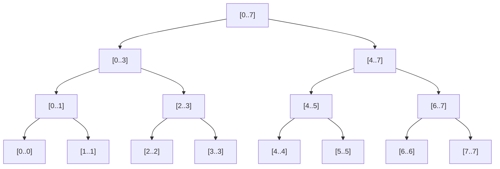
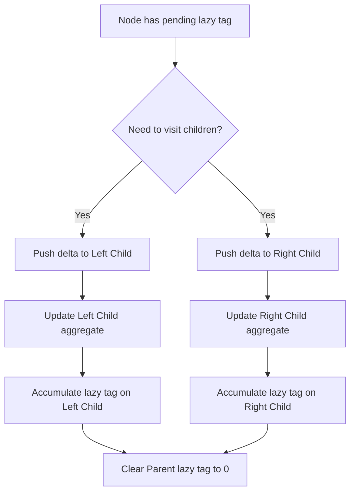

# Segment Trees

> [!NOTE]
> A **Segment Tree** is an array-backed binary tree over intervals that supports dynamic range queries and range updates in $O(\log N)$ time by recursively decomposing segments into canonical sub-intervals.

---

## 1. Why This Matters

Many computational problems demand dynamic queries and modifications over contiguous ranges:
* What is the sum, minimum, maximum, or GCD of values in subarray $A[L \dots R]$?
* How can we update an individual element in $O(\log N)$ while preserving fast range queries?
* How can we modify an entire range $[L, R]$ (e.g. adding $\Delta$ or assigning a value) without touching all $N$ elements?

A naive array requires $O(N)$ per range query or range update. A static Prefix Sum array provides $O(1)$ queries but suffers from $O(N)$ updates.

A Segment Tree provides a generalized, highly expressive **Interval Algebra Framework**:
* Dynamic array modifications.
* Repeated range queries in $O(\log N)$.
* Arbitrary associative operations (Sum, Min, Max, Matrix Multiplication, GCD).
* Range modifications via **Lazy Propagation**.

---

## 2. Core Intuition & Visual Model

### Mental Model
Instead of inspecting individual array elements during a query, a Segment Tree precomputes aggregate values for hierarchical power-of-two intervals.

Consider an array of $N = 8$ elements:

```text
Index:  0  1  2  3  4  5  6  7
Value:  5  2  7  3  6  1  4  8
```

The tree builds nested segments:
* Root covers the entire array $[0, 7]$.
* Internal nodes partition intervals into left half $[0, 3]$ and right half $[4, 7]$.
* Subsegments subdivide until reaching singleton leaves: $[0, 0], [1, 1], \dots, [7, 7]$.



### Canonical Segment Decomposition ($O(\log N)$)
When querying range $[2, 6]$, the tree does not scan 5 elements. Instead, it decomposes $[2, 6]$ into a union of disjoint canonical tree nodes:
$$\text{Query}([2, 6]) = \text{Node}([2, 3]) \cup \text{Node}([4, 5]) \cup \text{Node}([6, 6])$$
At most **$2 \times \lceil \log_2 N \rceil$ nodes** are visited at any tree depth, bounding query latency strictly to $O(\log N)$.

---

## 3. Formal Definition & Invariants

A Segment Tree over $A[0 \dots N-1]$ maintains:
1. **Interval Coverage Invariant**: Every node represents a unique contiguous half-open or closed interval $[L, R]$.
2. **Binary Partition Invariant**: For an internal node covering $[L, R]$, its left child covers $[L, M]$ and its right child covers $[M+1, R]$, where $M = L + \lfloor (R - L)/2 \rfloor$.
3. **Monoid Aggregation Invariant**: The stored value at node $u$ satisfies:
   $$\text{val}(u) = \text{merge}(\text{val}(\text{left\_child}), \text{val}(\text{right\_child}))$$
   where $\text{merge}$ is any associative binary operator possessing an identity element.
4. **Lazy Tag Invariant**: If a node carries a pending lazy tag, the node's stored aggregate already reflects the update for its entire interval, but its child subtrees have not yet received the update.

---

## 4. Key Operations & Complexity

| Operation | Time Complexity | Auxiliary Space | Description |
| :--- | :--- | :--- | :--- |
| **`Build`** | **$O(N)$** | $4N$ elements | Recursive bottom-up tree construction from flat array. |
| **`PointUpdate`** | **$O(\log N)$** | $O(\log N)$ call stack | Updates a single leaf and updates ancestors on return. |
| **`RangeQuery`** | **$O(\log N)$** | $O(\log N)$ call stack | Decomposes range into canonical interval nodes. |
| **`RangeUpdate` (Lazy)** | **$O(\log N)$** | $4N$ lazy array | Defers updates to child intervals using lazy tags. |
| **`PushDown`** | **$O(1)$** | $O(1)$ | Transfers pending lazy updates to immediate children. |

---

## 5. Hardware & The $4N$ Array Representation

Rather than allocating dynamic heap nodes with pointers (`Node* left, Node* right`), Segment Trees are mapped onto a single flat contiguous array:
* Root is stored at index `1`.
* Left child of node $i$ resides at `2 * i`.
* Right child of node $i$ resides at `2 * i + 1`.

### Why $4N$ Capacity?
If $N$ is an exact power of 2, the tree is a complete binary tree requiring $2N - 1$ slots. When $N$ is not a power of 2, the tree height is $\lceil \log_2 N \rceil$, requiring an array size of:
$$2^{\lceil \log_2 N \rceil + 1} - 1 < 4N$$
Allocating $4N$ array slots guarantees zero out-of-bounds indexing without complex dynamic allocation.

```text
Flat Memory Layout (tree[] of size 4N):
[ Index 0 (Unused) | Node 1 (Root) | Node 2 (Left) | Node 3 (Right) | ... ]
▲
└── Contiguous memory layout benefits from CPU L1/L2 hardware prefetching.
```

---

## 6. Canonical Implementations

### Python: Point Update + Range Sum Query

```python
class SegmentTree:
    def __init__(self, nums: list[int]):
        self.n = len(nums)
        self.tree = [0] * (4 * self.n if self.n > 0 else 1)
        if self.n > 0:
            self._build(1, 0, self.n - 1, nums)

    def _build(self, node: int, left: int, right: int, nums: list[int]):
        if left == right:
            self.tree[node] = nums[left]
            return

        mid = left + (right - left) // 2
        self._build(node * 2, left, mid, nums)
        self._build(node * 2 + 1, mid + 1, right, nums)
        self.tree[node] = self.tree[node * 2] + self.tree[node * 2 + 1]

    def update(self, index: int, value: int):
        self._update(1, 0, self.n - 1, index, value)

    def _update(self, node: int, left: int, right: int, index: int, value: int):
        if left == right:
            self.tree[node] = value
            return

        mid = left + (right - left) // 2
        if index <= mid:
            self._update(node * 2, left, mid, index, value)
        else:
            self._update(node * 2 + 1, mid + 1, right, index, value)

        self.tree[node] = self.tree[node * 2] + self.tree[node * 2 + 1]

    def query(self, ql: int, qr: int) -> int:
        return self._query(1, 0, self.n - 1, ql, qr)

    def _query(self, node: int, left: int, right: int, ql: int, qr: int) -> int:
        if qr < left or right < ql:
            return 0
        if ql <= left and right <= qr:
            return self.tree[node]

        mid = left + (right - left) // 2
        return (
            self._query(node * 2, left, mid, ql, qr)
            + self._query(node * 2 + 1, mid + 1, right, ql, qr)
        )
```

---

## 7. Lazy Propagation for Range Updates

Without Lazy Propagation, updating all elements in range $[L, R]$ requires visiting every affected leaf, taking $O(N)$ time.

**Lazy Propagation** defers updates to child intervals until those children are strictly needed by future queries.

### Push-Down Flow Mechanics



### Modern C++17: Lazy Range Addition + Range Sum Query

```cpp
#include <vector>
#include <algorithm>

template <typename T = long long>
class LazySegmentTree {
private:
    std::size_t n_;
    std::vector<T> tree_;
    std::vector<T> lazy_;

    void build(const std::vector<T>& arr, std::size_t node, std::size_t start, std::size_t end) {
        if (start == end) {
            tree_[node] = arr[start];
            return;
        }
        std::size_t mid = start + (end - start) / 2;
        build(arr, 2 * node, start, mid);
        build(arr, 2 * node + 1, mid + 1, end);
        tree_[node] = tree_[2 * node] + tree_[2 * node + 1];
    }

    void push_down(std::size_t node, std::size_t start, std::size_t end) {
        if (lazy_[node] != 0) {
            T val = lazy_[node];
            std::size_t mid = start + (end - start) / 2;
            std::size_t left = 2 * node;
            std::size_t right = 2 * node + 1;

            tree_[left] += val * (mid - start + 1);
            tree_[right] += val * (end - mid);

            lazy_[left] += val;
            lazy_[right] += val;

            lazy_[node] = 0;
        }
    }

public:
    explicit LazySegmentTree(const std::vector<T>& arr)
        : n_(arr.size()), tree_(4 * arr.size(), 0), lazy_(4 * arr.size(), 0) {
        if (n_ > 0) build(arr, 1, 0, n_ - 1);
    }

    void range_update(std::size_t l, std::size_t r, T val) {
        if (n_ == 0 || l > r || l >= n_) return;
        r = std::min(r, n_ - 1);
        auto update_fn = [&](auto& self, std::size_t node, std::size_t start, std::size_t end) -> void {
            if (l <= start && end <= r) {
                tree_[node] += val * (end - start + 1);
                lazy_[node] += val;
                return;
            }
            push_down(node, start, end);
            std::size_t mid = start + (end - start) / 2;
            if (l <= mid) self(self, 2 * node, start, mid);
            if (r > mid) self(self, 2 * node + 1, mid + 1, end);
            tree_[node] = tree_[2 * node] + tree_[2 * node + 1];
        };
        update_fn(update_fn, 1, 0, n_ - 1);
    }

    T range_query(std::size_t l, std::size_t r) {
        if (n_ == 0 || l > r || l >= n_) return 0;
        r = std::min(r, n_ - 1);
        auto query_fn = [&](auto& self, std::size_t node, std::size_t start, std::size_t end) -> T {
            if (l <= start && end <= r) return tree_[node];
            push_down(node, start, end);
            std::size_t mid = start + (end - start) / 2;
            T total = 0;
            if (l <= mid) total += self(self, 2 * node, start, mid);
            if (r > mid) total += self(self, 2 * node + 1, mid + 1, end);
            return total;
        };
        return query_fn(query_fn, 1, 0, n_ - 1);
    }
};
```

---

## 8. Head-to-Head: Fenwick Tree vs. Segment Tree

| Feature / Dimension | Fenwick Tree (BIT) | Segment Tree |
| :--- | :--- | :--- |
| **Core Architecture** | Implicit prefix-sum intervals via $i \ \& \ (-i)$ | Explicit full binary interval decomposition |
| **Memory Footprint** | **Minimal ($1N$)** | Larger ($4N$) |
| **Code Length** | **~10 lines** | ~50–80 lines |
| **Associative Operations** | Requires invertible operator (group: $+$, $\oplus$) | **Arbitrary associative monoid ($\min, \max, \gcd, \times$)** |
| **Range Updates** | Specialized difference tricks | **Natural & Generalized via Lazy Propagation** |
| **Throughput / Constants** | **$2\times$ to $3\times$ faster** (tight loops, no branch misses) | Slower constant factor due to tree traversal branches |

---

## 9. Common Pitfalls & Edge Cases

1. **Neutral Element Mismatch**:
   * For Range Sum: `identity = 0`.
   * For Range Min: `identity = +INFINITY`.
   * For Range Max: `identity = -INFINITY`.
   * For Range GCD: `identity = 0` ($\gcd(0, x) = x$).
2. **Forgetting to Scale Lazy Updates**: In Range Sum trees, when pushing a lazy add tag down, `tree[child]` must increase by $\text{tag} \times \text{interval\_length}$, not just $\text{tag}$.
3. **Range Assignment vs. Range Addition**: Assigning values (`A[l..r] = V`) overwrites existing lazy tags rather than adding to them. Mixing the two requires tracking whether a tag represents an assignment or delta.

---

## 10. Curated Problem Sets

* [LeetCode 307: Range Sum Query - Mutable](https://leetcode.com/problems/range-sum-query-mutable/) *(Point update + Range query)*
* [LeetCode 699: Falling Squares](https://leetcode.com/problems/falling-squares/) *(Coordinate compression + Range maximum query with lazy updates)*
* [CSES 1649: Dynamic Range Minimum Queries](https://cses.fi/problemset/task/1649) *(Segment Tree for non-invertible Min operations)*
* [CSES 1651: Range Update Queries](https://cses.fi/problemset/task/1651) *(Range updates with point queries)*
* [CSES 1143: Hotel Queries](https://cses.fi/problemset/task/1143) *(Binary search on Segment Tree: finding first segment with value $\ge X$)*
* [Codeforces 339D: Xenia and Bit Operations](https://codeforces.com/problemset/problem/339/D) *(Alternating Bitwise OR / XOR operations at tree levels)*

---

## 11. Related Topics

* [Fenwick Trees](fenwick-trees.md)
* [Choosing the Right Data Structure](../22-benchmarking-and-tradeoffs/choosing-the-right-data-structure.md)
* [Theoretical vs Practical Performance](../22-benchmarking-and-tradeoffs/theoretical-vs-practical-performance.md)
* [Lowest Common Ancestor](../08-graphs-and-network-algorithms/lowest-common-ancestor.md)
