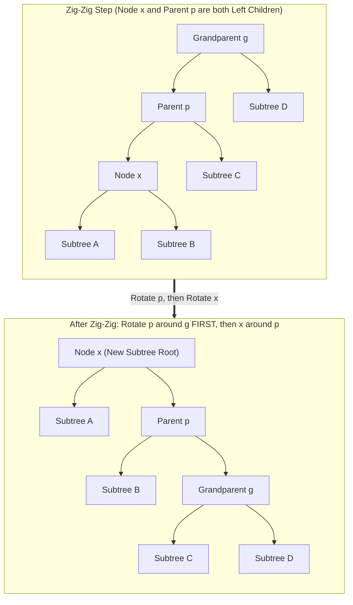

# Splay Trees

> [!NOTE]
> **The Self-Adjusting Paradigm:**
> Unlike AVL or Red-Black trees, which strictly maintain balance invariants by storing explicit balance factors or color bits at every node, a **Splay Tree (Sleator & Tarjan, 1985)** stores **zero balance metadata**.
> It is an entirely self-adjusting binary search tree: every time a node is accessed, inserted, or deleted, it is moved to the root via a sequence of tree rotations called **splaying**.
> While individual operations can take $O(N)$ worst-case time, any sequence of $M$ operations on an $N$-node tree runs in **$O(M \log N)$ amortized time**.

> [!TIP]
> **The Magic of Zig-Zig:**
> The fundamental breakthrough of Sleator and Tarjan lies in the **Zig-Zig** step:
> When a node $x$ and its parent $p$ are both left children (or both right children), splaying rotates the **parent $p$ first**, and only then rotates $x$.
> Rotating the parent first cuts the depth of all nodes along the access path roughly in half. Naive splaying (rotating $x$ twice) fails to halve the path depth and degrades to $\Omega(N)$ amortized time!

> [!WARNING]
> **Read Operations Mutate the Tree:**
> Even pure search operations (`find(key)`) modify the tree structure by splaying the accessed node (or the last non-null node on the search path) to the root.
> In concurrent or multi-threaded environments, splay tree lookups require **exclusive write locks**, unlike read-concurrent AVL or Red-Black trees.



---

## 1. Core Mental Model & Motivation

In real-world computing workloads, data access is rarely uniform. Workloads follow the **80/20 Pareto principle** and exhibit strong **temporal locality**:
- A small subset of keys (the "working set") receives the vast majority of queries.
- Recently accessed keys are overwhelmingly likely to be accessed again in the near future.

In a static balanced tree (like an AVL or Red-Black tree), accessing a popular key always incurs $O(\log N)$ comparisons, because its depth remains fixed.
In contrast, a **Splay Tree** moves frequently accessed keys close to the root:
- Once accessed, subsequent queries to that key take **$O(1)$ time**.
- The tree automatically dynamically adapts its internal geometry to the query distribution.
- For non-uniform distributions with entropy $H$, the amortized access time approaches the optimal theoretical entropy bound $O(H)$.

---

## 2. Mathematical Formulation & Amortized Invariants

### 2.1 The Potential Function
For any node $x$ in tree $T$, let $s(x)$ denote the **size** of the subtree rooted at $x$ (number of nodes in $x$'s subtree, including $x$).
The **rank** of node $x$ is defined as:
$$r(x) = \log_2 s(x)$$
The **potential** of the splay tree $T$ is the sum of ranks of all its nodes:
$$\Phi(T) = \sum_{x \in T} r(x) = \sum_{x \in T} \log_2 s(x)$$

### 2.2 The Access Lemma (Sleator & Tarjan, 1985)
Let $r(x)$ and $r'(x)$ be the rank of node $x$ before and after a splaying step, respectively.
The amortized time $a = t + \Delta \Phi$ of splaying node $x$ to the root satisfies:
$$a(x) \le 3(r'(x) - r(x)) + 1$$
Summing across all splay steps along the path to the root telescopes:
$$\text{Total Amortized Cost} \le 3(r(\text{root}) - r(x)) + 1 = 3(\log_2 N - \log_2 1) + 1 = O(\log N)$$

### 2.3 Key Theorems Derived from Splaying
1. **Balance Theorem:** Any sequence of $M$ operations on an $N$-node splay tree takes $O((M + N) \log N)$ time.
2. **Static Optimality Theorem:** If key $i$ is accessed with probability $p_i$, the amortized cost per access is $O\left(1 + \sum p_i \log \frac{1}{p_i}\right)$, matching the optimal static search tree.
3. **Working Set Theorem:** If $t(x)$ is the number of distinct items accessed since the last access to $x$, the cost of accessing $x$ is $O(\log(t(x) + 1))$.

---

## 3. Visual State Transitions: The Splaying Steps

When splaying node $x$ to the root, we repeatedly apply one of three operations depending on $x$'s parent $p$ and grandparent $g$:

```mermaid
flowchart TD
    Check{"Does x have a parent p?"}
    Check -->|No| Done["x is Root (Finished)"]
    Check -->|Yes| CheckG{"Does p have a parent g?"}
    CheckG -->|No| Zig["ZIG STEP: Rotate x around p"]
    CheckG -->|Yes| CheckShape{"Are x and p on the same side?"}
    CheckShape -->|Yes (Left-Left or Right-Right)| ZigZig["ZIG-ZIG STEP:\n1. Rotate p around g\n2. Rotate x around p"]
    CheckShape -->|No (Left-Right or Right-Left)| ZigZag["ZIG-ZAG STEP:\n1. Rotate x around p\n2. Rotate x around g"]
    Zig --> Done
    ZigZig --> Check
    ZigZag --> Check
```

### 1. Zig Step (Terminal Case)
- Condition: $p$ is the root of the tree ($g = \text{null}$).
- Action: Perform a single rotation of $x$ around $p$. This is only performed once at the very end if the initial depth of $x$ was odd.

### 2. Zig-Zig Step (Same Side)
- Condition: $x$ is the left child of $p$ and $p$ is the left child of $g$ (or both right children).
- Action: Rotate $p$ around $g$ **first**, then rotate $x$ around $p$.

### 3. Zig-Zag Step (Opposite Sides)
- Condition: $x$ is the right child of $p$ and $p$ is the left child of $g$ (or vice versa).
- Action: Rotate $x$ around $p$, then rotate $x$ around $g$ (identical to standard AVL double rotation).

---

## 4. Concrete Operations & Step-by-Step State Transitions

### 4.1 Search (`find(key)`)
1. Traverse down the BST from the root comparing `key` against node values.
2. If `key` is found at node $x$, `splay(x)` and return $x$.
3. If `key` is not present, `splay(last_visited_node)` and return `null`. Splaying the last visited node ensures the tree still self-balances around the nearest neighbor.

### 4.2 Insertion (`insert(key, value)`)
1. If tree is empty, create root with `key`.
2. Otherwise, search for `key`. Splay the node to the root.
3. If root's key equals `key`, update value (or ignore if set).
4. If `key < root->key`:
   - Detach `root->left`.
   - New node becomes new root.
   - `new_root->right = old_root`, `new_root->left = old_root->left`.
   - `old_root->left = null`.
5. If `key > root->key`:
   - Detach `root->right`.
   - `new_root->left = old_root`, `new_root->right = old_root->right`.
   - `old_root->right = null`.

### 4.3 Deletion (`erase(key)`)
1. Search for `key`, which splays the node to the root.
2. If root does not contain `key`, the key is not in the tree; return.
3. If root contains `key`:
   - If `root->left == null`: set `root = root->right`.
   - If `root->right == null`: set `root = root->left`.
   - If both subtrees exist:
     - Detach right subtree: $T_R = \text{root->right}$.
     - Isolate left subtree: $T_L = \text{root->left}$.
     - Splay the maximum element of $T_L$ to the root of $T_L$.
     - Since this maximum node has no right child, simply attach $T_R$ as its right child!

---

## 5. Algorithmic Complexity Analysis

| Operation | Amortized Time | Worst-Case Single Op | Space Overhead per Node |
| :--- | :--- | :--- | :--- |
| `find(key)` | $O(\log N)$ | $O(N)$ | 0 bytes (No height/color) |
| `insert(key)` | $O(\log N)$ | $O(N)$ | 0 bytes |
| `erase(key)` | $O(\log N)$ | $O(N)$ | 0 bytes |
| `min()` / `max()` | $O(\log N)$ | $O(N)$ | 0 bytes |
| `split()` / `join()` | $O(\log N)$ | $O(N)$ | 0 bytes |

---

## 6. High-Performance Engineering & Memory Footprint

### 6.1 Zero Balance Factor Overhead
- An AVL tree requires 2 bits per node for balance factors (`-1, 0, +1`), typically padded to 1 byte or packed into child pointer alignment bits.
- A Red-Black tree requires 1 bit for color (`RED / BLACK`).
- A Splay Tree requires **zero extra metadata fields** beyond `left`, `right`, and `parent` (or can even be implemented top-down without parent pointers!).

### 6.2 Top-Down vs Bottom-Up Splaying
- **Bottom-Up:** Requires parent pointers in each node. Traverses down to find the key, then walks up splaying with rotations.
- **Top-Down (Sleator-Tarjan):** Assembles left and right subtrees during the downward search pass, performing rotations on the way down in a single pass without parent pointers!

---

## 7. Edge Cases & Failure Modes

1. **Repeated Access to Deep Pathological Trees:** A freshly initialized tree inserted in sorted order forms a degenerate linked list of depth $N$. The first query takes $O(N)$ time, but the splay operation immediately restructures the path into height $\approx N/2$.
2. **Accessing Non-Existent Elements:** Always splay the last non-null node encountered before falling off the tree. Forgetting to splay on misses destroys the amortized $O(\log N)$ bound under adversarial miss sequences!
3. **Empty / Single-Node Trees:** Ensure `splay(root)` is an immediate no-op when `node == root` or `tree` is empty.

---

## 8. Arthur's Two-Layer API Implementation

Following repository architectural standards:
- **Layer A (Fast Core API):**
  - `const T& min() const`: Precondition: `!empty()`, debug `assert(!empty())`.
  - `const T& max() const`: Precondition: `!empty()`.
  - `void insert(const K& key, const V& val)`
  - `void erase(const K& key)`
- **Layer B (Safe Adapter API):**
  - `const V* try_find(const K& key)`: Zero-copy pointer return; returns `nullptr` if absent.
  - `const K* try_min() const`: Returns pointer to min key or `nullptr`.
  - `const K* try_max() const`: Returns pointer to max key or `nullptr`.

---

## 9. Differential Testing & Oracle Verification Strategy

To guarantee absolute algebraic and structural correctness:
- Splay Tree operations are differentially verified against `std::set` (C++) and Python's `bisect` / `dict`.
- 1,000 randomized operations (`insert`, `erase`, `find`, `min`, `max`, `successor`) are applied to both structures.
- After every operation, the tree is verified for:
  1. Strict BST ordering: `all(left) < key < all(right)`.
  2. Root property: Accessed element (or nearest neighbor) is verified to reside at the root.

---

## 10. Engineering Pitfalls & Optimization Notes

> [!CAUTION]
> **The Naive Splay Trap:**
> Do NOT simply rotate $x$ around its parent twice during a zig-zig configuration.
> Rotating $x$ twice leaves the long access path unchanged in depth ($d \to d - 1$).
> You **must** rotate $p$ around $g$ first, and then rotate $x$ around $p$. This rotation order is the sole reason the potential function $\Phi$ telescopes to $O(\log N)$.

---

## 11. Real-World Applications & Industry Context

1. **GCC Compiler Internals:** The GNU C++ compiler (`gcc`) uses splay trees internally (`splay-tree.h`) for managing memory pools, symbol tables, and register allocation ranges.
2. **Network Packet Forwarding:** IP routing tables with highly skewed traffic benefit from splay trees caching frequent destination IP routes at the root.
3. **Memory Allocators:** Implementations of buddy allocators and free-list binning (such as early versions of FreeBSD jemalloc) utilize splay trees to manage variable-sized free chunks.

---

## 12. Curated Academic References

1. **Sleator, Daniel D. & Tarjan, Robert E. (1985):** *Self-adjusting binary search trees*. Journal of the ACM (JACM), 32(3), pp. 652–686.
2. **Tarjan, Robert E. (1983):** *Data Structures and Network Algorithms*. SIAM. CBMS-NSF Regional Conference Series in Applied Mathematics.
3. **Cole, Richard (2000):** *On the dynamic finger conjecture for splay trees. Part I: Splay sorting log n-block sequences*. STOC 2000.
