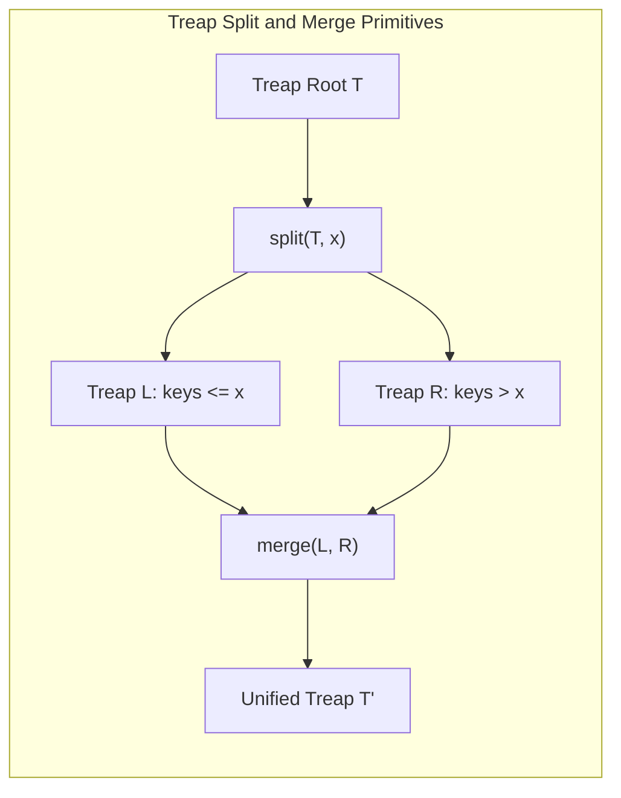

# Treaps (Cartesian Trees)

> [!NOTE]
> **Randomized Self-Balancing Cartesian Tree:** A **treap** (Tree + Heap) marries binary search trees with binary heaps by assigning each node two attributes:
> - A deterministic **key** satisfying the binary search tree property ($k_{\text{left}} < k_{\text{node}} < k_{\text{right}}$).
> - An independent, uniformly distributed **random priority** satisfying the max-heap property ($p_{\text{node}} \ge p_{\text{left}}, p_{\text{right}}$).
> - Guarantees $O(\log n)$ expected tree height without complex deterministic rebalancing rotations (AVL / Red-Black cases).
> - Reference implementations: [C++17 Implementation](../../implementations/cpp/treap.cpp) | [Python Implementation](../../implementations/python/treap.py)

> [!TIP]
> **The Two Master Primitives: Split and Merge:**
>
> | Primitive | Signature | Precondition | Operation | Cost |
> |---|---|---|---|---|
> | **`split`** | `split(root, x, L, R)` | Any valid treap | Partitions into $L$ (keys $\le x$) and $R$ (keys $> x$) | $O(\log n)$ expected |
> | **`merge`** | `merge(L, R) -> root` | $\forall u \in L, v \in R: \text{key}(u) < \text{key}(v)$ | Joins $L$ and $R$ maintaining max-heap priorities | $O(\log n)$ expected |

> [!WARNING]
> **Critical Treap Implementation Invariants:**
> 1. **Random Number Generator Quality:** Never use a low-entropy or predictable pseudo-random generator (like standard C `rand()` modulo a small number). Biased priorities create unbalanced shapes and destroy the $O(\log n)$ logarithmic guarantee. Use `std::mt19937` in C++ or `random.Random` in Python.
> 2. **Merge Precondition:** `merge(L, R)` **strictly assumes** that all keys in treap $L$ are strictly smaller than all keys in treap $R$. Calling merge on overlapping key ranges produces an invalid tree that violates the BST property.
> 3. **Subtree Size Maintenance:** When implementing order-statistic operations (finding $k$-th element), always update subtree sizes inside `split` and `merge` via `update_size(node)`.




A **treap** is a randomized balanced binary search tree combining:

- BST ordering by key
- Heap ordering by random priority

Each node holds:

- `key`: for BST navigation
- `priority`: for heap property

Treaps maintain expected balance and provide $ O(\log n) $ operations with simple randomized logic.

This chapter develops:

- Treap invariants
- Randomized balancing
- Split and merge primitives
- Search, insert, delete

---

## 1. Treap Invariant

- **Binary Search Tree:** keys in left subtree < node’s key < keys in right subtree
- **Heap:** node’s priority ≥ priorities of children

Priority is typically assigned randomly when creating a node.

---

## 2. Why Randomized Priorities?

Random priorities ensure that the tree is likely to be balanced, so search, insert, and delete are $ O(\log n) $ expected.

This avoids complex rotations of AVL or Red-Black trees.

---

## 3. Search in Treap

Same as BST: follow key order.

---

## 4. Insert in Treap

- Insert node as in BST, with random priority
- After insertion, rotate as needed to restore heap property

### Example (C++ style)

```cpp
struct Node {
    int key, priority;
    Node *left, *right;
    Node(int k) : key(k), priority(rand()), left(nullptr), right(nullptr) {}
};

Node* insert(Node* root, int key) {
    if (!root) return new Node(key);
    if (key < root->key) {
        root->left = insert(root->left, key);
        if (root->left->priority > root->priority)
            root = rotateRight(root);
    }
    else if (key > root->key) {
        root->right = insert(root->right, key);
        if (root->right->priority > root->priority)
            root = rotateLeft(root);
    }
    return root;
}
```

---

## 5. Split and Merge Primitives

- **Split:** divide tree into two subtrees: keys ≤ `x`, keys > `x`
- **Merge:** combine two treaps, all keys in one < all keys in the other

These primitives make bulk operations efficient and are central to treap logic.

---

## 6. Split Example

```cpp
void split(Node* root, int x, Node*& left, Node*& right) {
    if (!root) left = right = nullptr;
    else if (root->key <= x) {
        split(root->right, x, root->right, right);
        left = root;
    } else {
        split(root->left, x, left, root->left);
        right = root;
    }
}
```

---

## 7. Merge Example

```cpp
Node* merge(Node* left, Node* right) {
    if (!left || !right) return left ? left : right;
    if (left->priority > right->priority) {
        left->right = merge(left->right, right);
        return left;
    } else {
        right->left = merge(left, right->left);
        return right;
    }
}
```

---

## 8. Delete in Treap

- Find node by key
- Merge left and right children to remove node

---

## 9. Engineering Pitfalls

- Use good random number generator for priorities
- Avoid memory leaks in recursive operations
- Handle duplicate keys consistently

---

## 10. Treap Performance

- All operations are $ O(\log n) $ expected due to random balancing
- No strict balancing, but very low probability of poor balance

---

## 11. Summary Table

| Operation | Expected Complexity | Balanced? | Notes |
|---|---|---|---|
| Search | $ O(\log n) $ | Yes (probabilistic) | BST logic |
| Insert | $ O(\log n) $ | Yes | random priority |
| Delete | $ O(\log n) $ | Yes | uses merge |

---

## 12. Practice Prompts

1. What two invariants define a treap?
2. Why are priorities randomized?
3. What is split and merge used for?
4. How does treap deletion work?
5. What are advantages over AVL/Red-Black trees?

---

## 13. Suggested Next Topics

- AVL trees
- Red-Black trees
- Splay trees
