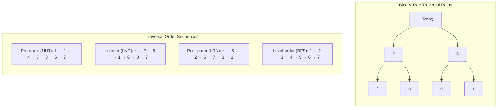

# Tree Basics and Traversals

> [!NOTE]
> **Hierarchical Recursive Abstraction:**
> A tree is a connected, acyclic undirected graph where any two nodes are connected by exactly one simple path.
> In a rooted tree, nodes naturally define ancestor-descendant relationships and subtrees:
> - **Binary Tree:** Each node has at most two children (`left`, `right`).
> - **N-ary Tree:** Each node has an arbitrary collection of children.
> - Reference implementations: [C++17 Implementation](../../implementations/cpp/tree_traversals.cpp) | [Python Implementation](../../implementations/python/tree_traversals.py)

> [!TIP]
> **Depth vs. Height Disambiguation & Traversal Disciplines:**
> - **Depth of node $u$:** Length of the simple path from root to $u$ (root depth = $0$). Measured top-down.
> - **Height of node $u$:** Length of longest simple path from $u$ downward to a leaf (leaf height = $0$, empty tree = $-1$). Measured bottom-up.
> - **Traversal Disciplines:**
>   - **Pre-order (NLR):** Root before children (serialization, copying, prefix expression parsing).
>   - **In-order (LNR):** Left child, Root, Right child (yields strictly ascending sorted keys in Binary Search Trees).
>   - **Post-order (LRN):** Children before root (memory deallocation, bottom-up tree dynamic programming, postfix evaluation).
>   - **Level-order (BFS):** Queue-driven frontier expansion by depth layers.

> [!WARNING]
> **Critical Traps & Anti-Patterns:**
> 1. **Call Stack Overflow on Skewed Trees:** Deeply skewed trees of depth $N \approx 10^5$ exhaust OS stack space ($8\text{ MB}$) during recursive DFS, triggering `SIGSEGV`. Use iterative traversals with explicit heap-allocated `std::stack` or `collections.deque` when tree depth is unconstrained.
> 2. **Iterative Preorder Child Push Order:** In iterative preorder with a single stack, push the **right** child first and then the **left** child, so that the left child sits at the top of the stack and is visited next.
> 3. **In-order on N-ary Trees:** In-order traversal is only well-defined for binary trees where a parent node divides left from right subtrees; general N-ary trees only have unambiguous pre-order, post-order, and level-order.



Trees are one of the most important structures in computer science.

They model hierarchy, containment, decomposition, and recursive structure.

Examples include:

- file systems
- organization charts
- parse trees
- expression trees
- DOM trees
- search trees
- game trees

A tree is simple to define, but extremely rich in applications.

This chapter develops:

- tree terminology
- binary and n-ary trees
- depth, height, and subtree ideas
- recursive traversals
- level-order traversal with BFS
- iterative traversals using explicit stacks

---

## 1. What is a tree?

A **tree** is a connected structure with no cycles.

In rooted-tree settings, one node is chosen as the **root**, and every other node has exactly one parent.

This creates a natural hierarchy:

- root at the top
- children below
- descendants further down

A tree is one of the clearest examples of recursive structure, because every subtree is itself a tree.

---

## 2. Basic terminology

Important tree terms include:

- **root**: top node
- **parent**: immediate node above
- **child**: immediate node below
- **leaf**: node with no children
- **internal node**: node with at least one child
- **ancestor**: node on the path upward
- **descendant**: node in the subtree below
- **subtree**: a node together with all its descendants

These terms are used constantly in tree algorithms.

---

## 3. Depth and height

Two important measurements are:

### Depth of a node
Number of edges from the root to that node.

### Height of a node
Number of edges on the longest downward path from that node to a leaf.

The **height of the tree** is the height of the root.

These are easy to confuse, so it is worth defining them clearly.

---

## 4. Binary trees

A **binary tree** is a tree where each node has at most two children:

- left child
- right child

Binary trees are especially important because they support many classical algorithms and data structures.

Examples:

- binary search trees
- heaps
- expression trees

---

## 5. N-ary trees

An **n-ary tree** is a more general rooted tree in which a node may have many children.

Examples:

- file directories
- syntax trees
- comment threads
- company hierarchies

So binary trees are a special case, not the whole story.

---

## 6. Binary tree node structure

A typical binary tree node stores:

- a value
- pointer or reference to left child
- pointer or reference to right child

This is enough to support most basic traversals.

---

## 7. C++17 binary tree node

```cpp
struct Node {
    int value;
    Node* left;
    Node* right;

    explicit Node(int value) : value(value), left(nullptr), right(nullptr) {}
};
```

---

## 8. Python binary tree node

```python
class Node:
    def __init__(self, value, left=None, right=None):
        self.value = value
        self.left = left
        self.right = right
```

---

## 9. N-ary tree node structure

For an n-ary tree, a node often stores:

- a value
- a list of children

This is more flexible than the binary case.

---

## 10. C++17 n-ary tree node

```cpp
#include <vector>

struct NNode {
    int value;
    std::vector<NNode*> children;

    explicit NNode(int value) : value(value) {}
};
```

---

## 11. Python n-ary tree node

```python
class NNode:
    def __init__(self, value):
        self.value = value
        self.children = []
```

---

## 12. Why traversals matter

A **traversal** is a systematic way to visit all nodes of a tree.

Different traversals are useful because they reflect different logical orders:

- process parent before children
- process children before parent
- process level by level

Traversal order often determines the meaning of a tree algorithm.

---

## 13. Depth-first traversal families

For binary trees, the three classical depth-first traversals are:

- **preorder**
- **inorder**
- **postorder**

These differ only in where the current node is processed relative to its left and right subtrees.

That simple change leads to very different behavior.

---

## 14. Preorder traversal

In **preorder**, we visit:

1. current node
2. left subtree
3. right subtree

So preorder is:

```text
node, left, right
```

This is useful when the parent should be processed before its children.

Examples:
- copying a tree
- serialization
- prefix expression generation

---

## 15. Inorder traversal

In **inorder**, we visit:

1. left subtree
2. current node
3. right subtree

So inorder is:

```text
left, node, right
```

This is especially important for binary search trees, because inorder traversal lists keys in sorted order.

That makes inorder one of the most meaningful binary-tree traversals.

---

## 16. Postorder traversal

In **postorder**, we visit:

1. left subtree
2. right subtree
3. current node

So postorder is:

```text
left, right, node
```

This is useful when children must be processed before the parent.

Examples:
- deleting a tree
- evaluating expression trees from the bottom up
- computing subtree summaries

---

## 17. Recursive preorder traversal

```cpp
#include <vector>

void preorder(Node* root, std::vector<int>& out) {
    if (!root) return;
    out.push_back(root->value);
    preorder(root->left, out);
    preorder(root->right, out);
}
```

```python
def preorder(root, out):
    if root is None:
        return
    out.append(root.value)
    preorder(root.left, out)
    preorder(root.right, out)
```

---

## 18. Recursive inorder traversal

```cpp
#include <vector>

void inorder(Node* root, std::vector<int>& out) {
    if (!root) return;
    inorder(root->left, out);
    out.push_back(root->value);
    inorder(root->right, out);
}
```

```python
def inorder(root, out):
    if root is None:
        return
    inorder(root.left, out)
    out.append(root.value)
    inorder(root.right, out)
```

---

## 19. Recursive postorder traversal

```cpp
#include <vector>

void postorder(Node* root, std::vector<int>& out) {
    if (!root) return;
    postorder(root->left, out);
    postorder(root->right, out);
    out.push_back(root->value);
}
```

```python
def postorder(root, out):
    if root is None:
        return
    postorder(root.left, out)
    postorder(root.right, out)
    out.append(root.value)
```

---

## 20. Level-order traversal

A different traversal style is **level-order traversal**.

This visits nodes by increasing depth:

- root
- then all nodes at depth 1
- then all nodes at depth 2
- and so on

This is naturally implemented using a queue and is essentially BFS on a tree.

---

## 21. Why BFS works for level order

A queue processes nodes in arrival order.

When we remove a node from the queue, we enqueue its children afterward.

So all nodes at the current level are processed before the next level.

That is exactly the level-order behavior we want.

---

## 22. C++17 level-order traversal

```cpp
#include <vector>
#include <queue>

std::vector<int> level_order(Node* root) {
    std::vector<int> out;
    if (!root) return out;

    std::queue<Node*> q;
    q.push(root);

    while (!q.empty()) {
        Node* cur = q.front();
        q.pop();

        out.push_back(cur->value);

        if (cur->left) q.push(cur->left);
        if (cur->right) q.push(cur->right);
    }

    return out;
}
```

---

## 23. Python level-order traversal

```python
from collections import deque

def level_order(root):
    if root is None:
        return []

    out = []
    q = deque([root])

    while q:
        cur = q.popleft()
        out.append(cur.value)

        if cur.left:
            q.append(cur.left)
        if cur.right:
            q.append(cur.right)

    return out
```

---

## 24. Level-order by levels

Sometimes we want grouped levels rather than one flat list.

Then we process the queue in batches of current queue size.

That gives one list per depth level.

This is common in interview and traversal problems.

---

## 25. Iterative preorder traversal

Recursive traversal is elegant, but iterative traversal is also important.

Iterative preorder uses an explicit stack.

The idea is:

- pop a node
- process it
- push right child
- push left child

Pushing right before left ensures left is processed first.

---

## 26. C++17 iterative preorder

```cpp
#include <vector>
#include <stack>

std::vector<int> preorder_iterative(Node* root) {
    std::vector<int> out;
    if (!root) return out;

    std::stack<Node*> st;
    st.push(root);

    while (!st.empty()) {
        Node* cur = st.top();
        st.pop();

        out.push_back(cur->value);

        if (cur->right) st.push(cur->right);
        if (cur->left) st.push(cur->left);
    }

    return out;
}
```

---

## 27. Python iterative preorder

```python
def preorder_iterative(root):
    if root is None:
        return []

    out = []
    st = [root]

    while st:
        cur = st.pop()
        out.append(cur.value)

        if cur.right:
            st.append(cur.right)
        if cur.left:
            st.append(cur.left)

    return out
```

---

## 28. Iterative inorder traversal

Iterative inorder traversal uses a stack and a pointer.

The idea is:

1. keep moving left, pushing nodes
2. when no more left child exists, pop one node
3. process it
4. move to its right child

This simulates the recursive call stack explicitly.

---

## 29. C++17 iterative inorder

```cpp
#include <vector>
#include <stack>

std::vector<int> inorder_iterative(Node* root) {
    std::vector<int> out;
    std::stack<Node*> st;
    Node* cur = root;

    while (cur || !st.empty()) {
        while (cur) {
            st.push(cur);
            cur = cur->left;
        }

        cur = st.top();
        st.pop();

        out.push_back(cur->value);
        cur = cur->right;
    }

    return out;
}
```

---

## 30. Python iterative inorder

```python
def inorder_iterative(root):
    out = []
    st = []
    cur = root

    while cur is not None or st:
        while cur is not None:
            st.append(cur)
            cur = cur.left

        cur = st.pop()
        out.append(cur.value)
        cur = cur.right

    return out
```

---

## 31. Iterative postorder traversal

Iterative postorder is trickier because the node must be processed after both children.

Common methods include:

- two stacks
- one stack with a visited flag
- one stack with a last-visited pointer

For clarity, the two-stack method is a good teaching version.

---

## 32. C++17 iterative postorder with two stacks

```cpp
#include <vector>
#include <stack>

std::vector<int> postorder_iterative(Node* root) {
    std::vector<int> out;
    if (!root) return out;

    std::stack<Node*> s1, s2;
    s1.push(root);

    while (!s1.empty()) {
        Node* cur = s1.top();
        s1.pop();
        s2.push(cur);

        if (cur->left) s1.push(cur->left);
        if (cur->right) s1.push(cur->right);
    }

    while (!s2.empty()) {
        out.push_back(s2.top()->value);
        s2.pop();
    }

    return out;
}
```

---

## 33. Python iterative postorder with two stacks

```python
def postorder_iterative(root):
    if root is None:
        return []

    s1 = [root]
    s2 = []
    out = []

    while s1:
        cur = s1.pop()
        s2.append(cur)

        if cur.left:
            s1.append(cur.left)
        if cur.right:
            s1.append(cur.right)

    while s2:
        out.append(s2.pop().value)

    return out
```

---

## 34. Traversing n-ary trees

For n-ary trees, preorder and postorder still make sense.

### Preorder
- process node
- then process children left to right

### Postorder
- process children left to right
- then process node

Inorder is not naturally defined for general n-ary trees.

That is mainly a binary-tree concept.

---

## 35. C++17 n-ary preorder

```cpp
#include <vector>

void preorder_nary(NNode* root, std::vector<int>& out) {
    if (!root) return;
    out.push_back(root->value);
    for (NNode* child : root->children) {
        preorder_nary(child, out);
    }
}
```

---

## 36. Python n-ary preorder

```python
def preorder_nary(root, out):
    if root is None:
        return
    out.append(root.value)
    for child in root.children:
        preorder_nary(child, out)
```

---

## 37. Why recursion fits trees so naturally

Trees are recursive objects:

- a tree is a node plus subtrees
- each subtree is itself a tree

So recursive definitions and recursive algorithms often feel natural and clean.

This is why tree traversal is one of the best places to learn recursive thinking.

---

## 38. Recursive vs iterative traversals

### Recursive
Advantages:
- short
- elegant
- matches tree structure directly

Disadvantages:
- uses call stack
- deep trees may cause stack overflow

### Iterative
Advantages:
- explicit control
- no recursion-depth risk
- useful in environments with limited recursion

Disadvantages:
- more bookkeeping

Both are important to know.

---

## 39. Complexity of traversals

For a tree with $ n $ nodes:

### Time
Every standard traversal visits each node once:

$$
O(n)
$$

### Space
- recursive DFS uses $ O(h) $ call stack, where $ h $ is tree height
- iterative DFS uses $ O(h) $ explicit stack
- level-order BFS may use $ O(w) $ queue space, where $ w $ is maximum width

These bounds are important in practice.

---

## 40. Common mistakes

### Mistake 1: confusing depth and height
Depth goes downward from root to node.
Height goes downward from node to deepest leaf.

### Mistake 2: mixing traversal orders
Preorder, inorder, and postorder differ only in node position, but that difference matters a lot.

### Mistake 3: forgetting null checks
Recursive traversals must stop at null children.

### Mistake 4: assuming inorder applies naturally to all trees
It is mainly a binary-tree notion.

### Mistake 5: using recursion carelessly on very deep trees
This can overflow the call stack.

### Mistake 6: pushing children in the wrong order in iterative preorder
To process left first, push right child before left child.

---

## 41. Comparison table

| Traversal | Order | Common use |
|---|---|---|
| Preorder | node, left, right | serialization, copy, prefix form |
| Inorder | left, node, right | sorted order in BST |
| Postorder | left, right, node | delete tree, subtree aggregation |
| Level-order | level by level | BFS, shortest-layer exploration |

This table is a useful memory anchor.

---

## 42. Summary

Trees model hierarchy and recursive structure.

The most important foundational ideas are:

- binary vs n-ary trees
- root, parent, child, leaf, depth, height
- recursive depth-first traversals
- level-order traversal using BFS
- iterative traversals using explicit stacks

Traversals are not just a technical detail.
They define the order in which meaning flows through the tree.

That is why tree traversal is one of the most central topics in data structures and algorithms.

---

## 43. Practice prompts

1. What is the difference between a binary tree and an n-ary tree?
2. What is the difference between depth and height?
3. Why does inorder traversal matter especially for BSTs?
4. Why is BFS the natural tool for level-order traversal?
5. How does iterative inorder simulate recursion?
6. Why is iterative postorder harder than iterative preorder?
7. Why is recursion natural for trees?
8. Why is inorder not a standard notion for general n-ary trees?
9. What is the space complexity of recursive DFS?
10. When would you prefer iterative traversal over recursive traversal?
