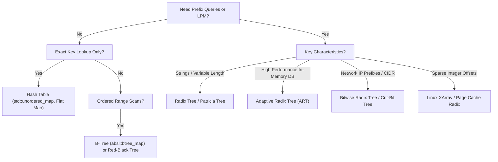

# Tries and Radix Trees

> [!NOTE]
> A trie stores keys by shared prefixes rather than by whole-key comparisons. This makes operation latency proportional to key length $L$, written $O(L)$, rather than $O(\log n)$ comparisons over $n$ stored keys. Radix trees compress long non-branching chains to reduce memory overhead and pointer depth.
>
> Reference implementations: [C++17 Implementation](../../implementations/cpp/trie.cpp) | [Python Implementation](../../implementations/python/trie.py)

> [!TIP]
> The main advantage of tries is not “they are always faster than trees.” Their real advantage is that prefix structure becomes first-class: exact search, prefix search, autocomplete, and longest-prefix matching (LPM) can all be handled naturally.

> [!IMPORTANT]
> **Prefix vs. Comparison Structures at a Glance:**
> - **Trie**: Prefix-first hierarchy, $O(L)$ operations, first-class `starts_with` and autocomplete.
> - **Patricia / Radix Tree**: Compressed trie collapsing single-child chains, cutting node count and pointer depth.
> - **Hash Table**: $O(1)$ exact lookups, but completely blind to prefix relations and longest prefix matches.
> - **Red-Black Tree**: $O(\log n)$ ordered comparisons, but prefix matches require lexicographic range scans.
> - **B-Tree**: High fanout, cache-line and page friendly, optimal for block storage and general-purpose databases.

---

## 1. Why This Matters

Many important search problems are not really about comparing whole keys.

Instead, they are about:
- matching characters or bit strings step by step
- sharing common prefixes across millions of keys
- finding all keys beginning with a specific prefix (autocomplete)
- finding the longest matching prefix for a query (network packet routing)
- indexing hierarchical names, URLs, file paths, or IP addresses

Examples include:
- **Search engines & IDEs**: Interactive autocomplete and type-ahead suggestions
- **Network routers**: Forwarding Information Base (FIB) IP routing via Classless Inter-Domain Routing (CIDR)
- **Operating systems**: Linux page-cache indexing and memory management via XArray
- **In-memory databases**: High-performance indexes like the Adaptive Radix Tree (ART) in DuckDB and HyPer
- **Text processing**: Dictionaries, spell checkers, and DNA sequence matching

A balanced BST answers:
- “Is this whole key less than or greater than that whole key?”

A hash table answers:
- “What bucket does this whole key hash into?”

A trie answers:
- “How far can I follow this key through a shared prefix graph?”

That is a fundamentally different abstraction.

This structural difference alters algorithmic complexity:
- search latency depends strictly on key length $L$
- lookup cost is independent of the total number of stored keys $n$

Tries naturally support:
- exact membership
- `starts_with` prefix verification
- prefix enumeration (autocomplete)
- longest prefix match (LPM)

However, textbook tries pay a steep physical penalty:
- excessive pointer chasing across independent heap allocations
- catastrophic memory waste when nodes store dense pointer arrays
- severe cache miss rates on modern CPU architectures

Modern production systems overcome these bottlenecks through path compression (Patricia / Radix trees) and adaptive node layouts (ART).

---

## 2. Core Intuition & Visual Model

A trie stores one step of the key per edge or per node level. For string dictionaries, each level typically corresponds to one character.

### Example Dataset
Suppose we insert:
- `to`
- `tea`
- `ten`
- `ted`
- `in`
- `inn`

```text
               (root)
              /      \
            't'      'i'
            /          \
          'e'          'n'* ("in")
         / | \           \
       'a'*'d'*'n'*      'n'* ("inn")
   ("tea")("ted")("ten")
       /
     'o'* ("to")
```
*(Nodes marked with `*` denote terminal states representing complete stored words).*

### Structural Insights
1. **Nodes as Prefix States**: A node does not store the full string. A node represents a prefix state reached by concatenating characters along the path from the root.
2. **Terminal Markers**: Not every node represents a valid stored key. For example, the path `root -> 't' -> 'e'` exists, but `'e'` is non-terminal because `"te"` was never inserted. It exists solely to anchor `"tea"`, `"ted"`, and `"ten"`.

---

## 3. Formal Definition & Invariants

A trie over alphabet $\Sigma$ is a rooted directed tree where each edge is labeled by a symbol $\sigma \in \Sigma$, and the concatenation of labels along the simple path from the root to node $v$ defines the prefix associated with $v$.

### Core Invariants

1. **Prefix-Path Invariant**: Every node $v$ corresponds to exactly one unique prefix string $P(v)$ formed by edge labels from the root to $v$.
2. **Child-Label Uniqueness Invariant**: For any node $v$, no two outgoing edges may share the same symbol $\sigma \in \Sigma$.
3. **Terminal-Marker Invariant**: A string $S$ belongs to the stored dictionary if and only if the traversal of $S$ terminates at a node $v$ marked with `is_terminal = true`.
4. **Prefix-Sharing Invariant**: Any two keys sharing a common prefix of length $k$ share the exact same first $k$ nodes and edges starting from the root.
5. **Deterministic Descent Invariant**: At any node $v$, transitioning on character $c$ either leads to a unique child node or fails immediately, guaranteeing deterministic $O(L)$ traversal without backtracking.

---

## 4. Standard Trie vs. Patricia / Radix Tree

```text
Standard Trie (Uncompressed):          Patricia / Radix Tree (Compressed):
          (root)                                      (root)
            |                                         /    \
           't'                                  "trans"    "in"
            |                                    /   \        \
           'r'                               "port"  "mit"    'n'
            |                              ("transport")("transmit")("inn")
           'a'
            |
           'n'
            |
           's'  <-- 5 pointer dereferences
          /   \     for non-branching chain!
        'p'   'm'
```

### 4.1 Standard Trie
- Each edge represents exactly one symbol.
- Every character in a key requires a separate node allocation.
- **Weakness**: Creates long single-child non-branching chains that consume memory and cause serialized CPU cache misses.

### 4.2 Patricia / Radix Tree
Introduced by Donald R. Morrison (1968), **PATRICIA** (*Practical Algorithm To Retrieve Information Coded In Alphanumeric*) and **Radix Trees** compress non-branching paths:
- Chains of single-child nodes are collapsed into a single composite edge labeled with a multi-character substring.
- An edge is split only when a new key branches off an existing path.
- **Benefit**: Drastically reduces node count, pointer hops, memory consumption, and traversal depth. Every internal node is guaranteed to have at least two children.

---

## 5. Core Algorithmic Operations

### 5.1 Exact Insertion
To insert key $S = c_0 c_1 \dots c_{L-1}$:
1. Start at the root node.
2. For each character $c_i$:
   - If a child edge labeled $c_i$ exists, descend to that child.
   - If no such child exists, allocate a new child node and link it.
3. At the final node $v$, set `v.is_terminal = true`.

In a **Radix Tree**, insertion may require **edge splitting**:
- If a new key diverges halfway along a compressed edge (e.g., edge `"transport"` vs. new key `"transmit"`), split the edge at the common prefix `"trans"`, create an intermediate branching node, and attach the two suffixes (`"port"` and `"mit"`) as children.

---

### 5.2 Exact Search
To search for key $S = c_0 c_1 \dots c_{L-1}$:
1. Start at the root node.
2. Sequentially consume characters $c_i$:
   - Follow the outgoing edge matching $c_i$.
   - If any character lacks a matching edge, return `false` immediately.
3. Once all characters are consumed, return `node.is_terminal`.

---

### 5.3 Prefix Search (`starts_with`)
To verify whether any stored key begins with prefix $P$:
1. Traverse using the characters of $P$.
2. If all characters of $P$ are successfully matched, return `true`.
3. If any character cannot be matched, return `false`.

Unlike exact search, prefix search does not require the final node to be terminal; it only requires that the path exists.

---

### 5.4 Longest Prefix Match (LPM)
Given a query $Q$, LPM finds the longest stored key that forms an exact prefix of $Q$.

```text
Query: "192.168.1.100"
Routing Table:
  - "192.168."       (Match! length 8)
  - "192.168.1."     (Match! length 10) <-- Longest Prefix!
  - "192.168.1.0/24" (Mismatch at byte 10)
Result: "192.168.1."
```

#### Algorithm:
1. Initialize `longest_match = ""` and descend from root.
2. For each character in $Q$:
   - If the current node is terminal, update `longest_match` to the current prefix.
   - Follow the matching edge. If missing, terminate search.
3. Return `longest_match`.

---

### 5.5 Deletion with Node Pruning
Deleting word $S$ requires two stages:
1. Locate the terminal node representing $S$ and clear its `is_terminal` flag (`is_terminal = false`).
2. **Backtrack and Prune**: Walk back up toward the root. A node can be safely deleted if:
   - It is non-terminal (`is_terminal == false`), and
   - It has no outgoing children (`children.empty() == true`).
3. Stop pruning as soon as a node is encountered that is either terminal or has other active children.

---

## 6. Time & Space Complexity Analysis

| Operation | Standard Trie | Patricia / Radix Tree | Hash Table | Balanced BST |
| :--- | :---: | :---: | :---: | :---: |
| **Exact Search** | $O(L)$ | $O(L)$ | Expected $O(1)$ | $O(L \cdot \log n)$ |
| **Insert** | $O(L)$ | $O(L)$ | Expected $O(1)$ | $O(L \cdot \log n)$ |
| **Delete** | $O(L)$ | $O(L)$ | Expected $O(1)$ | $O(L \cdot \log n)$ |
| **Prefix Search (`starts_with`)** | $O(P)$ | $O(P)$ | Not Supported | $O(L \cdot \log n)$ |
| **Longest Prefix Match (LPM)** | $O(L)$ | $O(L)$ | Not Supported | Not Supported |
| **Autocomplete ($k$ words)** | $O(P + k \cdot L)$ | $O(P + k \cdot L)$ | $O(n \cdot L)$ | $O(k \cdot L + \log n)$ |
| **Space Overhead** | High ($O(n \cdot L \cdot |\Sigma|)$) | Moderate ($O(n \cdot L)$) | Low ($O(n)$) | Minimal ($O(n)$) |

*Note on BST key comparisons*: In a balanced BST storing strings of length $L$, string comparisons take $O(L)$ time, making full tree lookup take $O(L \log n)$, whereas a trie completes lookups in $O(L)$ character transitions.

---

## 7. The Space Problem & Node Layouts

> [!WARNING]
> The classic textbook trie with a full child-pointer array at every node is usually not production-ready. For large alphabets or sparse branching, it wastes enormous memory and often loses badly on cache locality.

### 7.1 Why Naïve Dense Arrays Explode

Consider a textbook trie node storing a fixed array of pointers:
```cpp
struct NaiveNode {
    bool is_terminal;
    NaiveNode* children[26]; // Lowercase alphabet
};
```
- For $|\Sigma| = 26$ lowercase ASCII:
  $$
  26 \times 8\text{ bytes} + 1\text{ byte} + 7\text{ padding} = 216\text{ bytes per node}
  $$
- For full 8-bit byte alphabet ($|\Sigma| = 256$):
  $$
  256 \times 8\text{ bytes} = 2048\text{ bytes per node}
  $$

If a dictionary has 100,000 nodes, a dense byte trie consumes **over 200 MB of RAM** for just a few megabytes of text!

---

### 7.2 Node Representation Tradeoffs

```text
1. Dense Array (Fixed Size |Σ|)       2. Sorted Edge Vector              3. Dynamic Hash Map
   [ptr|ptr|ptr|...|ptr]                 [(char, ptr), (char, ptr)]         {char -> ptr}
   Fast O(1) index, 95% wasted RAM       Compact, binary search / SIMD      Flexible, high per-child alloc
```

| Layout Strategy | Child Lookup Cost | Memory Footprint | Cache Locality | Best Use Case |
| :--- | :---: | :---: | :---: | :--- |
| **Dense Array (`Node* [256]`)** | $O(1)$ direct array index | Catastrophic ($2\text{ KB/node}$) | Poor (sparse memory strides) | Very small alphabets ($\Sigma \le 4$, DNA) |
| **Sorted Edge Vector** | $O(\log k)$ or SIMD scan | Very Low (linear in children $k$) | Outstanding (contiguous array) | Low-fanout sparse trees |
| **Dynamic Hash Map** | Expected $O(1)$ | Moderate (hash table overhead) | Poor (pointer indirection) | Unpredictable large alphabets (Unicode) |
| **Adaptive Nodes (ART)** | $O(1)$ to SIMD | Optimal (dynamically sized) | Exceptional (fits cache lines) | Modern in-memory database indexing |

---

## 8. Adaptive Radix Trees (ART)

Introduced by Viktor Leis, Alfons Kemper, and Thomas Neumann (2013), the **Adaptive Radix Tree (ART)** solves the trie space-locality dilemma by replacing uniform nodes with four distinct adaptive node types:

```text
Node4 (1-4 children)        Node16 (5-16 children)       Node48 (17-48 children)      Node256 (49-256 children)
Keys: [char][char][char]    Keys: [16 chars SIMD]        Child Index Table: [256B]    Direct Pointers: [256 ptrs]
Ptrs: [ptr ][ptr ][ptr ]    Ptrs: [16 ptrs       ]       Ptrs: [48 ptrs          ]    Ptrs: [ptr|ptr|...|ptr]
Size: ~48 Bytes             Size: ~160 Bytes             Size: ~650 Bytes             Size: ~2048 Bytes
```

1. **`Node4`**: Stores up to 4 keys in a sorted array and 4 child pointers. Fits comfortably in a single cache line.
2. **`Node16`**: Stores 16 keys in an array searched in parallel using CPU SIMD instructions (`_mm_cmpeq_epi8`), achieving branchless $O(1)$ child lookups.
3. **`Node48`**: Uses a 256-byte array mapping byte values to indices ($0$ to $47$) in a 48-element pointer array, avoiding full 256-pointer arrays for intermediate densities.
4. **`Node256`**: Classic direct-indexed array of 256 child pointers used only when high fanout justifies the space.

When insertions exceed a node's capacity, it is dynamically promoted (`Node4 -> Node16 -> Node48 -> Node256`). When deletions shrink fanout, nodes are demoted.

---

## 9. Production Systems Case Studies

### 9.1 The Linux Kernel Radix Tree & XArray (`lib/xarray.c`)

The Linux kernel relies on radix trees for the **Page Cache**, mapping 64-bit file page offsets to physical memory page descriptors (`struct page*`):
- **Radix-64 / 6-bit chunking**: Each level of the Linux radix tree consumes 6 bits of the 64-bit offset (branching factor of $2^6 = 64$ slots per node).
- **Tagging Mechanism**: Each radix tree node maintains two bitfields (`tags[2][BITS_PER_LONG]`) to track page state flags (e.g., `PAGECACHE_TAG_DIRTY`, `PAGECACHE_TAG_WRITEBACK`). An internal node's tag bit is set if *any* page in its subtree is dirty. This allows `sync()` to flush dirty pages without scanning millions of clean pages.
- **XArray**: The modern successor to `radix_tree`, providing lockless RCU (Read-Copy-Update) traversal, automatic memory allocation, and tagged pointer storage.

---

### 9.2 Network Routing: CIDR & Forwarding Information Base (FIB)

Routers cannot use hash tables for packet forwarding because IP destinations do not match exact route entries; they match variable-length subnet masks:
- An IP packet arrives with destination `192.168.1.55`.
- The routing table contains `192.168.0.0/16` and `192.168.1.0/24`.
- The router traverses a bitwise radix tree (or Patricia tree) branching on each bit of the 32-bit IPv4 address.
- It selects the **Longest Prefix Match** (`/24`), forwarding the packet to the most specific gateway.

---

### 9.3 Autocomplete & Search Suggestions

Search engines, app stores, and code editors use augmented tries for autocomplete:
- The trie stores word dictionaries where terminal nodes hold static relevance scores (e.g., search frequency or query click-through rate).
- Internal nodes cache the **Top-K completions** for their entire subtree.
- When a user types prefix `"py"`, the search engine traverses two nodes (`'p' -> 'y'`) and reads the precomputed Top-10 queries directly from the node in $O(P)$ time, avoiding expensive subtree scans during live typing.

---

## 10. Hardware Locality & Practical Engineering Tradeoffs

```text
Flat Array / B-Tree:  [ K0 | K1 | K2 | K3 | K4 | K5 | K6 | K7 ]  <-- Single Cache Line (64 Bytes)
Trie Traversal:       [Node A] ---> [Node B] ---> [Node C] ---> [Node D]
                      (0x1040)      (0x8920)      (0x3100)      (0x7FC0)
                      Cache Miss!   Cache Miss!   Cache Miss!   Cache Miss!
```

### 10.1 Pointer Chasing and Cache Misses
Like all pointer-linked graphs, standard tries suffer from spatial memory fragmentation:
- A string of length $L = 16$ requires 16 separate memory dereferences.
- If each node is allocated independently on the heap, each step incurs a CPU cache miss (~50–100 ns latency), totaling ~800–1600 ns.
- In contrast, a contiguous hash table with open addressing evaluates a single hash and checks a cache line in ~50–120 ns.

### 10.2 When to Replace a Trie with an Alternative

1. **For Pure Exact Lookups**: Use a flat hash table (`std::unordered_map` or open-addressed flat map). It is 5x–15x faster and uses far less RAM.
2. **For Ordered Key Traversals without Prefix Matching**: Use an in-memory B-Tree (`absl::btree_map`) or Red-Black tree (`std::map`).
3. **For Prefix Queries on Static Datasets**: Use a **Sorted Vector with Binary Search** (`std::lower_bound`). Storing sorted strings contiguously in RAM eliminates pointer overhead and enables hardware prefetchers.

---

## 11. Decision Framework



| Structure | Exact Lookup | Prefix Match | LPM | Range Scan | Locality | Memory Efficiency | Primary Systems Niche |
| :--- | :---: | :---: | :---: | :---: | :---: | :---: | :--- |
| **Standard Trie** | $O(L)$ | $O(P)$ | $O(L)$ | Weak | Poor | Low | Educational, tiny alphabets |
| **Patricia / Radix Tree** | $O(L)$ | $O(P)$ | $O(L)$ | Weak | Moderate | Good | IP routing, URL path routers |
| **Adaptive Radix Tree (ART)** | $O(L)$ | $O(P)$ | $O(L)$ | Good | Outstanding | High | DuckDB, HyPer in-memory DBs |
| **Linux XArray** | $O(L)$ | $O(P)$ | $O(L)$ | Good | High | High | OS Page Cache, tagged pointers |
| **Hash Table** | Expected $O(1)$ | N/A | N/A | N/A | High | High | Exact key-value caching |
| **B-Tree** | $O(\log_B n)$ | Indirect | N/A | Outstanding | Outstanding | High | Databases, filesystems |

---

## 12. Reference Implementations

Complete, tested, and verified implementations are available in the repository:
- **C++17 Reference**: [`implementations/cpp/trie.cpp`](../../implementations/cpp/trie.cpp)
- **Python Reference**: [`implementations/python/trie.py`](../../implementations/python/trie.py)

### C++17 Production-Grade Reference

```cpp
#include <string>
#include <vector>
#include <unordered_map>
#include <memory>
#include <algorithm>

class Trie {
public:
    struct Node {
        bool is_terminal = false;
        std::unordered_map<char, std::unique_ptr<Node>> children;
    };

private:
    std::unique_ptr<Node> root_;
    std::size_t size_;

    bool erase_helper(Node* curr, const std::string& word, std::size_t depth, bool& erased) {
        if (!curr) return false;
        if (depth == word.size()) {
            if (!curr->is_terminal) {
                erased = false;
                return false;
            }
            curr->is_terminal = false;
            erased = true;
            return curr->children.empty();
        }

        char ch = word[depth];
        auto it = curr->children.find(ch);
        if (it == curr->children.end()) {
            erased = false;
            return false;
        }

        bool should_delete_child = erase_helper(it->second.get(), word, depth + 1, erased);
        if (should_delete_child) {
            curr->children.erase(it);
        }
        return !curr->is_terminal && curr->children.empty();
    }

public:
    Trie() : root_(std::make_unique<Node>()), size_(0) {}

    void insert(const std::string& word) {
        Node* curr = root_.get();
        for (char ch : word) {
            auto& child = curr->children[ch];
            if (!child) {
                child = std::make_unique<Node>();
            }
            curr = child.get();
        }
        if (!curr->is_terminal) {
            curr->is_terminal = true;
            ++size_;
        }
    }

    bool search(const std::string& word) const {
        const Node* curr = root_.get();
        for (char ch : word) {
            auto it = curr->children.find(ch);
            if (it == curr->children.end()) return false;
            curr = it->second.get();
        }
        return curr->is_terminal;
    }

    bool starts_with(const std::string& prefix) const {
        const Node* curr = root_.get();
        for (char ch : prefix) {
            auto it = curr->children.find(ch);
            if (it == curr->children.end()) return false;
            curr = it->second.get();
        }
        return true;
    }

    std::string longest_prefix_match(const std::string& query) const {
        const Node* curr = root_.get();
        std::size_t longest_len = 0, current_len = 0;
        for (char ch : query) {
            auto it = curr->children.find(ch);
            if (it == curr->children.end()) break;
            curr = it->second.get();
            ++current_len;
            if (curr->is_terminal) longest_len = current_len;
        }
        return query.substr(0, longest_len);
    }

    bool erase(const std::string& word) {
        bool erased = false;
        erase_helper(root_.get(), word, 0, erased);
        if (erased) --size_;
        return erased;
    }
};
```

---

## 13. Curated Problems & Further Reading

### Curated Practice Problems
1. **LeetCode 208 — Implement Trie (Prefix Tree)** *(Medium)*
   - The canonical baseline problem testing `insert`, `search`, and `startsWith`.
2. **LeetCode 211 — Design Add and Search Words Data Structure** *(Medium)*
   - Introduces wildcard query characters (`'.'`), requiring DFS branching over trie edges.
3. **LeetCode 212 — Word Search II** *(Hard)*
   - Backtracking on a 2D Boggle grid pruned by traversing a prefix trie of target words.
4. **Longest Prefix Match Routing Simulation** *(Systems)*
   - Construct an IPv4 CIDR forwarding table using a bitwise radix tree to route destination IPs.
5. **Adaptive Radix Tree (ART) Architecture Study** *(Advanced / Papers)*
   - Read *The Adaptive Radix Tree: ARTful Indexing for Main-Memory Databases* (Leis et al., ICDE 2013).

### Internal Encyclopedia Links
- [`avl-and-red-black-trees.md`](avl-and-red-black-trees.md) — Comparison-based ordered alternatives
- [`b-trees-and-b-plus-trees.md`](b-trees-and-b-plus-trees.md) — Block-structured cache-conscious search trees
- [`hash-tables-and-collisions.md`](../07-hashing-randomization-and-probabilistic/hash-tables-and-collisions.md) — Unordered exact search engine
- [`choosing-the-right-data-structure.md`](../22-benchmarking-and-tradeoffs/choosing-the-right-data-structure.md) — Memory hierarchy tradeoffs
- [`cpu-cache-and-memory.md`](../03-machine-model-and-performance/cpu-cache-and-memory.md) — Cache lines, TLB misses, and pointer chasing
