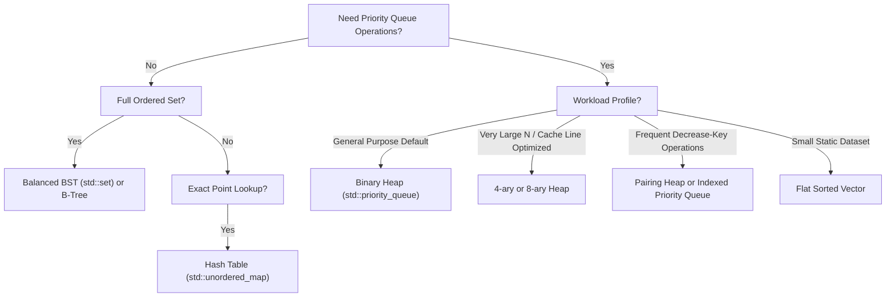

# Binary Heaps

> [!NOTE]
> A binary heap is a complete binary tree stored implicitly in a contiguous array, maintaining a heap-order invariant that makes the minimum or maximum element available at the root in $O(1)$ time and supports insertion and extraction in $O(\log n)$.
>
> Reference implementations: [C++17 Implementation](../../implementations/cpp/binary_heap.cpp) | [Python Implementation](../../implementations/python/binary_heap.py)

> [!TIP]
> A heap is not a fully sorted structure. It only guarantees that each parent dominates its children under the chosen comparator. That local ordering is exactly what makes heaps ideal for priority queues.

> [!WARNING]
> A heap is not a sorted array and not a search tree. It gives fast access only to the highest-priority root element. Arbitrary search, range queries, and full ordered traversal remain $O(n)$ operations.

> [!IMPORTANT]
> **Priority Queue vs. Ordered Structures at a Glance:**
> - **Binary Heap**: Best general-purpose priority queue; $O(1)$ root access, $O(\log n)$ push/pop, contiguous array with zero pointer overhead.
> - **d-ary Heap**: Shallower heap with higher fanout; fewer levels and cache-friendly multi-child node layout.
> - **Balanced BST**: Full ordered dictionary ($O(\log n)$ search, predecessor, range scans), but carries node pointer and cache-miss overhead.
> - **Sorted Vector**: $O(1)$ min/max, outstanding sequential scans, but prohibitive $O(n)$ insertion cost.
> - **Unsorted Array**: $O(1)$ append, but $O(n)$ linear scan to locate or extract the minimum.

---

## 1. Why This Matters

Many real-world systems problems do not need:
- full sorting
- arbitrary ordered predecessor/successor queries
- exact membership search by key

Instead, they need one repeated, high-velocity operation:
- **"Give me the current highest-priority item."**

Examples include:
- **Operating system schedulers**: Selecting the next runnable thread or timer event
- **Simulation engines**: Discrete-event simulation queues ordered by timestamp
- **Graph algorithms**: Dijkstra’s single-source shortest path and Prim’s minimum spanning tree
- **Network appliances**: Quality-of-Service (QoS) packet scheduling and rate limiting
- **Data streaming**: Top-$k$ frequent elements, median maintenance, and $k$-way external merges

A sorted array provides:
- $O(1)$ access to the smallest element
- but $O(n)$ insertion due to element shifting

A balanced BST provides:
- $O(\log n)$ insertion
- $O(\log n)$ delete-min
- full in-order sorted iteration
- but suffers from pointer overhead (24–48 bytes/node) and severe CPU cache misses

A binary heap delivers the optimal engineering balance:
- $O(1)$ instant access to the root priority
- $O(\log n)$ worst-case insertion and extraction
- Expected $O(1)$ insertion under uniform distributions
- Contiguous array storage with zero pointer overhead
- High spatial and temporal CPU cache locality

That is why binary heaps are the universal default implementation for priority queues across modern standard libraries.

---

## 2. Core Intuition & Visual Model

A binary heap is a binary tree defined by two simultaneous invariants:

1. **Shape Property**: It is a **complete binary tree**.
2. **Heap-Order Property**: Every parent node dominates its children under a strict weak ordering.

For a **min-heap**:
$$
A[\text{parent}(i)] \le A[i]
$$
For a **max-heap**:
$$
A[\text{parent}(i)] \ge A[i]
$$

### Visual Tree Representation

```text
         3
       /   \
      5     8
     / \   / \
    9  12 14 20
```

This tree satisfies the min-heap property:
- $3 \le 5, 8$
- $5 \le 9, 12$
- $8 \le 14, 20$

Notice that siblings are **not** ordered relative to each other:
- $5 < 8$, but $12$ (descendant of $5$) is greater than $8$.
- A heap enforces **partial ordering**, not total ordering.

### Contiguous Array Representation

The exact tree above is stored contiguously in level-order in an array:

```text
Index:  [  0  |  1  |  2  |  3  |  4  |  5  |  6  ]
Value:  [  3  |  5  |  8  |  9  | 12  | 14  | 20  ]
```

This eliminates every node pointer. Parent-child relationships are calculated via instant CPU register arithmetic.

---

## 3. Theoretical Foundations & Invariants

### 3.1 Complete Binary Tree Invariant

A binary tree is **complete** if:
- Every level except possibly the last is completely filled.
- All nodes in the bottom level are packed strictly from left to right without gaps.

#### Consequence for Height
Because nodes are packed with maximum possible density, a complete binary tree of $n$ elements has height:

$$
h = \lfloor \log_2 n \rfloor
$$

Unlike AVL or Red-Black trees, which require rotations and balance factors to bound height, a binary heap's height is **strictly deterministic and rotation-free**. Its shape is maintained automatically by appending to the end and removing from the end.

---

### 3.2 Heap-Order Invariant

For every node $i$ (other than the root $i = 0$):

$$
\text{Min-Heap}: \quad A[\text{parent}(i)] \le A[i]
$$
$$
\text{Max-Heap}: \quad A[\text{parent}(i)] \ge A[i]
$$

#### Properties:
1. **Global Root Extremum**: In a min-heap, every path from root to leaf is non-decreasing. Therefore, the root is guaranteed to be the global minimum.
2. **Subtree Inductive Validity**: Every subtree of a valid heap is itself a valid heap.

---

### 3.3 Implicit Contiguous Array Layout

Because the tree has no gaps, level-order indexing provides an injection from tree nodes to contiguous array indices:

#### 0-Based Indexing (C++, Python, Java, Rust):
$$
\text{parent}(i) = \left\lfloor \frac{i - 1}{2} \right\rfloor
$$
$$
\text{left}(i) = 2i + 1
$$
$$
\text{right}(i) = 2i + 2
$$

#### 1-Based Indexing (Classic Textbook Formulation):
$$
\text{parent}(i) = \left\lfloor \frac{i}{2} \right\rfloor = i \gg 1
$$
$$
\text{left}(i) = 2i = i \ll 1
$$
$$
\text{right}(i) = 2i + 1 = (i \ll 1) \mid 1
$$

In 0-based indexing, modern compilers optimize these operations into single-cycle bitwise instructions:
- `left = (i << 1) + 1`
- `right = (i << 1) + 2`
- `parent = (i - 1) >> 1`

---

## 4. Core Algorithmic Mechanics

### 4.1 Peek / Top ($O(1)$)
The root element is always stored at index `0`:
```cpp
const T& top() const { return data_[0]; }
```
Accessing the root requires zero searching or traversal ($O(1)$).

---

### 4.2 Push / Insertion with Sift-Up ($O(\log n)$)

To insert a new element $x$:
1. Append $x$ to the end of the array (at index $n$). This preserves the complete-tree shape invariant.
2. The heap-order invariant may now be violated between index $n$ and its parent.
3. **Sift-Up**: Compare $x$ with its parent. If $x$ has higher priority, swap them and repeat upward toward the root. Stop as soon as the parent dominates $x$ or $x$ becomes the root.

```text
Initial Heap:        Insert [4]:          Sift-Up (Swap 4, 9):  Sift-Up (Swap 4, 5):
       3                   3                      3                     3
     /   \               /   \                  /   \                 /   \
    5     8    ===>     5     8       ===>     5     8      ===>     4     8
   / \   / \           / \   / \              / \   / \             / \   / \
  9  12 14 20         9  12 14 20            4  12 14 20           5  12 14 20
                     /                      /                     /
                   [4]                    [9]                   [9]
```

#### Complexity Analysis:
- **Worst Case**: The new element sifts all the way to the root: $\lfloor \log_2 n \rfloor$ swaps $\implies O(\log n)$.
- **Expected Case**: Under uniform random inputs, the probability that a random element rises $k$ levels is $2^{-k}$. The expected number of comparisons is bounded by $\sum_{k=1}^\infty \frac{k}{2^k} = 2 \implies \mathbf{O(1)}$ **expected time**.

---

### 4.3 Pop / Extract-Min with Sift-Down ($O(\log n)$)

To remove the root element:
1. Save the root element $A[0]$.
2. Move the last element in the array ($A[n-1]$) into the root position $A[0]$.
3. Truncate the array size by one. This preserves the complete-tree shape invariant.
4. **Sift-Down**: The new root may violate heap order with its children. Compare the node with both of its children. Swap with the **highest-priority child** (the smaller child in a min-heap). Repeat downward until the node dominates both children or reaches a leaf.

```text
Remove Root [3]:       Move [20] to Root:      Sift-Down (Swap 20, 5): Sift-Down (Swap 20, 9):
       3                      20                      5                       5
     /   \                  /    \                  /   \                   /   \
    5     8       ===>     5      8       ===>    20     8        ===>     9     8
   / \   / \              / \    /                / \   /                 / \   /
  9  12 14 [20]          9  12  14               9  12 14               20  12 14
```

#### Why swap with the *smaller* child in a min-heap?
If parent $P$ has children $L$ and $R$ with $L < R$, swapping $P$ with $L$ places $L$ at the parent position. Since $L < R$ and $L \le \text{grandchildren}$, $L$ is guaranteed to dominate both its new sibling $R$ and its new children, restoring local heap order.

#### Complexity:
The element descends down a single branch of the tree: at most $\lfloor \log_2 n \rfloor$ iterations $\implies O(\log n)$ worst-case.

---

## 5. Floyd’s Linear-Time `build_heap` Algorithm

A collection of $n$ unsorted elements can be converted into a valid binary heap in two ways:

1. **Naïve Repeated Insertion**: Start with an empty heap and call `push()` $n$ times.
   $$
   \sum_{i=1}^n O(\log i) = O(n \log n)
   $$
2. **Floyd’s Bottom-Up Construction (1964)**: Populate the array with all $n$ elements, then sift-down each internal node in reverse level order.
   $$
   \text{Time Complexity} = \mathbf{O(n)}
   $$

### 5.1 Algorithmic Procedure

Leaves have no children, so every leaf is trivially a valid 1-element heap. In a complete binary tree, all elements from index $\lfloor n / 2 \rfloor$ to $n - 1$ are leaves.

Floyd's algorithm starts at the last non-leaf node ($\lfloor n / 2 \rfloor - 1$) and calls `sift_down()` backward to the root:

```python
def build_heap(arr):
    n = len(arr)
    for i in range(n // 2 - 1, -1, -1):
        sift_down(arr, i, n)
```

By the time node $i$ is processed, both of its child subtrees are already valid heaps. Sift-down merges the two subtrees into a single larger valid heap.

---

### 5.2 Mathematical Proof of $O(n)$ Bound

Let height $h$ be the distance from a node to the deepest leaf in its subtree:
- Leaves have height $h = 0$.
- Nodes one level above leaves have height $h = 1$.
- The root has height $h = \lfloor \log_2 n \rfloor$.

In a complete binary tree of $n$ nodes, the maximum number of nodes at height $h$ is:

$$
N(h) \le \left\lceil \frac{n}{2^{h+1}} \right\rceil
$$

A node at height $h$ can sift down at most $h$ levels. Therefore, the total work across all nodes is:

$$
T(n) = \sum_{h=0}^{\lfloor \log_2 n \rfloor} N(h) \cdot O(h) \le \sum_{h=0}^{\lfloor \log_2 n \rfloor} \left\lceil \frac{n}{2^{h+1}} \right\rceil c \cdot h = c \cdot n \sum_{h=0}^{\lfloor \log_2 n \rfloor} \frac{h}{2^{h+1}}
$$

Factoring out $\frac{1}{2}$:

$$
T(n) \le \frac{c \cdot n}{2} \sum_{h=0}^\infty \frac{h}{2^h}
$$

To evaluate the infinite sum $S = \sum_{h=0}^\infty \frac{h}{2^h}$:
$$
\begin{aligned}
S &= \frac{1}{2} + \frac{2}{4} + \frac{3}{8} + \frac{4}{16} + \dots \\
\frac{1}{2}S &= \quad \quad \frac{1}{4} + \frac{2}{8} + \frac{3}{16} + \dots \\
S - \frac{1}{2}S &= \frac{1}{2} + \frac{1}{4} + \frac{1}{8} + \frac{1}{16} + \dots = 1 \\
\frac{1}{2}S &= 1 \implies S = 2
\end{aligned}
$$

Substituting $S = 2$ back into our bound:

$$
T(n) \le \frac{c \cdot n}{2} \cdot 2 = c \cdot n = \mathbf{O(n)}
$$

#### Intuitive Insight:
Naïve insertion does the most work ($O(\log n)$) on the nodes at the bottom (which represent $\approx 50\%$ of all nodes). Floyd's algorithm does $0$ work on the bottom $50\%$ of nodes (leaves) and reserves the $O(\log n)$ work for the single root node.

---

## 6. In-Place Heapsort

Heapsort is a deterministic comparison sort that operates strictly in-place with $O(1)$ auxiliary memory:

```text
Array: [ 9 | 5 | 8 | 3 | 1 | 4 | 2 ]  <-- Max-Heap of size N
Swap root with end:
Array: [ 2 | 5 | 8 | 3 | 1 | 4 ] | [ 9 ]  <-- 9 is in its final sorted place!
Sift-down root:
Array: [ 8 | 5 | 4 | 3 | 1 | 2 ] | [ 9 ]
Repeat until heap is empty!
```

### 6.1 Two-Phase Execution
1. **Phase 1 (Heap Construction)**: Build a **Max-Heap** in-place using Floyd's algorithm in $O(n)$ time.
2. **Phase 2 (Sorting)**: For `end` from $n - 1$ down to $1$:
   - Swap $A[0]$ (current maximum) with $A[\text{end}]$.
   - Call `sift_down(0, end)` to restore the max-heap on the reduced prefix $[0, \text{end}-1]$.

Total time complexity is:
$$
T(n) = O(n) + \sum_{i=1}^{n-1} O(\log i) = O(n \log n)
$$

---

### 6.2 Comparison: Heapsort vs. Quicksort vs. Mergesort

| Algorithm | Worst-Case Time | Average-Case Time | Auxiliary Space | Stable? | Cache Locality |
| :--- | :---: | :---: | :---: | :---: | :---: |
| **Heapsort** | $O(n \log n)$ | $O(n \log n)$ | **$O(1)$** | No | Poor (jumping strides) |
| **Quicksort** | $O(n^2)$ | $O(n \log n)$ | $O(\log n)$ stack | No | **Outstanding (sequential scans)** |
| **Mergesort** | $O(n \log n)$ | $O(n \log n)$ | $O(n)$ buffer | **Yes** | Good (streaming) |

#### Why Heapsort Loses to Quicksort on Modern Hardware:
During sift-down, memory accesses double indices ($i \to 2i+1 \to 4i+3$). When $n > 10^5$, these strides jump across distinct cache lines and memory pages, causing serialized L3 cache and TLB misses. In contrast, Quicksort partitions memory linearly, allowing hardware prefetchers to operate at peak DRAM bandwidth.

---

## 7. Complexity Summary

| Operation | Average Case | Worst Case | Auxiliary Space | Description |
| :--- | :---: | :---: | :---: | :--- |
| **`top()` / `peek()`** | $O(1)$ | $O(1)$ | $O(1)$ | Read root element at index 0 |
| **`push()` / `insert()`** | $O(1)$ expected | $O(\log n)$ | $O(1)$ amortized | Append at index $n$ + sift-up |
| **`pop()` / `extract_min()`**| $O(\log n)$ | $O(\log n)$ | $O(1)$ | Move back to root + sift-down |
| **`build_heap()`** | $O(n)$ | $O(n)$ | $O(1)$ | Floyd's bottom-up construction |
| **`heapsort()`** | $O(n \log n)$ | $O(n \log n)$ | $O(1)$ | In-place max-heap extraction |
| **Full In-Order Traversal**| $O(n \log n)$ | $O(n \log n)$ | $O(n)$ | Requires repeated extraction |

---

## 8. Production Systems Case Studies

### 8.1 C++ Standard Library (`<algorithm>`, `<queue>`)

The C++ standard library decouples heap algorithms from containers:
- `std::make_heap(begin, end)`: Executes Floyd’s linear-time algorithm.
- `std::push_heap(begin, end)`: Assumes the last element was appended, executes `sift_up`.
- `std::pop_heap(begin, end)`: Swaps the top element with the back and executes `sift_down`.
- `std::sort_heap(begin, end)`: Executes Phase 2 of Heapsort.

`std::priority_queue<T, Container, Compare>` is a container adaptor wrapping these exact primitives around `std::vector<T>`.

---

### 8.2 Operating System Timers & Event Loops

High-performance event loops (`libuv`, Linux kernel timers, `epoll_wait` timeouts) maintain timers ordered by expiration deadline:
- **Timer Creation**: Calling `setTimeout(fn, 500ms)` pushes an event into a min-heap in $O(\log n)$ time.
- **Event Polling**: The kernel or event loop peeks at `heap.top()` in $O(1)$ to compute the exact sleep timeout for `epoll_wait(..., timeout)`.
- **Timer Expiration**: When the deadline arrives, `heap.pop()` extracts the event in $O(\log n)$ time.

---

### 8.3 Graph Algorithms: Dijkstra & Prim

Dijkstra’s single-source shortest path algorithm requires repeatedly extracting the unvisited vertex with the minimum tentativedistance:
- Using an unsorted array: $O(V^2 + E)$.
- Using a Binary Heap: $O((V + E) \log V)$.

In practice, a binary heap priority queue delivers faster wall-clock times than theoretically optimal Fibonacci heaps ($O(E + V \log V)$) due to contiguous cache locality and minimal constant factors.

---

## 9. Hardware Locality & Practical Engineering Tradeoffs

```text
Contiguous Binary Heap:
[ Node 0 | Node 1 | Node 2 | Node 3 | Node 4 | Node 5 | Node 6 | Node 7 ]
<----------------------- Single 64-Byte Cache Line --------------------->

Pointer-Based Tree (std::set):
[Node 0] ---> [Node 1] ---> [Node 2]
(0x1000)      (0x8400)      (0x3200)
Cache Miss!   Cache Miss!   Cache Miss!
```

### 9.1 Memory Density Advantage
- `std::set<uint64_t>`: Stores key + left pointer + right pointer + parent pointer + color byte $\approx 48$ bytes per element + allocator padding ($64$ bytes/element).
- `BinaryHeap<uint64_t>`: Stores exactly $8$ bytes per element inside a flat contiguous `std::vector`. **Consumes 8x less memory than a balanced BST!**

### 9.2 Sift-Up vs. Sift-Down Cache Access Patterns
- **Sift-Up (Temporal Locality)**: Traverses parent indices: $i \to \lfloor (i-1)/2 \rfloor \to \dots \to 0$. The path is short and ancestral nodes near the root are hot in CPU L1/L2 cache.
- **Sift-Down (Spatial Divergence)**: Traverses child indices: $i \to 2i+1 \to 4i+3 \to \dots$. Memory strides double on each step, eventually leaping across multiple 4 KB memory pages for large heaps.

### 9.3 Preview: Motivation for $d$-ary Heaps
To improve cache utilization during sift-down on large datasets, engineers utilize **$d$-ary heaps** ($d = 4$ or $d = 8$):
- Tree height shrinks from $\log_2 n$ to $\log_d n$.
- All $d$ children of a node sit contiguously in a single 64-byte cache line, allowing SIMD parallel comparisons.

---

## 10. Decision Framework



| Structure | Peek Best | Push | Pop Best | Ordered Scan | Locality | Memory Overhead | Primary Systems Niche |
| :--- | :---: | :---: | :---: | :---: | :---: | :---: | :--- |
| **Binary Heap** | $O(1)$ | $O(\log n)$ | $O(\log n)$ | Poor ($O(n \log n)$) | Good | Zero pointers ($8\text{ B/item}$) | General priority queues, timers |
| **d-ary Heap ($d=4$)** | $O(1)$ | $O(\log_d n)$ | $O(d \log_d n)$ | Poor | Outstanding | Zero pointers | Large in-memory priority queues |
| **Balanced BST (`std::set`)** | $O(1)$ or $O(\log n)$ | $O(\log n)$ | $O(\log n)$ | Outstanding ($O(n)$) | Poor | High ($48\text{ B/node}$) | Ordered dynamic dictionaries |
| **Sorted Vector** | $O(1)$ | $O(n)$ | $O(1)$ | Outstanding ($O(n)$) | Optimal | Zero pointers | Static or read-heavy datasets |
| **Unsorted Array** | $O(n)$ | $O(1)$ | $O(n)$ | Poor | Optimal | Zero pointers | Small batch insert buffers |

---

## 11. Reference Implementations

Complete, verified, unit-tested implementations are available in the repository:
- **C++17 Reference**: [`implementations/cpp/binary_heap.cpp`](../../implementations/cpp/binary_heap.cpp)
- **Python Reference**: [`implementations/python/binary_heap.py`](../../implementations/python/binary_heap.py)

### C++17 Production-Grade Reference

```cpp
#include <vector>
#include <functional>
#include <cassert>
#include <stdexcept>
#include <utility>

template <typename T, typename Compare = std::less<T>>
class BinaryHeap {
private:
    std::vector<T> data_;
    Compare comp_; // Returns true if a has higher priority than b

    static inline std::size_t parent(std::size_t i) noexcept { return (i - 1) / 2; }
    static inline std::size_t left_child(std::size_t i) noexcept { return 2 * i + 1; }
    static inline std::size_t right_child(std::size_t i) noexcept { return 2 * i + 2; }

    void sift_up(std::size_t i) {
        while (i > 0) {
            std::size_t p = parent(i);
            if (comp_(data_[i], data_[p])) {
                std::swap(data_[i], data_[p]);
                i = p;
            } else {
                break;
            }
        }
    }

    void sift_down(std::size_t i, std::size_t n) {
        while (true) {
            std::size_t best = i;
            std::size_t left = left_child(i);
            std::size_t right = right_child(i);

            if (left < n && comp_(data_[left], data_[best])) best = left;
            if (right < n && comp_(data_[right], data_[best])) best = right;

            if (best != i) {
                std::swap(data_[i], data_[best]);
                i = best;
            } else {
                break;
            }
        }
    }

public:
    explicit BinaryHeap(Compare comp = Compare{}) : comp_(comp) {}

    // Floyd's O(n) bottom-up heap construction
    explicit BinaryHeap(std::vector<T> elements, Compare comp = Compare{})
        : data_(std::move(elements)), comp_(comp) {
        if (!data_.empty()) {
            for (std::size_t i = data_.size() / 2; i > 0; --i) {
                sift_down(i - 1, data_.size());
            }
        }
    }

    [[nodiscard]] std::size_t size() const noexcept { return data_.size(); }
    [[nodiscard]] bool empty() const noexcept { return data_.empty(); }

    const T& top() const {
        if (data_.empty()) throw std::underflow_error("Heap is empty");
        return data_[0];
    }

    void push(const T& val) {
        data_.push_back(val);
        sift_up(data_.size() - 1);
    }

    T pop() {
        if (data_.empty()) throw std::underflow_error("Heap is empty");
        T top_val = std::move(data_[0]);
        data_[0] = std::move(data_.back());
        data_.pop_back();
        if (!data_.empty()) {
            sift_down(0, data_.size());
        }
        return top_val;
    }
};
```

---

## 12. Curated Problems & Further Reading

### Curated Practice Problems
1. **LeetCode 215 — Kth Largest Element in an Array** *(Medium)*
   - Maintain a min-heap of size $k$ to solve streaming selection in $O(n \log k)$ time and $O(k)$ space.
2. **LeetCode 23 — Merge k Sorted Lists** *(Hard)*
   - Classic $k$-way merge using a min-heap of size $k$ containing head pointers from active lists.
3. **LeetCode 295 — Find Median from Data Stream** *(Hard)*
   - Two-heap balance pattern: Max-heap for lower half, Min-heap for upper half, giving $O(1)$ median queries.
4. **LeetCode 347 — Top K Frequent Elements** *(Medium)*
   - Combine a hash table frequency map with a bounded min-heap.
5. **Dijkstra's Algorithm Implementation** *(Graph Theory)*
   - Implement single-source shortest path on an adjacency list using a binary heap priority queue.

### Internal Encyclopedia Links
- [`dynamic-arrays-and-strings.md`](../04-linear-data-structures/dynamic-arrays-and-strings.md) — Contiguous array allocation and geometric growth
- [`avl-and-red-black-trees.md`](../05-trees-and-hierarchical-structures/avl-and-red-black-trees.md) — Comparison-based ordered trees
- [`b-trees-and-b-plus-trees.md`](../05-trees-and-hierarchical-structures/b-trees-and-b-plus-trees.md) — Cache-conscious block structures
- [`choosing-the-right-data-structure.md`](../22-benchmarking-and-tradeoffs/choosing-the-right-data-structure.md) — Hardware-driven container selection
- [`cpu-cache-and-memory.md`](../03-machine-model-and-performance/cpu-cache-and-memory.md) — Spatial vs. temporal locality in memory hierarchies
